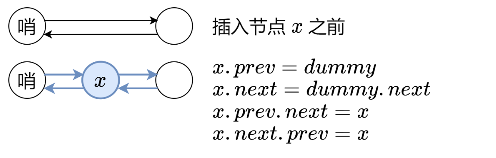

# 经典题目
## [实现一个LRU](https://leetcode.cn/problems/lru-cache/description/?envType=study-plan-v2&envId=top-interview-150)
**关键点**：
1. 所有的操作需要在O(1)的时间复杂度上实现，所以不能实现数组遍历的方式实现。一般实现O(1)查找肯定会用到哈希表，所以我们这里也需要使用哈希表存储对应的key。
2. 如何保存最长的LRU。如果要将某个节点更新到最新使用，使用传统的数组肯定不行。因为找到对应的节点就需要O(n)的时间复杂度。所以可以使用链表来实现高效的插入删除。单向链表也不行，删除太慢了。所以用双向链表实现。
3. 通过双向链表处理插入和删除 + 哈希表处理访问可以实现所有的操作都是O(1)

**具体实现**

LRU 缓存机制可以通过哈希表辅以双向链表实现，我们用一个哈希表和一个双向链表维护所有在缓存中的键值对。
双向链表按照被使用的顺序存储了这些键值对，靠近头部的键值对是最近使用的，而靠近尾部的键值对是最久未使用的。
哈希表即为普通的哈希映射（HashMap），通过缓存数据的键映射到其在双向链表中的位置。
这样以来，我们首先使用哈希表进行定位，找出缓存项在双向链表中的位置，随后将其移动到双向链表的头部，即可在 O(1) 的时间内完成 get 或者 put 操作。具体的方法如下：

1. 对于 get 操作，首先判断 key 是否存在：

- 如果 key 不存在，则返回 −1；
- 如果 key 存在，则 key 对应的节点是最近被使用的节点。通过哈希表定位到该节点在双向链表中的位置，并将其移动到双向链表的头部，最后返回该节点的值。

2. 对于 put 操作，首先判断 key 是否存在：

- 如果 key 不存在，使用 key 和 value 创建一个新的节点，在双向链表的头部添加该节点，并将 key 和该节点添加进哈希表中。然后判断双向链表的节点数是否超出容量，如果超出容量，则删除双向链表的尾部节点，并删除哈希表中对应的项；

- 如果 key 存在，则与 get 操作类似，先通过哈希表定位，再将对应的节点的值更新为 value，并将该节点移到双向链表的头部。

上述各项操作中，访问哈希表的时间复杂度为 O(1)，在双向链表的头部添加节点、在双向链表的尾部删除节点的复杂度也为 O(1)。而将一个节点移到双向链表的头部，可以分成「删除该节点」和「在双向链表的头部添加节点」两步操作，都可以在 O(1) 时间内完成。

**小技巧**

在双向链表的实现中，使用一个伪头部（dummy head）和伪尾部（dummy tail）标记界限，这样在添加节点和删除节点的时候就不需要检查相邻的节点是否存在。

**双向链表设计**
```js
function ListNode(val, key = null) {
  this.val = val; // 节点值
  this.next = null; // 下一个节点
  this.pre = null; // 上一个节点
  this.key = key; // 存储map中的key
}
```

**删除某个节点**


**把某个节点添加到最前面**



**全部代码**

```js
function ListNode(val, key = null) {
  this.val = val; // 节点值
  this.next = null; // 下一个节点
  this.pre = null; // 上一个节点
  this.key = key; // 存储map中的key
}

class LRUCache {
  constructor(size) {
    this.size = size; // 缓存最大容量
    this.cache = new Map(); // 缓存容器
    this.head = new ListNode(); // 头节点
    this.tail = new ListNode(); // 尾节点
    // 增加两个哨兵节点
    this.head.next = this.tail;
    this.tail.pre = this.head;
  }

  // 移除节点
  removeNode(node) {
    const preNode = node.pre;
    const nextNode = node.next;
    preNode.next = nextNode;
    nextNode.pre = preNode;
  }

  // 移到头部
  removeToHead(node) {
    node.next = this.head.next;
    node.next.pre = node;
    this.head.next = node;
    node.pre = this.head;
  }

  // 获取节点。包含两步：1.获取节点 2.如果存在缓存就更新缓存
  getNode(key) {
    const node = this.cache.get(key);
    // 存在节点的情况就需要更新缓存。1. 去掉当前节点 2. 当前节点添加到头部
    if (node) {
      this.removeNode(node);
      this.removeToHead(node);
    }
    return node;
  }

  // 获取缓存
  get(key) {
    const node = this.getNode(key);
    return node ? node.val : -1;
  }

  // 设置缓存
  put(key, val) {
    // 已经存在的情况。getNode中会处理更新的情况
    const node = this.getNode(key);
    if (node) {
      node.val = val;
      return null;
    }

    // 如果超出缓存容量，移除尾节点。
    if (this.cache.size >= this.size) {
      const delNode = this.tail.pre;
      // 1. 移除尾节点
      this.removeNode(delNode);
      // 2. 删除缓存
      this.cache.delete(delNode.key);
    }
    // 新建一个节点
    const newNode = new ListNode(val, key);
    this.cache.set(key, newNode);
    this.removeToHead(newNode);

    return null;
  }
}
```

