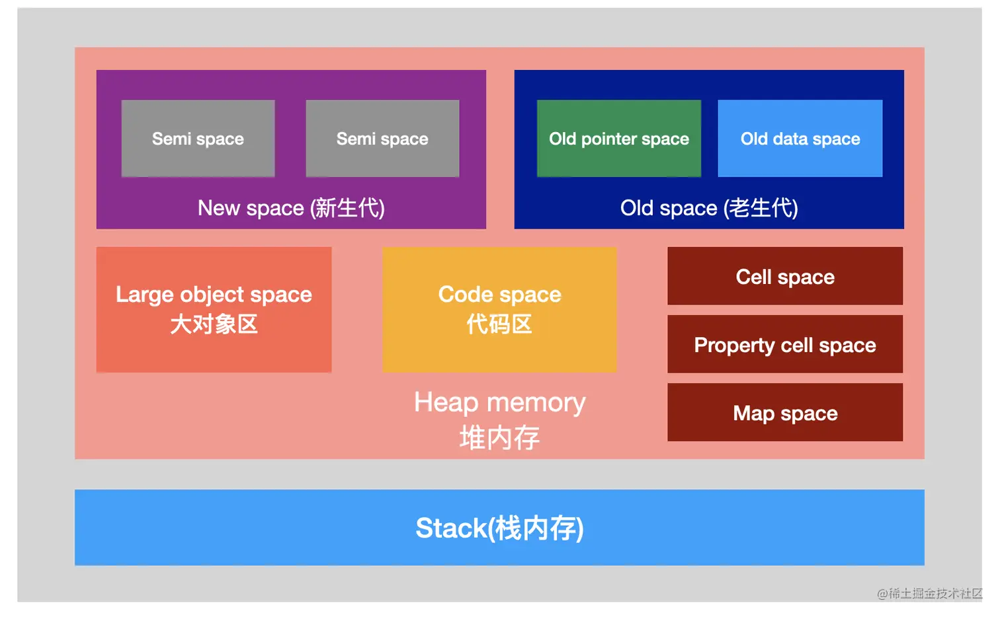
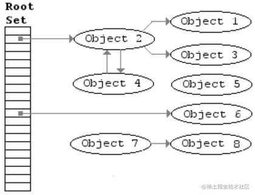
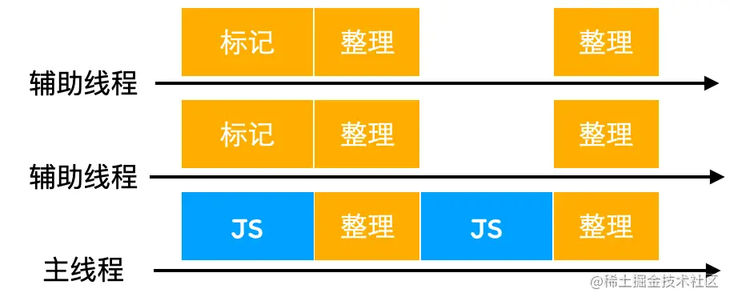

# V8内存管理

文章主要介绍了 Google V8 引擎的内存管理，包括内存的生命周期、栈和堆的特点，以及垃圾回收机制。垃圾回收有 GC 概念、判断非活跃对象方法、代际假说等，还介绍了 Scavenger 等算法和优化策略，如并行、增量、并发回收及三色标记法、写屏障等，最后给出避免内存泄漏的代码建议和参考文章。

众所周知，Javascript语言是没有能力管理内存和自动垃圾回收的，最直观的判断就是并没有这些方面的api及主动处理机制，这些能力完全依赖了底层引擎的处理，想要弄清楚V8引擎的性能为何出众，更加需要了解其重要的内存管理及垃圾回收的策略是如何运行的。

## 内存管理

内存作为计算机的最重要部分之一，它是与CPU进行沟通的桥梁，程序运行时CPU需要调用的指令和数据只能通过内存获取。计算机中所有程序的运行都是在内存中进行的，因此内存的性能对计算机的影响非常大。内存一般是半导体存储单元，包括了ROM + RAM + Cache，其中最重要的就是RAM部分。


内存的生命周期一般包括：分配内存大小 > 使用内存（读 or 写）> 不需要时进行释放。

运行js代码时，内存空间使用包括了堆内存和栈内存。

## 栈

小而连续，数组结构，由系统自动分配相对固定大小的内存空间，并由系统自动释放，遵循LIFO后进先出的规则，主要职责是javascript中存储局部变量及管理函数调用。

基础数据类型的变量都是直接存储在栈中，复杂类型数据会将对象的引用（实际存储的指针地址）存储在栈中，数据本身存储在堆中。

每个函数的调用时，解释器都会现在栈中创建一个调用栈（call stack）来存储函数的调用流程顺序。然后把该函数添加进调用栈，解释器会为被添加进的函数再创建一个栈帧（Stack Frame）并立即执行。如果正在执行的函数还调用了其它函数，那么新函数也将会被添加进调用栈并执行。直到这个函数执行结束，对应的栈帧也会被立即销毁。栈帧中一般会存放信息包括：

- 函数的返回地址和参数

- 临时变量：函数局部变量+编译器自动生成的其他临时变量

- 函数调用的上下文


（函数的调用栈顺序）

**思考：为什么大部分高级语言都用栈来管理函数调用？**

我们可以从函数自身的特性来分析这个问题：

1. 函数具有可被调用的特性，代码执行控制权从最开始父函数调用子函数开始，移交给子函数，再由子函数执行完成后又移交给父函数，这个控制权的转移证明了：**函数调用者的生命周期总是长于被调用者（后进），而且被调用者的生命周期总是先于调用者结束（先出）**

1. 函数还有作用域的限制，在执行的时候，定义在函数内部的临时变量与外部环境隔离，只能在函数内访问，外部函数无权访问，当函数执行介绍后，临时变量也会随之被销毁。关于临时变量的资源占用情况证明了：**被调用者的资源分配总是晚于调用者（后进），同时被调用者的资源释放却又总先于调用者（先出）**

从上面的函数的生命周期及资源分配情况来看，我们可以发现使用栈结构来管理函数调用，是最优解

## 堆

**思考：有了栈为什么还需要堆？**

栈空间是连续的，在栈上分配资源和销毁资源的速度非常快，分配空间和销毁空间只需要移动下指针就可以了。但是如果想在内存中分配一块连续的大空间是非常难的，栈空间是有上限的，一旦函数循环嵌套次数过多，或者分配的数据过大，就会造成栈溢出问题，所以我们需要另外一种数据结构来存储大数据。


引用数据类型存储在堆内存中，因为引用数据类型占据空间大、大小不固定。 如果存储在栈中，将会影响程序运行的性能； 引用数据类型在栈中存储了指针，该指针指向堆中该实体的起始地址。 当解释器寻找引用值时，会首先检索其在栈中的地址，取得地址后从堆中获得实体。


相对栈内存结构来说，堆内存内部结构比较复杂，V8引擎内存分配和垃圾回收机制复杂的设计也重点体现在堆内存管理上，下图中是V8引擎内存结构总览，我们来重点剖析下堆内存的结构。



主要分为以下几个区域：

- New space(新生代)

新生代主要是由两个半空间（semi space）组成，一个是from space，一个是to space，空间的大小由--min_semi_space_size(初始值) 和 --max_semi_space_size(最大值) 两个标志来控制，感兴趣可以看下[V8源码](https://link.juejin.cn/?target=https%3A%2F%2Fsource.chromium.org%2Fchromium%2Fchromium%2Fsrc%2F%2B%2Fmain%3Av8%2Fsrc%2Fheap%2Fheap.cc%3Bl%3D5236%3Fq%3DFLAG_min_semi_space_size%26ss%3Dchromium%2Fchromium%2Fsrc%3Av8%2F)对于变量的定义，在64位和32位操作系统中最大值分别为64MB和32MB，新生代空间主要是用于新对象的存储，后面配合垃圾回收再深入讲下gc的过程。

- Old space (老生代)

这部分存储的是经过多次gc后仍在新生代中存在的对象，空间的大小由--initial_old_space_size(初始值) 和--max_old_space_size(最大值) 两个标志来控制，代码[见此处](https://link.juejin.cn/?target=https%3A%2F%2Fsource.chromium.org%2Fchromium%2Fchromium%2Fsrc%2F%2B%2Fmain%3Av8%2Fsrc%2Fheap%2Fheap.cc%3Bl%3D5177%3Fq%3Dmax_old_space_size%26ss%3Dchromium%2Fchromium%2Fsrc%3Av8%2F)。

- 这个区域包括了两个部分：
- - Old pointer space: 存放存活下来包含指向其他对象指针的对象
  - Old data space：存放仅保存数据的对象，不含指向其他对象指针的对象，字符串等数据

- Large object space (大对象区）

这是大于其他空间大小限制的对象存储的地方，避免大对象的频繁拷贝导致性能变差。大对象是不会被垃圾回收的。

- Code space(代码区): 即时（JIT）编译器存储编译代码块的地方。唯一可执行代码的空间

- Cell space (单元区)

- Property cell space(属性单元区)

- Map space(map 区域)：用来存放对象的map信息，可以回归下之前讲过的每个对象的隐藏类，为了快速定位，单独开辟了一个区域来用来存放这部分信息

- Stack（栈内存）

# 垃圾回收

## **什么是垃圾回收(GC)？**

GC = Garbage Collection，是指在内存空间进行垃圾回收的过程。如果不做GC，容易造成内存空间大小超过上限而导致程序的崩溃，对比C/C++等语言中，开发者需要手动处理内存的分配和释放，人工控制优势是在于可以细粒度控制，不足在于人工会导致失误率的提高，分配或释放太晚或太早会造成引用错误和内存泄漏，同时也增加了开发者的心智负担。一些语言例如js、java等，会选择在语言运行时中内置垃圾回收机制，虽然失去细颗粒度的控制，但得到了更高的开发效率，也解耦了对底层api的依赖，提高了内存的安全性。

Javascript的标准ECMAScript并没有对GC做相关的要求，GC完全依赖底层引擎的能力。

堆内存中存储着动态数据，随着代码的运行，这些数据随时都可能会发生变化，而且这部分数据可能会相互引用，引擎需要不断地遍历找到这些数据相互之间的关系，从而发现哪些数据是**非活动对象**并对其进行gc操作，所以gc的算法及策略的好坏，直接影响着整个引擎执行代码的性能，这部分是非常关键的。

## **如何判断非活跃对象？**

- 判断对象是否是活跃的一般有两种方法，引用计数法和可访问性分析法。
- - 引用计数法
  -  V8中并没有使用这种方法，因为每当有引用对象的地方，就加1，去掉引用的地方就减1，这种方式无法解决A与B循环引用的情况，引用计数都无法为0，导致无法完成gc
  - 可访问性分析法
  -  V8中采用了这种方法，将一个称为**GC Roots**的对象（在浏览器环境中，GC Roots可以包括：全局的window对象、所有原生dom节点集合等等）作为所有初始存活的对象集合，从这个对象出发，进行遍历，遍历到的就认为是**可访问的，为活动对象，需要保留**；如果没有遍历到的对象，就是**不可访问的，这些就是非活动对象，可能就会被垃圾回收**。


## 代际假说

代际假说（The Generational Hypothesis）垃圾回收领域中的一个重要术语，它有两个特点

1. 大部分对象在内存中存活时间很短，比如函数内部声明变量，块级作用域中的变量等，这些代码块执行完分配的内存就会被清掉

1. 不死的对象会活的更久，比如全局的window、Dom、全局api等对象。

基于代际假说的理论，在V8引擎中，垃圾回收算法被分为两种，一个是Major GC，主要使用了Mark-Sweep & Mark-Compact算法，针对的是堆内存中的老生代进行垃圾回收；另外一个是Minor GC，主要使用了Scavenger算法，针对于堆内存中的新生代进行垃圾回收。

## Scavenger算法

是在新生代内存中使用的算法，速度更快，空间占用更多的算法。New space区域分为了两个半区，分别为from-space和to-space。不断经过下图中的过程，在两个空间的角色互换中，完成垃圾回收的过程。每次都会有对象复制的操作，为了控制这里产生的时间成本和执行效率，往往新生代的空间并不大。同时为了避免长时间之后，某些对象会一直积压在新生代区域，V8制定了**晋升机制**，满足任一条件就会被分配到老生代的内存区中。

1. 经历一次Scavenger算法后，仍未被标记清除的对象

1. 进行复制的对象大于to space空间大小的25%


## Mark-Sweep & Mark-Compact算法

是老生代内存中的垃圾回收算法，标记-清除 & 标记-整理，老生代里面的对象一般占用空间大，而且存活时间长，如果也用Scavenger算法，复制会花费大量时间，而且还需要浪费一半的空间。

- 标记-清除过程：与之前讲过的可访问性分析一致，从GC Root开始遍历，标记完成后，就直接进行垃圾数据的清理工作。



- 标记-整理过程：清除算法后会产生大量不连续的内存碎片，碎片过多会导致后面大对象无法分配到足够的空间，所以需要进行整理，第一步的标记是一样的，但标记完成活跃对象后，并不是进行清理，而是将所有存活的对象向一端移动，然后清理掉这端之外的内存。


# 优化策略

由于 JavaScript 是运行在主线程之上的，因此，一旦执行垃圾回收算法，都需要将正在执行的 JavaScript 脚本暂停下来，待垃圾回收完毕后再恢复脚本执行。这种行为叫做全停顿（Stop-The-World）。


STW会造成系统周期性的卡顿，对实时性高的和与时间相关的任务执行成功率会有非常大的影响。例如：js逻辑需要执行动画，刚好碰到gc的过程，会导致整个动画卡顿，用户体验极差。

为了降低这种STW导致的卡顿和性能不佳，V8引擎中目前的垃圾回收器名为Orinoco，经过多年的不断精细化打磨和优化，已经具备了多种优化手段，极大地提升了GC整个过程的性能及体验。

## 并行回收

简单来讲，就是主线程执行一次完整的垃圾回收时间比较长，开启多个辅助线程来并行处理，整体的耗时会变少，所有线程执行gc的时间点是一致的，js代码也不会有影响，不同线程只需要一点同步的时间，在新生代里面执行的就是并行策略。


## 增量回收

- 并行策略说到底还是STW的机制，如果老生代里面存放一些大对象，处理这些依然很耗时，Orinoco又增加了增量回收的策略。将标记工作分解成小块，插在主线程不同的任务之间执行，类似于React fiber的分片机制，等待空闲时间分配。这里需要满足两个实现条件:
- - 随时可以暂停和启动，暂停要保存当前的结果，等下一次空闲时机来才能启动
  - 暂停时间内，如果已经标记好的数据被js代码修改了，回收器要能正确地处理


下面要讲到的就是Orinoco引入了3色标记法来解决随时启动或者暂停且不丢之前标记结果的问题

### 三色标记法

- 三色标记法的规则如下：
- - 最开始所有对象都是**白色**状态
  - 从GC Root遍历所有可到达的对象，标记为**灰色**，放入待处理队列
  - 从待处理队列中取出灰色对象，将其引用的对象标记为灰色放入待处理队列，自身标记为**黑色**
  - 重复3中动作，直到灰色对象队列为空，此时白色对象就是垃圾，进行回收。


垃圾回收器可以依据当前内存中有没有灰色节点，来判断整个标记是否完成，如果没有灰色节点了，就可以进行清理工作了。如果还有灰色标记，当下次恢复垃圾回收器时，便从灰色的节点开始继续执行。

下面将要解决由于js代码导致对象引用发生变化的情况，Orinoco借鉴了写屏障的处理办法。

### 写屏障（write-barrier）

- 一旦对象发生变化时，如何精确地更新标记的结果，我们可以分析下一般js执行过程中带来的对象的变化有哪些，其实主要有2种：
- - 标记过的黑色或者灰色的对象不再被其他对象所引用
  - 引入新的对象，新的对象可能是白色的，面临随时被清除的危险，导致代码异常

第一种问题不大，在下次执行gc的过程中会被再次标记为白色，最后会被清空掉；第二种就使用到了写屏障策略，一旦有黑色对象引用到了白色对象，系统会强制将白色对象标记成为灰色对象，从而保证了下次gc执行时状态的正确，这种模式也称为**强三色原则。**

## 并发回收

虽说三色标记法和写屏障保证了增量回收的机制可以实现，但依然改变不了需要占用主线程的情况，一旦主线程繁忙，垃圾回收依然会影响性能。所以增加了并发回收的机制。V8里面的并发机制相对复杂，简化来看，当主线程运行代码时，辅助线程并发进行标记，当标记完成后，主线程执行清理的过程时，辅助线程也并行执行。



# 总结

摘自V8官网的[blog](https://link.juejin.cn/?target=https%3A%2F%2Fv8.dev%2Fblog%2Ftrash-talk): V8 中的垃圾收集器自诞生以来已经走过了漫长的道路。向现有 GC 添加并行、增量和并发技术是一项多年的努力，但已经取得了回报，将大量工作转移到后台任务。它极大地改善了暂停时间、延迟和页面加载，使动画、滚动和用户交互更加流畅。并行Scavenger算法将主线程年轻代垃圾收集的总时间减少了大约 20%–50%，具体取决于工作负载。空闲时间gc策略可以在 Gmail 空闲时将其 JavaScript 堆内存减少 45%。并发标记和清除策略已将重型 WebGL 游戏的暂停时间减少了多达 50%。

# 代码建议

> 如何避免内存泄漏

1. 尽量减少创建全局变量，尽量使用局部变量

```csharp
csharp

代码解读
复制代码function foo() {
    a = 1; // 等价于window.a = 1
}
```

1. 定时器隐患

```ini
ini

代码解读
复制代码const a = []; //手动不清掉定时器，a将无法被回收
const foo = () => {
    for(let i = 0; i < 1000; i++) {
        a.push(i);
    }
}
window.setInterval(foo, 1000);
```

1. 闭包的错误使用

```javascript
javascript

代码解读
复制代码function foo() {
    let a = 123;
    return function() {
        return a;
    }
}
const bar = foo();
console.log(bar()); // 存在变量引用其返回的匿名函数，导致作用域无法得到释放
```

1. 推荐弱引用

es6中新增了：WeakMap和WeakSet，它的键名所引用的对象均是弱引用，弱引用是指垃圾回收的过程中不会将键名对该对象的引用考虑进去，只要所引用的对象没有其他的引用了，垃圾回收机制就会释放该对象所占用的内存。

1. DOM引用

```javascript
javascript

代码解读
复制代码const elements = {
    button: document.getElementById('button')
};

function removeButton() {
    document.body.removeChild(document.getElementById('button'));
}
// removeChild 清除了元素，但对象引用中还存在，要手动清除引用
```


## 参考文章

- https://juejin.cn/post/7128036227986489374
- https://developer.mozilla.org/zh-CN/docs/Web/JavaScript/Memory_management#weakrefs_%E5%92%8C_finalizationregistry