# V8引擎概览

> 前端开发人员都会遇到一个流行词：V8。它的流行程度很大一部分是因为它将JavaScript的性能提升到了一个新的水平。是的，V8很快。但它是如何发挥它的魔力？

## 前言

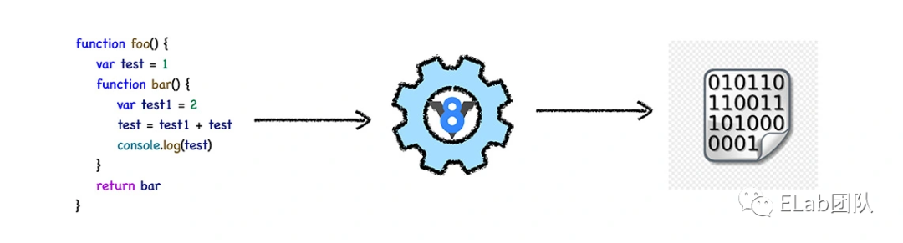  
**源代码**：https://source.chromium.org/chromium/chromium/src/+/master:v8/ \[1\]  
    在介绍V8引擎之前，我们可以先分析下为什么需要V8引擎？众所周知，前端最火的开发语言非javascript莫属，那javascript与V8是什么样的关系呢？  
我们知道，计算机只能识别二进制的机器语言，无法识别更高级的语言，用高级的语言开发，需要先将这些语言翻译成机器语言，而语言种类大体可以分为解释型语言和编译型语言：

| **语言种类**                     | **翻译过程**                                   | **优点**               | **不足**           | **常见语言例子** |
| -------------------------------- | ---------------------------------------------- | ---------------------- | ------------------ | ---------------- |
| 解释型语言                       | 解释器 > 翻译成与平台无关的中间代码            | 与平台无关，跨平台性强 | 每次都需要解释执行 |                  |
| 需要源文件                       |                                                |                        |                    |                  |
| 按句执行，执行效率差             | javascript、Ruby、Python                       |                        |                    |                  |
| 编译型语言                       | 预处理>编译>汇编>可执行的二进制文件            | 一次编译，永久执行     |                    |                  |
| 无需源代码，只需要可执行的源文件 |                                                |                        |                    |                  |
| 运行速度快                       | 不同系统可识别的二进制文件不同，跨平台兼容性差 | C、C++、java           |                    |                  |

    JavaScript就是一种解释型语言，支持动态类型、弱类型、基于原型的语言，内置支持类型。一般JavaScript都是在前端侧执行，需要能快速响应用户，**所以这就要求语言本身可以被快速地解析和执行，javascript引擎就为此目的而生。**

## JS引擎历史那些事

    1993年**网景浏览器**诞生，成为浏览器鼻祖。

    1995年微软推出了**IE浏览器**，拉开了第一次浏览器大战的序幕。IE受益于windows系统风靡世界，逐渐占有了大部分市场。

    1998年处于低谷的网景公司成立了Mozilla基金会，在该基金会推动下，开发了著名的开源项目**Firefox**并在2004年发布1.0版本，拉开了第二次浏览器大战的序幕，IE发展更新较缓慢，Firefox一推出就深受大家的喜爱，市场份额一直上升。

    2003年，苹果发布了**Safari浏览器**，并在2005年释放了浏览器中一种非常重要部件的源代码，发起了一个新的开源项目WebKit。

    2008年，Google以苹果开源项目WebKit作为内核，创建了一个新的项目Chromium，在Chromium的基础上，Google发布了**Chrome浏览器**。Google工程师起初曾考虑过使用 Firefox 的 Gecko 内核，然而他们最终被 Android 团队说服采用了 WebKit，他们劝说道：WebKit 轻快、易扩展、代码结构清晰。而且在苹果公司内部不停的速度压榨的情况下，最终才发布了WebKit并把它开源。https://www.google.com/googlebooks/chrome/med\_14.html \[2\]

    站在当下回头来看，当时的选择无比的明智，现在WebKit 更是出现在几乎每一个移动平台——iOS、Android、BlackBerry等等。可惜的是，Google加入了WebKit之列并成为开发的主力后，**独立fork出了Blink**，自己的内核，又与WebKit分道扬镳了。

        在Blink基础之上，为了追求javascript的极致速度和性能，Google工程师又创造出来了**V8引擎**，而Node的作者认为这么优秀的引擎只在浏览器中跑可惜了，不如拿出来写一些配套的模块，就可以开发服务器端应用了，这就有了Node.js，至此javascript语言从单纯的前端语言，蜕变成了一门全端语言，从而有了全栈工程师的发展方向。

    微软依然维护着自己的EdgeHTML引擎，作为老的Trident引擎的替代方案。新的Edge的浏览器已经开始使用Chromium的Blink引擎了，当Edge加入Blink的阵营后，以Webkit和其衍生产品已经牢牢的占有市场的6成以上。

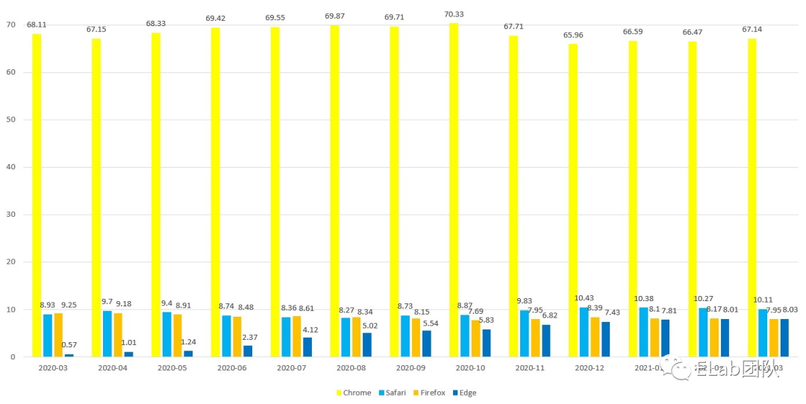

## **什么是V8引擎**

    V8引擎是一个JavaScript引擎实现，最初由一些语言方面专家设计，后被谷歌收购，随后谷歌对其进行了开源。V8使用C++开发，在运行JavaScript之前，相比其它的JavaScript的引擎转换成字节码或解释执行，V8将其编译成原生机器码（IA-32, x86-64, ARM, or MIPS CPUs），并且使用了如内联缓存（inline caching）等方法来提高性能。有了这些功能，JavaScript程序在V8引擎下的运行速度媲美二进制程序。V8支持众多操作系统，如windows、linux、android等，也支持其他硬件架构，如IA32,X64,ARM等，具有很好的可移植和跨平台特性。

## V8如何运行Javascript

1. **解析 (Parse)**: 输入的JS源代码首先被`解析器(Parse)`处理，解析成`抽象语法树（AST）`。这一步是编程语言的常规处理过程，目的是将源代码转换成结构化的、便于进一步处理的内部表示形式
2. **生成字节码 (Bytecode)**: AST 接下来被 `Ignition（V8的解释器）`处理，转换成字节码。字节码是介于源代码和机器代码之间的一种低级语言，比源代码更接近机器语言，但不是特定于任何单一的硬件
3. **执行字节码 (Execution)**: 字节码随后被执行。在这一阶段，代码运行并进行实际的计算
4. **优化 (Optimization)**: `TurboFan（V8的优化编译器）`根据运行时的数据对字节码进行优化，生成优化的机器代码。优化的目的是提高代码的执行效率，通过诸如内联函数、消除冗余代码等技术来增强性能
5. **去优化 (Deoptimization)**: 如果优化的假设在实际运行中不成立，优化的代码需要被去优化，回退到字节码执行，这一过程称为去优化
6. **生成机器代码 (Machine Code)**: 优化后的代码被转换为机器代码，即直接由计算机硬件执行的代码。这一步骤确保代码运行得尽可能快

具体流程可以看下图：

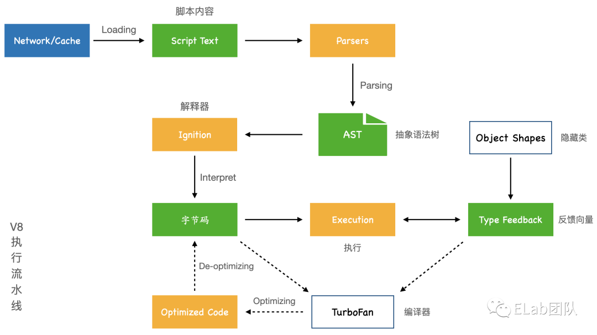

### Loading

    js文件加载的过程并不是由V8负责的，它可能来自于网络请求、本地的cache或者是也可以是来自service worker，浏览器的js加载的整个过程，就是V8引擎运行js的前置步骤。  
**3种加载方式 & V8的优化**：

*   **Cold load**: 首次加载脚本文件时，没有任何数据缓存

*   **Warm load**：V8分析到如果使用了相同的脚本文件，会将编译后的代码与脚本文件一起缓存到磁盘缓存中

*   **Hot load**: 当第三次加载相同的脚本文件时，V8可以从磁盘缓存中载入脚本，并且还能拿到上次加载时编译后的代码，这样可以避免完全从头开始解析和编译脚本

    延伸阅读：V8 6.6 进一步改进缓存性能\[3\] 代码缓存策略优化，简单讲就是从缓存代码依赖编译过程的模式，改变成两个过程解耦，并增加了可缓存的代码量，从而提升了解析和编译的时间  
**【旧模式】**  
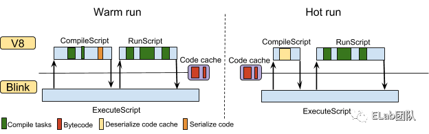  
 **【新模式】**  
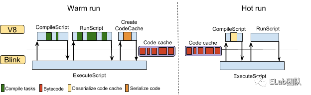

### Parsing

    Parsing（分析过程）是将js脚本转换成AST（抽象语法树:**Abstract Syntax Tree**）的过程

#### 词法分析

##### Token

    从左往右逐个字符地扫描源代码，通过分析，产生一个不同的标记，这里的标记称为token，代表着源代码的最小单位，通俗讲就是将一段代码拆分成最小的不可再拆分的单元，这个过程称为词法标记。词法分析器常用的token标记种类有几类：

*   常数（整数、小数、字符、字符串等）

*   操作符（算术操作符、比较操作符、逻辑操作符）

*   分隔符（逗号、分号、括号等）

*   保留字

*   标识符（变量名、函数名、类名等）

```
TOKEN-TYPE TOKEN-VALUE\
-----------------------------------------------\
T_IF                 if\
T_WHILE              while\
T_ASSIGN             =\
T_GREATTHAN          >\
T_GREATEQUAL         >=\
T_IDENTIFIER name    / numTickets / ...\
T_INTEGERCONSTANT    100 / 1 / 12 / ....\
T_STRINGCONSTANT     "This is a string" / "hello" / ...
```

##### 流式处理

    词法处理过程中，输入是字节流，输出是Token流：  
  
    定义100行单词处理时间1t，占用内存1m，来对比看下流式和非流式两种方式的区别：

*   **非流式处理:** 时间消耗6t，内存消耗峰值3M，读取+处理完成才会释放内存块；

*   **流式处理：** 时间消耗是4t，内存消耗峰值1M，内存释放相同机制；

    可以发现流式处理能很大程度上提升处理效率和节省内存空间  
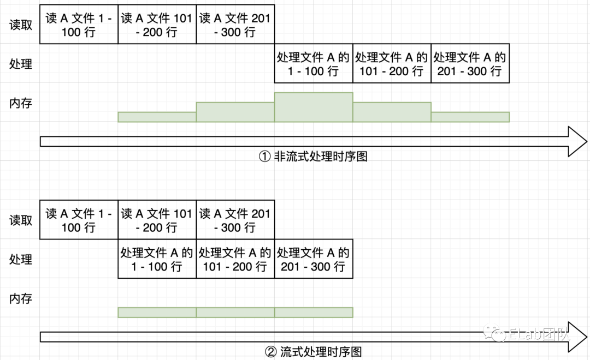

##### 词法分析器结构

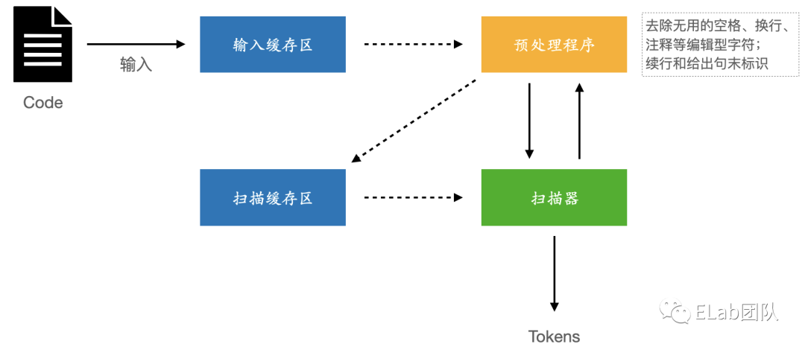  
    扫描缓存区大小一般是固定的大小，但也无法确保能不影响单词的边界，同时会使用**两个指示器（指针），一个指向正在识别的单词头部，一个向前搜索单词的终点。**  
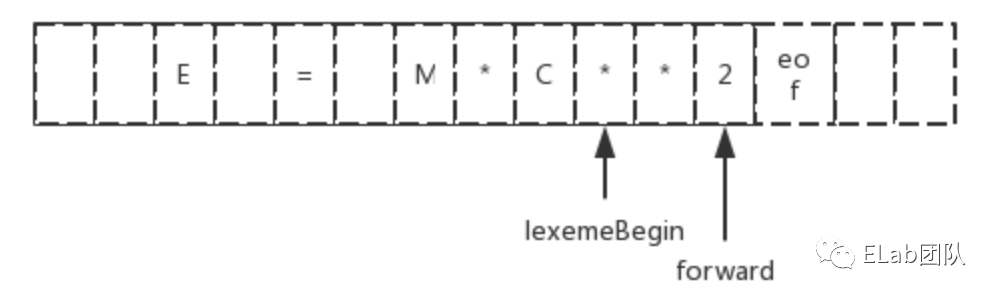  
    这里有个概念是：**超前搜索**，用户可能把关键字等特殊的语句重新定义，所以扫描器需要提前扫描到这些字后面的代码格式，才能确定其最终代表的词性。有这个问题存在会影响到性能，现在的大多数语言会把基本字都设置成保留字，用户不能修改其含义。

##### 有限状态机

    扫描器依托**有限状态机**来实现正则匹配不同的token类型，下面以识别整数和浮点数的状态机为例，简单讲下过程：  
单圆代表着“结点”，代表着扫描过程中可能出现的“状态”，也就是上面提到的两个指示器中间对应的所有字符；  
箭头指向可称为“边”，从一个状态指向另外一个状态，边的标号代表一个或者多个符号，如果能匹配一条边，向前指针就会前移，指向下个状态  
Start代表着开始状态  
双圆环代表着接受状态或者最终状态，代表着已经找到了准确的状态，向语法分析器返回一个token和相关的属性值  
“\*”代表着可能会识别到并不包含接受状态的符号，可能指针需要回退一步或者多步

| **词法单元** | **模式**                          |
| ------------ | --------------------------------- |
| **digit**    | \[0-9\]                           |
| **digits**   | digit+                            |
| **number**   | digits(.digits)?(E\[+-\]?digits)? |

    23状态对应的是识别为整数，24状态代表为非科学计数法的浮点数，22匹配的是科学计数法的浮点数（包含整数和小数部分），同时也有只有整数部分的。状态机会通过一个state参数来保存识别出来的编号（例如：0-24），然后通过switch 来判断state的值，实现不同状态对应的执行动作。  
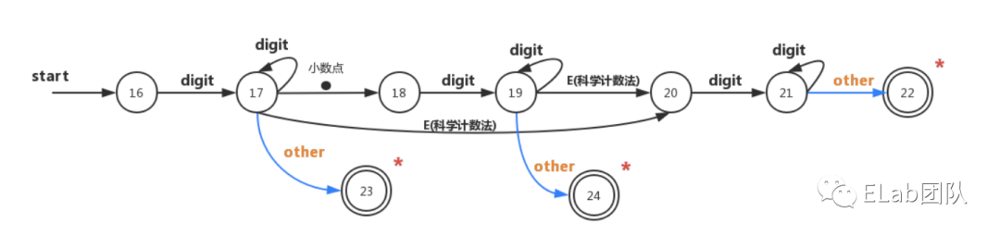  
**状态机是一个很有用的设计思想，在很多场景都有使用，大家可以下来好好学习下，React的state,Redux的状态管理等等。**  
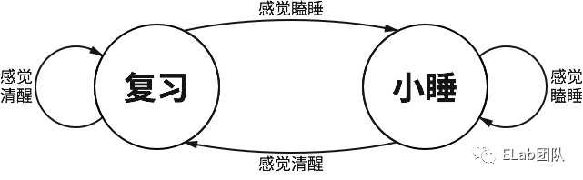

##### 在线demo

Esprima: Parser\[4\] 在线demo，仅做参考，v8的解析的比这个复杂：https://v8.dev/blog/scanner \[5\]  
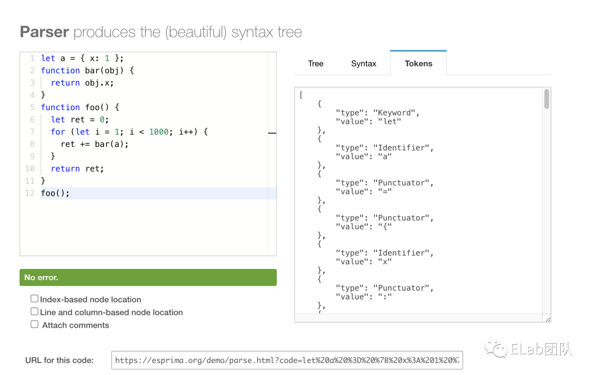

#### 语法分析

    语法分析是指根据某种给定的**形式文法**对由**单词序列构成**的输入文本，例如上个阶段的词法分析产物-tokens stream，进行分析并确定其**语法结构**的过程。  
    **抽象语法树（Abstract Syntax Tree）** 是源代码结构的一种抽象表示。它以树状的形式表现编程语言的语法结构，树上的每个节点都表示源代码中的一种结构。  
    推荐这2个网站可以用来分析代码生成的ast结构：Esprima: Parser\[6\]  
https://resources.jointjs.com/demos/javascript-ast \[7\]  
以下面代码为例，简单分析下对应生成的AST树形结构：  

```
function f(a, b) {
let result = 0;
if(a > 0) {
result = a + b;
} else {
result = a - b;
}
return result
}
```


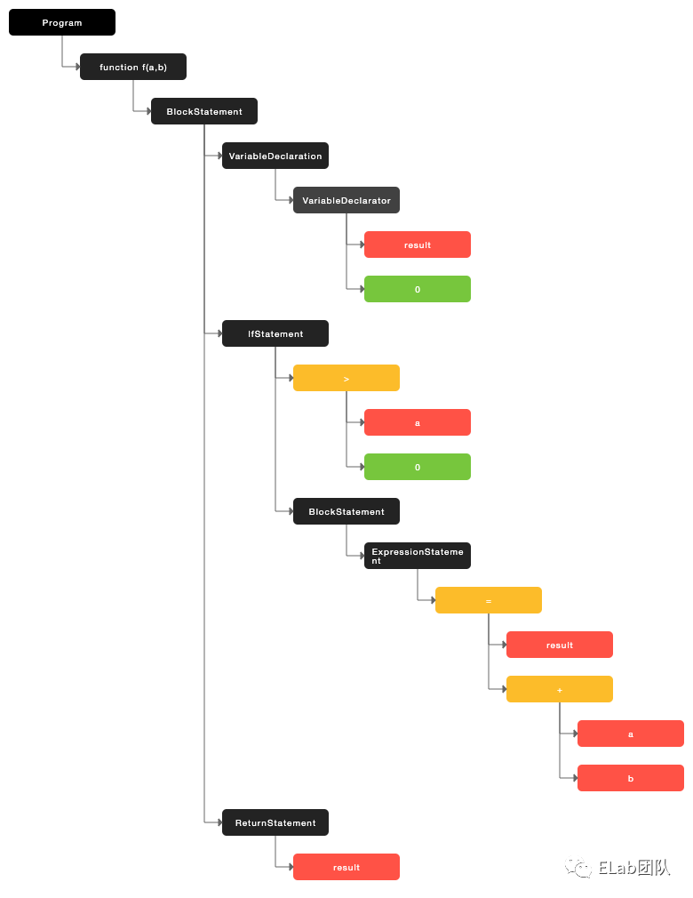  
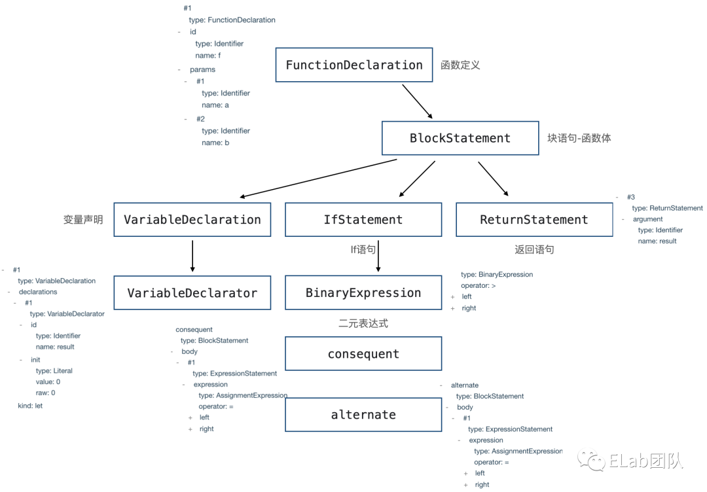  
V8会将语法分析的过程分为两个阶段来执行：

##### Pre-parser

*   跳过还未使用的代码

*   不会生成对应的ast，会产生不带有变量的引用和声明的scopes信息

*   解析速度会是Full-parser的2倍

*   根据js的语法规则仅抛出一些特定的错误信息

##### Full-parser

*   解析那些使用的代码

*   生成对应的ast

*   产生具体的scopes信息，带有变量引用和声明等信息

*   抛出所有的js语法错误

默认函数声明后，没有调用，对应的pre-parser:

```
➜ Desktop d8 test.js --print-ast
[generating bytecode for function: ]
--- AST ---
FUNC at 0
. KIND 0
. LITERAL ID 0
. SUSPEND COUNT 0
. NAME ""
. INFERRED NAME ""
. DECLS
. . FUNCTION "f" = function f
```

在文件末尾增加f(1, 2)调用函数方法，就可以触发Full-parser过程：

```
[generating bytecode for function: f]
--- AST ---
FUNC at 10
. KIND 0
. LITERAL ID 1
. SUSPEND COUNT 0
. NAME "f"
. PARAMS
. . VAR (0x7f80dd00fad8) (mode = VAR, assigned = false) "a"
. . VAR (0x7f80dd00fb80) (mode = VAR, assigned = false) "b"
. DECLS
. . VARIABLE (0x7f80dd00fad8) (mode = VAR, assigned = false) "a"
. . VARIABLE (0x7f80dd00fb80) (mode = VAR, assigned = false) "b"
. . VARIABLE (0x7f80dd00fc28) (mode = LET, assigned = true) "result"
. BLOCK NOCOMPLETIONS at -1
. . EXPRESSION STATEMENT at 25
. . . INIT at 25
. . . . VAR PROXY local[0] (0x7f80dd00fc28) (mode = LET, assigned = true) "result"
. . . . LITERAL undefined
. IF at 35
. . CONDITION at 40
. . . GT at 40
. . . . VAR PROXY parameter[0] (0x7f80dd00fad8) (mode = VAR, assigned = false) "a"
. . . . LITERAL 0
. . THEN at -1
. . . BLOCK at -1
. . . . EXPRESSION STATEMENT at 51
. . . . . ASSIGN at 58
. . . . . . VAR PROXY local[0] (0x7f80dd00fc28) (mode = LET, assigned = true) "result"
. . . . . . ADD at 63
. . . . . . . VAR PROXY parameter[0] (0x7f80dd00fad8) (mode = VAR, assigned = false) "a"
. . . . . . . VAR PROXY parameter[1] (0x7f80dd00fb80) (mode = VAR, assigned = false) "b"
. . ELSE at -1
. . . BLOCK at -1
. . . . EXPRESSION STATEMENT at 83
. . . . . ASSIGN at 90
. . . . . . VAR PROXY local[0] (0x7f80dd00fc28) (mode = LET, assigned = true) "result"
. . . . . . SUB at 94
. . . . . . . VAR PROXY parameter[0] (0x7f80dd00fad8) (mode = VAR, assigned = false) "a"
. . . . . . . VAR PROXY parameter[1] (0x7f80dd00fb80) (mode = VAR, assigned = false) "b"
. RETURN at 105
. . VAR PROXY local[0] (0x7f80dd00fc28) (mode = LET, assigned = true) "result"
```

##### 为什么要做两次解析？

    如果仅有一次，那必须是Full-parser，但这样的话，大量未使用的代码会消耗非常多的解析时间，结合具体的项目来看下：通过Devtools-Coverage录制的方式可以分析页面哪些代码没有用到：  
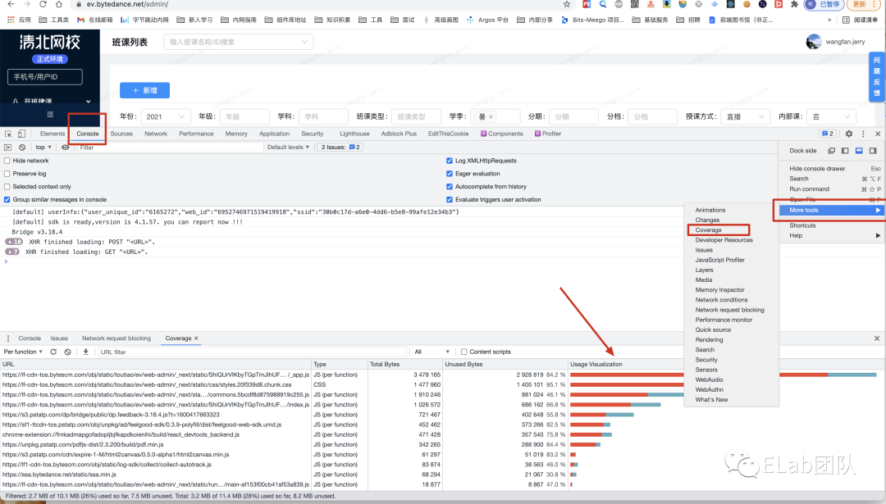  
    两次解析的负面影响：如果部分代码片段已经被pre-parser过了，那么在执行的过程中还会经过一次Full-parser，那总体耗时就是0.5\*parser + 1 \* parser = 1.5parser。  
下面罗列了不同种情况的代码声明对应的解析方法：

```
let a = 0; *// Top-Level 顶层的代码都是 Full-Parsing*
*// 立即执行函数表达式 IIFE = Immediately Invoked Function Expression*
(function eager() {...})(); *// 函数体是 Full-Parsing*
*// 顶层的函数非IIFE*
function lazy() {...} *// 函数体是 Pre-Parsing*
lazy(); *// -> Full-Parsing 开始解析和编译！*
*// 强制触发Full-Parsing解析*
!function eager2() {...}, function eager3() {...} *// full 解析*
let f1 = function lazy() { ... }; *// 函数体是 Pre-Parsing*
let f2 = function lazy() {...}(); *// 先触发了pre 解析, 然后又full解析*
```

**Bad case: 深度内嵌定义方法**

```
function lazy_outer() { *// pre-parser*
function inner() {
function inner2() {
*// ...*
}
}
}
lazy_outer(); *// pre-parsing inner & inner2*
inner(); *// pre-parsing inner & inner2 (3rd time!)*
```

##### Parser性能优化Tips

1.  使用Devtools-Coverage工具分析网页无用代码，并进行裁剪

2.  V8会将Parser过程的结果缓存72个小时，当用到的脚本文件中有任何代码修改了，那么parser缓存的结果就失效了，所以好的实践是将经常变动的代码打包一起，非经常变动的代码打包一起，这就有了第三方库dll的方案。

3.  可以考虑懒加载方案，当有一些代码无需业务代码执行的最开始需要的话，可以用异步加载的方法后续再加载

### Interpret（解释）

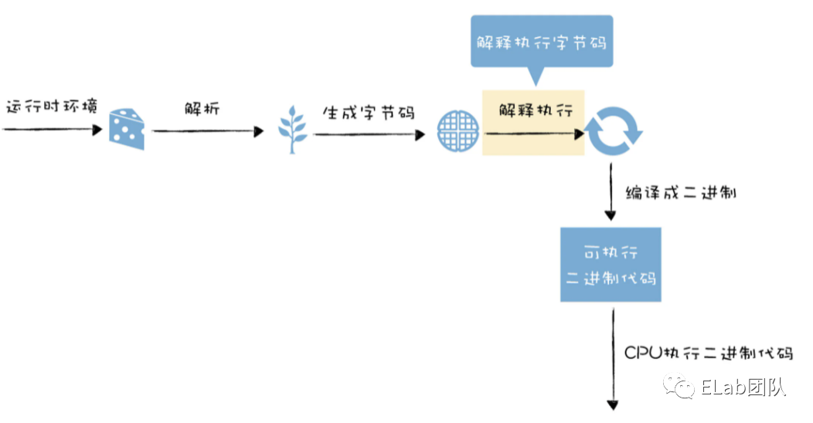  
    解释阶段会将之前生成的AST转换成字节码，代码会被编译器编译成从未被优化过的机器码，在运行的过程中，会将需要优化的代码进行**热点标记**，再通过更高级的编译器进行优化后再编译。  
    增加字节码的好处是，并不是将AST直接翻译成机器码，因为对应的cpu系统会不一致，翻译成机器码时要结合每种cpu底层的指令集，这样实现起来代码复杂度会非常高。  
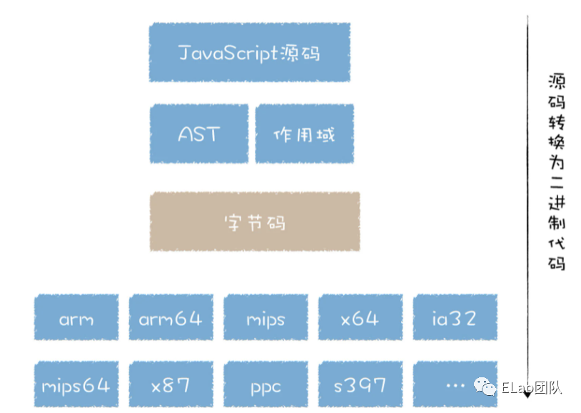

#### 内存占用

    最开始V8的设计中，运行js代码后会将AST直接转换成二进制的机器码，由于执行机器码的效率是非常高效的，所以这种方式在发布后的一段时间内运行效果是非常好。

    但机器码会存储在内存中，退出进程后会存储在磁盘上，但如果js源码可能只有1M，但转换后的机器码可能会多达几十M，过度占用会导致性能大大降低。当手机越来变得普及后，内存问题就更加突出了。  
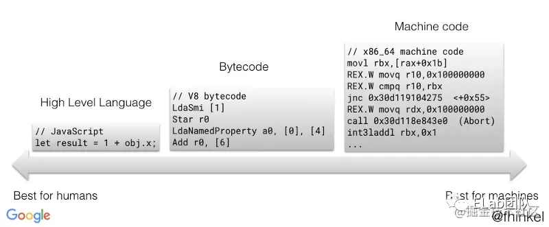

#### Ignition解释器

    V8团队为了解决这类性能问题，自己做出了Ignition\[8\]解释器，在中间过程中增加了字节码  
    Ignition解释器转换成的字节码，比传统的直接翻译成机器码节省了 **25%-50%** 的内存空间，同时为了进一步节省，当字节码生成后，AST的数据就直接被废弃掉了。在字节码上又加上了一些元数据，例如记录源代码的位置和用于执行字节码的处理方法等。  
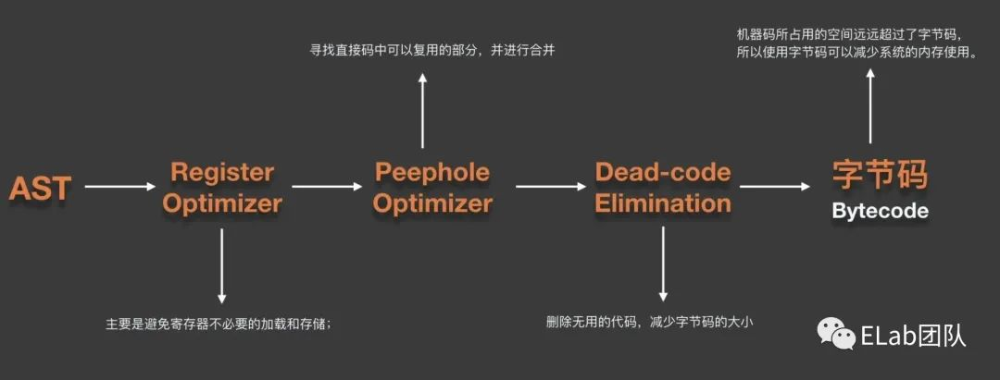  
还是以上面的代码为例，看下d8下的字节码

```
function add(x, y) {
var z = x + y;
return z;
}
add(1,2);
```

```
➜ Desktop d8 test.js --print-bytecode
[generated bytecode for function: (0x3ae908292f71 <SharedFunctionInfo>)]
Bytecode length: 28
Parameter count 1
Register count 4
Frame size 32
OSR nesting level: 0
Bytecode Age: 0
0x3ae908293032 @ 0 : 13 00 LdaConstant [0]
0x3ae908293034 @ 2 : c2 Star1
0x3ae908293035 @ 3 : 19 fe f8 Mov <closure>, r2
0x3ae908293038 @ 6 : 64 4f 01 f9 02 CallRuntime [DeclareGlobals], r1-r2
0x3ae90829303d @ 11 : 21 01 00 LdaGlobal [1], [0]
0x3ae908293040 @ 14 : c2 Star1
0x3ae908293041 @ 15 : 0d 03 LdaSmi [3]
0x3ae908293043 @ 17 : c1 Star2
0x3ae908293044 @ 18 : 0d 04 LdaSmi [4]
0x3ae908293046 @ 20 : c0 Star3
0x3ae908293047 @ 21 : 62 f9 f8 f7 02 CallUndefinedReceiver2 r1, r2, r3, [2]
0x3ae90829304c @ 26 : c3 Star0
0x3ae90829304d @ 27 : a8 Return
Constant pool (size = 2)
0x3ae908293001: [FixedArray] in OldSpace
- map: 0x3ae908002205 <Map>
- length: 2
0: 0x3ae908292fb9 <FixedArray[2]>
1: 0x3ae908003f85 <String[3]: #add>
Handler Table (size = 0)
Source Position Table (size = 0)
[generated bytecode for function: add (0x3ae908292fc9 <SharedFunctionInfo add>)]
Bytecode length: 7
Parameter count 3
Register count 1
Frame size 8
OSR nesting level: 0
Bytecode Age: 0
0x3ae908293156 @ 0 : 0b 04 Ldar a1
0x3ae908293158 @ 2 : 38 03 00 Add a0, [0]
0x3ae90829315b @ 5 : c3 Star0
0x3ae90829315c @ 6 : a8 Return
Constant pool (size = 0)
Handler Table (size = 0)
Source Position Table (size = 0)
```

    V8在执行字节码的过程中，使用到了**通用寄存器**和**累加寄存器**，函数参数和局部变量保存在通用寄存器里面，累加器中保存中间计算结果，在执行指令的过程中，如果直接由cpu从内存中读取数据的话，比较影响程序执行的性能，使用寄存器存储中间数据的设计，可以大大提升cpu执行的速度。  
    这里面包含了很多编译原理里面涉及到的指令集。  
    字节码更多指令可以看下V8-Ignition的源码\[9\]  
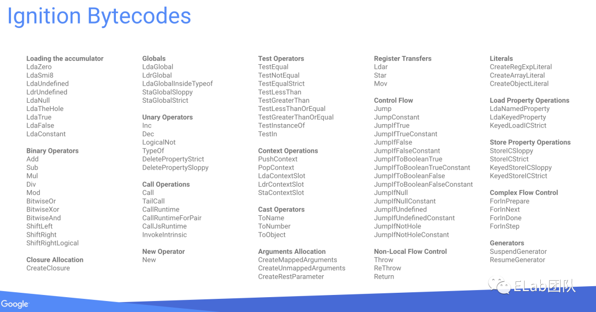  
参考文档：Google Ignition ppt\[10\]

### 编译器

    这个过程主要指是V8的**TurboFan编译器**将字节码翻译成机器码的过程。  
字节码配合解释器和编译器这一技术设计，可以称为JIT，即时编译技术，java虚拟机也是类似的技术，解释器在解释执行字节码时，会收集代码信息，标记一些**热点代码**，**热点代码(hotspot)**就是一段代码被重复执行多次，TurboFan会将热点代码直接编译成机器码，缓存起来，下次调用直接运行对应的二进制的机器码，加速执行速度。****  
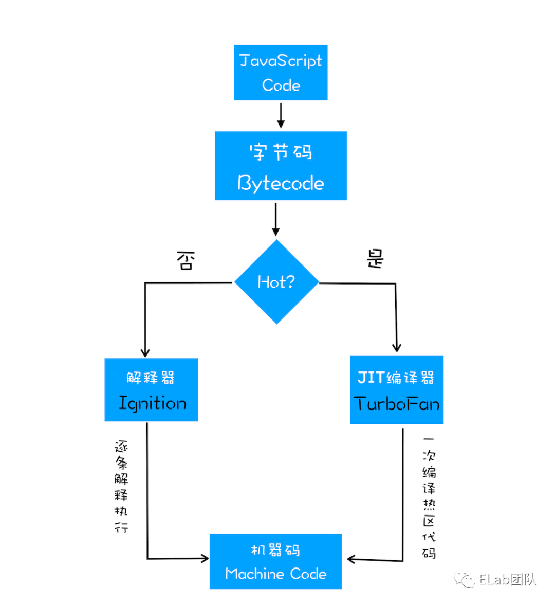  
**TurboFan**的整体优化过程，可参见下图，这里的优化分为了3层，更偏向于系统底层  
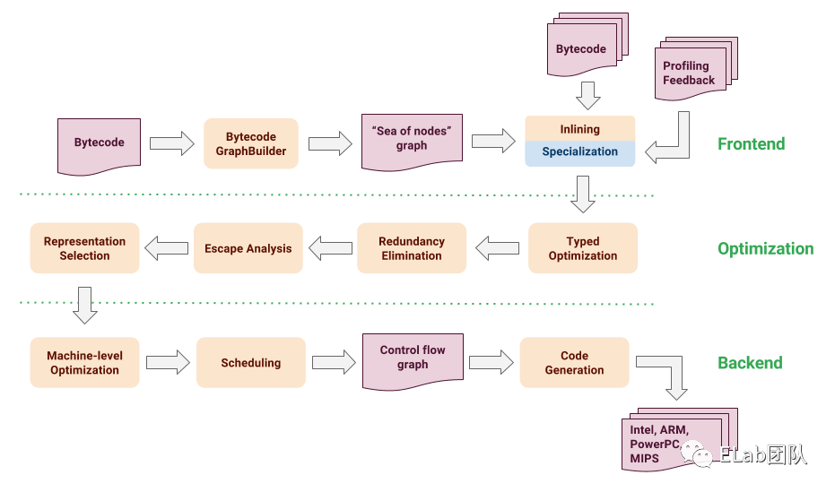  
在**TurboFan**将字节码编译成机器码的过程中，还进行了简化处：常量合并、强制折减、代数重新组合。  
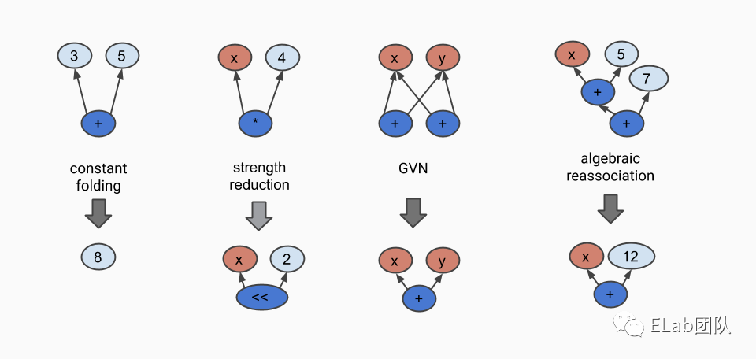  
类型推断（Speculative Optimization）是TurboFan的一大核心能力，

### **Execution(执行)**

    在Javascript的执行过程中，经常遇到的就是对象属性的访问。作为一种动态的语言，在js中，一行简单的属性访问可能包含着复杂的语义: Object.xxx的形式，可能是属性的直接访问，也可能调用的对象的Getter方法，还有可能是要通过原型链往上层对象中查找。  
    这种不确定性而且动态判断的情况，会浪费很多查找时间，降低运行的速度，V8中会把第一次分析的结果放在缓存中，当再次访问相同的属性时，会优先从缓存中去取，调用GetProperty(Object, "xxx", feedback\_cache)的方法获取缓存，如果有缓存结果，就会跳过查找过程。

#### Object Shapes

    在静态语言中，代码执行前要先进行编译，编译的时候，每个对象的属性都是固定的， 直接可以通过记录某个属性相对该对象的地址的偏移量，就可直接读取到属性值， 而在动态语言中，对象的属性是会被实时改动的，能否可以借鉴静态语言的这种特点来设计呢？  
    V8加入了**Object Shapes** 或者叫做Hidden Class(隐藏类)的概念。V8会给每个对象创建一个隐藏类，里面记录了对象的一些基本信息：

*   对象所包含的所有属性

*   每个属性相对于该对象的偏移量

    有了属性名和地址的偏移量，当访问对象的某个属性时，就可以直接从内存中读取到，不需要再经过一系列的查找，大大提升了V8访问对象时的效率。以代码为例：

```
let demoObj = { a:1, b:2 }; %DebugPrint(demoObj); // d8内部api 
```

执行d8的调试命令查看对应的隐藏类结构：

```
➜ Desktop d8 --allow-natives-syntax test2.js
DebugPrint: 0x2ef2081094b5: [JS_OBJECT_TYPE]
- map: 0x2ef2082c78c1 <Map(HOLEY_ELEMENTS)> [FastProperties] //隐藏类地址
- prototype: 0x2ef208284205 <Object map = 0x2ef2082c21b9> // 原型链
- elements: 0x2ef20800222d <FixedArray[0]> [HOLEY_ELEMENTS] // elements 和 properties 快慢属性相关
- properties: 0x2ef20800222d <FixedArray[0]>
- All own properties (excluding elements): {
0x2ef20808ecf9: [String] in ReadOnlySpace: #a: 1 (const data field 0), location: in-object
0x2ef20808ed95: [String] in ReadOnlySpace: #b: 2 (const data field 1), location: in-object
}
0x2ef2082c78c1: [Map] // 对应的隐藏类
- type: JS_OBJECT_TYPE
- instance size: 20
- inobject properties: 2
- elements kind: HOLEY_ELEMENTS
- unused property fields: 0
- enum length: invalid
- stable_map
- back pointer: 0x2ef2082c7899 <Map(HOLEY_ELEMENTS)>
- prototype_validity cell: 0x2ef208202405 <Cell value= 1>
- instance descriptors (own) #2: 0x2ef2081094e5 <DescriptorArray[2]>
- prototype: 0x2ef208284205 <Object map = 0x2ef2082c21b9>
- constructor: 0x2ef208283e3d <JSFunction Object (sfi = 0x2ef208209071)>
- dependent code: 0x2ef2080021b9 <Other heap object (WEAK_FIXED_ARRAY_TYPE)>
- construction counter: 0
```

#### 隐藏类的复用

    现在我们清楚每个对象都有一个map属性，指向的是一个隐藏类，如果两个相同形状的对象，在V8中会复用同一个隐藏类，**这样会减少创建隐藏类的次数，加快V8的执行速度，同时也会减少隐藏类占用的内存空间**，相同形状的定义：

*   相同的属性名称

*   相同的属性名顺序一致

*   相同的属性个数

```
let demoObj = { a:1, b:2 }; 
let demoObj2 = { a:100, b:200 }; 
%DebugPrint(demoObj); 
%DebugPrint(demoObj2); 
```


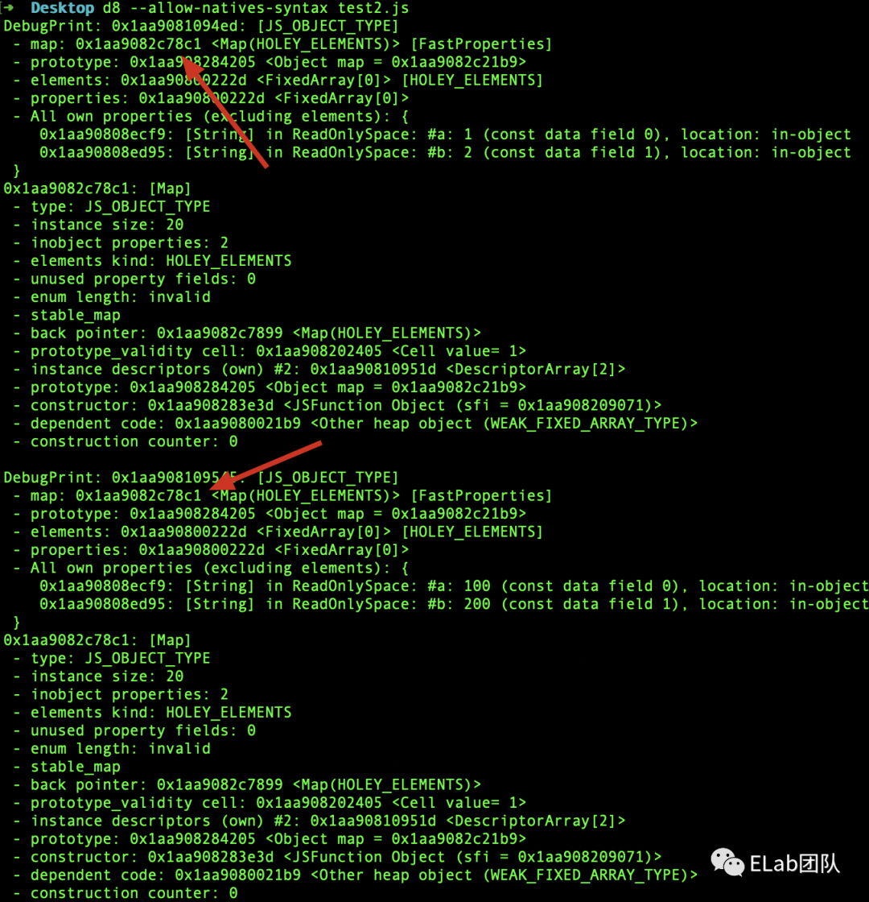  
    当对象的隐藏类创建完成后，一旦对象发生形状上的改变：增加新的属性或者是删除旧的属性时，隐藏类就会重新被创建，这个动作是V8执行过程中的一笔开销。所以这里的**代码优化建议**：

1.  尽量创建形状一致的对象，属性的顺序、属性的key值、key值的个数尽量保持一致

2.  尽量不要后面再加入临时属性，声明对象时属性完整，因为每次加入属性，破坏了原有的对象形状，隐藏类要重新创建

3.  尽量不要使用delete 删除对象属性，同理于上条原理，会破坏对象的形状

## 总结

    V8引擎经历了多年的不断完善和新技术的演进，里面涵盖了太多的技术点和设计思想，本次分享主要是从js脚本内容下载到最终在V8引擎执行的过程进行分析，来体会一下V8的独到之处，和它不断追求极致性能的思想，加深对V8的理解，也能更好地写出高效的代码，而且很多优化思想也可以在其他的语言或框架中得到印证，还有很多比较深入的知识点，例如：内联属性策略、反馈向量机制、快慢属性等，后续的分享文章中会进一步解析，欢迎大家不吝指正和探讨，一起探究v8引擎背后绝妙的设计思想。

## 个人思考

### 为什么生成字节码不直接生成机器码

> 为什么编译成字节码，我觉得是一种取舍，直接编译成机器码占用内存非常大， 特别是在移动设备中，过大会造成性能问题。编译成字节码可以减少很多体积，当需要运行的时候再通过JIT和热点代码缓存为机器码的方式，也能有很快的运行速度。另外字节码是更加上层的抽象，可以很好的实现跨平台。

## 参考文档

- https://mp.weixin.qq.com/s/4nSZprltPcVV3yEl5Hawiw
- https://juejin.cn/post/7406139000284135463