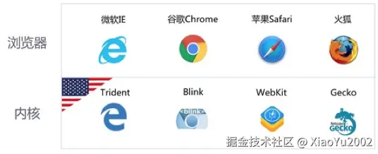
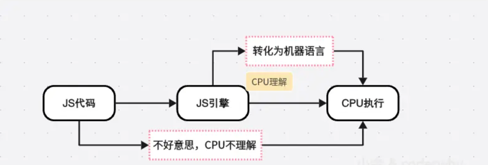

# 浏览器内核和JS引擎的关系

## 认识浏览器内核

- 我们打包部署好的项目内容，直接打开是看不了的。而浏览器访问却可以正常的显示内容，那在这个过程中，一大堆文件都是谁在帮助我们解析?
  - 要想深入理解下载的过程，我们还要先理解，一个index.html被下载下来后是如何被解析和显示在浏览器上的
  - 这里就需要说到一个重要的概念，也就是我们的**浏览器内核**，我们的解析就是由它来完成的
  - 经过它的解析，我们就能够看到网页，并对网页进行点击等交互操作
  - 浏览器内核是浏览器的一个重要组成部分

### 1. 什么是浏览器内核

> 浏览器内核是指浏览器中负责解析 HTML、CSS、JavaScript 等文件的核心组件，也被称为渲染引擎

- 我们经常会说：不同的浏览器有不同的内核组成
  - `Gecko`：早期被Netscape和Mozilla Firefox浏览器浏览器使用
  - `Trident`：微软开发，被IE4~IE11浏览器使用，但是Edge浏览器已经转向Blink
  - `Webkit`：苹果基于KHTML开发、开源的，用于Safari，Google Chrome之前也在使用
  - `Blink`：是Webkit的一个分支，Google开发，目前应用于Google Chrome、Edge、Opera等
  - 等等...
- 事实上，我们经常说的浏览器内核指的是浏览器的排版引擎：
  - 官方没有对引擎取一个具体的名字(因为没有官方，浏览器并不是单独由某家公司开发的)，所以大家对此的叫法有很多种
  - `排版引擎`（layout engine），也称为`浏览器引擎`（browser engine）、`页面渲染引擎`（rendering engine）或`样版引擎`

### 2. 常见的浏览器内核

> 如图2-7，可以看到常用的几款浏览器和对应的内核分别是谁

1. Trident （三叉戟）

    Trident 内核最初是由 Microsoft 开发的，用于 Internet Explorer 浏览器

   - 后来，一些国内的浏览器厂商（如 360安全浏览器、搜狗高速浏览器、百度浏览器、UC浏览器）也采用了 Trident 内核

2. Gecko （壁虎）

    Gecko 内核最初是由 Mozilla 开发的，用于 Firefox 浏览器

   - Gecko 内核的优势在于支持 HTML5、CSS3 等最新的 Web 标准，并且具有较高的性能和稳定性

3. Presto（急板乐曲）-> Blink （眨眼）

    Presto 内核最初是由 Opera 开发的，用于 Opera 浏览器

   - 后来，Opera 采用了 Blink 内核，Blink 内核基于 WebKit 内核进行了改进和优化，能够更快地渲染页面，并且支持更多的 HTML5、CSS3 特性

4. Webkit

    WebKit 内核最初是由 Apple 开发的，用于 Safari 浏览器

   - 现在，很多国内的浏览器厂商（如 360极速浏览器、搜狗高速浏览器）也采用了 WebKit 内核
   - 除了桌面浏览器，WebKit 内核在移动设备上也得到了广泛的应用，如 iOS 和 Android 系统的浏览器

5. Webkit -> Blink

    Blink 内核最初也是由 Google 开发的，用于 Chrome 浏览器

   - Blink 内核基于 WebKit 内核进行了改进和优化，并且具有更高的性能和更好的兼容性
   - 现在，Microsoft Edge 也采用了 Blink 内核

    

## JavaScript引擎

### 1. 什么是JavaScript引擎

> JavaScript引擎是一个解释和执行JavaScript代码的程序，负责将JavaScript代码转换成可执行的机器代码。这个过程包括解析代码、进行优化，并最终执行。通过它，JS能在浏览器或服务器环境中运行，处理从简单的脚本到复杂应用的各种计算任务

当我们编写JavaScript代码时，它实际上是一种高级语言，这种语言并不是机器语言。

- 高级语言是设计给开发人员使用的，它包括了更多的抽象和可读性。
- 但是，计算机的CPU只能理解特定的机器语言，它不理解JavaScript语言。
- 这意味着，在计算机上执行JavaScript代码之前，必须将其转换为机器语言。

这就是JavaScript引擎的作用：

- 事实上我们编写的JavaScript无论交给浏览器还是Node执行，最后都是需要被CPU执行的；
- 但是CPU只认识自己的指令集，实际上是机器语言，才能被CPU所执行；
- 所以我们需要JavaScript引擎帮助我们将JavaScript代码翻译成CPU指令来执行；

#### 1.1. CPU对于JS引擎的意义

CPU（中央处理器）是计算机的主要硬件之一，负责解释计算机程序中的指令以及处理计算机软件中的数据。它执行程序的基本算术、逻辑、控制和输入/输出（I/O）操作，指定这些操作的基本指令系统。CPU是计算机的大脑，负责执行操作系统和应用程序的命令。现代CPU通常包括多个处理核心，这使它们能够同时处理多个任务

- CPU是真正的代码执行者，而JS引擎则相当于一个翻译官
- 前端通常很少理解到硬件层，有兴趣的可以通过学习408(计算机四件套)来进一步掌握，接下来就让我们来看下这个步骤
  - CPU又叫做`中央处理器` 执行的是机器语言，也就我们所说的底层编码语言，由一系列的二进制代码组成，能够直接控制硬件操作，也是真正的代码执行源头

  

- 这样如图3-1，通过引擎的转换，JavaScript 代码最终能在硬件上运行，实现各种功能和任务

#### 1.2. 常见的JavaScript引擎

比较常见的JavaScript引擎有哪些呢？

- `SpiderMonkey`：第一款JavaScript引擎，由Brendan Eich开发（也就是JavaScript作者）;
- `Chakra`：微软开发，用于IT浏览器；
- `JavaScriptCore`：WebKit中的JavaScript引擎，Apple公司开发；
- `V8`：Google开发的强大JavaScript引擎，也帮助Chrome从众多浏览器中脱颖而出；
  - 这就是为什么早年谷歌浏览器的浏览速度会快于其他浏览器的原因，这都得益于V8引擎的强大，但到如今，很多的浏览器也都开始使用起谷歌的这个引擎了(因为是开源的)。所以这些套用谷歌v8引擎的浏览器有时候也会被人叫做套壳浏览器
- 等等…

## 浏览器内核与JS引擎关系

- 我们先以WebKit为例，WebKit事实上由两部分组成的：
  - `WebCore`：负责HTML解析、布局、渲染等等相关的工作
  - `JavaScriptCore`：解析、执行JavaScript代码

- 所以JavaScript引擎是浏览器内核的一个组成部分。内核负责整体的页面布局和资源加载，而JavaScript引擎专注于处理JavaScript语言
  - 当网页被加载时，浏览器内核首先解析HTML和CSS，构建DOM树和渲染树，也是我们讲过的重点内容。在此过程中，当内核遇到`<script>`标签时，它会调用JavaScript引擎来处理脚本，执行可能会影响DOM的操作(也就是我们上一章节所说的`重绘与重排`)。而JS代码就是在这时候参与进来的
- 既然引擎这么重要，我们就需要单独拿出来进行一个讲解了，可JavaScript引擎其实不少，我们可以着重关注`V8`引擎。
