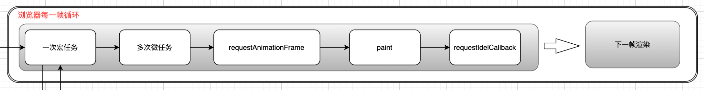

# dom更新时机

## 事件循环

1. 进入到 script 标签,就进入到了第一次事件循环.
2. 遇到同步代码，立即执行
3. 遇到宏任务,放入到宏任务队列里.
4. 遇到微任务,放入到微任务队列里.
5. 执行完所有同步代码
6. 执行微任务代码
7. 微任务代码执行完毕，本次队列清空
8. 更新 DOM 渲染
9. 寻找下一个宏任务，重复步骤1



那么在宏任务或微任务中操作 DOM 之后,再获取 DOM 的最新状态或位置，这时 DOM 还没渲染为什么能获取到呢？

## 更新 DOM 渲染

首先需要用改变 DOM 才会触发更新 DOM 渲染。如下：

```js
document.getElementById("text").innerHTML = "Hello World";
```

这段代码是同步执行的，所以我们可以立马获取到最新的值

```js
console.log(document.getElementById("text").innerText);
```

在浏览器中会打印我们新设置的`Hello World`。但这个时候页面其实没有渲染出最新的值。我们可以下面这段代码测试一下：

```html
<!DOCTYPE html>
<html lang="en">
<head>
  <meta charset="UTF-8">
  <meta name="viewport" content="width=device-width, initial-scale=1.0">
  <title>Document</title>
</head>
<body>
  <p id="text"></p>
</body>
</html>
<script>
  document.getElementById("text").innerHTML = "Hello World";
  console.log(document.getElementById("text").innerText);
  alert(document.getElementById("text").innerText)
</script>

```

这段代码运行效果如下：


这里用到了 `alert `，在 `chrome `中` alert `会暂停任务执行，相应的事件循环不得运行进一步的任务，并且当前正在运行的任务中的任何脚本都必须阻塞。 因此在 `alert `信息弹出，页面显示`Hello World`。但是页面没有渲染。而提示框提示的内容已经是最新的值了。

我们修改下添加宏任务和微任务：

```html
<!DOCTYPE html>
<html lang="en">
<head>
  <meta charset="UTF-8">
  <meta name="viewport" content="width=device-width, initial-scale=1.0">
  <title>Document</title>
</head>
<body>
  <p id="text"></p>
</body>
</html>
<script>
  setTimeout(() => { // 这里用setTimeout包起来是谷歌浏览器第一次渲染会将两个宏任务一起执行了...
    document.getElementById("text").innerHTML = "Hello World";
    console.log(document.getElementById("text").innerText);
    alert(document.getElementById("text").innerText)
    queueMicrotask(() => {
      alert('微任务')
    });

    setTimeout(() => {
      alert('宏任务')
    }, 0);
  }, 1000);
</script>
```

运行效果如下：


微任务提示框时页面没有重新渲染。


宏任务提示框时页面渲染了。

页面渲染不是同步渲染的，而是在一个事件循环微任务执行完之后才会渲染，也就是在一个事件循环内缓存宏任务和微任务的DOM操作，最后才一起渲染到页面上。我们也可以自己打开浏览器的`performance`查看一下：


可以看到前两个`alert`是一个任务中执行的。后面`alert`执行之前会进行渲染。


## 尺寸和大小

我们用 document 的 API 修改 DOM 时，在用 document 的 API 获取 DOM 的属性自然也就是最新值。

那该元素在页面的位置和尺寸大小能不能获取到最新的呢？

页面渲染主要分为两个阶段：Reflow(回流)、Repaint(重绘)。

Reflow(回流)，有的叫它重排，这个阶段主要是重新触发了 Layout(布局)，重新计算元素的所有框位置。

Repaint(重绘)，将元素样式绘制在屏幕上。

如果页面的是在微任务之后执行重新渲染，那么在宏任务中修改尺寸时没有触发 Layout(布局)应该获取不到最新尺寸的，我们写个例子看看是不是这样：

```html
<!DOCTYPE html>
<html lang="en">
<head>
  <meta charset="UTF-8">
  <meta name="viewport" content="width=device-width, initial-scale=1.0">
  <title>Document</title>
</head>
<body>
  <p id="text"></p>
</body>
</html>
<script>
  setTimeout(() => {
    document.getElementById("text").style.height = "200px";
    alert(document.getElementById("text").style.height);
  }, 1000);
</script>

```

运行结果：


运行结果可以看到可以获取到最新的尺寸，我们用`performance`监听页面的渲染过程。

::: tip 提示

常见的一些事件可以查看文档：https://developer.chrome.com/docs/devtools/performance/timeline-reference

 :::


图中看到执行了两个 alert，两个 alert 之间触发了 Layout(布局)。

也就是当获取 DOM 尺寸的时候强制执行了 Layout(布局) 后再获取 DOM 的尺寸，但并没有触发重绘，只是触发了布局。

## 总结

- DOM 的修改是同步修改。
- Reflow(回流)，通常浏览器会等到宏任务和微任务操作DOM执行完之后再触发它，但是一些 DOM 方法比如获取尺寸 offsetXXX 等会强制触发同步 Relow(回流)，以便获取最新值，但不会强制触发 Repaint(重绘)。
- Repaint(重绘)，将元素样式绘制在屏幕上，大多数浏览器会等待下一次屏幕刷新，不同浏览器重绘规则有区别。