# performance使用

网页加载后，浏览器会解析 html、执行 js、渲染 css，这些工作都是在 Event Loop 里完成的，理解了 Event Loop 就能理解网页的运行流程。但很多人对 Event Loop 的理解只是停留在概念层面，并没看过真实的 Event Loop 是怎样的。其实在 浏览器的Performance 工具里就可以看到。了解了performance的使用，对我们分析问题和优化代码都有非常大的帮助。

官方文档：https://developer.chrome.com/docs/devtools/performance/timeline-reference?hl=zh-cn

翻译：https://juejin.cn/post/6844903839863144461

具体的使用可以参考官方文档，我这里只记录自己平时忽略的地方。下图就是我们录制之后的数据。我们一般只用关注`Main`主线程，也就是执行 Event Loop 的部分。其余的Frames，Thread pool等需要的时候也可以关注下。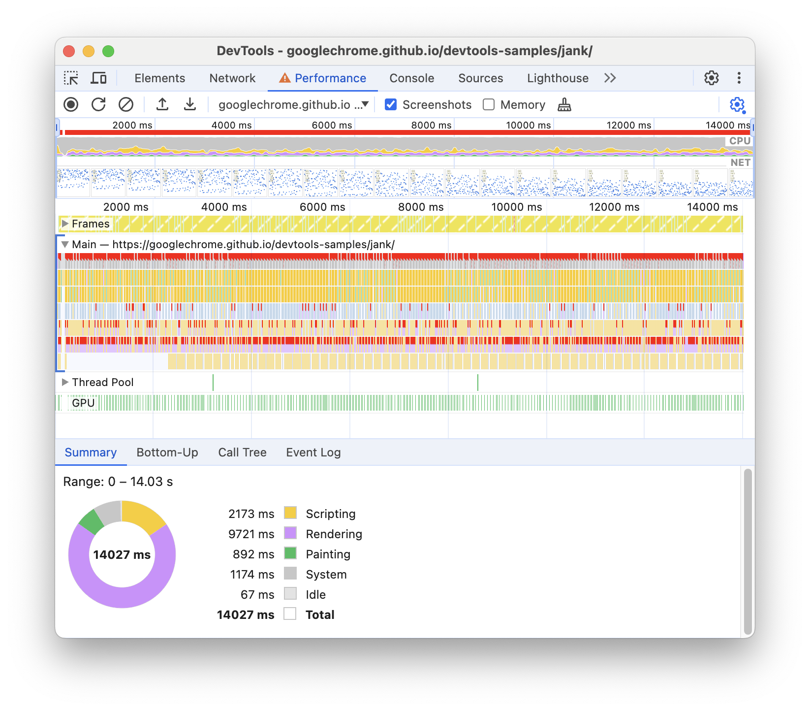

## 例子

https://claudiopro.github.io/react-fiber-vs-stack-demo/fiber.html
我们可以使用 react 测试 fiber 用的网页。由于用到了时间分片，所以非常适合我们去查看performance

## 一些含义

展示的信息中很多种颜色，这些颜色代表着不同的含义：

1. 灰色就代表宏任务 task，可以看到在react中fiber的构建会在一段一段的宏任务中执行。

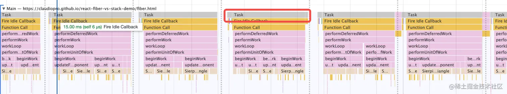

2. 蓝色的是 html 的 parse，橙色的是浏览器内部的 JS：

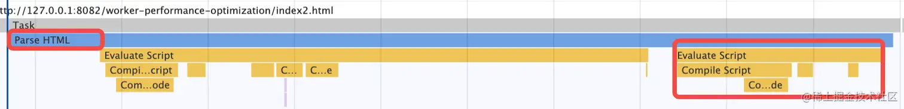

3. 紫色是样式的 reflow、repaint，绿色的部分就是渲染：

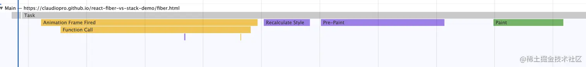

其余的颜色都是用户 JS 的执行了，那些可以不用区分。

## 每一帧

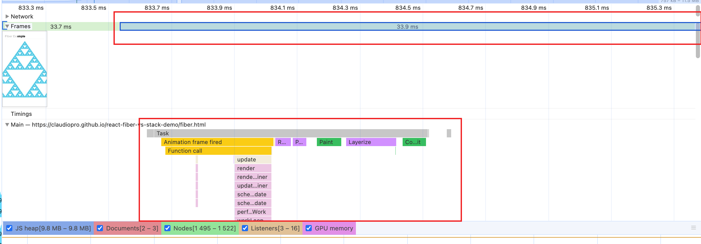

我们可以选择某一帧查看这一帧所做的事情。

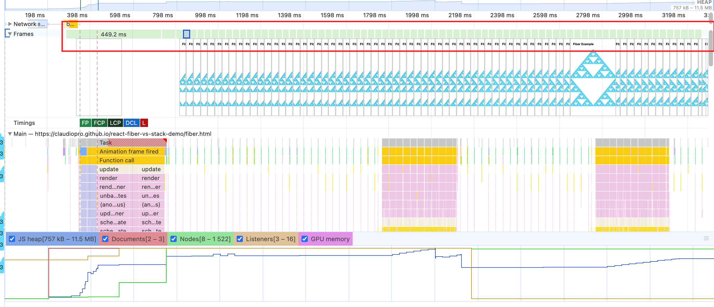

同时我们也可以看到开启了时间分片之后每一帧都非常的稳定。

##  Event Loop

其实上面每一个task就是一个宏任务。

我们一起来看一下：

你会发现每隔一段时间就会有一个这种任务：

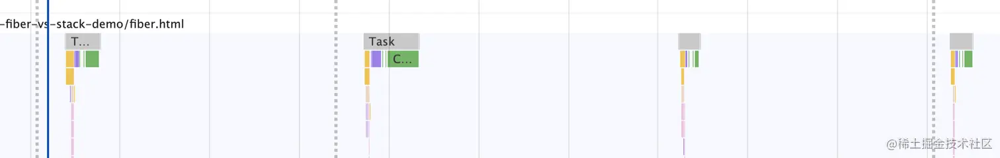

放大一下是这样的：

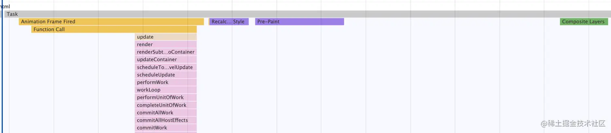

执行了 Animation Frame 的回调，然后执行了回流重绘，最后执行渲染。

这种任务每隔 16.7 ms 就会执行一次：

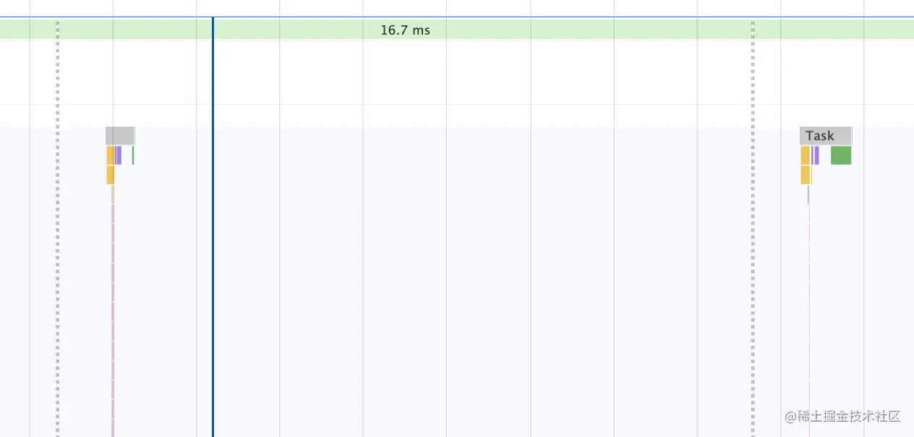

这就是网页里怎么执行渲染的。

所以说 requestAnimationFrame 的回调是在渲染前执行的，rAF 和渲染构成了一个宏任务。

为什么有的时候会掉帧、卡顿，就是因为阻塞的渲染的宏任务的执行：

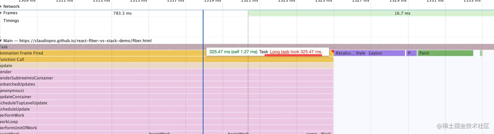

（在 Performance 中宽度代表时间，超过 50ms 就被认为是 Long Task，会被标红）

我们做性能分析，就是要找到这些 Long Task，然后优化掉它。

### 那除了 rAF 和渲染，还有哪些是宏任务呢？

看下分析的结果就知道了：

可以看到 requestIdleCallback 的回调是宏任务：

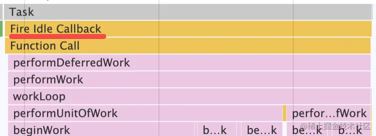

垃圾回收 GC 是宏任务：

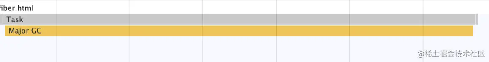

requestAnimationFrame 的回调是宏任务：

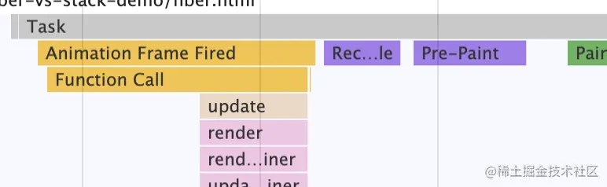

html 中直接执行的 script 也是宏任务：

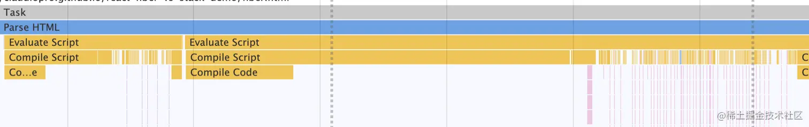

这些需要记么？

不需要，用 Performance 工具看下就知道了。

那微任务是怎么执行的呢？

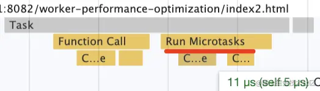

可以看到 micro task 只是 task 的一部分，宏任务执行完就会执行所有的微任务。

这就是这个网页的 Event Loop 执行过程。

当你对这些熟悉了之后，看到下面的火焰图，你就能分析出一些东西来了：

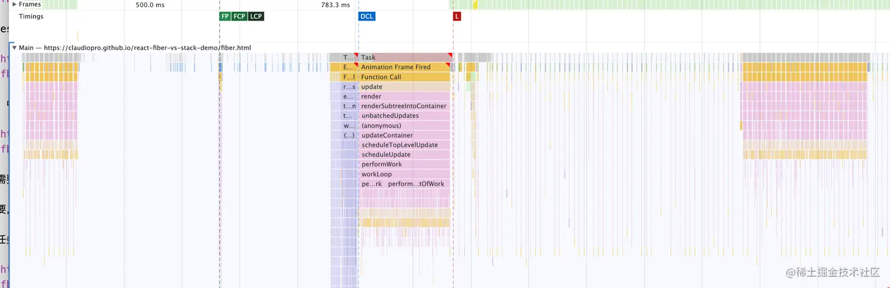

中间比较宽的标红的就是 Long Task，是性能优化的主要目标。

一些比较窄的周期性的 Task 就是 requestAnimationFrame 回调以及 reflow、rapaint 和渲染。

比较长的那个调用栈一般是递归，而且递归层数特别多。

当你展开看的时候，它也能展示完整的代码运行流程：

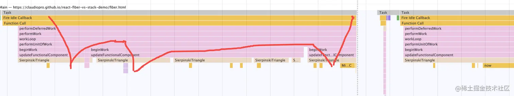

而如果你打断点调试，只能看到其中的一个调用栈，这是用 Performance 工具分析代码流程比 debugger 断点调试更好的地方。

当你阅读源码的时候，也可以通过 Performance 看执行流程的全貌，然后再 debugger 某些具体的流程。

## 总结成一张图

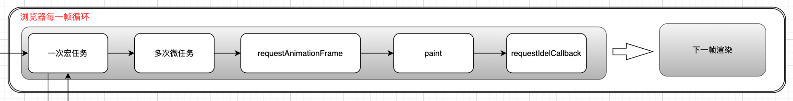

理解了这个对于我们后面分析问题非常有帮助。