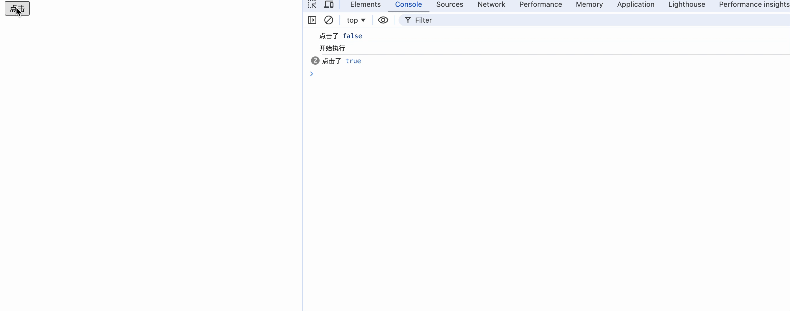
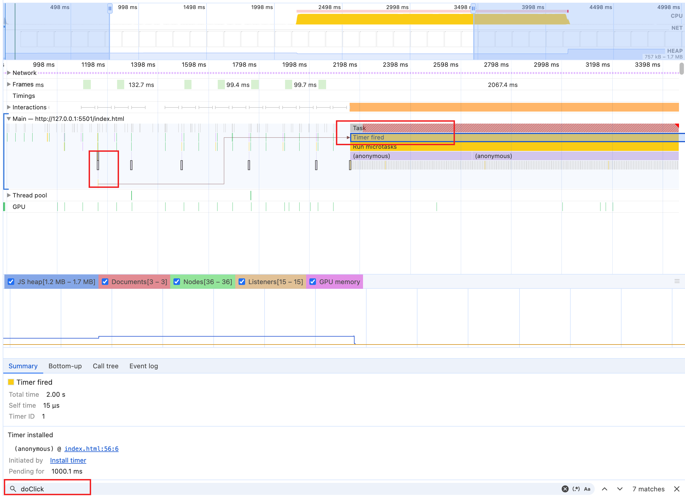
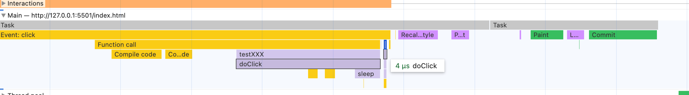
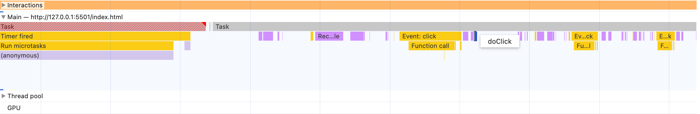

# 一段奇怪的代码

```html
<!DOCTYPE html>
<html lang="en">
<head>
  <meta charset="UTF-8">
  <meta name="viewport" content="width=device-width, initial-scale=1.0">
  <title>Document</title>
</head>
<body>
  <button id="btn">点击</button>
</body>
</html>
<script>
  let loading = false;
  let btn = document.getElementById('btn');

  const sleep = (time) => new Promise((resolve) => {
    setTimeout(() => {
      resolve(null);
    }, time);
  });

  btn.addEventListener('click', function testXXX(){
    doClick(loading);
  })

  const doClick = (innerLoading) => {
    console.log('点击了', innerLoading);
    if (innerLoading) {
      return;
    }
    console.log('开始执行');
    loading = true;
    sleep(1000).then(() => {
      const now = Date.now();
      while (Date.now() - now < 2000) {
      }
      loading = false;
      console.log('执行完成', innerLoading);
    });
  };
</script>

```



打开上面的代码在浏览器中执行效果如上。中间会有一段停顿的地方，也就是我们阻塞了主进程，一直在执行

```js
while (Date.now() - now < 2000) {
}
```

## 前置知识

1. **事件循环（Event Loop）**： 浏览器使用事件循环来协调事件、脚本执行、渲染、网络请求等。JavaScript的执行、事件的响应等都是在这个循环中处理的。当执行一段阻塞代码时，事件循环被阻塞，无法继续处理其他在队列中等待的任务。
2. **单线程模型**： JavaScript是单线程运行的，这意味着在任何给定时刻只能执行一个代码块。如果当前执行的代码块长时间占用线程（如阻塞循环），其他操作（如事件响应）就必须等待。
3. **浏览器的用户界面响应**： 用户界面的更新（如重绘和重排）也依赖于主线程。当主线程被长时间阻塞时，界面更新就会停滞，导致用户体验到界面“冻结”。

我们上面的代码会阻塞浏览器的主线程。主线程负责执行JavaScript代码、计算布局、绘制界面等任务。当主线程被阻塞时，浏览器无法完成这些任务，包括响应用户的交互事件。当在执行阻塞代码期间不断点击按钮时，这些点击事件会被浏览器接收并放入事件队列中等待处理。然而，因为主线程被阻塞，这些事件无法立即被处理。只有当阻塞的循环结束后，主线程才会从事件队列中取出事件并逐一处理。这意味着在阻塞期间的所有点击都不会即时响应，用户会感受到界面的“冻结”。

一旦阻塞的代码执行完毕，主线程就会变得空闲，事件循环会继续工作，从事件队列中取出事件并处理它们。这意味着所有在阻塞期间积累的事件（如多次点击按钮产生的多个点击事件）将会被依次处理。这通常会导致在阻塞结束后看到一系列快速连续的事件响应，因为这些事件是在阻塞期间积累起来的，然后在阻塞解除后迅速被处理。

## 深入理解



我们查看一下`performance`。搜索一下`doClick`事件。可以看到第一次`doClick`执行完之后会产生一个`setTimeout`。回掉函数会在一秒钟后触发(上图中的`Timer fired`就是`setTimeout`回掉产生的红任务)。由于`setTimeout`是异步的。所以在这一秒内我们点击按钮是可以立马被执行，只是由于`innerLoading`为`true`返回了，但是可以看到`console.log('点击了', innerLoading);`的执行。

::: tip 提示

如果我们点击的足够快，浏览器会在一个事件循环里处理所有的点击事件。可以看下图，一个`task`里面执行了两次`doclick`。只不过我们一般操作不了那么快，所以都是下一次事件循环处理。

 :::



当执行`setTimeout`回掉的时候，可以在`performance`看到上看到，这是一个长任务，执行耗时2s左右。在这期间，浏览器无法响应我们的点击事件。会把所有的点击事件存起来。等主线程执行完了再执行（这里具体存哪里还有待看）。

当我们`while`代码执行完后会将`loading`重置为`false`。然后会在下一个事件循环执行我们前面阻塞的点击事件。这里需要注意的是，第一个执行的点击事件执行的时候`loading`已经被修改为`false`了。所以又会执行`doClick`的后面逻辑而不是直接返回。

然后后面的阻塞事件由于`loading`被第一个阻塞事件改为`true`了。所以后面的都直接返回了。



可以看到`doclick`都在同一个时间循环中执行完了。

::: tip 提示
这里的关键是要理解我们`loading`的变化时机。被阻塞的事件都是在阻塞任务之后执行的，如果在阻塞任务里面更改`loading`，当我们执行被阻塞的事件的时候其实读到的是更改后的`loading`。
:::

## 总结

这一个例子很好能很好的了解一下浏览器事件循环的过程。以及当线程被阻塞的时候继续进行页面操作时会没有反应，只有主线程空闲的时候才会执行。