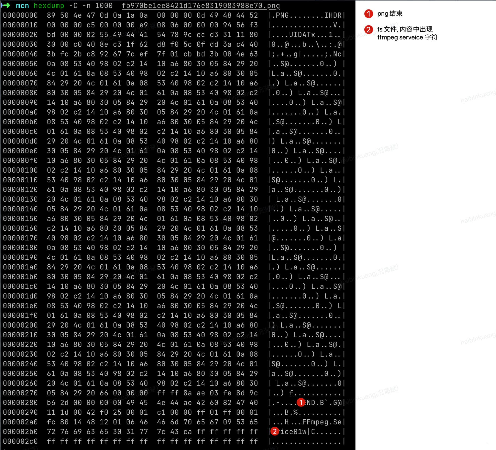
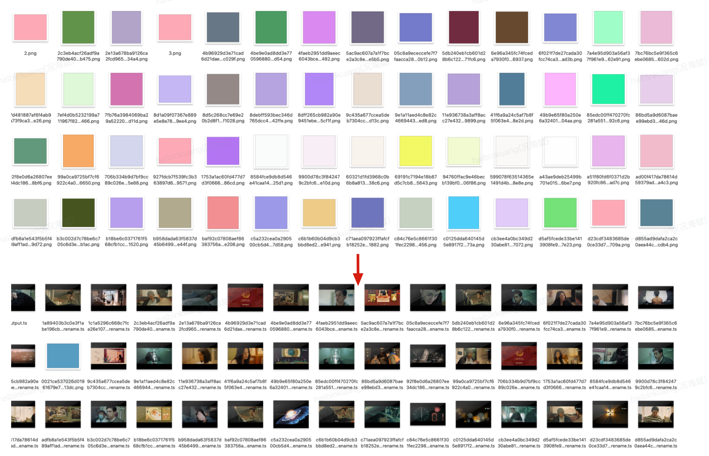

# 黑产上传接口攻击

## 攻击方法

黑产利用腾讯cos存储作为图床，将视频ts文件上面覆盖一层png文件，伪装成图片文件上传创意中心之后获取url地址；再将url地址写入到视频索引文件m3u8文件中；播放的时候，利用改造后的播放器去除伪装之后对ts文件进行播放；因此，CDN 中会出现大量黑产图片。

此种攻击经常发生在内容上传接口，例如小红书，微博的图片上传。黑客有一套完整的上传和播放链路，我们平时看到的盗版视频网站的视频基本都是用这种攻击方法进行视频存储的。一般都配备了很多信号源(其实就是攻击了好几个厂家的存储)。

## 具体方法

https://www.52pojie.cn/thread-1889161-1-1.html

## 对抗策略

1. 上传接口需要登录后才能使用，并且一段时间内限制上传次数，过多就进行封禁
2. 对`CDN`进行`refer`过滤，保证其他网站无法访问到我们的`CDN`资源
3. 针对user-agent也进行了一轮检查，存在非浏览器访问的user-agent，对user-agent也增加了白名单配置
4. 对可疑`ip`和用户直接封禁，不让上传
5. 增加图像检测能力，对可疑图片进行`resize`内容改写。
6. `url`增加过期策略。对于头像这种通过返回临时链接的方式进行处理。
7. 高热素材进行自动标记清理。如果图片访问量超过正常频率就进行文件名重写。
8. 对图片进行分路径存储，对于可以可疑用户进行快速打击。