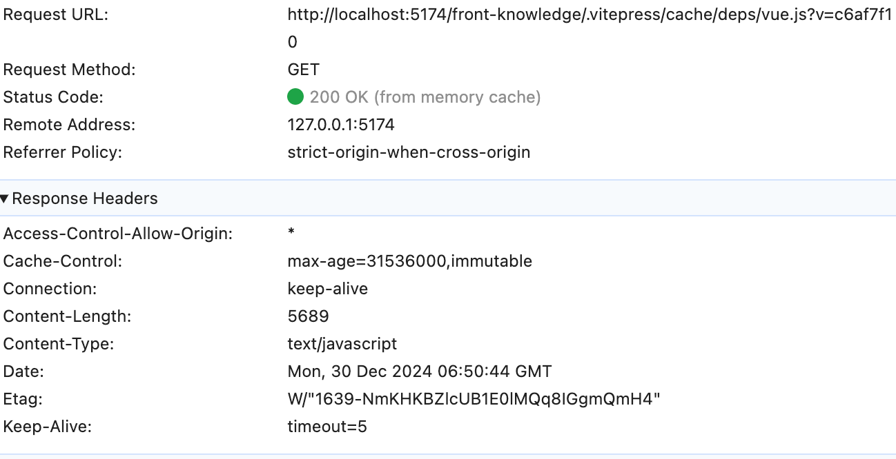

# 强缓存和协商缓存

> 为了减少资源请求次数，加快资源访问速度，浏览器会对资源文件如图片、css文件、js文件等进行缓存，而浏览器缓存策略又分为**强缓存**和**协商缓存**。**强缓存**未过期则不会发起请求，使用本地资源。如果过期则通过服务器返回304/200判断缓存是否可用

## 强缓存

所谓强缓存，可以理解为强制缓存的意思，即浏览器在访问某个资源时会判断是否使用本地缓存里已经存在的资源文件，使用本地缓存的话则不会发送请求到服务器，从而达到减轻服务器访问压力的作用，且由于直接从本地缓存读取资源文件，大大提高了加载速度。

强缓存的具体流程为：

浏览器第一次请求远程服务器的某个资源时，如果服务器希望浏览器得到该资源后一段时间内不要再发送请求过来，直接从浏览器里的缓存里取，则服务器可以通过在响应头里设置`Cache-Control: max-age=31536000`，max-age代表缓存时间，单位为秒，这里的数据换算过来就是一年，意味着在一年内浏览器不会再向服务器发送请求。(例如`vite`中将预购建里面的内容设置为`max-age=31536000,immutable`)

使用缓存的话，状态码200后面会标明情况。浏览器缓存资源的地方有两个：磁盘缓存（disk cache）和内存缓存（memory cache）。

当缓存时间到期后再次访问时，状态码200后面便没有括号内的内容了。

> 一般来说，浏览器会将较大的资源缓存到disk cache，而较小的资源则被缓存到memory cache里。内存缓存与磁盘缓存相比，访问速度要更快一些！

`Cache-Control`除了max-age外，还可以设置其它属性值：

- no-cache: 不使用强缓存（但仍会使用协商缓存）。
- no-store: 不使用缓存（不使用强缓存也不使用协商缓存），每次都向服务器发送资源请求。
- private： 只允许客户端使用缓存，不允许其他代理服务器进行缓存。
- public: 客户端和代理服务器都可缓存。
- s-maxage: 与max-age类似，区别是s-maxage是设定代理服务器的缓存时间。

强缓存除了使用`Cache-Control`实现之外，还可以使用`Expires`字段，`Expires`是Http1.0规范，`Cache-Control`是Http1.1规范，`Expires`返回一个具体的时间值（如下图所示），代表缓存的有效期，在该日期内浏览器不会向服务器发起请求，而是直接从缓存里获取资源。

因为`Expires`参照的是本地客户端的时间，而客户端的时间是可以被修改的，所以会有误差产生的情况，这也是`Expires`的一个缺点，所以有了后来Http1.1规范的`Cache-control`。

另外，`Cache-control`的优先级要高于`Expires`，如果两者同时设置，会优先使用`Cache-control`而忽略掉Expires。

## 协商缓存

在强缓存里，是否使用缓存是由浏览器来确定的，而协商缓存则是由服务器来告诉浏览器是否使用缓存资源，也就是浏览器每一次都要发送请求到服务器询问是否使用缓存，协商缓存的具体流程如下：

浏览器初次请求资源，服务器返回资源，同时生成一个`Etag`值携带在响应头里返回给浏览器。当浏览器再次请求资源时会在请求头里携带`If-None-Match`，值是之前服务器返回的`Etag`的值，服务器收到之后拿该值与资源文件最新的`Etag`值做对比。(例如`vite`中非预购建资源都会使用协商缓存。用内容`md5`作为`etag`)

- 如果没有变化则返回304，告诉浏览器继续使用缓存（不返回资源文件）。
- 如果发生变化，则返回200和最新的资源文件给浏览器使用。

除了`Etag`外，还有一个`Last-Modified`的属性，它是Http1.0规范的，服务器返回`Last-Modified`，浏览器请求头对应携带的是`If-Modified-since`，与`Etag`不同的是，`Last-Modified`的值是一个时间值，代表文件的修改时间，服务器通过对比文件的修改时间是否发生改变来判断是否使用缓存。

相比`Last-Modified`，`Etag`优先级更高，使用上也更精确一些，因为有时候会存在文件内容并没有改变，但文件的修改时间变更了，`Last-Modified`不一致所以服务器会重新返回资源文件，实际上还是可以继续使用缓存的。

> 强缓存优先级大于协商缓存，即两者同时存在时，如果强缓存开启且在有效期内，则不会走协商缓存。

## 总结

强缓存就是浏览器本地根据服务器设置的过期时间来判断是否使用缓存，未过期则从本地缓存里拿资源，已过期则重新请求服务器获取最新资源。

协商缓存则是浏览器本地每次都向服务器发起请求，由服务器来告诉浏览器是从缓存里拿资源还是返回最新资源给浏览器使用。