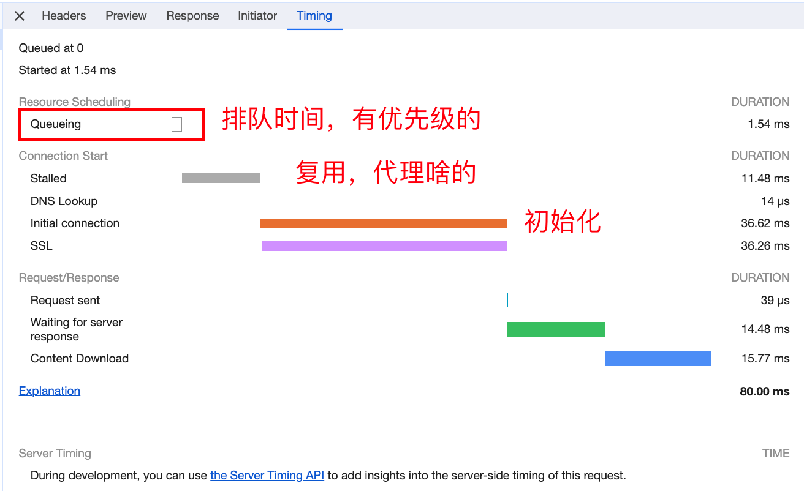

1. 从进程角度来看

- 用户输入`url`地址(关键字，会将关键字根据默认的引擎生成地址)。会开始导航，是在浏览器进程里面做的。
- 浏览器进程会准备一个渲染进程用于渲染页面
- 通过网络进程加载资源，最终将加载的资源交给渲染进程来处理
- 渲染完毕

2. 网络七层模型

   - 物理层
   - 数据链路层 （可以和物理层合并）
   - 网络层 (ip)
   - 传输层 ( tcp（安全可靠，分段传输），UDP（可能会丢包） )
   - 会话层
   - 表示层
   - 应用层 

   一般会将后面三层合并为应用层 ( http )

3. 从请求上来说

- 域名 `DNS` 解析为 ip地址 + 端口。DNS其实就是一个映射关系，是基于UDP协议的
- 请求时https  需要SSL协商
- ip地址寻址，可能不是立马就会发送（最多发送6个http请求，有限制的）排队等待
- tcp 三次握手创建链接用于传输
- 利用tcp传输数据（拆分成数据包进行传输，传输的包是有序的）-- 可靠，有序。服务器会按照顺序接受然后重排
- http请求 (请求行 请求头 请求体) 默认不会断开 keep-alive。为了下次传输数据时可以服用上次创建的链接
- 服务器收到数据后 解析 (请求行 请求头 请求体)，然后响应（响应行，响应头，响应体）
  - 状态码 301, 302(临时)会进行重定向操作。
  - 304状态码 回去查询浏览器缓存进行返回

可以访问jd.com在network里面看看   jd.com(302)->www.jd.com(302) ->https://www.jd.com

stalled - 复用，代理啥的

可以https://developer.chrome.com/docs/devtools/network/reference?utm_source=devtools&hl=zh-cn#timing-explanation 查看

## 渲染过程

CSS放顶端，JS放在低端，因为CSS不会阻塞，但是JS会阻塞

解析HTML -> 解析CSS -> 合成layers -> paint -> 合成

- 页面加载的时候会先扫面link和script标签

样式在顶部的时候才会渲染dom时等待css

但是样式放在底部会渲染两次。放到下面就会重绘

js会阻塞html解析和渲染，但是js要等待上面的CSS加载完毕才行，因为要保证页面的js可以操作样式。

