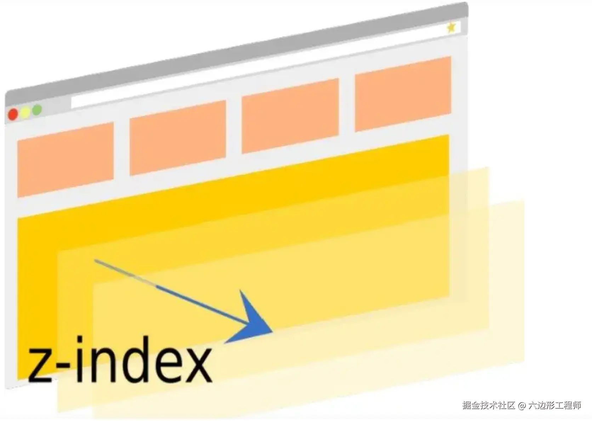
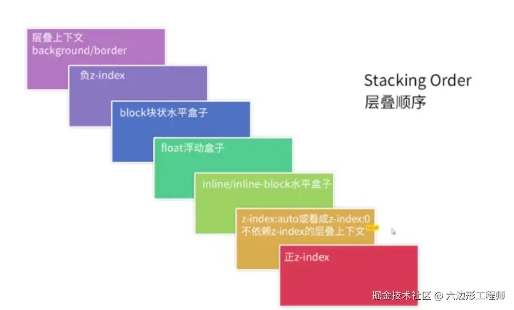
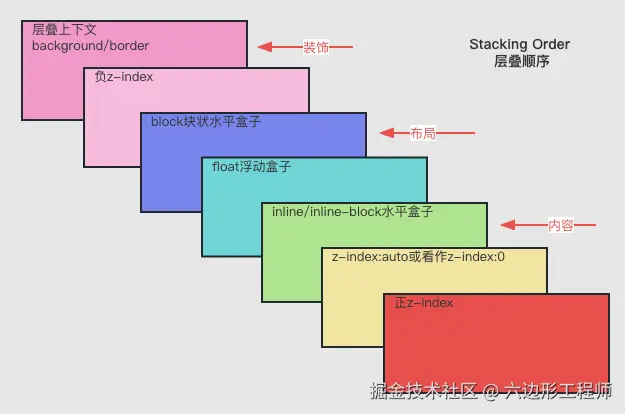
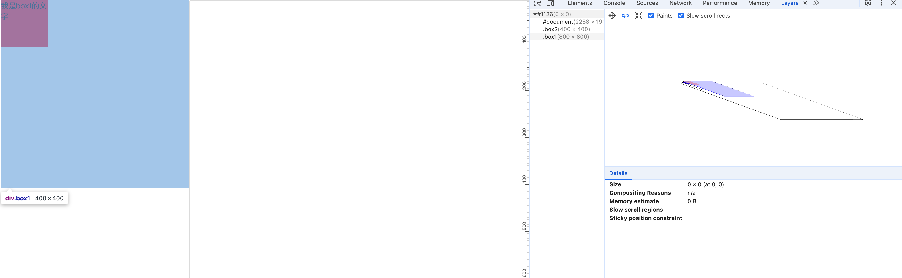

# z-index问题


## 问题引入

```html
<!DOCTYPE html>
<html lang="en">
<head>
  <meta charset="UTF-8">
  <meta name="viewport" content="width=device-width, initial-scale=1.0">
  <title>Document</title>
</head>
<style>
  .box1 {
    width: 400px;
    height: 400px;
    position: fixed;
    z-index: 2;
  }
  .box2 {
    width: 200px;
    height: 200px;
    position: fixed;
    z-index: 1;
  }

  .text1 {
    width: 100px;
    height: 100px;
    z-index: -10000;
    background-color: red;
  }

  .text2 {
    width: 50px;
    height: 50px;
    z-index: 10000;
    background-color: blue;
  }
</style>
<body>
  <div class="box1">
    <div class="text1">我是box1的文字</div>
  </div>
  <div class="box2">
    <div class="text2">我是box2的文字</div>
  </div>
</body>
</html>
```

在这么一段代码中无论我们的`text2`的`z-index`比`text1`的大多少都不会展示在上层。

**按照前端z-index原理，数值越大越在上层，不被遮挡，所以这是为什么呢**

## 查阅文档

在[MDN](https://developer.mozilla.org/zh-CN/docs/Web/CSS/z-index)上可以看到`z-index`的作用如下：

对于定位盒子（即 `position` 属性值非 `static` 的盒子），`z-index` 属性会指定：

1. 盒子在当前[层叠上下文](https://developer.mozilla.org/zh-CN/docs/Web/CSS/CSS_positioned_layout/Understanding_z-index/Stacking_context)中的层叠等级。
2. 盒子是否会创建局部层叠上下文。

也就是说`z-index`只会在当前的层叠上下文中生效，同时也会收到`postion`的影响，如果`postion`设置不正确（`static`）则也不会生效。

## position

 `position`属性影响 `z-index`是否生效，百度内容摘抄如下：

> z-index属性用于控制元素在层叠上下文中的显示顺序。当z-index不起作用时，可能是由于以下几个原因：
>
> 1. 没有指定元素的定位属性：z-index属性只对定位元素（position属性值为relative、absolute或fixed）起作用。如果元素没有指定定位属性，z-index将不会生效。因此，需要确保元素的position属性已正确设置。
> 2. 元素的定位属性值不正确：如果元素的定位属性值设置不正确，z-index也不会生效。例如，如果元素的position属性值为static（默认值），则z-index属性将不起作用。需要将元素的position属性值设置为relative、absolute或fixed。
> 3. 元素的层叠上下文不正确：每个层叠上下文都有自己的层叠水平，z-index只在同一层叠上下文中才有意义。如果元素的z-index属性没有在正确的层叠上下文中设置，它将无法影响其他层叠上下文中的元素。可以通过设置父元素的position属性值为relative、absolute或fixed来创建新的层叠上下文。
> 4. 元素的z-index值不正确：如果多个元素都具有定位属性且属于同一层叠上下文，那么z-index值较大的元素将覆盖z-index值较小的元素。因此，需要确保所需元素的z-index值较大。
>
> 总结起来，要使z-index生效，需要确保元素具有正确的定位属性（relative、absolute或fixed），在正确的层叠上下文中，并且具有较大的z-index值。如果仍然无法解决z-index不起作用的问题，可能需要检查其他CSS属性或JavaScript代码是否对元素的显示顺序产生了影响。

## 层叠上下文(Stacking Context)

[层叠上下文(Stacking Context)](层叠上下文(Stacking Context)也就是我们的元素如何向`z`轴排序。假定用户正面向（浏览器）视窗或网页， HTML 元素沿着其相对于用户的一条虚构的 z 轴排开，层叠上下文就是对这些 HTML 元素的一个三维构想。



每个网页都有一个默认的层叠上下文，这个层叠上下文的根元素就是html元素。html标签中的一切都被置于这个默认的层叠上下文的一个层叠层上（body）。当一个元素创建一个层叠上下文时，它的所有子元素都会受到父元素的层叠顺序影响。这意味着如果一个层叠上下文位于一个最低位置的层，那么其子元素的z-index设置得再大，它都不会出现在其他层叠上下文元素的上面。

### 层叠水平与层叠顺序

“层叠水平”，英文称作“stacking level”，在同一层叠上下文中的不同元素重叠时，它们的显示顺序会遵循层叠水平的规则，而z-index能够影响元素的层叠水平。

**重点：在讨论元素基于层叠水平进行排序时，是限制在单个层叠上下文内的。层叠水平不等于z-index属性，所有的元素都存在层叠水平，而z-index属性只能改变定位元素及flex盒子的孩子元素的层叠水平。**

再来说说层叠顺序。“层叠顺序”，英文名为“stacking order”，表示元素发生层叠时候有着特定的垂直显示顺序，这里需要注意，上面的**层叠上下文和层叠水平是概念**，而这里讲到的**层叠顺序则是规则**。

在一个层叠上下文中按照层叠顺序把元素分为7种层叠水平，默认的层叠顺序如下图所示：



解释如下：

- （1）背景和边框--形成层叠上下文元素的背景和边框。位于层叠上下文中的最底层。
- （2）负z-index--层叠上下文内z-index值为负的定位元素。
- （3）块级盒子--层叠上下文中非行内非定位元素。
- （4）浮动盒子--非定位浮动元素。
- （5）行内/行内快盒子 -- 层叠上下文中，inline和inline-block非定位元素。
- （6）z-index:0 /auto -- 定位元素。单纯考虑层叠水平，两者表现一样，但实际上对层叠上下文影响不一样。
- （7）正z-index值 -- 定位元素。z-index值越大，越靠近用户。

在平时开发时，我们经常会使用（2）、（6）、（7），大部分元素的层叠水平都低于z-index为0的定位元素。

**为什么inline/inline-block元素的层叠顺序比浮动元素和块元素都高呢？** 因为：border/background一般为装饰属性，而浮动和块元素一般用作布局，内联元素都是内容。网页中展示最重要的是内容，因此内容的层叠顺序比较高，当发生层叠时，重要的文字和图片等内容优先暴露在屏幕上（如下图）。



## 问题解惑

看到z-index上下文以后，我们就明白了。这两个`text`都不在一个层级内，所以即使`z-index`为 `10000` 的`text2`组件大于`z-index` 层级为 `-10000` 的 `text1` 组件，依然会遮挡。



可以看到。`text1`所在的父元素高于`text2`所在的父元素，所以无论怎么设置`z-index`都不生效。因为`z-index`只能影响当前层叠上下文的局部层叠上下文顺序。能够生效的办法就是改变父元素的层叠上下文顺序。例如给`box2`设置`z-index=10000`

## 5、z-index总结

`z-index`一定要关注层叠上下文（Stacking Context），即：层叠水平（Stacking Level）与层叠顺序（Stacking Order）都需要关注才能生效。

具体使用技巧总结如下:

- 第一步：首先先看要比较的两个元素是否处于同一个层叠上下文(Stacking Context)中
- 1）如果是，谁的层叠等级大，谁在上面
- 2）如果两个元素不在同一SC中，先比较他们的父SC
- 当两个元素层叠水平相同、层叠顺序相同时，在 DOM 结构中后面的元素层叠等级在前面元素之上

其他注意事项：

- CSS3时，无position属性，z-index值也可能生效，因为css3很多默认`display`为`flex`
- 浏览器兼容性差异
- 避免在transform元素下做fixed定位

## 参考文档：

https://juejin.cn/post/7433393393218224139?share_token=dfe052c9-4b3c-475e-8e94-18c3ee399eb0

https://developer.mozilla.org/zh-CN/docs/Web/CSS/z-index

https://developer.mozilla.org/zh-CN/docs/Web/CSS/CSS_positioned_layout/Understanding_z-index/Stacking_context