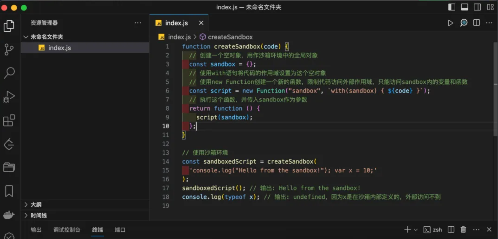

# js沙箱

在 JavaScript 中，沙箱（sandbox）是一个安全机制，用于隔离运行代码，以防止代码对其它部分的应用程序或系统造成不必要的影响或安全风险。沙箱提供了一个受控环境，在这个环境中，代码可以被执行而不影响外部环境，从而保护用户数据和系统安全。

在浏览器中，沙箱通常指的是浏览器为每个标签页提供的隔离环境。这种隔离保证了一个标签页中的 JavaScript 代码无法访问另一个标签页中的内容，除非两个页面遵循同源策略（即协议、域名和端口号都相同）或者通过 CORS（跨源资源共享）明确允许了跨源访问。网页 web 代码内容必须通过 IPC 通道才能与浏览器内核进程通信，通信过程会进行安全的检查。沙箱设计的目的是为了让不可信的代码运行在一定的环境中，从而限制这些代码访问隔离区之外的资源。

## js 中沙箱的使用场景有什么

在 JavaScript 中，沙箱通常用于隔离和控制代码执行的环境，以确保代码运行在一个安全的、受限制的环境中，避免对主环境造成潜在的损害。

1. 执行第三方 js：当你有必要执行第三方 js 的时候，而这份 js 文件又不一定可信的时候；
2. 在线代码编辑器：相信大家都有使用过一些在线代码编辑器，而这些代码的执行，基本都会放置在沙箱中，防止对页面本身造成影响；
3. Web 应用安全: 在浏览器中运行来自不同来源的 JavaScript 代码时，沙箱可以限制这些代码的权限，防止恶意代码访问敏感资源或执行危险操作。
4. 插件和第三方脚本: 当 Web 应用需要加载和执行第三方插件或脚本时，通过沙箱可以限制这些脚本的访问权限，保护主应用的安全和数据。
5. jsonp：解析服务器所返回的 jsonp 请求时，如果不信任 jsonp 中的数据，可以通过创建沙箱的方式来解析获取数据；

### **jsonp 通信机制**

JSONP 的工作原理就是通过利用 `<script>` 标签没有跨域限制的“漏洞”（历史遗迹啊）来达到与第三方通讯的目的。当需要通讯时，本站脚本创建一个 `<script>` 元素，地址指向第三方的 API 网址，形如：

```js
<script src="http://www.example.net/api?param1=1&param2=2"></script>
```

并提供一个回调函数来接收数据（函数名可约定，或通过地址参数传递）。 第三方产生的响应为 json 数据的包装（故称之为 jsonp，即 json padding），形如： `callback({"name":"hax","gender":"Male"})` 这样浏览器会调用 callback 函数，并传递解析后 json 对象作为参数。本站脚本可在 callback 函数里处理所传入的数据。

下面是如何通过创建沙箱环境来解析 JSONP 数据的基本思路：

1. 创建独立的 iframe 作为沙箱：通过在主页面中动态创建一个 iframe，可以为 JSONP 请求提供一个隔离的执行环境。这个 iframe 没有访问主页面 DOM 的权限，从而限制了其中执行的代码对主页面可能造成的影响。
2. 在 iframe 中发起 JSONP 请求：将 JSONP 请求的 `<script>` 标签插入到上述创建的 iframe 中，这样由 JSONP 请求返回的脚本就会在这个隔离的环境中执行。这意味着，即使返回的脚本中包含恶意代码，其影响也被限制在了 iframe 中，不会波及到主页面。
3. 安全地从 iframe 中获取数据：虽然 iframe 中的脚本不能直接修改主页面的 DOM，但它仍然可以通过预定的方式（如通过 postMessage API）安全地将数据传递给主页面。主页面需要设置事件监听器来接收这些数据，并确保通过验证数据来源等措施来保证数据的安全性。
4. 限制和监控 iframe 中的行为：进一步增强安全性的措施包括使用 Content Security Policy (CSP)来限制 iframe 中可以加载和执行的资源，以及使用其他浏览器安全特性来监控和控制 iframe 中的行为。

通过以上步骤，即使 JSONP 响应中包含不可信的数据或代码，其潜在的危害也可以被有效地隔离和控制，从而保护了用户的数据和安全。

总而言之，当你要解析或执行不可信的 JS 的时候，当你要隔离被执行代码的执行环境的时候，当你要对执行代码中可访问对象进行限制的时候，沙箱就派上用场了。

## with + new Function 实现沙箱

在 JavaScript 中，使用 with 语句和 new Function 可以创建一个简单的沙箱环境。这种方式可以限制代码运行时的作用域，防止它访问全局变量或执行不安全的操作。

在 with 的块级作用域下，变量访问会优先查找你传入的参数对象，之后再往上找，所以相当于你变相监控到了代码中的变量访问：

```js
function createSandbox(code) {
// 创建一个空对象，用作沙箱环境中的全局对象
const sandbox = {};
// 使用with语句将代码的作用域设置为这个空对象
// 使用new Function创建一个新的函数，限制代码访问外部作用域，只能访问sandbox内的变量和函数
const script = newFunction("sandbox", `with(sandbox) { ${code} }`);
// 执行这个函数，并传入sandbox作为参数
returnfunction () {
    script(sandbox);
  };
}

// 使用沙箱环境
const sandboxedScript = createSandbox(
'console.log("Hello from the sandbox!"); var x = 10;'
);
sandboxedScript(); // 输出: Hello from the sandbox!
console.log(typeof x); // 输出: undefined，因为x是在沙箱内部定义的，外部访问不到
```

定义了一个 createSandbox 函数，它接受一个字符串 code 作为参数，这个字符串是要在沙箱环境中执行的代码。我们首先创建一个空对象 sandbox，这个对象将作为沙箱的全局对象。然后，我们使用 with(sandbox)语句将沙箱中的代码执行环境设置为这个空对象，这意味着代码中所有的变量和函数定义都将局限在这个空对象内，无法访问外部的全局对象和变量。

new Function 构造函数创建一个新的函数，它执行传入的代码字符串。通过这种方式，我们能够动态执行代码，同时限制这段代码的作用域，防止它访问或修改沙箱外部的环境。最后，我们返回一个闭包函数，这个函数在被调用时会执行沙箱中的代码。



需要注意的是，虽然这种方法可以在一定程度上隔离执行环境，但它并不是完全安全的。with 和 new Function 都有一些安全隐患，特别是如果沙箱中执行的代码可以访问到 Function 构造器本身，它就可能绕过沙箱限制，执行任意代码。可见，new Function + with 的这种沙箱方式，防君子不防小人。

## iframe 实现沙箱

使用 iframe 创建沙箱环境是 Web 开发中常见的一种技术，它允许你在当前页面内嵌套一个完全独立的 HTML 页面。这种方法可以有效隔离 JavaScript 执行环境，防止脚本访问主页面的 DOM 或 JavaScript 环境，从而提高安全性。以下是如何使用 iframe 来实现沙箱环境的一个详细代码示例：

首先我们需要编写 HTML 结构：

```js
<!DOCTYPE html>
<html lang="en">
<head>
    <meta charset="UTF-8" />
    <meta name="viewport" content="width=device-width, initial-scale=1.0" />
    <title>Document</title>
</head>
<body>
    <iframe id="sandbox" style="display: none"></iframe>

    <script src="index.js"></script>
</body>
</html>
```

我们再在 `index.js`，在 js 代码中，通过操作这个 iframe 的 contentWindow 属性来实现一个简单的沙箱环境。这里的思路是向 iframe 注入脚本并执行，这样执行的脚本就在 iframe 的独立环境中运行，与主页面隔离：

```js
// index.js
function createSandbox(callback) {
const iframe = document.getElementById("sandbox");
if (!iframe) {
    returnconsole.error("沙箱iframe未找到");
  }

// 确保iframe完全加载后再执行代码
  iframe.onload = function () {
    const iframeWindow = iframe.contentWindow;

    // 在沙箱环境中定义一些安全的全局变量或函数，如果需要的话
    iframeWindow.safeGlobalVar = {
      /* 安全的数据或方法 */
    };

    // 执行回调函数，传入沙箱的window对象，以便在其中执行代码
    callback(iframeWindow);
  };

// 重新加载iframe以确保环境清洁
  iframe.src = "about:blank";
}

// 使用沙箱
createSandbox(function (sandboxWindow) {
// 在沙箱环境中执行代码
  sandboxWindow.eval('console.log("Hello from the sandbox!");');
});
```

在上面的这些代码中，createSandbox 函数接收一个回调函数作为参数，该回调函数会在 iframe 加载完成后执行。在回调函数中，我们可以通过 iframe 的 contentWindow 属性来访问并操作 iframe 内的全局对象，包括定义全局变量、函数或者通过 eval 执行一些 JavaScript 代码。

但是这些也会带来一下限制：

1. script 脚本不能执行
2. 不能发送 ajax 请求
3. 不能使用本地存储，即 localStorage,cookie 等
4. 不能创建新的弹窗和 window
5. 不能发送表单
6. 不能加载额外插件比如 flash 等

但是别担心，为了进一步提高安全性，HTML5 引入了 sandbox 属性，它可以限制 iframe 中代码的能力。sandbox 属性可以采用以下值：

1. allow-scripts: 允许执行脚本。
2. allow-same-origin: 允许与包含文档同源的文档交互。
3. allow-forms: 允许表单提交。
4. allow-popups: 允许弹窗，比如通过 window.open 方法。
5. allow-top-navigation: 允许通过链接导航到顶级框架。

使用 sandbox 属性的 iframe 示例：

```js
<iframe src="sandbox.html" sandbox="allow-scripts" id="sandbox"></iframe>
```

接下来我们结合 postMessage API，将你需要执行的代码，和需要暴露的数据传递过去，然后和我们的 iframe 页面通信就行了。

首先，在主页面中，我们需要获取 iframe 的引用并使用 postMessage 方法发送消息。消息可以是任何可序列化的对象。

```js
<!DOCTYPE html>
<html>
  <head>
    <title>主页面</title>
  </head>
  <body>
    <iframe
      src="./sandbox.html"
      id="sandbox"
      style="width: 600px; height: 400px"
    ></iframe>

    <script>
      var iframe = document.getElementById("sandbox");

      // 等待iframe加载完成
      iframe.onload = function () {
        // 向iframe发送消息
        var targetOrigin = "http://127.0.0.1:5500/"; // 替换为iframe的实际源
        iframe.contentWindow.postMessage("Hello, sandbox!", targetOrigin);
      };

      // 监听来自iframe的消息
      window.addEventListener("message", function (event) {
        // 检查消息来源是否符合预期

        if (event.origin !== "http://127.0.0.1:5500") {
          return; // 来源不匹配时忽略消息
        }

        // 处理接收到的消息
        console.log("Received message from iframe:", event.data);
      });
    </script>
  </body>
</html>
```

postMessage 的第一个参数是要发送的消息，第二个参数是接收消息页面的源（origin），这是一个安全特性，以确保消息只被发送到指定的来源页面。

在 iframe 页面中，我们需要监听 message 事件来接收主页面发送过来的信息：

```js
<!DOCTYPE html>
<html lang="en">
  <head>
    <meta charset="UTF-8" />
    <meta name="viewport" content="width=device-width, initial-scale=1.0" />
    <title>Document</title>
  </head>
  <body>
    <script>
      window.addEventListener("message", function (event) {
        // 检查消息来源是否符合预期

        if (event.origin !== "http://127.0.0.1:5500") {
          return; // 来源不匹配时忽略消息
        }

        // 处理接收到的消息
        console.log("Received message:", event.data);

        // 回复消息给主页面
        event.source.postMessage("Hello, main page!", event.origin);
      });
    </script>
  </body>
</html>
```

在使用 postMessage 进行通信时，始终要检查 event.origin，并且在发送消息时指定精确的目标 origin，这样可以防止潜在的安全问题。通过这种方式，即使在跨域的情况下，主页面与 iframe 或新窗口之间也能安全、有效地进行数据交换。

## Web Workers 实现沙箱

使用 Web Workers 作为沙箱的方法，通过动态创建一个 Blob 对象来包含你想在 Worker 中执行的 JavaScript 代码，然后使用这个 Blob 对象创建一个 Worker。这种方式的好处是它允许你动态地执行任意的 JavaScript 代码，同时确保这些代码在一个与主页面环境隔离的 Worker 中运行，提供了一种隔离执行代码的手段。

```js
function workerSandbox(appCode) {
  var blob = new Blob([appCode]);
  var appWorker = new Worker(window.URL.createObjectURL(blob));
}

workerSandbox("const a = 1;console.log(a);"); // 输出1

console.log(a); // a not defined
```

这种使用 Web Workers 实现沙箱的方法为在 Web 应用中隔离和执行 JavaScript 代码提供了一种有力的手段，特别适合那些需要保持 UI 响应性而又要执行复杂或潜在风险代码的场景。

## 总结

JavaScript 的沙箱环境是一种隔离执行环境，允许运行和测试代码而不干扰主应用程序的状态或数据。它通过限制代码访问全局变量和函数，提供了一个安全的方式来执行不信任的代码，避免潜在的安全风险和数据泄露。沙箱环境对于保护应用程序免受恶意代码或不确定性代码影响至关重要。