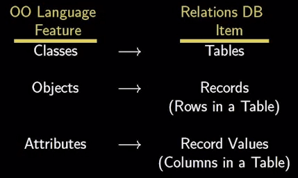

# 数据库
## ORM

面向对象编程和关系型数据库，都是目前最流行的技术，但是它们的模型是不一样的。

面向对象编程把所有实体看成对象（object），关系型数据库则是采用实体之间的关系（relation）连接数据。很早就有人提出，关系也可以用对象表达，这样的话，就能使用面向对象编程，来操作关系型数据库。


**简单说，ORM 就是通过实例对象的语法，完成关系型数据库的操作的技术，是"对象-关系映射"（Object/Relational Mapping） 的缩写。**

ORM 把数据库映射成对象。

> - 数据库的表（table） --> 类（class）
> - 记录（record，行数据）--> 对象（object）
> - 字段（field）--> 对象的属性（attribute）



## MongoDB和Mongoose

Mongoose和MongoDB是两个不同的概念，尽管它们通常一起使用。以下是它们之间的详细区别：

### 1. 定义

- **MongoDB**：
  - MongoDB是一个NoSQL数据库，使用文档存储数据。它以JSON样式的BSON（Binary JSON）格式存储数据，支持灵活的模式设计，适合处理大量非结构化或半结构化的数据。
  - MongoDB提供了丰富的查询功能、索引、聚合等特性，适合高性能和高可扩展性的应用。
- **Mongoose**：
  - Mongoose是一个Node.js的对象数据建模（ODM）库，用于与MongoDB进行交互。它为MongoDB提供了一个更高层次的抽象，使得在Node.js应用中操作MongoDB变得更加简单和直观。
  - Mongoose允许开发者定义数据模型、验证数据、创建关联等，提供了更强的结构化和数据验证功能。

### 2. 功能

- **MongoDB的功能**：
  - 数据存储：以文档形式存储数据，支持灵活的模式。
  - 查询：支持丰富的查询语言，可以进行复杂的查询操作。
  - 索引：支持多种索引类型，提高查询性能。
  - 聚合：提供聚合框架，可以对数据进行复杂的处理和分析。
  - 分片和复制：支持水平扩展和高可用性。
- **Mongoose的功能**：
  - 模型定义：允许开发者定义数据模型和模式（Schema），包括字段类型、默认值、验证规则等。
  - 数据验证：在保存数据之前进行验证，确保数据的完整性。
  - 中间件：支持在执行某些操作（如保存、删除等）之前或之后执行自定义逻辑。
  - 关联：支持定义模型之间的关系（如一对多、多对多等）。
  - 查询构建：提供链式查询构建器，使得查询更加直观。

### 3. 使用场景

- **MongoDB**：
  - 适用于需要高性能、高可扩展性和灵活数据模型的应用，如社交网络、内容管理系统、实时分析等。
- **Mongoose**：
  - 适用于Node.js应用程序，特别是当需要对数据进行结构化、验证和关联时。它使得与MongoDB的交互更加方便，适合需要复杂数据模型的应用。

### 4. 代码示例

- **MongoDB**（使用原生驱动）：

  ```js
  javascript复制const { MongoClient } = require('mongodb');
  
  async function run() {
      const client = new MongoClient('mongodb://localhost:27017');
      await client.connect();
      const database = client.db('testdb');
      const collection = database.collection('users');
  
      const user = { name: 'Alice', age: 25 };
      const result = await collection.insertOne(user);
      console.log(`New user created with the following id: ${result.insertedId}`);
      await client.close();
  }
  
  run().catch(console.dir);
  ```

- **Mongoose**：

  ```js
  javascript复制const mongoose = require('mongoose');
  
  mongoose.connect('mongodb://localhost:27017/testdb', { useNewUrlParser: true, useUnifiedTopology: true });
  
  const userSchema = new mongoose.Schema({
      name: { type: String, required: true },
      age: { type: Number, required: true }
  });
  
  const User = mongoose.model('User', userSchema);
  
  const user = new User({ name: 'Alice', age: 25 });
  user.save()
      .then(() => console.log('User saved'))
      .catch(err => console.error(err))
      .finally(() => mongoose.connection.close());
  ```

### 总结

- **MongoDB**是数据库，负责数据的存储和管理。
- **Mongoose**是一个库，提供了与MongoDB交互的更高层次的抽象，简化了数据模型的定义和操作。

## 数据库一些操作

```js
// 通用分页方法，通过传入model和相关condition来进行分页并排序
export function limitPage(
  businessModel: Model<Document>,
  pageSize: string,
  pageNum: string,
  queryCondition = {},
  sortCondition?: IAnyObject,
): DocumentQuery<Document[], Document> {
  // 没有必要参数则抛出异常
  if (!pageSize || !pageNum) {
    throw new Error('缺少必要的page_size或page_num参数');
  }
  const pageSizeParam = Number(pageSize);
  const pageNumParam = Number(pageNum);
  const skipCondition = (pageNumParam - 1) * pageSizeParam;
  let limitQuery = businessModel
    .find(queryCondition);

  // 如果传入sortCondition，则进行排序
  if (sortCondition) {
    limitQuery = limitQuery.sort(sortCondition);
  }

  // 排序完后进行分页
  limitQuery = limitQuery.skip(skipCondition)
    .limit(pageSizeParam);

  return limitQuery;
}

// 查询数据总量
export function countTotal(
  businessModel: Model<Document>,
  queryCondition = {},
): Query<number> {
  const countQuery = businessModel.countDocuments(queryCondition);
  return countQuery;
}
```

