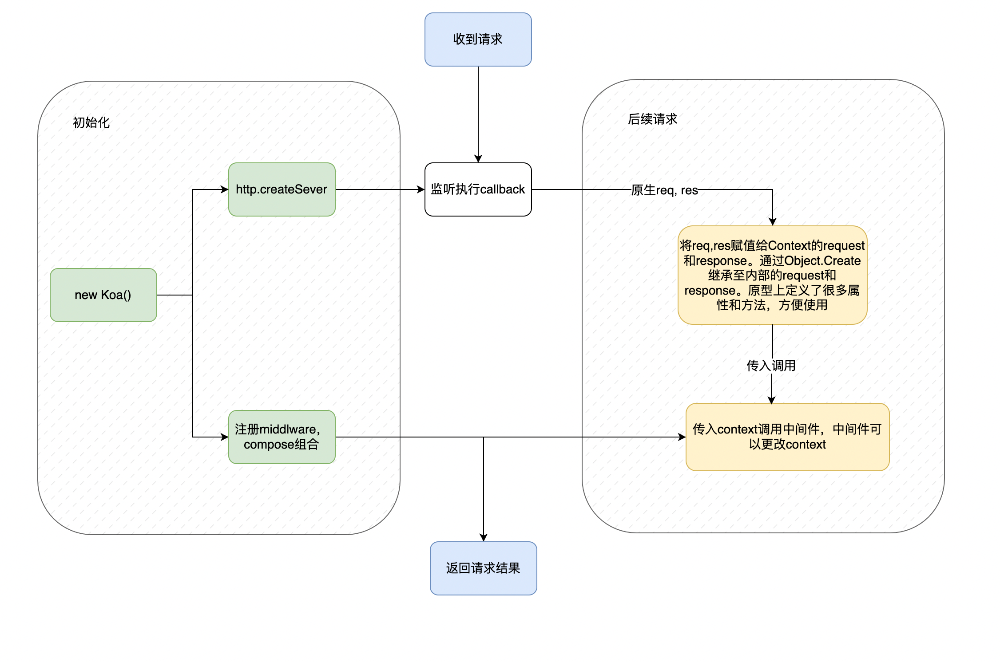
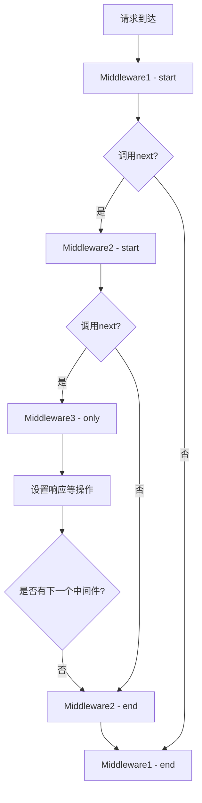

# Koa2 实现原理详解

> 官方代码：https://github.com/koajs  （很少，建议看看）

## 一、引言
Koa2 是一个基于 Node.js 平台的轻量级、高效且现代化的 Web 开发框架，由 Express 团队打造。它摒弃了传统回调函数的嵌套模式，采用 `async/await` 语法，使得异步编程更加简洁和直观。Koa2 以其简洁的设计、强大的中间件机制和灵活的扩展性受到了广大开发者的喜爱。在本文档中，我们将深入探讨 Koa2 的实现原理，包括其基本使用、底层原理、中间件机制以及如何简易实现一个 Koa2 框架。

## 二、Koa2 基本使用

### （一）安装与创建项目
首先，确保已经安装了 Node.js 环境。然后，通过 `npm` 初始化一个新项目并安装 Koa2：
```bash
mkdir koa2-demo
cd koa2-demo
npm init -y
npm install koa
```

### （二）创建一个简单的 Koa2 服务器
创建一个 `app.js` 文件，并添加以下代码：
```javascript
const Koa = require('koa');
const app = new Koa();

// 中间件：在请求时输出日志
app.use(async (ctx, next) => {
  console.log('Request started');
  await next();
  console.log('Request ended');
});

// 定义路由
app.use(async (ctx) => {
  ctx.body = 'Hello, Koa2!';
});

// 启动服务器
app.listen(3000, () => {
  console.log('Server is running at http://localhost:3000');
});
```
运行服务器：
```bash
node app.js
```
在浏览器中访问 `http://localhost:3000`，即可看到页面显示 `Hello, Koa2!`。

## 三、Koa2 底层原理

`koa2`中最重要的就是`context`上下文和中间件机制。整体代码并不复杂。整体功能模块如下



### （一）基于 Node.js 原生模块封装
Koa2 的底层是基于 Node.js 的原生 `http` 模块来实现服务的创建和请求的处理。它对 `http.createServer` 方法进行了封装，以便在创建服务器时能够更好地处理请求和响应。

### （二）核心对象
1. **Application（应用）**
`Application` 是 Koa2 应用的核心对象，它负责管理应用的生命周期、中间件的注册和执行等。在 `lib/application.js` 文件中定义，主要的职责包括：
 - 创建 HTTP 服务器：通过 `http.createServer` 方法创建服务器，并将中间件处理函数作为回调。
 - 注册中间件：提供 `use` 方法用于注册中间件函数，将中间件函数依次加入一个数组中。
 - 执行中间件：在服务器接收到请求时，按照中间件的注册顺序依次调用中间件函数。

2. **Context（上下文）**
  `Context` 对象是对每个请求的封装，包含了请求和响应的相关信息，以及一些便捷的方法。它是一个请求的上下文环境，在处理请求和响应的过程中，开发者可以通过 `ctx` 对象方便地获取和设置各种信息。`Context` 对象在 `lib/context.js` 文件中定义，它融合了 `request` 和 `response` 对象的功能，并且通过 `delegate` 代理了相关属性和 方法，使得开发者可以直接通过 `ctx` 访问到 `request` 和 `response` 对象的属性和方法，如 `ctx.request.query`、`ctx.response.body` 等。

3. **Request（请求）**
  `Request` 对象封装了 HTTP 请求的相关信息，如请求方法、URL、请求头、请求体等。它提供了一系列的方法和属性，方便开发者获取和处理请求数据。在 `lib/request.js` 文件中定义。

4. **Response（响应）**
  `Response` 对象封装了 HTTP 响应的相关操作，如设置响应状态码、响应头、设置响应体等。在 `lib/response.js` 文件中定义。

  

  ```js
  constructor (options) {
    this.middleware = []
    this.context = Object.create(context) // 以context为原型创建，上面又一些实用函数
    this.request = Object.create(request) // 以request为原型创建，上面又一些实用函数
    this.response = Object.create(response) // 以response为原型创建，上面又一些实用函数
  }
  ```

  

## 四、Koa2 中间件机制

### 一、中间件机制原理

Koa2的中间件机制是其核心特性。中间件是一个函数，在处理请求和响应的过程中起到不同的作用。每个中间件函数接收两个参数：`ctx`（上下文对象）和 `next`（下一个中间件函数的引用）。

Koa 中的 `ctx`（上下文）对象是请求和响应的封装。它将 Node.js 的 `req` 和 `res` 对象进行了扩展和封装，简化了开发者对请求和响应的操作。

**Context 的组成部分：**

- **ctx.request**: 封装了 Node.js 的 `req` 对象，提供了更简便的 API，例如 `ctx.request.query` 可以直接获取查询参数。
- **ctx.response**: 封装了 Node.js 的 `res` 对象，提供了设置响应内容的 API，例如 `ctx.response.body` 可以直接设置响应内容。
- **ctx.state**: 一个用户自定义的对象，可以在中间件之间传递数据。
- **ctx.body**: 设置响应体的快捷方式，相当于 `ctx.response.body`。

### （一）执行顺序 - 洋葱模型

中间件的执行顺序遵循“洋葱模型”（Onion Model）。这一概念形象地将中间件的执行过程比作一个洋葱的层层结构。当一个请求到达时，它会从最外层的中间件开始执行，先执行中间件的前置部分（在调用 `await next()` 之前），然后依次进入下一层中间件。

洋葱模型的工作原理：

- 当请求进入 Koa 应用时，Koa 会依次调用每个中间件。
- 如果中间件中调用了 await next()，Koa 会暂停当前中间件的执行，并进入下一个中间件。
- 当最内层的中间件执行完毕后，控制权会回到上一个中间件，继续从 await next() 之后的部分执行。

以一个简单的三中间件示例来说明：

```javascript
const Koa = require('koa');
const app = new Koa();

app.use(async (ctx, next) => {
    console.log('Middleware1 - start');
    await next();
    console.log('Middleware1 - end');
});

app.use(async (ctx, next) => {
    console.log('Middleware2 - start');
    await next();
    console.log('Middleware2 - end');
});

app.use(async (ctx) => {
    console.log('Middleware3 - only');
    ctx.body = 'Hello!';
});

app.listen(3000);
```

请求到来时的执行顺序为：

1. 首先进入 `Middleware1 - start`。
2. 然后进入 `Middleware2 - start`。
3. 接着执行 `Middleware3 - only`，这里是实际处理业务逻辑的地方，比如设置响应内容等。
4. 之后开始从内层往外层返回，执行 `Middleware2 - end`。
5. 最后执行 `Middleware1 - end`。

这个过程就像是在洋葱的不同层之间穿梭，进去和出来都有特定的顺序。

### 二、中间件的组合与执行

Koa2使用 `koa-compose` 来组合中间件。以下是 `koa-compose` 核心逻辑解析：

```javascript
function compose (middleware) {
  if (!Array.isArray(middleware)) throw new TypeError('Middleware stack must be an array!')
  for (const fn of middleware) {
    if (typeof fn !== 'function') throw new TypeError('Middleware must be composed of functions!')
  }


  return function (context, next) { // 这个next就是下一个中间件，如果已经是最后一个了next就是传进来的next(这里调用的时候没传入，就是undifined)，所以会直接返回Promise.resolve()
    // last called middleware #
    let index = -1
    return dispatch(0)
    function dispatch (i) {
      if (i <= index) return Promise.reject(new Error('next() called multiple times')) // 防止死循环
      index = i
      let fn = middleware[i]
      if (i === middleware.length) fn = next // 到达最后了这个next其实就是外面传过来的了
      if (!fn) return Promise.resolve() // 没有了直接return
      try {
        return Promise.resolve(fn(context, dispatch.bind(null, i + 1))) // 调用函数，并且next传入下一个中间件
      } catch (err) {
        return Promise.reject(err)
      }
    }
  }
}

// compose调用  listen => callback => handleRequest
listen (...args) {
  debug('listen')
  const server = http.createServer(this.callback())
  return server.listen(...args)
}
callback () {
    const fn = this.compose(this.middleware) // 这里进行组合

    const handleRequest = (req, res) => { // 请求处理
      const ctx = this.createContext(req, res) // 创建res 和 req对象
      return this.handleRequest(ctx, fn) // 在这里面会调用fn，fn需要两个参数`context`和next。通常是不会传入next的，使用者没办法传进来
    }
    return handleRequest
  }
handleRequest (ctx, fnMiddleware) {
    const res = ctx.res
    res.statusCode = 404
    const onerror = err => ctx.onerror(err)
    const handleResponse = () => respond(ctx)
    onFinished(res, onerror)
    return fnMiddleware(ctx).then(handleResponse).catch(onerror) // fnMiddleware只传入了context。所以最后一个next是undifinde
  }
```

1. **函数嵌套关系**
   - `compose` 函数接收中间件数组 `middleware`，并返回一个新的函数。这个新函数接收 `ctx` 和 `next` 两个参数。
   - 在返回的新函数内部，定义了 `dispatch` 函数。`dispatch` 函数用于按照顺序调用中间件。它通过一个索引 `i` 来标记当前调用到的中间件位置。
   - 当调用 `dispatch(0)` 时，开始执行第一个中间件。每个中间件被调用时，会传入 `ctx` 和一个新的 `dispatch` 函数（这个新的 `dispatch` 函数指向数组中的下一个中间件）。
2. **数据流向与控制权转移**
   - 在中间件函数内部，当执行 `await next()` 时，实际上是暂停当前中间件的执行，将控制权交给下一个中间件。这就实现了数据在中间件之间的流动。
   - 一旦下一个中间件执行完毕（无论是正常结束还是抛出错误），控制权又会返回到之前的中间件，继续执行 `next` 之后的代码。

### 三、中间件流程图

下面用一个简单的流程图来展示中间件的执行过程：



这个流程图清晰地展示了中间件的执行顺序，从最外层中间件的开始到最内层中间件的处理，再到从内层往外层返回的执行过程。

### 四、中间件的作用与场景

1. **日志记录**

   - 中间件可以在请求进入时记录相关信息，如请求的方法、URL、时间等，以及在响应返回时记录状态码、响应时间等信息。这对于监控应用的运行状况非常有用。
   - 例如：

   ```javascript
   app.use(async (ctx, next) => {
       const start = Date.now();
       await next();
       const ms = Date.now() - start;
       console.log(`${ctx.method} ${ctx.url} - ${ms}ms`);
   });
   ```

2. **路由处理**

   - 中间件可以用于处理不同的路由请求。Koa2本身没有内置的路由系统，但可以通过中间件来实现简单的路由功能或者集成第三方的路由库，如 `koa - router`。
   - 假设一个简单的基于中间件的路由示例：

   ```javascript
   app.use(async (ctx, next) => {
       if (ctx.path === '/home') {
           ctx.body = 'Home Page';
       } else if (ctx.path === '/about') {
           ctx.body = 'About Page';
       } else {
           await next();
       }
   });
   ```

3. **请求处理和数据验证**

   - 在中间件中可以对请求的数据进行验证，比如验证查询参数、请求体中的数据格式等。如果数据不符合要求，可以提前返回错误响应，避免无效的数据进入后续的业务逻辑处理。
   - 例如，使用 `joi` 库进行数据验证的中间件：

   ```javascript
   const Joi = require('joi');
   
   const schema = Joi.object({
       name: Joi.string().required(),
       age: Joi.number().integer().min(0).required()
   });
   
   app.use(async (ctx, next) => {
       const { error } = schema.validate(ctx.request.body);
       if (error) {
           ctx.status = 400;
           ctx.body = error.details[0].message;
       } else {
           await next();
       }
   });
   ```

## 五、简易 Koa2 实现

### （一）封装 HTTP 服务
首先，我们需要封装一个简单的 HTTP 服务，使用 Node.js 的 `http` 模块：
```javascript
const http = require('http');

function createServer(callback) {
  const server = http.createServer((req, res) => {
    callback(req, res);
  });
  return server;
}
```

### （二）创建 Koa2 类构造函数
接下来，创建一个 `Koa` 类，定义 `constructor`、`use`、`listen` 和 `callback` 方法：
```javascript
class Koa {
  constructor() {
    this.callback = null;
    this.middleware = [];
  }

  use(fn) {
    this.middleware.push(fn);
    return this;
  }

  listen(port, callback) {
    const server = createServer(this.callback());
    server.listen(port, callback);
  }

  callback() {
    const middleware = this.middleware;
    return async (req, res) => {
      const ctx = createContext(req, res);
      await dispatch(middleware, ctx);
      if (ctx.status === 404) {
        ctx.body = '404 Not Found';
      }
    };
  }
}
```

### （三）创建 Context 对象
`Context` 对象封装了请求和响应的相关信息：
```javascript
function createContext(req, res) {
  const ctx = Object.create({});
  ctx.request = {
    method: req.method,
    url: req.url,
    query: req.url.split('?')[1] ? parse_qs(req.url.split('?')[1]) : {}
  };
  ctx.response = {
    status: 200,
    setHeader: (name, value) => {
      res.setHeader(name, value);
    },
    end: (body) => {
      res.end(body);
    }
  };
  ctx.body = undefined;

  return ctx;
}
```

### （四）组合中间件
实现中间件的组合，类似于 `koa-compose` 函数的功能：
```javascript
async function dispatch(middleware, ctx) {
  let index = -1;
  return async function next() {
    index++;
    if (index === middleware.length) return;
    const fn = middleware[index];
    try {
      await fn(ctx, next);
    } catch (err) {
      console.error('Error in middleware:', err);
    }
  }();
}
```

### （五）完整的简易 Koa2 示例
将上述代码整合在一起，得到一个简易的 Koa2 示例：
```javascript
const http = require('http');

// 创建 HTTP 服务
function createServer(callback) {
  const server = http.createServer((req, res) => {
    callback(req, res);
  });
  return server;
}

// 创建 Koa 类
class Koa {
  constructor() {
    this.callback = null;
    this.middleware = [];
  }

  use(fn) {
    this.middleware.push(fn);
    return this;
  }

  listen(port, callback) {
    const server = createServer(this.callback());
    server.listen(port, callback);
  }

  callback() {
    const middleware = this.middleware;
    return async (req, res) => {
      const ctx = createContext(req, res);
      await dispatch(middleware, ctx);
      if (ctx.status === 404) {
        ctx.body = '404 Not Found';
      }
    };
  }
}

// 创建 Context 对象
function createContext(req, res) {
  const ctx = Object.create({});
  ctx.request = {
    method: req.method,
    url: req.url,
    query: req.url.split('?')[1] ? parse_qs(req.url.split('?')[1]) : {}
  };
  ctx.response = {
    status: 200,
    setHeader: (name, value) => {
      res.setHeader(name, value);
    },
    end: (body) => {
      res.end(body);
    }
  };
  ctx.body = undefined;

  return ctx;
}

// 组合中间件
async function dispatch(middleware, ctx) {
  let index = -1;
  return async function next() {
    index++;
    if (index === middleware.length) return;
    const fn = middleware[index];
    try {
      await fn(ctx, next);
    } catch (err) {
      console.error('Error in middleware:', err);
    }
  }();
}

// 使用简易 Koa2 框架
const app = new Koa();

app.use(async (ctx, next) => {
  console.log('Middleware 1 - Before next');
  await next();
  console.log('Middleware 1 - After next');
});

app.use(async (ctx, next) => {
  console.log('Middleware 2 - Before next');
  await next();
  console.log('Middleware 2 - After next');
});

app.use(async (ctx) => {
  ctx.body = 'Hello, World!';
});

app.listen(3000, () => {
  console.log('Server is running at http://localhost:3000');
});
```

## 六、总结
Koa2 作为一个轻量级、现代化的 Web 开发框架，以其简洁的设计、强大的中间件机制和高效的异步处理能力深受开发者喜爱。通过深入理解 Koa2 的底层原理、中间件机制以及如何简易实现一个 Koa2 框架，我们能够更好地掌握其工作原理，并在实际开发中灵活运用，构建出高效、可维护的 Web 应用。希望本文档能够帮助你更好地理解和掌握 Koa2 框架的实现原理。