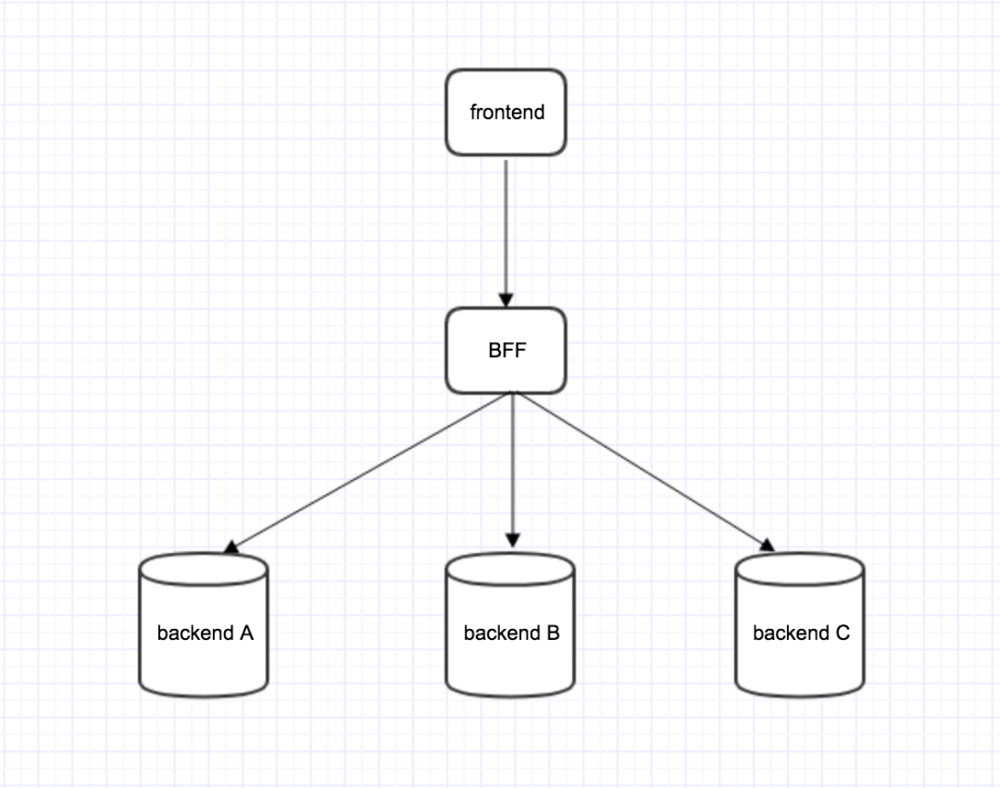

# bff和rpc

## rpc

### RPC是什么

RPC（Remote  Procedure  Call，远程过程调用）是一种计算机通信协议，它允许一个程序调用另一个程序所在的远程计算机上的子程序（或函数）而不需要自己的代码去处理远程调用的细节。

### RPC的应用

RPC技术应用广泛，特别是在分布式系统中。比如，在Web开发中，有时需要从后端服务器请求数据，此时就可以使用RPC进行通信。RPC还可以用于跨语言调用，例如Java程序调用C++程序，也可以用于跨平台通信，例如Windows系统与Linux系统之间的通信。

### RPC的技术要点

在RPC的实现中，有多种技术可以选择，如：

1. RPC框架：实现RPC的一种基础设施，包括协议解析，网络通信，序列化和反序列化，负载均衡等功能。
2. 序列化和反序列化：将数据结构或对象转换为可以在网络上传输的格式和从网络接收的格式。
3. 协议：定义消息格式和通信规则。常见的RPC协议包括HTTP，TCP，UDP等。
4. 负载均衡：在多个服务提供者之间进行负载均衡，减少单个服务提供者的负荷。

### RPC的实现案例

除了上面提到的技术，还有一些其他的RPC相关技术，如：

1. RESTful  API：RESTful是一种设计风格，也可以用于分布式系统中的通信。它包括一组协议和约束条件，可用于提高系统的可伸缩性，可移植性和可靠性。
2. gRPC：由Google开发的，基于HTTP/2协议的RPC框架，支持多种编程语言和平台。
3. Thrift：由Facebook开发的，支持多种编程语言和平台的RPC框架，包括Java，Python，C#和Ruby等。
4. Dubbo：由阿里巴巴开发的，基于Java语言的RPC框架，支持服务治理和容错机制。

### 示例

Protocol Buffers（Protobuf）的IDL（Interface Description Language，接口描述语言）是一种用于定义数据结构和服务接口的语言。它允许开发者以一种语言无关和平台无关的方式描述数据结构和服务，从而实现跨语言和跨平台的通信

在Protobuf中，IDL用于定义消息类型和服务接口。消息类型描述了数据的结构，包括字段名称、类型和标识符。服务接口则定义了可以远程调用的方法，包括请求和响应的消息类型

例如，以下是一个简单的`.proto`文件示例，定义了一个名为`Person`的消息类型和一个名为`Greeter`的服务接口：

```proto
syntax = "proto3";

package example;

message Person {
    string name = 1;
    int32 id = 2;
    string email = 3;
}

service Greeter {
    rpc SayHello (HelloRequest) returns (HelloReply) {}
}

message HelloRequest {
    string name = 1;
}

message HelloReply {
    string message = 1;
}
```

在这个示例中，`Person`消息类型包含三个字段：`name`、`id`和`email`。`Greeter`服务接口定义了一个`SayHello`方法，该方法接收一个`HelloRequest`消息并返回一个`HelloReply`消息

通过使用IDL，开发者可以定义清晰、一致的数据结构和服务接口，从而简化分布式系统中的通信和数据交换。

### 名字服务

### 名字服务（Name Service）

- 定义：名字服务是一种将易于人类记忆的名称（如域名）映射到计算机可识别的地址（如IP地址）的系统
- 作用：它允许用户通过名称而不是复杂的IP地址来访问网络资源，简化了网络操作

## bff

BFF，即 `Backend For Frontend（`服务于前端的后端），也就是服务器设计 API 时会考虑前端的使用，并在服务端直接进行业务逻辑的处理，又称为用户体验适配器。BFF 只是一种逻辑分层，而非一种技术，虽然 BFF 是一个新名词，但它的理念由来已久。


##  

## **BFF优缺点**

回顾完前端演化史，我们再来分析BFF利弊。

BFF作为中间层，优点是：

- 前后端彻底分离，即便是后期有微服务迁移，也不需改动前端代码
- 业务更向前靠拢，琐碎的api由前端开发自己决定，更适配前端框架
- BFF可以自开mock，插件也能生成API文档，相比后端单开这类服务要方便些吧
- 留给后端更清晰的服务边界，只需要提供粗粒度的接口即可

我自己的项目就直接把**BFF+前端**一齐从后端repo里分离出来，独立开发独立部署。尤其是在多应用场景里，BFF共享后端是很优雅的中台设计。

当然，BFF的缺点也很明显——增加了系统的复杂度，这会导致一系列的连锁反应

- 中间层转发会增加请求延迟。

- 需要保证端到端测试

- 必须随时准备好后端异常请求

- BFF分成会增加开发成本

  

## **BFF 解决了什么问题**

如下图，在我们的前端页面时常存在，某个页面需要向 `backend A`、`backend B` 以及 `backend C...... `发送请求，不同服务的返回值用于渲染页面中不同的 `component`，即一个页面存在很多请求的场景。


此时，每次访问该页面都需要发送 3 个请求。同时为了保障 Android，iOS，以及 Web 端的不同需求，需要为不同的平台写不同的 `API` 接口，而每当值发生一些变化时，需要 Android，iOS，Web 做出修改。与此同时，当我们需要对一个字符串进行处理，如限定 140 个字符的时候，我们需要在每一个客户端（Android，iOS，Web）分别实现一遍，这样的代价显然相当大。

于是，我们就需要 BFF 作为中间件。在这个中间件上我们将做一些业务逻辑处理：


而当我们有了 BFF 这一层时，我们就不需要考虑系统后端的迁移。后端发生的变化都可以在 BFF 层做一些响应的修改。

例如，我们加入 BFF 层，原本每次访问发送 3 请求页面，变成一个请求。



##  

## **使用 BFF 的正确姿势**

- 多端应用
  我们在设计 API 时会考虑到不同设备的需求，也就是为不同的设备提供不同的 API，虽然它们可能是实现相同的功能，但因为不同设备的特殊性，它们对服务端的 API 访问也各有其特点，需要区别处理。
- 服务聚合
  随着微服务的兴起，原本在同一个进程内运行的业务流程被拆分到了不同的服务中。这在增加业务灵活性的同时，也让前端的调用变得更复杂。BFF 的出现为前端应用提供了一个对业务服务调用的聚合点，它屏蔽了复杂的服务调用链，让前端可以聚焦在所需要的数据上，而不用关注底层提供这些数据的服务。
- 非必要，莫新增
  我们在看到 BFF 带来的各种好处的同时，也要注意到它所带来的代码重复和工作量增加方面的问题。如果与已有 BFF 功能类似，且展现数据的要求也相近的话，一定要谨慎对待新增 BFF 的行为。因此，建议**非必要，莫新增**。

## **实战中的玩法**

- 访问控制
  例如，服务中的权限控制，将所有服务中的权限控制集中在 BFF 层，使下层服务更加纯粹和独立。
- 应用缓存
  项目中时常存在一些需要缓存的临时数据，此时 BFF 作为业务的汇聚点，距离用户请求最近，遂将该缓存操作放在 BFF 层。
- 第三方入口
  在业务中需要与第三交互时，将该交互放在 BFF 层，这样可以只暴露必要信息给第三方，从而便于控制第三方的访问。

## node实现rpc

通过`pb`编译成一些`client或者sever`的桩代码，可以通过函数调用的方式实现`rpc`调用。

`trpc-node`提供`cli`工具，根据 protobuffer IDL 生成 codec (编/解码器) 以及 client/server 所需的样板代码，基于 [protobufjs](https://www.npmjs.com/package/protobufjs) 实现。具体流程为：`rick -> 编译成npm包 -> 引入npm包 -> 通过函数调用实现rpc调用`