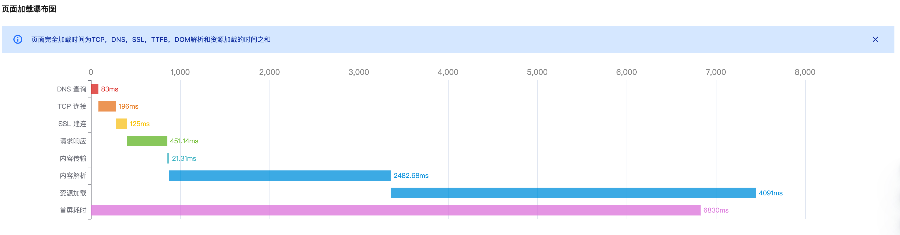
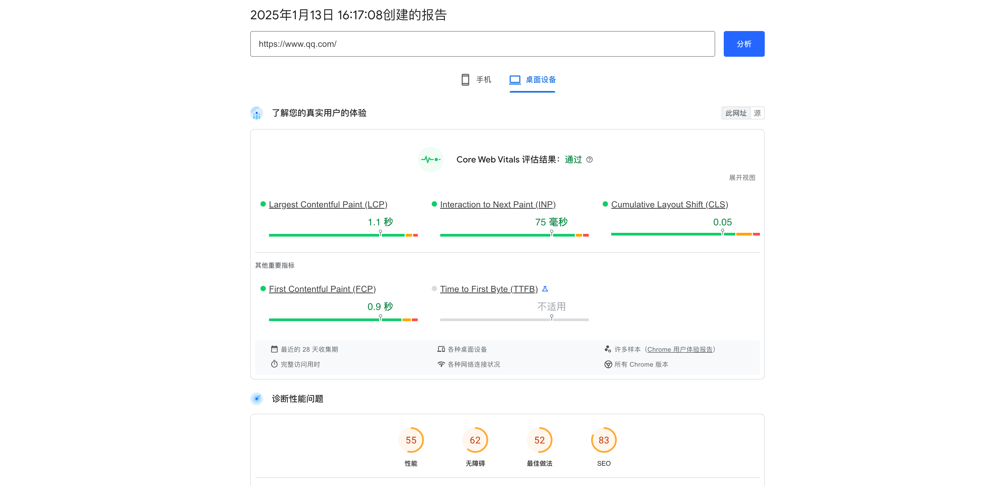
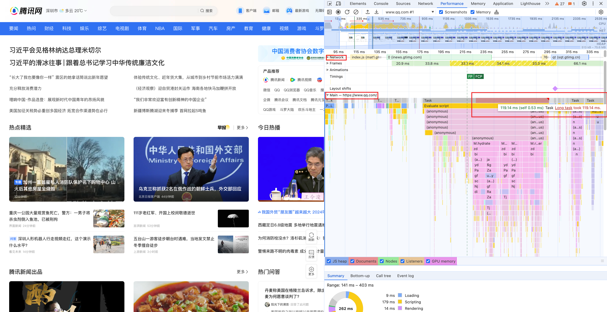
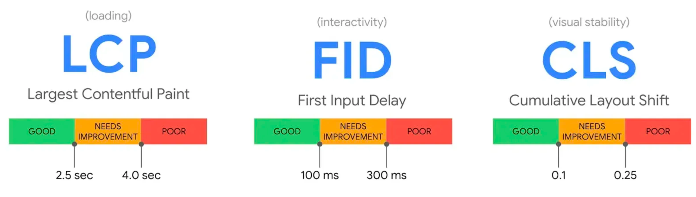
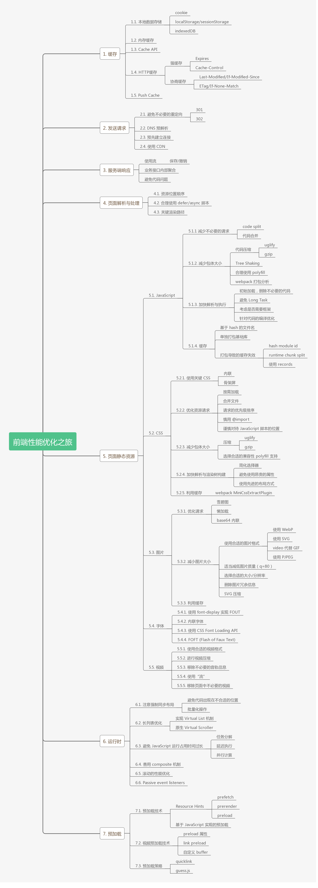

# 性能优化体系

## 前言

当页面加载时间过长、交互操作不流畅时，会给用户带来很糟糕的体验。越是使用时间越长的产品，用户对体验的要求越高，如果出现卡顿或是加载缓慢，最坏的情况下会导致用户的流失。 并且性能优化不是一劳永逸的解决方案，项目在发展过程，代码不断地迭代和变更。我们在某个阶段优化过的代码，过段时间性能又会慢慢下降，这也是前端开发常把性能挂在嘴边的原因。

对于性能优化，其实解决方案也比较常见和通用了，但是基本上也只有指导思想，实施起来还得具体项目具体分析。对于我个人而言，解决性能问题可以分为如下三步：

1. **明确要优化的内容。**

   是首屏优化还是运行时优化，需要找到系统使用的痛点。如果我们花了很多时间优化了一个用户根本不关注时间的功能，那么这个优化就不算一个好的优化

2. **分析性能瓶颈**

   明确了优化方向后，就需要通过各种各样的性能指标和分析工具找到我们的性能瓶颈。可以从页面加载流程 / 时间与空间等等角度去建立体系化的性能分析方法。这个也是性能优化中最关注的地方

3. **执行性能优化**

   找到了具体问题之后才是性能优化。除了通用的一些方法论之外，还需要结合具体业务具体分析。

## 如何找到性能优化体系

虽然大家对性能优化都有自己的思路，不过大多是分散在某几个点，较难形成一个完整的体系。业界也有很多优质的资料，例如[雅虎的性能优化 35 条](https://github.com/creeperyang/blog/issues/1)，但是 **性能优化作为一个系统性工程**，想要系统性地去学习并不容易。所以只能在不断的学习中渐渐完善。

从用户开始访问你的网站应用，到最终它在上面浏览信息、操作交互，其间经历了非常多的环节，每个环节都有可能出现性能问题，同时也是我们实现性能提升机会。所以，前端性能优化会要求你从整体维度来分析系统，甚至是业务。

那么如何能够更有效地梳理与理解性能优化呢？回想到每每面试都会被问到：“从地址栏输入XXX到访问之间经历了什么？”其实我们也可以从这个视角来看待性能优化。

从访问开始，用户可能会经历类似「查询缓存 -> 发送请求 -> 等待响应 -> 页面解析 -> 下载并处理各类静态资源 -> 进行资源解析 -> 运行时 -> 预加载（等待后续的请求）」。这里面每个环节都有可能存在性能问题，所以我们去分析性能问题的时候就是排查各个环节的瓶颈。例如很多监控平台都会有下面的瀑布图，很方便的帮我们找到性能问题。

 

1. **DNS 查询**：domainLookupEnd - domainLookupStart；
2. **TCP 连接**：connectEnd - connectStart； 
3. **SSL 建连**：requestStart - secureConnectionStart；
4. **请求响应**：responseStart - requestStart；
5. **内容传输**：responseEnd - responseStart；
6. **DOM解析**：domInteractive - domLoading；
7. **资源加载**：loadEventStart - domInteractive；
8. **首屏耗时**：监听页面打开3s内的**首屏** DOM 变化，并认为 DOM 变化数量最多的那一刻为首屏框架渲染完成时间（SDK 初始化后 setTimeout 3s 收集首屏元素，由于 JS 是在单线程环境下执行，收集时间点可能大于 3s）；
9. **页面完全加载时间**：TCP、DNS、SSL、TTFB、DOM 解析和资源加载的时间之和。

从流程上找到问题之后，需要针对性的提出解决方案。回想我们做算法的时候衡量一个算法的好坏是通过空间复杂度和时间复杂度，同理我们也可以从这两方面出发去提出解决问题。

对于前端应用来说，网络耗时、页面加载耗时、脚本执行耗时、渲染耗时等耗时情况会影响用户的等待时长，而 CPU 占用、内存占用、本地缓存占用等则可能会导致页面卡顿甚至卡死。

因此，性能优化可以分别从**耗时和资源占用**两方面来解决，其实也就是“时间”和“空间”两个维度。

**小结**

1. 可以从浏览器加载页面的流程去分析哪个环节存在问题
2. 可以从空“时间”和“空间”两个维度去找到性能问题的解决方案

## 找到性能瓶颈

有了上述指导思想之后，我们就可以进行性能指标的建设了。单单凭感觉是无法进行性能衡量的，一切都需要有数据做支撑支撑。

### 常用的性能分析工具

目前已经有一些做性能测试的工具，可以很方便的帮助我们了解网站运行情况，并给出一些优化建议。

#### 1. [PageSpeed](https://pagespeed.web.dev/)

#### 

#### 2. Lighthouse


#### 3. 各个浏览器自带的DevTools

可以通过`performance`选项卡来分析页面中存在的性能问题。对于找到长任务，耗时代码等非常有帮助



### 自建性能监控

除了已有的分析工具之外，我们还可以自建性能监控。不过首先要理解每个指标的含义，确定要优化的目标，并为这个目标定义指标，例如：在优化首屏渲染时间，我们的目标是让用户尽可能早的看到渲染的关键内容，在优化页面滚动时，我们的目标是稳定滚动时的帧率。 所以在进行性能优化前，我们需要结合历史性能数据和业务诉求，来确定优化目标，并定义指标。

### 1. Core Web Vitals

Core Web Vitals 是衡量页面用户体验的一种方法， 主要关注用户体验的三个方面：**加载、交互性和视觉稳定性**。



#### 1.1 LCP

用于衡量标准报告视口内可见的最大内容元素的渲染时间。为了提供良好的用户体验，网站应努力在开始加载页面的前 2.5秒内进行 最大内容渲染。

- [Largest contentful paint (LCP](https://web.dev/lcp/) ： 测量页面开始加载到最大文本块内容或图片显示在页面中的时间。

#### 1.2 FID

记录用户和页面进行首次交互操作所花费的时间 。FID 指标影响用户对页面交互性和响应性的第一印象。 为了提供良好的用户体验，站点应努力使首次输入延迟小于 100 毫秒。

- [First input delay (FID)](https://web.dev/fid/) ：测量用户首次与网站进行交互(例如点击一个链接、按钮)到浏览器真正进行响应的时间。

#### 1.3 CLS

CLS 会测量在页面的整个生命周期中发生的每个意外的样式移动的所有单独布局更改得分的总和。布局的移动可能发生在可见元素从一帧到下一帧改变位置的任何时候。为了提供良好的用户体验，网站应努力使 CLS 分数小于 0.1 。

- [Cumulative layout shift (CLS)](https://web.dev/cls/)： 测量从页面开始加载到状态变为隐藏过程中，发生不可预期的layout shifts的累积分数。

### 2. FMP 和 FPS

除了以上三个指标，我们一般还会关注FMP与FPS。

#### 2.1 单页应用 - FMP的度量

**单页应用与多页应用的不同：** 用户请求一个页面时，页面会先加载 index.html，加载完成后，就会触发 DOMContentLoaded 和 load。而这个时候，页面展示的只是个空白页。此时根本不算真正意义的首屏。接下来，页面会加载相关脚本资源并通过 axios 异步请求数据，使用数据渲染页面主题部分，这个时候首屏才渲染完成。

#### 2.2 FPS的度量

##### requesAnimationFrame

通过`requesAnimationFrame` 来统计FPS

##### Long Tasks

因为`requestAnimationFrame`不是严格的一次主线程加一次合成线程执行所消耗的时间为一帧， 所以通过requestAnimationFrame这个API来统计FPS必定会存在着误差，所以这里介绍一下`longtask`，但会有兼容性的问题。

流畅度降低的根本原因是UI线程被阻塞，而这种阻塞是由于一些长时间没有完成的长任务导致的，使用Long Task API可以定位这些阻塞UI线程的长任务。

```javascript
var observer = new PerformanceObserver(function(list) {
  var perfEntries = list.getEntries();
  for (var i = 0; i < perfEntries.length; i++) {
     // Process long task notifications:
     // report back for analytics and monitoring
     // ...
  }
});


// register observer for long task notifications
observer.observe({entryTypes: ["longtask"]});
```

### 3. 均值，分位数，秒开率

除了需要为度量用户端的性能选取度量指标还需要选取一个合适的统计指标来反映用户整体的性能水平

#### 3.1 均值

在实际的性能统计中，直接使用均值会存在一些问题：

1. 无法排除极值的影响，均值往往会被个别极值拉到一个远远偏离大部分值的水平，在生产环境的性能数据来说，受各种外在因素的影响，非常容易产生这种极值

#### 3.2 分位数

另一个常和均值出现的统计指标是中位数，使用中位数可以很好的解决均值的两个问题，由中位数引申，有不少于x%的用户首屏时间在2s内，这里的2s就是首屏渲染耗时的x分位数，而中位数是一种特定的分位数，即50分位数，一般来说并不会有太多极端慢的用户数据出现，如果占比太高，就需要考虑是否存在一个现实的性能问题，而不是排除极值，通常这些只称为Top Percent（TP），TP90即代表90分位数。

#### 3.3 秒开率

分位数更侧重于性能差的用户端的性能状态，秒开率则是关注有多少用户达到了非常高的性能水平，秒开只是一个惯用的说法，实际我们更关注的是1s内打开用户的占比 n秒内打开用户的占比，提高分位数的方式往往用于解决低端机型 弱网条件下的性能问题，而优化秒开率的方式则是用于提高极限的性能，让条件好的用户得到更好的体验

> 除此之外我们还可以结合业务场景上报各种各样的性能指标，例如接口测速，按钮点击响应耗时等等，有了数据的支持我们的性能优化才能更加的得心应手

## 优化策略

