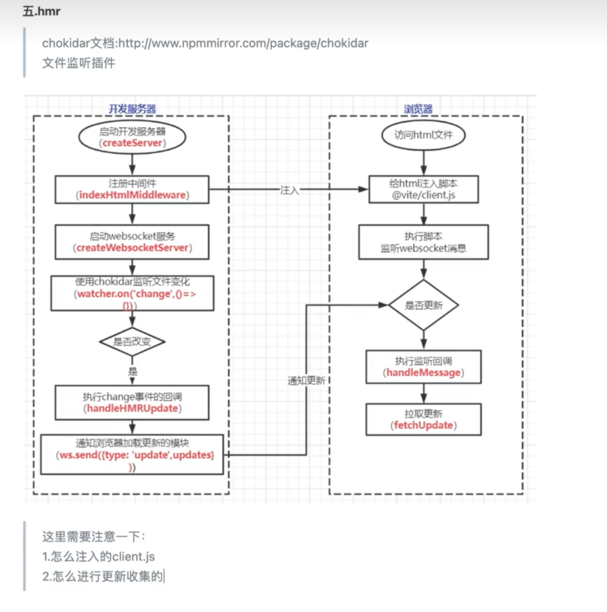

# HMR

1. full-reload: 调用location.reload()更新页面
2. js更新 / css更新: 拉取更新的文件即可

## 关键点

1. 怎么向各个文件中注入`HMR`代码。
2. 如何收集文件的更新函数

## 整体流程:



## 核心API

HMR 的 API 在工作中写得较少，大多数插件都会内置这些 API，比如 vite:css-post 插件埋上 accept 钩子是修改 css 文件能够触发热更的原因。作为高级的插件开发者，我们必须要能够熟练地使用热更技能。本节先来熟悉 HMR 客户端 API 的定义和作用。Vite 通过 `import.meta.hot `提供这些 API。我们处理热更新的时候也是调用这些`API`去注册以来啥的

```typescript
interface ImportMeta {
  readonly hot?: {
    // 只读的 data 属性
    readonly data: any

    // 定义热更接收的模块，有四种定义：
    // 没有参数，代表接收自身
    accept(): void
    
    // 只有一个回调函数，接收已更新模块的回调函数
    accept(cb: (mod: any) => void): void
    
    // 接收单个依赖 dep 的更新，并调用更新模块的回调函数
    accept(dep: string, cb: (mod: any) => void): void
    
    // 接收多个依赖 deps 的更新，并调用更新模块的回调函数，参数依次为deps对应的模块
    accept(deps: string[], cb: (mods: any[]) => void): void
	
    // 模块不再需要，被剔除时调用回调 cb
    prune(cb: () => void): void
    
    // 清除任何更新导致的持久副作用
    dispose(cb: (data: any) => void): void

    // 调用后直接刷新页面
    invalidate(): void

    // 模块监听热更事件
    on(event: string, cb: (...args: any[]) => void): void
  }
}
```

## 整体详细流程

1. 在浏览器请求index.html的时候通过indexHtmlMiddleware中间件，然后调用`devHtmlHook`进行client的注入

```js
// 返回一个script标签，src为client.js的路径。
const devHtmlHook: IndexHtmlTransformHook = async (
  html,
  { path: htmlPath, filename, server, originalUrl },
) => {
  /** 省略其他代码 */
  return {
    html,
    tags: [
      {
        tag: 'script',
        attrs: {
          type: 'module',
          src: path.posix.join(base, CLIENT_PUBLIC_PATH),
        },
        injectTo: 'head-prepend',
      },
    ],
  }
}
```

2. 请求@vite/client.js之后。会初始化一个`HMRClient`实例。这个实例上会存储所有路径的更新函数
3. 例如我们请求`App.vue`文件。`plugin-vue`插件会在代码中注入热更新的代码

```js
import { createHotContext as __vite__createHotContext } from "/@vite/client";
import.meta.hot = __vite__createHotContext("/src/App.vue");import HelloWorld from "/src/components/HelloWorld.vue"

/** vue 编译后的代码 */

_sfc_main.__hmrId = "7a7a37b1"
typeof __VUE_HMR_RUNTIME__ !== 'undefined' && __VUE_HMR_RUNTIME__.createRecord(_sfc_main.__hmrId, _sfc_main)
import.meta.hot.on('file-changed', ({ file }) => {
  __VUE_HMR_RUNTIME__.CHANGED_FILE = file
})
import.meta.hot.accept(mod => {
  if (!mod) return
  const { default: updated, _rerender_only } = mod
  if (_rerender_only) {
    __VUE_HMR_RUNTIME__.rerender(updated.__hmrId, updated.render)
  } else {
    __VUE_HMR_RUNTIME__.reload(updated.__hmrId, updated)
  }
})
```

首先通过会调用`createHotContext`创建一个`HMR`上下文。并挂载在`import.meta.hot`上。

然后通过`import.meta.hot.accept`将更新函数添加到`HMRClient`的`hotModulesMap`上

```ts
accept(deps?: any, callback?: any): void {
  if (typeof deps === 'function' || !deps) {
    // self-accept: hot.accept(() => {})
    this.acceptDeps([this.ownerPath], ([mod]) => deps?.(mod))
  } else if (typeof deps === 'string') {
    // explicit deps
    this.acceptDeps([deps], ([mod]) => callback?.(mod))
  } else if (Array.isArray(deps)) {
    this.acceptDeps(deps, callback)
  } else {
    throw new Error(`invalid hot.accept() usage.`)
  }
}

 acceptDeps(
    deps: string[],
    callback: HotCallback['fn'] = () => {},
  ): void {
    // 没有当前模块就更新
    const mod: HotModule = this.hmrClient.hotModulesMap.get(this.ownerPath) || {
      id: this.ownerPath,
      callbacks: [],
    }
		// 将更新函数放入callbacks中
    mod.callbacks.push({
      deps,
      fn: callback,
    })
    this.hmrClient.hotModulesMap.set(this.ownerPath, mod) // 在hmrClient上的hotModulesMap添加一个路径的依赖
  }
```

2. `watcher.on('change')`监听文件变化。执行`handleHMRUpdate`。判断文件是`reload`还是`update`

```js
watcher.on('change', async (file) => { // 监听文件变化
    file = normalizePath(file)
    await container.watchChange(file, { event: 'update' }) // 执行update钩子
    moduleGraph.onFileChange(file) // 更新模块依赖
    await onHMRUpdate('update', file) // 执行handleHMRUpdate发送消息
  })
```

4. 通过ws向浏览器发送更新消息`ws.send({ type: 'update' })`
5. 浏览器`client.js`接收到更新消息

```js
// Listen for messages
socket.addEventListener('message', async ({ data }) => { // 收到消息。热更新主要就是这一块处理
  handleMessage(JSON.parse(data))
})

// handleMessage
if (update.type === 'js-update') { // 拉取js文件
  return hmrClient.queueUpdate(update)
}

// queueUpdate
public async queueUpdate(payload: Update): Promise<void> {
  this.updateQueue.push(this.fetchUpdate(payload))
  ...
}
```

6. 发起请求并进行更新

```ts
private async fetchUpdate(update: Update): Promise<(() => void) | undefined> {
  const { path, acceptedPath } = update
  const mod = this.hotModulesMap.get(path) // 通过path找到mod。上面挂载了更新函数
  if (!mod) {
    return
  }

  let fetchedModule: ModuleNamespace | undefined
  const isSelfUpdate = path === acceptedPath

  // determine the qualified callbacks before we re-import the modules
  const qualifiedCallbacks = mod.callbacks.filter(({ deps }) =>
    deps.includes(acceptedPath),
  )

  if (isSelfUpdate || qualifiedCallbacks.length > 0) {
    const disposer = this.disposeMap.get(acceptedPath)
    if (disposer) await disposer(this.dataMap.get(acceptedPath))
    try {
      fetchedModule = await this.importUpdatedModule(update) // 重新拉取最新的文件
    } catch (e) {
      this.warnFailedUpdate(e, acceptedPath)
    }
  }

  return () => {
    for (const { deps, fn } of qualifiedCallbacks) {
      fn( // 执行更新函数
        deps.map((dep) => (dep === acceptedPath ? fetchedModule : undefined)),
      )
    }
    const loggedPath = isSelfUpdate ? path : `${acceptedPath} via ${path}`
    this.logger.debug(`[vite] hot updated: ${loggedPath}`)
  }
}
```


参考：

HMR api: https://juejin.cn/post/7083719911112966174
