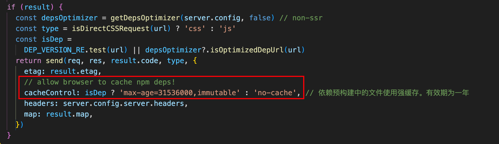
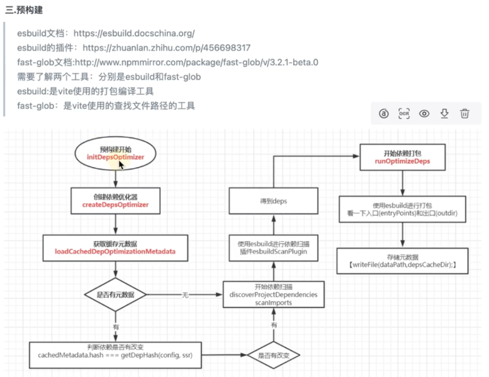

# 依赖预构建

## 为什么要预构建

1. **CommonJS 和 UMD 兼容性：** 在开发阶段中，Vite 的开发服务器将所有代码视为原生 ES 模块。因此，Vite 必须先将以 CommonJS 或 UMD 形式提供的依赖项转换为 ES 模块。

   在转换 CommonJS 依赖项时，Vite 会进行智能导入分析，这样即使模块的导出是动态分配的（例如 React），具名导入（named imports）也能正常工作：

   ```
   // 符合预期
   import React, { useState } from 'react'
   ```

   

2. **性能：** 为了提高后续页面的加载性能，Vite 将那些具有许多内部模块的 ESM 依赖项转换为单个模块。

   有些包将它们的 ES 模块构建为许多单独的文件，彼此导入。例如，[`lodash-es` 有超过 600 个内置模块](https://unpkg.com/browse/lodash-es/)！当我们执行 `import { debounce } from 'lodash-es'` 时，浏览器同时发出 600 多个 HTTP 请求！即使服务器能够轻松处理它们，但大量请求会导致浏览器端的网络拥塞，使页面加载变得明显缓慢。

   通过将 `lodash-es` 预构建成单个模块，现在我们只需要一个HTTP请求！

::: tip 

注意 依赖预构建仅适用于开发模式，并使用 `esbuild` 将依赖项转换为 ES 模块。在生产构建中，将使用 `@rollup/plugin-commonjs`。 :::

## 预构建产物

1. 遍历所有的文件，搜集所有裸模块的请求，然后将所有裸模块的请求作为esbuild打包的入口文件，将所有裸模块缓存打包到`.vite/deps`文件夹下，在打包过程中，会将`commonjs`转化为`esmodule`的形式，本质是使用一个`export default`包裹着`commonjs`的代码，同时利用esbuild的打包能力，将多个内置请求合并为一个请求，防止大量请求引起浏览器端的网络堵塞，使页面加载变得非常缓慢
2. 在浏览器请求链接时改写所有裸模块的路径指向`.vite/deps`
3. 如果想要重新执行预构建，使用`--force`参数或者直接删除`node_modeuls/.vite/deps`是比较快捷的方式，或者改变一些配置的值可以触发重新预构建

## 预构建的特性

### 源码和依赖

冷启动开发服务器时，基于打包器的方式启动必须优先抓取并构建你的整个应用，然后才能提供服务。

Vite 通过在一开始将应用中的模块区分为 **依赖** 和 **源码** 两类，改进了开发服务器启动时间。

- **依赖** 大多为在开发时不会变动的纯 JavaScript。一些较大的依赖（例如有上百个模块的组件库）处理的代价也很高。依赖也通常会存在多种模块化格式（例如 ESM 或者 CommonJS）。

  Vite 将会使用 [esbuild](https://esbuild.github.io/) [预构建依赖](https://cn.vite.dev/guide/dep-pre-bundling.html)。esbuild 使用 Go 编写，并且比以 JavaScript 编写的打包器预构建依赖快 10-100 倍。

- **源码** 通常包含一些并非直接是 JavaScript 的文件，需要转换（例如 JSX，CSS 或者 Vue/Svelte 组件），时常会被编辑。同时，并不是所有的源码都需要同时被加载（例如基于路由拆分的代码模块）。

  Vite 以 [原生 ESM](https://developer.mozilla.org/en-US/docs/Web/JavaScript/Guide/Modules) 方式提供源码。这实际上是让浏览器接管了打包程序的部分工作：Vite 只需要在浏览器请求源码时进行转换并按需提供源码。根据情景动态导入代码，即只在当前屏幕上实际使用时才会被处理。

`vite`只会预构依赖。对于源码也需要预构建的，需要我们手动处理。例如在一个 monorepo 启动中，该仓库中的某个包可能会成为另一个包的依赖。Vite 会自动侦测没有从 `node_modules` 解析的依赖项，并将链接的依赖视为源码。它不会尝试打包被链接的依赖，而是会分析被链接依赖的依赖列表。那么你可以在配置里将此依赖添加到 [`optimizeDeps.include`](https://cn.vite.dev/config/dep-optimization-options.html#optimizedeps-include) 和 [`build.commonjsOptions.include`](https://cn.vite.dev/config/build-options.html#build-commonjsoptions) 这两项中。

### 缓存（提高启动和响应速度）

#### 文件系统缓存

Vite 将预构建的依赖项缓存到 `node_modules/.vite` 中。它会基于以下几个来源来决定是否需要重新运行预构建步骤：

- 包管理器的锁文件内容，例如 `package-lock.json`，`yarn.lock`，`pnpm-lock.yaml`，或者 `bun.lockb`；
- 补丁文件夹的修改时间；
- `vite.config.js` 中的相关字段；
- `NODE_ENV` 的值。

只有在上述其中一项发生更改时，才需要重新运行预构建。

如果出于某些原因你想要强制 Vite 重新构建依赖项，你可以在启动开发服务器时指定 `--force` 选项，或手动删除 `node_modules/.vite` 缓存目录。

#### 浏览器缓存

已预构建的依赖请求使用 HTTP 头 `max-age=31536000, immutable` 进行强缓存，以提高开发期间页面重新加载的性能。一旦被缓存，这些请求将永远不会再次访问开发服务器。如果安装了不同版本的依赖项（这反映在包管理器的 lockfile 中），则会通过附加版本查询自动失效。如果你想通过本地编辑来调试依赖项，可以通过如下方式：

1. 通过浏览器开发工具的 Network 选项卡暂时禁用缓存；
2. 重启 Vite 开发服务器指定 `--force` 选项，来重新构建依赖项;
3. 重新载入页面。

源码位于`packages/vite/src/node/server/middlewares/transform.ts`下的`transformMiddleware`函数



## 整体流程

主要分为两步

1. 通过`html`文件分析所有的第三方依赖
2. 打包所有的第三方依赖。后续请求拦截的时候对返回结果进行判断，如果是第三方依赖就从预购建的结果里面取。



1. 通过`prepareEsbuildScanner`找到所有项目依赖的第三方模块入口

   ```js
   return await esbuild.context({
       absWorkingDir: process.cwd(),
       write: false, // 只分析，不写入
       stdin: {
         contents: entries.map((e) => `import ${JSON.stringify(e)}`).join('\n'),
         loader: 'js',
       },
       bundle: true,
       format: 'esm',
       logLevel: 'silent',
       plugins: [...plugins, plugin],
       ...esbuildOptions,
       tsconfigRaw,
     })
   ```

   esbuild.context 和 esbuild.build 差不多的功能。

2. 调用`esbuild`将得到的入口作为打包的入口

   ```js
   const context = await esbuild.context({ // 调用esbuild打包一下，实现预购建
       absWorkingDir: process.cwd(),
       entryPoints: Object.keys(flatIdDeps), // 入口文件。先通过vite插件找到所有第三方模块的入口文件，然后通过入口文件进行打包。因为esbuild不支持从html扫面依赖
       bundle: true,
       // We can't use platform 'neutral', as esbuild has custom handling
       // when the platform is 'node' or 'browser' that can't be emulated
       // by using mainFields and conditions
       platform,
       define,
       format: 'esm', // 打成esm
       // See https://github.com/evanw/esbuild/issues/1921#issuecomment-1152991694
       banner:
         platform === 'node'
           ? {
               js: `import { createRequire } from 'module';const require = createRequire(import.meta.url);`,
             }
           : undefined,
       target: ESBUILD_MODULES_TARGET,
       external,
       logLevel: 'error',
       splitting: true,
       sourcemap: true,
       outdir: processingCacheDir, // 输出目录就是.vite
       ignoreAnnotations: true,
       metafile: true,
       plugins,
       charset: 'utf8',
       ...esbuildOptions,
       supported: {
         ...defaultEsbuildSupported,
         ...esbuildOptions.supported,
       },
     })
   ```

   