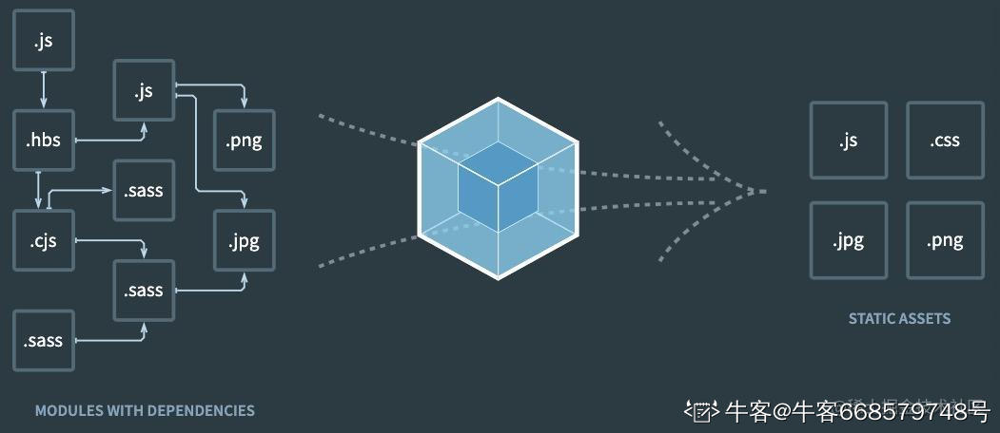
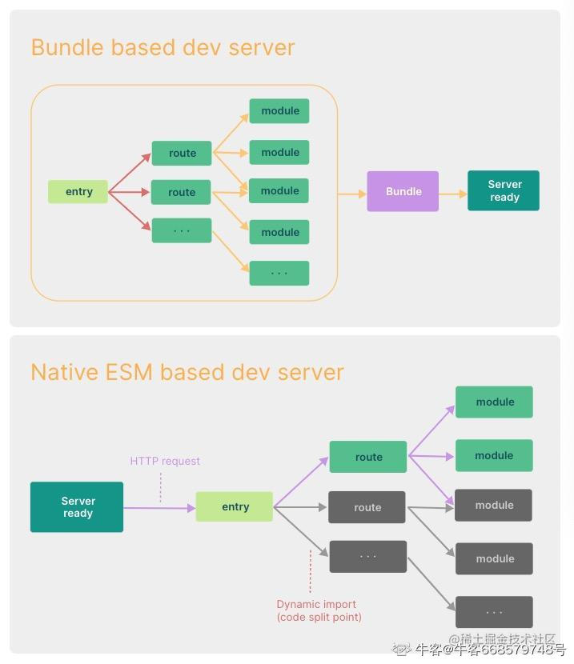
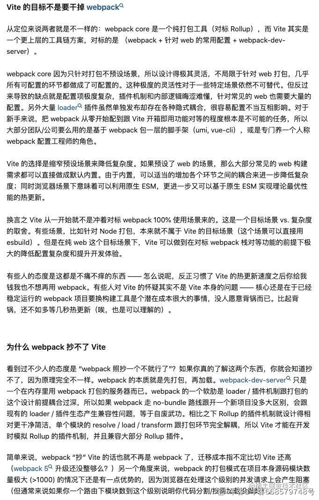

# 简单聊聊webpack、rollup和vite

vite近几年比较火，业界也总是将它和webpack放在一起进行比较。所以出于好奇心，最近就决定了解一下vite到底是个什么东西。

直接看vite的文档，可能有点云里雾里，唯一看懂的就两句话：

1. **vite有一个利用浏览器原生模块机制的很快的开发服务器。**
2. **vite在生产环境下的打包是基于rollup的。**

所以，为了搞明白vite，我们需要理清常见的这些工具的区别和联系：

1. **这些工具都是干什么的**
2. **这些工具怎么使用**
3. **这些工具之间的联系和区别**

# webpack

## 基本概念

**官方定义：webpack is a static module bundler for modern JavaScript applications。**

前端工程化的今天，我们往往会以模块的形式开发项目。一个模块可以是一个组件，一个公共方法文件或者一个json数据文件。但浏览器对于JavaScript原生模块的支持晚于语法标准的出现，并且各浏览器支持的速度也不一样，开发的系统也经常需要兼容老的浏览器。所以一直以来我们常用的做法就是把**所有的模块（包括自己开发的模块以及引用的第三方模块）打包成少数的几个文件（js、css、图片等）供浏览器使用。**



## 基本用法

1. **设置打包入口**：告诉webpack从哪个文件开始遍历从而将代码打包到一起
2. **设置打包出口**：告诉webpack打包之后的代码以什么格式输出到哪里
3. **设置loader**：告诉webpack在遍历文件、打包代码的时候，遇到不同的文件应该怎么处理。比如，使用样式相关的loader将scss/less转换成浏览器能够处理的css；使用babel-loader将react代码转换成原生js代码。
4. **设置插件**：提供一些loader无法实现的额外功能。比如，生成html模板文件，每次打包前先清空目标文件夹，代码混淆压缩等。

上述四步简单描述了使用webpack的最大粒度的配置流程，实际需要配置的步骤和每个步骤的可配置项都是极其丰富的。除了将项目打包成生产包以外，webpack也提供了一个开发服务器，使得开发者能够直接在本地启动项目进行调试，并提供HMR(热更新)功能。但需要注意的是，在开发服务器上运行的代码也是经过webpack打包后生成的代码。

下面代码模拟了一个简单的组件库及webpack打包的基本配置。

```js
// 组件1及其样式
import styles from "./index.module.scss";
const BlueText = props => {
  return <div className={styles.text}>{props.text}</div>;
};
export default BlueText;
.text {
  font-size: 16px;
  line-height: 18px;
  color: blue;
  display: flex; //测一下自动前缀
  user-select: all; //测一下自动前缀
  overflow-wrap: break-word; //测一下postcss-preset-env state:2/stage:3 的区别，这是一个stage2的提案
}
```

```js
// 组件2及其样式
import styles from "./index.module.scss";
const RedText = props => {
  return <div className={styles.text}>{props.text}</div>;
};
export default RedText;
.text {
  font-size: 16px;
  line-height: 18px;
  color: red;
}
```

将两个组件通过index.js文件统一暴露出去

```js
export { default as BlueText } from "./components/BlueText/index";
export { default as RedText } from "./components/RedText/index";
```

webpack.config.js（输出一个umd包）

```js
const path = require("path");
const MiniCssExtractPlugin = require("mini-css-extract-plugin");
const { CleanWebpackPlugin } = require("clean-webpack-plugin");

module.exports = {
  mode: "none",
  entry: {
    index: "./src/index.js",
  },
  output: {
    path: path.resolve(__dirname, "./dist"),
    filename: "[name].js",
    library: {
      type: "umd",
      name: "WebpackDemo",
    },
  },
  resolve: {
    alias: {
      "@": path.resolve(__dirname, "./src"),
    },
  },
  externals: {
    react: "react", //这里偷懒了
    "react/jsx-runtime": "react/jsx-runtime",
  },
  module: {
    rules: [
      {
        test: /((\.scss)|(\.module\.scss))$/,
        use: [
          MiniCssExtractPlugin.loader,
          "css-loader",
          {
            loader: "postcss-loader",
            options: {
              postcssOptions: {
                plugins: [
                  [
                    "postcss-preset-env",
                    {
                      stage: 3,
                      autoprefixer: {
                        flexbox: "no-2009",
                      },
                    },
                  ],
                ],
              },
            },
          },
          "sass-loader",
        ],
      },
      {
        test: /((\.jsx)|(\.js))/,
        use: ["babel-loader"],
      },
    ],
  },
  plugins: [
    new CleanWebpackPlugin(),
    new MiniCssExtractPlugin({
      filename: "css/[name].css",
      chunkFilename: "css/[id].[contenthash:8].css",
    }),
  ],
  optimization: {
    //测试tree-shaking
    usedExports: true,
    minimize: true,
  },
};
```

webpack的功能丰富，生态完整，可配置性高，所以上手的难度以及配置的复杂度也比较高。实际项目开发时，我们一般不会直接从零开始配置webpack，而是直接使用集成了webpack的脚手架，比如vue-cli(曾经的)、create-react-app等。这些脚手架对webpack进行了预配置，并将webpack的配置文件暴露给开发者进行个性化配置，极大地降低了基于webpack的前端项目的搭建难度。

# rollup

## 基本概念

**官方定义：Rollup is a module bundler for JavaScript which compiles small pieces of code into something larger and more complex, such as a library or application。**

rollup和webpack一样都是打包工具，只是在实际开发中，webpack更多用于应用打包，而rollup更多用于js库打包。

## 基本用法

1. **设置打包入口**
2. **设置打包出口**
3. **设置插件**：可以看做是webpack中loader和plugin的集合，所有打包流程都通过插件实现

从上述基本步骤就可以发现，rollup的配置流程相比webpack更简单。看过官方文档的开发者也会得出结论，rollup的文档篇幅及学习难度也远低于webpack。设置好打包的入口和出口之后，中间流程需要对代码进行哪些处理就针对性地在打包流水线中引入相应的插件。比如：要处理样式就引入postcss插件，要处理jsx就引入babel插件，要混淆压缩代码就引入terse插件。这些插件构成了一条流水线，源码输入，经过流水线后输出打包后的代码。

值得一提的是，rollup是基于es module实现的。项目中如果导入了commonjs模块，就需要在配置文件中加入commonjs插件，用于将commonjs模块转换成es module。es module的静态解析机制使得rollup率先提出了tree-shaking（打包时删除无用代码），这一优化机制随后也被webpack效仿。

针对上面模拟的组件库，下面给出rollup打包的基本配置。输出格式为es module，且打包后的产物保留文件结构。

```js
import json from "@rollup/plugin-json"; //导入json文件
import terser from "@rollup/plugin-terser"; //压缩代码
import clear from "rollup-plugin-clear"; //清空指定文件夹
import resolve from "@rollup/plugin-node-resolve"; //使用node模块的解析逻辑，不然导入第三方库会找不到
import commonjs from "@rollup/plugin-commonjs"; //convert commonjs module to es6 module, so that you can use a commonjs module by 'import'
import babel from "@rollup/plugin-babel"; //babel编译
import postcss from "rollup-plugin-postcss"; //处理样式
import autoprefixer from "autoprefixer"; //自动添加css前缀
import cssnano from "cssnano"; //压缩css代码
export default {
  input: [
    "./src/index.js",
    // "./src/components/BlueText/index.js",
    // "./src/components/RedText/index.js",
  ],
  output: [
    {
      preserveModules: true, //打包后保留目录结构
      preserveModulesRoot: "src",
      dir: "es",
      format: "es",
      // sourcemap: true,
    },
  ],
  external: ["react", "react/jsx-runtime"],
  plugins: [
    clear({
      targets: ["es"],
    }),
    json(),
    resolve(),
    commonjs({ include: [/node_modules/] }),
    babel({
      babelHelpers: "runtime",
      skipPreflightCheck: true,
      exclude: ["node_modules/**"], //该插件不会自动忽略，需要显式指定不处理node_modules
    }),
    postcss({
      extract: "css/index.css",
      plugins: [autoprefixer(), cssnano()],
    }),
    terser(),
  ],
};
```

# vite

## 基本概念

vite是一个法语单词，翻译成中文就是“快”。它包含两部分：

1. **一个基于原生es module的，提供快速hmr（热更新）的开发服务器**
2. **一个基于rollup的打包工具**

很多人应该都和我一样，第一次看到vite这个词的时候，是跟webpack一起出现的，而且修饰词就是“快”。所以，我先入为主的定义就是：这是一个比webpack更快的打包工具。这种先入为主的错误定义让我在刚开始阅读vite官方文档的时候感到有一些吃力。而当我看完官方文档后，我又产生了另一个疑问：为什么vite会和webpack放在一起讨论？它用起来似乎更像一个脚手架，因而更应该和vue-cli、create-react-app这类工具放在一起讨论。对此，作者尤雨溪给出了他的解释：

**“从定位来说两者就是不一样的：webpack core 是一个纯打包工具（对标 Rollup），而 Vite 其实是一个更上层的工具链方案，对标的是 （webpack + 针对 web 的常用配置 + webpack-dev-server）。”**

对此，我的理解是：webpack是一个单纯的打包工具，即使是开发环境下也需要先对代码进行打包再将打包后的产物放到本地启动的服务器上。我们在项目开发过程中，如果每次都从零开始配置整个项目，需要花费大量的时间。脚手架的出现就是为了解决这个问题。它将一些费时且重复的配置过程提前封装好，达到开箱即用的效果。其本质只是封装，将若干个现有的工具及其常规配置封装成一个新的工具。所以，vite不是一个脚手架。因为无论是在开发阶段还是生产打包阶段，都有它独特的处理逻辑，而非简单的组合。**与其说是“vite vs webpack”，不如说是“vite vs webpack及其强相关的工具链，包括基于webpack的脚手架”。**

深入的了解vite可以直接看vite的官方文档，本文只重点说明以下几个高频词汇，理解后应该会对阅读官方文档有帮助。

### modern

vite的官方文档中多次出现modern这个词，理解这个词其实是对传统工程化思想的一次冲击。诸如webpack这类打包工具，它的一个重要的功能就是利用babel把比较新的js语法转换成目标环境下能够运行的旧语法，以及为新的api提供polyfill。但vite选择直接放弃老的浏览器，默认基于vite创建的项目是在现代浏览器上运行的。“现代”指的是**support native ES Modules, native ESM dynamic import, and import.meta**。对此，可以从development和production两方面进行讨论。

1. 对于development，vite提供的快速的开发体验本身就是基于es module实现的。所以如果开发时使用的浏览器连es module都不支持，那也就没有必要强行使用vite了。
2. 对于production，鉴于我们可能使用较新的js语法和api，而生产环境下的用户环境不一致。vite会通过esbuild对代码进行转换处理。但vite最低能将代码转换成es2015，并且只会转换语法，不会包括polyfill。如果实在要支持老的（不现代的）浏览器，则可以使用legacy插件引入babel进行兼容处理。

对此，我其实还有一点疑问一直没有找到答案：vite中解决polyfill的最佳实践？

### 快

vite的快主要体现在development阶段。上文已经反复提到，基于webpack的项目在开发环境下调试时，会先打包再放到开发服务器上。而之后每次代码发生变动，都需要重新打包。虽然webpack引入了热更新技术，但页面的更新速度依旧会随着项目规模的增加而变慢。而vite提供的开发服务器是基于原生es module实现的，无需打包即可直接运行。某个模块的代码发生变动后，浏览器只需要重新加载该模块即可，因此页面的更新速度并不会随着项目规模的增加而变慢。下图直观的展示了两者的区别



### 预构建

vite利用原生es module请求模块的时候会遇到两个问题

1. 请求的模块不是es module而是commonjs/umd规范实现的怎么办？
2. 请求的模块内部又请求了其他的模块，并行请求过多导致网络阻塞怎么办？（可以参考lodash-es）

以上两个问题主要针对的是第三方库。为解决这两个问题，vite在启动开发服务器之前，会先将非es module转换成es module，并将第三方库及其依赖打包成一个整体es module供项目源码使用。也就是说，虽然vite在开发环境下不对整体项目打包，但还是会对第三方库及其依赖进行打包。**但需要注意的是，vite默认不会预构建npm link的本地包，开发者需要显式将本地包加到optimizeDeps.include中。**

预构建使用的是由go编写的工具esbuild。它比那些通过js开发的工具更快，这是由语言特性决定的。由于预构建处理的都是不会频繁改动的第三方依赖库，所以vite会对预构建的结果进行缓存。这也保证了即使有预构建过程的存在，开发环境下的体验也是足够快的。

### 开箱即用

webpack功能丰富的代价就是配置上极高的复杂度，所以我们一般使用脚手架搭建web项目。前文虽然说到vite不等同于一个脚手架，但它拥有和脚手架一样的开箱即用的便利性。官方文档虽然提供了很多针对不同开发阶段的可配置项，但全部看一遍下来发现，对于一个普通项目而言大部分配置项保持其默认值即可，无需在配置文件中显式声明。也就是说，vite搭建的项目是可以开箱即用的，开发者仅需要针对自己的特殊需求进行少量的配置即可。

## 基本用法

1. 像使用脚手架一样，选择特定的模板创建项目
2. 修改部分配置（基本配置、本地服务器配置、打包配置、预览配置、预构建配置等）
3. 开发业务代码
4. 启动本地服务器进行bundless调试
5. 打包，测试后发布生产环境

# webpack VS rollup

上文有提到，webpack常用于应用打包，rollup常用于第三方库打包。技术方案的选择可以从两者各自的特点中找到答案：

1. webpack的功能丰富，生态完整，但学习成本高，配置复杂。rollup在生态方面略逊于webpack，但配置简单易懂。
2. webpack打包出来的产物加入了大量处理代码，导致代码体积变大，即使不混淆和压缩也晦涩难懂。而rollup基本只是对代码进行了转换和整合，打包后的产物中依旧能看到原代码的影子。
3. rollup是基于es module实现的，所以它率先引入了tree-shaking，也能够很方便地打包出es module产物。打包输出的es module库也能够在被其他应用导入时很方便地实现tree-shaking。而在webpack官方文档中，打包输出es module格式依旧还是一个实验特性。

所以，综合上述三点，我的理解是：当开发应用时，我们可能会有各种各样的优化需求。这时webpack丰富的功能使得webpack成为了首选。而且webpack提供了一个支持HMR的本地开发服务器（虽然这个rollup也有），开发阶段调试方便。而开发第三方库时，我们对于打包工具的要求没那么高，配置的方便以及对tree-shaking良好的支持成了我们首选rollup的理由。

# vite VS webpack

vite和webpack的对比，在上文中为了方便理解vite，已经提前叙述了一些。此处直接放上尤雨溪在某乎上的回答。



# 总结

现代前端项目的开发离不开模块。过去，项目必须打包才能在浏览器上运行。但随着浏览器版本的迭代，现代浏览器基本都已经支持了原生es module。这也就意味着，遵守es module规范开发的代码无需打包就可以直接在浏览器上运行。

但目前来说，vite仅在开发阶段用了bundless模式，而在生产阶段依旧采取打包的策略。这是因为bundless模式会增加网络请求的数量，以目前的网络条件，一旦遇到大量的嵌套模块请求，就容易阻塞网络，从而影响用户体验。vite开箱即用的设计其实也是为了保证在不同环境的不同处理方式下，应用的表现能够保持一致性。毕竟干的越少，错的越少。