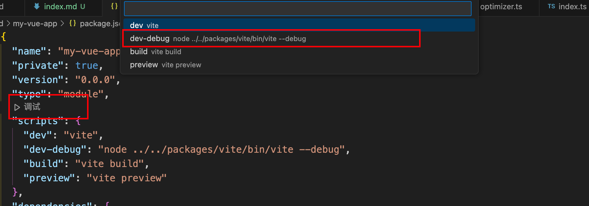
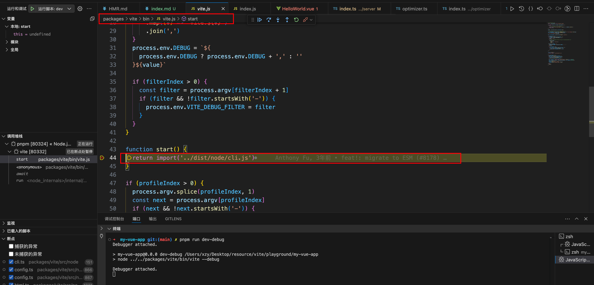

# 如何调试vite源码

通过整个工程的目录结构，我们可以得出 `vite` 是采用 `pnpm workspace` 的方式来管理整个项目的，接着查看 `pnpm-workspace.yaml` 文件。

```yaml
packages:
  - 'packages/*'
  - 'playground/**'
```

从上面的 yaml 文件当中可以得到，vite 源码当中，分开了源码的包（即 `packages/*`) 和示例源码（即 `playgorund/**`）。

我们可以使用 `playgorund/**`中的项目进行调试。

## 具体流程

1. 切换到实例项目。执行`pnpm install`安装依赖

2. 在`package.json`中添加命令`"dev-debug": "node ../../packages/vite/bin/vite --debug"`

3. 使用`javascript debbuger`调试。可以直接在`package.json`文件中点击就行

   

4. 然后就可以在`vite`项目中打断点进行调试了

   