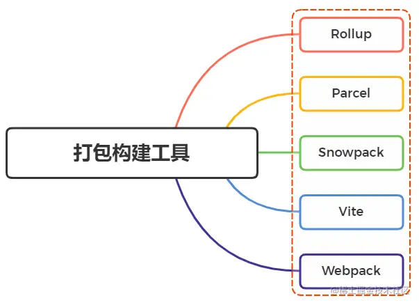
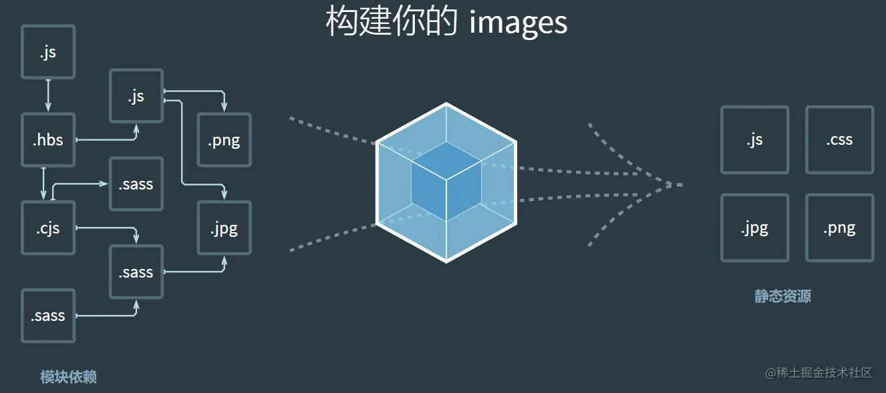
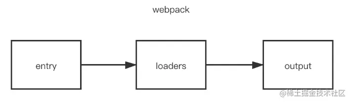
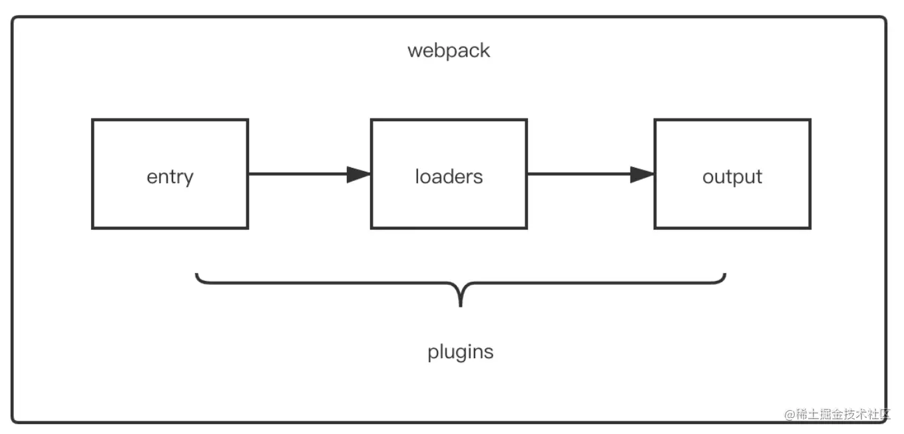
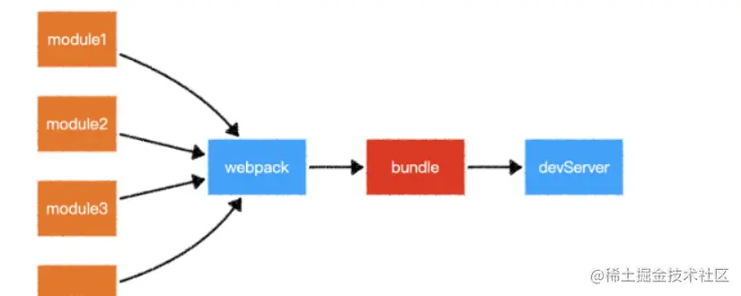
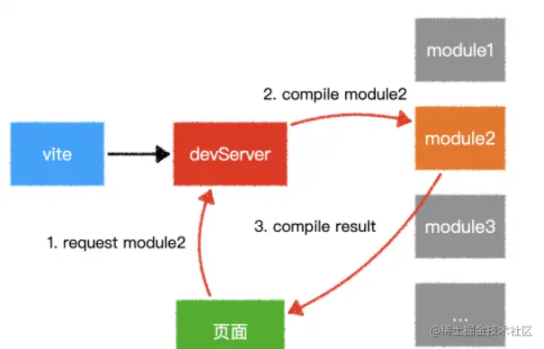

## 一、webpack

### 1. 为什么需要打包工具?

开发时，我们会使用框架 (React、Vue) ，ES6 模块化语法，Less/Sass 等 CSS 预处理器等语法进行开发，这样的代码要想在浏览器运行必须经过编译成浏览器能识别的 JS、CSS语法才能运行。所以我们需要打包工具帮我们做完这些事。除此之外，打包还能压缩代码、做兼容性处理、提升代码性能等。

### 2. 有哪些打包构建工具？



### 3. 说说你对 webpack 的理解？

webpack 是一个静态模块的打包工具。它会在内部从一个或多个入口点构建一个依赖图，然后将项目中所需的每一个模块组合成一个或多个 bundles 进行输出，它们均为静态资源。输出的文件已经编译好了，可以在浏览器运行。 webpack 具有打包压缩、编译兼容、能力扩展等功能。其最初的目标是实现前端项目的模块化，也就是如何更高效地管理和维护项目中的每一个资源。 

webpack 有五大核心概念：

- 入口(entry)
- 输出(output)
- 解析器（loader）
- 插件(plugin)
- 模式(mode)

### 4. 你知道webpack的作用是什么吗？

- 模块打包。可以将不同模块的文件打包整合在一起，并保证它们之间的引用正确，执行有序。
- 编译兼容。通过 webpack 的 Loader 机制，可以编译转换诸如 .less, .vue, .jsx 这类在浏览器无法识别的文件，让我们在开发的时候可以使用新特性和新语法，提高开发效率。
- 能力扩展。通过 webpack 的 Plugin 机制，可以进一步实现诸如按需加载，代码压缩等功能，帮助我们提高工程效率以及打包输出的质量。

### 5. Loader 是什么？

其作用是让 Webpack 能够去处理那些非 JavaScript 文件。由于 Webpack 自身只理解 JavaScript、JSON ，其他类型/后缀的文件都需要经过 loader 处理，并将它们转换为有效模块。loader 可以是同步的，也可以是异步的；而且支持链式调用，链中的每个 loader 会处理之前已处理过的资源。

在加载模块的时候，执行顺序如下：



当 `webpack` 碰到不识别的模块时， 就会在配置中查找该文件的解析规则

在 webpack 的配置中，**loader** 有两个属性：

1. test：识别出哪些文件会被转换
2. use：定义在进行转换时，应该使用哪个 loader

```js
const path = require('path');

module.exports = {
  output: {
    filename: 'my-first-webpack.bundle.js',
  },
  module: {
    rules: [{ test: /.txt$/, use: 'raw-loader' }],
  },
};
```

当配置多个 loader 的时候，从右到左（从下到上）执行

```css
module.exports = {
  module: {
    rules: [
      {
        test: /.css$/,
        use: [
          { loader: 'style-loader' },
          {
            loader: 'css-loader',
            options: {
              modules: true
            }
          },
          { loader: 'sass-loader' }
        ]
      }
    ]
  }
};
```

### 6. 有哪些常见的Loader？

```js
babel-loader：使用Babel加载ES2015+ 代码并将其转换为ES5

ts-loader: 将TypeScript转换成JavaScript

sass-loader：将SCSS/SASS代码转换成CSS

style-loader：将模块导出的内容作为样式添加到DOM中

css-loader：加载CSS文件并解析import的CSS文件

less-loader：将Less编译为CSS

node-loader：处理Node.js插件

source-map-loader：加载额外的Source Map文件，以方便断点调试
```

### 7. Plugin 是什么？

loader 用于转换某些类型的模块，而插件则可以用于执行范围更广的任务：打包优化，资源管理，注入环境变量。plugin 会运行在 webpack 的不同阶段，贯穿整个编译周期，目的在于解决 loader 无法实现的其他事。



配置方式：

```js
const HtmlWebpackPlugin = require('html-webpack-plugin');
const webpack = require('webpack'); // 访问内置的插件
const path = require('path');

module.exports = {
  entry: './path/to/my/entry/file.js',
  output: {
    filename: 'my-first-webpack.bundle.js',
    path: path.resolve(__dirname, 'dist'),
  },
  module: {
    rules: [
      {
        test: /.(js|jsx)$/,
        use: 'babel-loader',
      },
    ],
  },
  plugins: [
    new webpack.ProgressPlugin(),
    new HtmlWebpackPlugin({ template: './src/index.html' }),
  ],
};
```

其本质是一个具有`apply`方法`javascript`对象， apply 方法会被 webpack compiler 调用，并且在整个编译生命周期都可以访问 compiler 对象。

```javascript
const pluginName = 'ConsoleLogOnBuildWebpackPlugin';

class ConsoleLogOnBuildWebpackPlugin {
  apply(compiler) {
    compiler.hooks.run.tap(pluginName, (compilation) => {
      console.log('webpack 构建过程开始！');
    });
  }
}

module.exports = ConsoleLogOnBuildWebpackPlugin;
```

### 8. 有哪些常见的Plugin？

```js
clean-webpack-plugin: 用于在打包前清理上一次项目生成的bundle文件

mini-css-extract-plugin: 分离样式文件，CSS提取为独立文件

webpack-bundle-analyzer: 可视化Webpack输出文件的体积 

speed-measure-webpack-plugin: 可以看到每个Loader和Plugin执行耗时

optimize-css-assets-webpack-plugin：压缩css文件

css-minimizer-webpack-plugin：压缩css文件（用于 webpack 5）

uglifyjs-webpack-plugin：压缩js文件

compression-webpack-plugin：启用gzip压缩

html-webpack-plugin：自动生成一个html文件，并且引用bundle.js文件

terser-webpack-plugin: 可以压缩和去重 js 代码(Webpack4)
```

### 9. 说一说Loader和Plugin的区别？

**回顾概念：**

- loader 能够让 Webpack 能够去处理那些非 JavaScript 文件，因为 Webpack 自身只能理解 JavaScript、JSON ，其他类型/后缀的文件都需要经过 loader 处理，并将它们转换为有效模块。
- plugin 赋予了 webpack 各种灵活的功能例如打包优化、资源管理、环境变量注入等，目的是解决 loader 无法实现的其他事。

**区别一：**

- loader 运行在打包文件之前
- plugins 在整个编译周期都起作用

**区别二：**

- loader 在 module.rules 中配置，类型为数组。每一项都是 Object，包含了 test、use 等属性
- Plugin 在 plugins 中单独配置，类型为数组，每一项是一个 Plugin 实例，参数都通过构造函数传入

**区别三：**

- 在 Webpack 运行的生命周期中会广播出许多事件，Plugin 可以监听这些事件，在合适的时机通过Webpack 提供的 API 改变输出结果
- 对于 loader，实质是一个转换器，将A文件进行编译形成B文件，操作的是文件，比如将 A.scss 转变为 B.css ，单纯的文件转换过程

### 10. 是否写过Loader？简述下思路？

首先需要了解 loader 的本质：其本质为函数，函数中的 this 作为上下文会被 webpack 填充，因此我们不能将 loader 设为一个箭头函数。函数接受一个参数，为 webpack 传递给 loader 的文件源内容。函数中 this 是由 webpack 提供的对象，能够获取当前 loader 所需要的各种信息

函数中有异步操作或同步操作，异步操作通过 this.callback 返回，返回值要求为 string 或者 Buffer。

代码如下所示：

```javascript
// 导出一个函数，source为webpack传递给loader的文件源内容
module.exports = function(source) {
    const content = doSomeThing2JsString(source);
    
    // 如果 loader 配置了 options 对象，那么this.query将指向 options
    const options = this.query;
    
    // 可以用作解析其他模块路径的上下文
    console.log('this.context');
    
    /*
     * this.callback 参数：
     * error：Error | null，当 loader 出错时向外抛出一个 error
     * content：String | Buffer，经过 loader 编译后需要导出的内容
     * sourceMap：为方便调试生成的编译后内容的 source map
     * ast：本次编译生成的 AST 静态语法树，之后执行的 loader 可以直接使用这个 AST，进而省去重复生成 AST 的过程
     */
    this.callback(null, content); // 异步
    return content; // 同步
}
```

一般在编写 loader 的过程中，保持功能单一，避免做多种功能。如 less 文件转换成 css 文件也不是一步到位，而是 less-loader 、 css-loader 、 style-loader 几个 loader 的链式调用才能完成转换。

### 11. 是否写过Plugin？简述下思路？

由于`webpack`基于发布订阅模式，在运行的生命周期中会广播出许多事件，插件通过监听这些事件，就可以在特定的阶段执行自己的插件任务

webpack 编译会创建两个核心对象：

- compiler：包含了 webpack 环境的所有的配置信息，包括 options，loader 和 plugin，和 webpack 整个生命周期相关的钩子
- compilation：作为 plugin 内置事件回调函数的参数，包含了当前的模块资源、编译生成资源、变化的文件以及被跟踪依赖的状态信息。当检测到一个文件变化，一次新的 Compilation 将被创建

```arduino
class MyPlugin {
    // Webpack 会调用 MyPlugin 实例的 apply 方法给插件实例传入 compiler 对象
  apply (compiler) {
    // 找到合适的事件钩子，实现自己的插件功能
    compiler.hooks.emit.tap('MyPlugin', compilation => {
        // compilation: 当前打包构建流程的上下文
        console.log(compilation);
        
        // do something...
    })
  }
}
```

在 `emit` 事件发生时，代表源文件的转换和组装已经完成，可以读取到最终将输出的资源、代码块、模块及其依赖，并且可以修改输出资源的内容

### 12. 使用webpack开发时，你用过哪些可以提高效率的插件？

- webpack-dashboard：可以更友好的展示相关打包信息
- webpack-merge：提取公共配置，减少重复配置代码
- speed-measure-webpack-plugin：简称 SMP，分析出 Webpack 打包过程中 Loader 和 Plugin 的耗时，有助于找到构建过程中的性能瓶颈
- size-plugin：监控资源体积变化，尽早发现问题
- HotModuleReplacementPlugin：模块热替换

### 13. source map 是什么？

`sourceMap`是一项将编译、打包、压缩后的代码映射回源代码的技术，由于打包压缩后的代码并没有阅读性可言，一旦在开发中报错或者遇到问题，直接在混淆代码中 debug 会带来非常糟糕的体验， sourceMap 可以帮助我们快速定位到源代码的位置，提高我们的开发效率。

既然是一种源码的映射，那必然就需要有一份映射的文件，来标记混淆代码里对应的源码的位置，通常这份映射文件以`.map`结尾，里边的数据结构大概长这样：

```json
{
  "version" : 3,                          // Source Map版本
  "file": "out.js",                       // 输出文件（可选）
  "sourceRoot": "",                       // 源文件根目录（可选）
  "sources": ["foo.js", "bar.js"],        // 源文件列表
  "sourcesContent": [null, null],         // 源内容列表（可选，和源文件列表顺序一致）
  "names": ["src", "maps", "are", "fun"], // mappings使用的符号名称列表
  "mappings": "A,AAAB;;ABCDE;"            // 带有编码映射数据的字符串
}
```

有了这份映射文件，我们只需要在压缩代码的最末端加上这句注释，即可让 sourceMap 生效：

```ruby
//# sourceURL=/path/to/file.js.map
```

有了这段注释后，浏览器就会通过`sourceURL`去获取这份映射文件，通过解释器解析后，实现源码和混淆代码之间的映射。因此 sourceMap 其实也是一项需要浏览器支持的技术。

如果我们仔细查看 webpack 打包出来的 bundle 文件，就可以发现在默认的`development`开发模式下，每个`_webpack_modules__`文件模块的代码最末端，都会加上`//# sourceURL=webpack://file-path?`，从而实现对 sourceMap 的支持。

### 14. 文件监听原理呢？

在发现源码变化时，自动重新构建出新的输出文件。

Webpack开启监听模式，有两种方式：

- 启动 webpack 命令时，带上 --watch 参数
- 在配置 webpack.config.js 中设置 watch:true

缺点：每次需要手动刷新浏览器

原理：轮询判断文件的最后编辑时间是否变化，如果某个文件发生了变化，并不会立刻告诉监听者，而是先缓存起来，等  aggregateTimeout 后再执行。

```javascript
module.export = {    
    // 默认false,也就是不开启    
    watch: true,    
    // 只有开启监听模式时，watchOptions才有意义    
    watchOptions: {        
        // 默认为空，不监听的文件或者文件夹，支持正则匹配        
        ignored: /node_modules/,        
        // 监听到变化发生后会等300ms再去执行，默认300ms        
        aggregateTimeout:300,        
        // 判断文件是否发生变化是通过不停询问系统指定文件有没有变化实现的，默认每秒问1000次 
        poll:1000    
    }
}
```

### 15. 说一下 Webpack 的热更新原理吧

Webpack 的热更新又称热替换（Hot Module Replacement），缩写为 `HMR`。,这个机制可以做到不用刷新浏览器而将新变更的模块替换掉旧的模块。

例如，我们在应用运行过程中修改了某个模块，通过自动刷新会导致整个应用的整体刷新，那页面中的状态信息都会丢失。如果使用的是 `HMR`，就可以实现只将修改的模块实时替换至应用中，不必完全刷新整个应用。

在 webpack 中配置开启热模块也非常的简单，如下代码：

```java
const webpack = require('webpack')
module.exports = {
  // ...
  devServer: {
    // 开启 HMR 特性
    hot: true
    // hotOnly: true
  }
}
```

通过上述这种配置，如果我们修改并保存`css`文件，确实能够以不刷新的形式更新到页面中。但是，当我们修改并保存`js`文件之后，页面依旧自动刷新了，这里并没有触发热模块。所以，`HMR`并不像 `Webpack` 的其他特性一样可以开箱即用，需要有一些额外的操作，我们需要去指定哪些模块发生更新时进行`HRM`。

```javascript
if(module.hot){
    module.hot.accept('./util.js',()=>{
        console.log("util.js更新了")
    })
}
```

HMR的核心就是客户端从服务端拉去更新后的文件，准确的说是 chunk diff (chunk 需要更新的部分)，实际上 WDS 与浏览器之间维护了一个 `Websocket`，当本地资源发生变化时，WDS 会向浏览器推送更新，并带上构建时的 hash，让客户端与上一次资源进行对比。客户端对比出差异后会向 WDS 发起 `Ajax` 请求来获取更改内容(文件列表、hash)，这样客户端就可以再借助这些信息继续向 WDS 发起 `jsonp` 请求获取该chunk的增量更新。

后续的部分(拿到增量更新之后如何处理？哪些状态该保留？哪些又需要更新？)由 HotModulePlugin 来完成，提供了相关 API 以供开发者针对自身场景进行处理。

### 16. 说说webpack proxy工作原理？为什么能解决跨域?

**（1）是什么？**： webpack 提供的代理服务，基本行为就是接收客户端发送的请求后转发给其他服务器 ，其目的是为了便于开发者在开发模式下解决跨域问题（浏览器安全策略限制）

想要实现代理首先需要一个中间服务器， webpack 中提供服务器的工具为 webpack-dev-server，是 webpack 官方推出的一款开发工具，将自动编译和自动刷新浏览器等一系列对开发友好的功能全部集成在了一起，目的是为了提高开发者日常的开发效率，只适用在**开发阶段**

关于配置方面，在`webpack`配置对象属性中通过`devServer`属性提供，如下：

```js
module.exports = {
    // ...
    devServer: {
        contentBase: path.join(__dirname, 'dist'),
        compress: true,
        port: 9000,
        proxy: {
            '/api': {
                target: 'https://api.github.com'
            }
        }
        // ...
    }
}
```

属性的名称是需要被代理的请求路径前缀，一般为了辨别都会设置前缀为`/api`，值为对应的代理匹配规则，对应如下：

- target：表示的是代理到的目标地址
- pathRewrite：重写路径，默认情况下，我们的 /apiy 也会被写入到URL中，如果希望删除，可以使用 pathRewrite: { '^/api': '' }
- secure：默认情况下不接收转发到 https 的服务器上，如果希望支持，可以设置为 false
- changeOrigin：它表示是否更新代理后请求的 headers 中 host 地址

**（2）工作原理**：是利用 http-proxy-middleware 这个 http 代理中间件，实现请求转发给其他服务器。

举个例子：

在开发阶段，本地地址为`http://localhost:3000`，该浏览器发送一个前缀带有 /api 标识的请求到服务端获取数据，但响应这个请求的服务器只是将请求转发到另一台服务器中。

```php
const express = require('express');
const proxy = require('http-proxy-middleware');

const app = express();

app.use('/api', proxy({target: 'http://www.example.org', changeOrigin: true}));
app.listen(3000);

// http://localhost:3000/api/foo/bar -> http://www.example.org/api/foo/bar
```

**（3）跨域**：在开发阶段， `webpack-dev-server` 会启动一个本地开发服务器，所以我们的应用在开发阶段是独立运行在 localhost 的一个端口上，而后端服务又是运行在另外一个地址上，所以在开发阶段中，由于浏览器同源策略的原因，当本地访问后端就会出现跨域请求的问题。

通过设置 webpack proxy 实现代理请求后，相当于浏览器与服务端中添加一个代理者。当本地发送请求的时候，代理服务器响应该请求，并将请求转发到目标服务器，目标服务器响应数据后再将数据返回给代理服务器，最终再由代理服务器将数据响应给本地。


在代理服务器传递数据给本地浏览器的过程中，两者同源，并不存在跨域行为，这时候浏览器就能正常接收数据。注意：服务器与服务器之间请求数据并不会存在跨域行为，跨域行为是浏览器安全策略限制

### 17. 如何对bundle体积进行监控和分析？

VSCode 中有一个插件 Import Cost 可以帮助我们对引入模块的大小进行实时监测，还可以使用 `webpack-bundle-analyzer` 生成 bundle 的模块组成图，显示所占体积。

### 18. 文件指纹是什么？怎么用？

文件指纹是打包后输出的文件名的后缀。

- `Hash`：和整个项目的构建相关，只要项目文件有修改，整个项目构建的 hash 值就会更改
- `Chunkhash`：和 Webpack 打包的 chunk 有关，不同的 entry 会生出不同的 chunkhash
- `Contenthash`：根据文件内容来定义 hash，文件内容不变，则 contenthash 不变

**（1）JS的文件指纹设置**

设置 output 的 filename，用 chunkhash。

```css
module.exports = {    
    entry: {        
        app: './scr/app.js',        
        search: './src/search.js'    
    },    
    output: {        
        filename: '[name][chunkhash:8].js',        
        path:__dirname + '/dist'    
    }
}
```

**（2）CSS的文件指纹设置**

设置 MiniCssExtractPlugin 的 filename，使用 contenthash。

```css
module.exports = {    
    entry: {        
        app: './scr/app.js',        
        search: './src/search.js'    
    },    
    output: {        
        filename: '[name][chunkhash:8].js',        
        path:__dirname + '/dist'    
    },    
    plugins:[        
        new MiniCssExtractPlugin({            
            filename: `[name][contenthash:8].css`        
        })    
    ]
}
```

### 19. 在实际工程中，配置文件上百行乃是常事，如何保证各个loader按照预想方式工作？

可以使用 `enforce` 强制执行 loader 的作用顺序， pre 代表在所有正常 loader 之前执行， post 是所有 loader 之后执行。(inline 官方不推荐使用)

### 20. 说说webpack的构建流程?

- 初始化参数：从配置文件和 Shell 语句中读取与合并参数，得出最终的参数
- 开始编译：用上一步得到的参数初始化 Compiler 对象，加载所有配置的插件，执行对象的 run 方法开始执行编译
- 确定入口：根据配置中的 entry 找出所有的入口文件
- 编译模块：从入口文件出发，调用所有配置的 Loader 对模块进行翻译，再找出该模块依赖的模块，再递归本步骤直到所有入口依赖的文件都经过了本步骤的处理
- 完成模块编译：在经过第4步使用 Loader 翻译完所有模块后，得到了每个模块被翻译后的最终内容以及它们之间的依赖关系
- 输出资源：根据入口和模块之间的依赖关系，组装成一个个包含多个模块的 Chunk，再把每个 Chunk 转换成一个单独的文件加入到输出列表
- 输出完成：在确定好输出内容后，根据配置确定输出的路径和文件名，把文件内容写入到文件系统

### 21. SCSS文件在webpack中的编译打包过程是怎么样的？

1. 加载scss：sass-loader在js文件中根据模块化规则找到scss文件
2. 编译scss：sass编译器将scss编译为css
3. css-loader解析：根据css-loader对css文件进行加载并解析其中的@import和url()
4. style-loader工作：将css样式插入html文件中

### 22. npm run dev的时候webpack做了什么事情

执行 npm run dev 时候最先执行的 build/dev-server.js 文件，该文件主要完成下面几件事情：

1、检查node和npm的版本、引入相关插件和配置

2、webpack对源码进行编译打包并返回compiler对象

3、创建express服务器

4、配置开发中间件（webpack-dev-middleware）和热重载中间件（webpack-hot-middleware）

5、挂载代理服务和中间件

6、配置静态资源

7、启动服务器监听特定端口（8080）

8、自动打开浏览器并打开特定网址（localhost:8080）

### 23. webpack 如何分包

### 24. webpack打包原理（机制）

## 二、Vite

### 1. 如何指定 vite 插件 的执行顺序？

可以使用 `enforce` 修饰符来强制插件的位置:

- pre：在 Vite 核心插件之前调用该插件
- post：在 Vite 构建插件之后调用该插件

### 2. Vite是否支持 commonjs 写法？

纯业务代码，一般建议采用 ESM 写法。如果引入的三方组件或者三方库采用了 CJS 写法，vite 在预构建的时候就会将 CJS 模块转化为 `ESM` 模块。

### 3. 为什么说 vite 比 webpack 要快

1. `vite` 不需要做全量的打包
2. `vite` 在解析模块依赖关系时，利用了 `esbuild`，更快（esbuild 使用 Go 编写，并且比以 JavaScript 编写的打包器预构建依赖快 10-100 倍）
3. `按需加载`：在HMR（热更新）方面，当改动了一个模块后，vite 仅需让浏览器重新请求该模块即可，不像 webpack 那样需要把该模块的相关依赖模块全部编译一次，效率更高。
4. 由于现代浏览器本身就支持 `ES Module`，会自动向依赖的Module发出请求。vite充分利用这一点，将开发环境下的模块文件，就作为浏览器要执行的文件，而不是像 webpack 那样进行打包合并。
5. `按需编译`：当浏览器请求某个模块时，再根据需要对模块内容进行编译，这种按需动态编译的方式，极大的缩减了编译时间。
6. webpack 是先打包再启动开发服务器，vite 是直接启动开发服务器，然后按需编译依赖文件。由于 vite在启动的时候`不需要打包`，也就意味着不需要分析模块的依赖、不需要编译，因此启动速度非常快。

### 4. vite 对比 webpack ，优缺点在哪？

`（1）优点`：

1. **更快的冷启动**： Vite 借助了浏览器对 ESM 规范的支持，采取了与 Webpack 完全不同的 unbundle 机制
2. **更快的热更新**： Vite 采用 unbundle 机制，所以 dev server 在监听到文件发生变化以后，只需要通过 ws 连接通知浏览器去重新加载变化的文件，剩下的工作就交给浏览器去做了。

`（2）缺点`：

1. **开发环境下首屏加载变慢**：由于 unbundle 机制， Vite 首屏期间需要额外做其它工作。不过首屏性能差只发生在 dev server 启动以后第一次加载页面时发生。之后再 reload 页面时，首屏性能会好很多。原因是 dev server 会将之前已经完成转换的内容缓存起来
2. **开发环境下懒加载变慢**：由于 unbundle 机制，动态加载的文件，需要做 resolve 、 load 、 transform 、 parse 操作，并且还有大量的 http 请求，导致懒加载性能也受到影响。
3. **webpack支持的更广**：由于 Vite 基于ES Module，所以代码中不可以使用CommonJs；webpack更多的关注兼容性, 而 Vite 关注浏览器端的开发体验。

> 当需要打包到生产环境时，`Vite`使用传统的rollup进行打包，所以，vite的优势是体现在开发阶段，缺点也只是在开发阶段存在。

### 5. Vite和webpack的区别

Vite 和 Webpack 都是现代化的前端构建工具，它们可以帮助开发者优化前端项目的构建和性能。虽然它们的目标是相似的，但它们在设计和实现方面有许多不同之处。

两者原理图： 



区别如下：

**（1）构建原理：** Webpack 是一个静态模块打包器，通过对项目中的 JavaScript、CSS、图片等文件进行分析，生成对应的静态资源，并且可以通过一些插件和加载器来实现各种功能；Vite 则是一种基于浏览器原生 ES 模块解析的构建工具。

**（2）打包速度：** Webpack 的打包速度相对较慢，Vite 的打包速度非常快。

**（3）配置难度：** Webpack 的配置比较复杂，因为它需要通过各种插件和加载器来实现各种功能；Vite 的配置相对简单，它可以根据不同的开发场景自动配置相应的环境变量和配置选项。

**（4）插件和加载器：** Webpack 有大量的插件和加载器可以使用，可以实现各种复杂的构建场景，例如代码分割、按需加载、CSS 预处理器等；Vite 的插件和加载器相对较少

**（5）Vite是按需加载，webpack是全部加载：** 在HMR（热更新）方面，当改动了一个模块后，vite仅需让浏览器重新请求该模块即可，不像webpack那样需要把该模块的相关依赖模块全部编译一次，效率更高。

**（6）webpack是先打包再启动开发服务器，vite是直接启动开发服务器，然后按需编译依赖文件** 由于vite在启动的时候不需要打包，也就意味着不需要分析模块的依赖、不需要编译，因此启动速度非常快。当浏览器请求某个模块时，再根据需要对模块内容进行编译，这种按需动态编译的方式，极大的缩减了编译时间。

### 6. Vite 常见的配置

**（1）css.preprocessorOptions：** 传递给 CSS 预处理器的配置选项，例如，我们可以定义一个全局变量文件，然后再引入这个文件：

```ruby
// src/assets/styles/variables.scss
$injectedColor: orange;
$injectedFontSize: 16px;
php

 代码解读
复制代码// vite.config.js
import { defineConfig } from 'vite'

export default defineConfig({
  css: {
    preprocessorOptions: {
      scss: {
        additionalData: `@import '/src/assets/styles/variables.scss';` // 引入全局变量文件
      }
    }
  }
})
```

**（2）css.postcss：** PostCSS 也是用来处理 CSS 的，只不过它更像是一个工具箱，可以添加各种插件来处理 CSS（解决浏览器样式兼容问题、浏览器适配等问题）。例如：移动端使用 postcss-px-to-viewport 对不同设备进行布局适配：

```javascript
// vite.config.js
import { defineConfig } from 'vite'
import postcssPxToViewport from 'postcss-px-to-viewport'

export default defineConfig({
  css: {
    postcss: {
      plugins: [
        // viewport 布局适配
        postcssPxToViewport({
          viewportWidth: 375
        })
      ]
    }
  }
})
```

这样我们书写的 px 单位就会转为 vw 或 vh ，很轻松地解决了适配问题

**（3）resolve.alias：** 定义路径别名也是我们常用的一个功能，我们通常会给 scr 定义一个路径别名：

```javascript
// vite.config.js
import { defineConfig } from 'vite'
import path from 'path'

export default defineConfig({
  resolve: {
    alias: {
      '@': path.resolve(__dirname, './src') // 路径别名
    }
  }
})
```

**（4）resolve.extensions：** 导入时想要省略的扩展名列表。默认值为 ['.mjs', '.js', '.ts', '.jsx', '.tsx', '.json'] 。

```javascript
// vite.config.js
import { defineConfig } from 'vite'
import path from 'path'

export default defineConfig({
  resolve: {
    extensions: ['.js', '.ts', '.json'] // 导入时想要省略的扩展名列表
  }
})
```

**（5）optimizeDeps.force：** 是否开启强制依赖预构建。node_modules 中的依赖模块构建过一次就会缓存在 node_modules/.vite/deps 文件夹下，下一次会直接使用缓存的文件。而有时候我们想要修改依赖模块的代码，做一些测试或者打个补丁，这时候就要用到强制依赖预构建。

```javascript
// vite.config.js
import { defineConfig } from 'vite'

export default defineConfig({
  optimizeDeps: {
    force: true // 强制进行依赖预构建
  },
})
```

**（6）server.host：** 指定服务器监听哪个 IP 地址。默认值为 localhost ，只会监听本地的 127.0.0.1。

```javascript
// vite.config.js
import { defineConfig } from 'vite'

export default defineConfig({
  server: {
    host: true // 监听所有地址
  }
})
```

**（7）server.proxy：** 反向代理也是我们经常会用到的一个功能，通常我们使用它来解决跨域问题：

```javascript
// vite.config.js
import { defineConfig } from 'vite'

export default defineConfig({
  server: {
    proxy: {
      '/api': {
        target: 'http://jsonplaceholder.typicode.com',
        changeOrigin: true,
        rewrite: (path) => path.replace(/^/api/, '')
      }
    }
  }
})
```

**（8）base：** 开发或生产环境服务的公共基础路径。

```javascript
// vite.config.js
import { defineConfig } from 'vite'

export default defineConfig({
  base: '/foo/' // 开发或生产环境服务的公共基础路径
})
```

**（9）build.outdir：** 指定打包文件的输出目录，默认值为 dist。

```javascript
// vite.config.js
import { defineConfig } from 'vite'

export default defineConfig({
  build: {
    outDir: 'build' // 打包文件的输出目录
  }
})
```

**（10）build.assetsDir：** 指定生成静态资源的存放目录，默认值为 assets。

```javascript
// vite.config.js
import { defineConfig } from 'vite'

export default defineConfig({
  build: {
    assetsDir: 'static' // 静态资源的存放目录
  }
})
```

**（11）build.assetsInlineLimit：** 图片转 base64 编码的阈值。为防止过多的 http 请求，Vite 会将小于此阈值的图片转为 base64 格式，可根据实际需求进行调整。

```javascript
// vite.config.js
import { defineConfig } from 'vite'

export default defineConfig({
  build: {
    assetsInlineLimit: 4096 // 图片转 base64 编码的阈值
  }
})
```

**（12）plugins：** 插件相信大家都不陌生了，我们可以使用官方插件，也可以社区插件。

```javascript
// vite.config.js
import { defineConfig } from 'vite'
import vue from '@vitejs/plugin-vue'
import { viteMockServe } from 'vite-plugin-mock'

export default defineConfig({
  plugins: [
    vue(),
    viteMockServe()
  ]
})
```


> 原文链接：https://juejin.cn/post/7207659644487893051