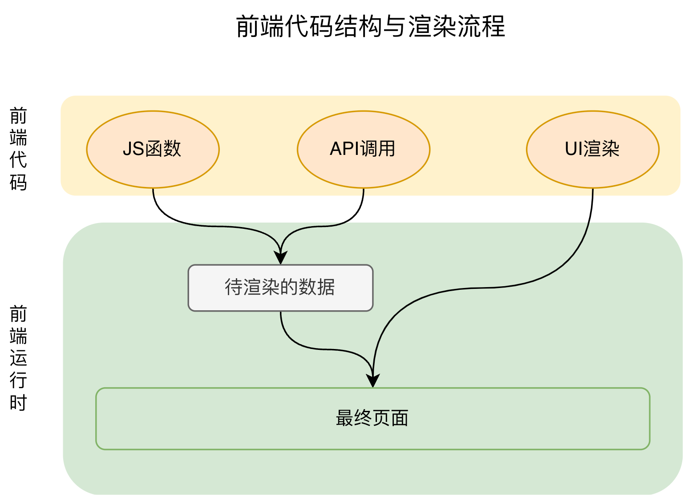
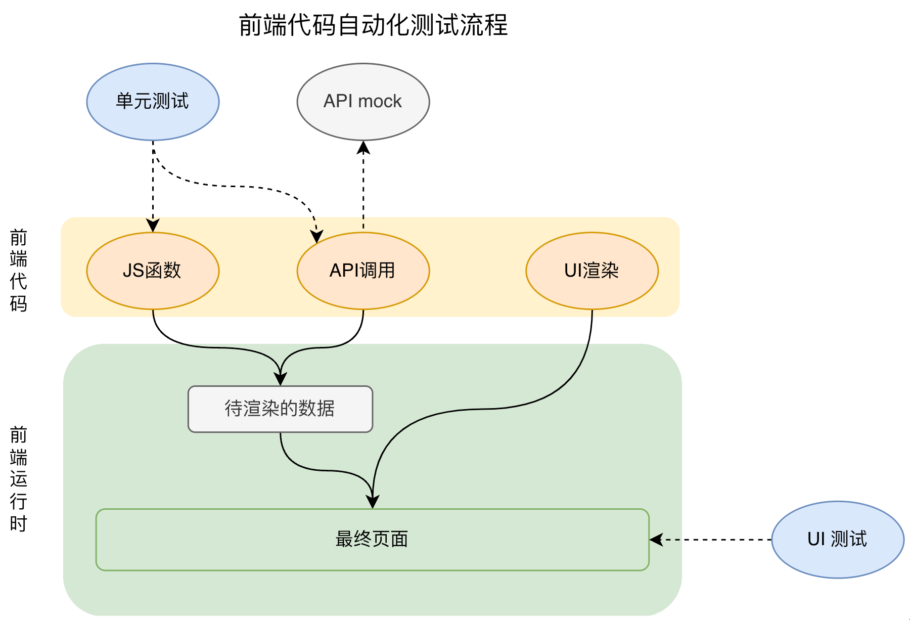

# 前端测试

自动化测试是确保前端应用质量、提高开发效率和减少人工测试成本的关键环节。在前端开发中，自动化测试通常包括以下几个层面：

### 1. 单元测试

单元测试是测试代码中最小的单元，例如函数或组件。这种测试主要用来确保这些单元能按预期工作。

- **工具**：常用的单元测试工具包括 Jest、Mocha、Chai 和 Jasmine。Jest 是目前非常流行的一个选择，因为它集成了断言库和模拟库，且配置简单。
- **实践**：在单元测试中，你应该关注如何隔离测试单元，避免外部依赖影响测试结果。使用mocks和spies来模拟外部调用或复杂的逻辑。

### 2. 集成测试

集成测试关注的是多个组件或模块如何一起工作。这种测试检查的是组件间的接口是否正常。

- **工具**：Jest 和 Mocha 也可以用于集成测试。另外，你可以使用如 Sinon.js 来模拟数据库调用、HTTP请求等。
- **实践**：在集成测试中，重要的是确保模块间的交互按预期进行。这通常涉及到数据库操作和网络请求的模拟。

### 3. 端到端测试（E2E测试）

端到端测试模拟用户行为以测试整个应用的流程，从用户界面到数据库，再到后端服务，确保所有部分协同工作。

- **工具**：常用的E2E测试工具有 Cypress 、 Selenium和Playwright。Playwright 是近年来非常受欢迎的工具，因为它易于设置，执行速度快，且提供了丰富的API和优秀的调试支持。
- **实践**：E2E测试应该覆盖用户的主要使用场景，确保应用的关键功能都能正常工作。这些测试通常比较耗时，因此应该选择关键路径进行测试。

### 4. 性能测试

性能测试是检查应用在高负载或不同条件下的表现。这对于前端来说，可能涉及到页面加载时间、响应时间等。

- **工具**：Lighthouse、WebPageTest 和 Google PageSpeed Insights 是常用的性能测试工具。
- **实践**：定期运行性能测试，并与历史数据比较，确保新的代码更改没有引入性能问题。

### 5. 可视回归测试

可视回归测试用于确保UI的视觉元素在更改后仍然按预期显示，这对于保持品牌和用户体验的一致性至关重要。

- **工具**：Percy、Applitools Eyes等。
- **实践**：在UI更改后自动捕捉屏幕快照，并与基线图像进行比较，检测差异。

### 自动化测试的最佳实践

- **持续集成**：将自动化测试集成到CI/CD流程中，确保每次代码提交都自动运行测试。
- **测试覆盖率**：监控测试覆盖率，确保重要的代码路径都被测试到。
- **测试数据管理**：使用合适的策略管理测试数据，确保测试的一致性和可重复性。
- **定期审查和维护测试**：随着应用的发展，定期审查和更新测试用例，确保它们仍然有效和相关。

通过这些工具和实践，你可以建立一个强大的前端自动化测试框架，帮助你提高代码质量，减少bug，加快开发周期。

## 前端代码结构渲染流程

前端项目目前主要以react开发框架为主，下图以react代码进行分析

前端代码主要有三部分：JS 函数、API调用、UI渲染。同时也是需要测试的三部分代码

## 前端自动化测试的方式

### 各部分代码与它的自动化测试方式

- JS函数： 采用单元测试
- API调用：先 mock API，然后采用单元测试
- UI渲染：  在 JS函数 和 API调用测试正常之后，再采用 UI测试（UI渲染依赖有效的数据）

## 自动化测试工具调研

### 单元测试工具调研

主流单元测试工具比较

| 工具    | 断言                 | 仿真                 | 快照                 | 异步测试             | 稳定性 | 难度 |
| :------ | :------------------- | :------------------- | :------------------- | :------------------- | :----- | :--- |
| Mocha   | 默认不支持，可配置   | 默认不支持，可配置   | 默认不支持，可配置   | 友好                 | 稳定   | 中   |
| Ava     | 默认支持             | 不支持，需第三方配置 | 默认支持             | 友好                 | 不稳定 | 低   |
| Jasmine | 默认支持             | 默认支持             | 默认支持             | 不友好               | 稳定   | 中   |
| Jest    | 默认支持             | 默认支持             | 默认支持             | 友好                 | 稳定   | 低   |
| Karma   | 不支持，需第三方配置 | 不支持，需第三方配置 | 不支持，需第三方配置 | 不支持，需第三方配置 | 稳定   | 高   |

#### 结论

单元测试使用Jest。

tips：Jest由Facebook团队维护， 被各种 React 应用推荐和使用，生态稳定，技术友好。

### UI测试工具调研

主流UI工具比较

| 工具       | 用例支持语言                         | 等待方式 | 支持的浏览器                    | 使用复杂度         | 文档     | 难度 | UI组件测试 | 浏览器多TAB | 近两年流行度 |
| :--------- | :----------------------------------- | :------- | :------------------------------ | :----------------- | :------- | :--- | :--------- | :---------- | :----------- |
| Selenium   | Java、Python、Ruby                   | 阻塞等待 | IE、Firefox、Chrome             | 复杂，需要一堆配置 | 一般     | 难   | 不支持     | 支持        | 低           |
| Puppeteer  | JavaScript                           | 异步     | Chrome、Edge、Electron、Firefox | 一般               | 友好     | 低   | 不支持     | 支持        | 高           |
| Cypress    | JavaScript                           | 异步     | Chrome                          | 简单               | 非常友好 | 低   | 支持       | 不支持      | 高           |
| Playwright | JavaScript、TypeScript、Java、Python | 异步     | Chrome、Edge、Electron、Firefox | 简单               | 非常友好 | 低   | 支持       | 支持        | 高           |

#### 结论

UI测试使用Playwright。

tips：Playwright有详细的文档说明和视频指导，并且上手难度低。

### API mock

由前端自己生成，还是后端直接提供？

### 引入自动化测试的优缺点

- 优点：每次迭代都可以进行全局自动化测试，防止小改动引发的未知牵连，确保代码整体稳定。
- 缺点：开发或修改需求时，前端开发除了要实现业务需求，还需要写 单元测试代码和UI测试代码，工作量将增大(至少2倍)

## e2e测试

### E2E 测试框架选型

目前当前主流的前端 E2E 测试框架主要有：Playwright、Puppeteer、Cypress 和 Selenium，其中 Playwright 是 Puppeteer 进阶版，除了支持更多的编程语言和兼容更多的浏览器之外，还提供了其他更强大的功能。而 Selenium 的运行速度慢，对版本配置要求严苛。现对比`Playwright `和` Cypress`

| 对比项                | PlayWright                                                   | Cypress                                                      |
| --------------------- | ------------------------------------------------------------ | ------------------------------------------------------------ |
| 支持的浏览器          | 支持在 Chromium、WebKit 和 Firefox 浏览器以及 Google Chrome 和 Microsoft Edge 等浏览器 | 主要支持 Chrome 系列浏览器                                   |
| 跨平台支持            | 支持多平台包括Windows、Mac和Linux                            | 支持多平台包括Windows、Mac和Linux                            |
| 是否能生成测试报告    | 支持生成测试报告                                             | 支持                                                         |
| 是否支持并发执行      | 支持并发执行，可以加快整体的测试速度                         | 不支持多个浏览器实例的并发执行                               |
| 是否支持多个浏览器TAB | 支持多TAB页测试                                              | 不支持多TAB页面测试                                          |
| 编写测试脚本的语言    | Playwright使用JavaScript、TypeScript、Java和Python编写测试脚本 | Cypress只支持JavaScript、TypeScript                          |
| 辅助生成用例代码      | Playwright支持模拟用户与网站或应用程序的交互过程，包括键盘输入和鼠标点击等，生成用例代码 | Cypress也支持                                                |
| 调试工具              | 自带调试工具                                                 | 自带调试工具                                                 |
| 异步处理方式          | Playwright对异步操作提供了很好的支持，它可以等待页面加载、网络请求、定时器等操作完成后再执行后续的测试步骤 | Cypress也支持异步操作，但是在处理某些复杂的异步场景时可能需要特殊的处理。 |
| CI/CD集成             | 可以与常见的CI/CD工具集成                                    | 可以与常见的CI/CD工具进行集成                                |
| 是否支持数据模拟      | 支持数据模拟，可以模拟网络请求的响应和数据                   | 支持数据模拟的能力，可以模拟网络请求的响应和数据             |
| 代码覆盖率报告        | Playwright需要使用其他工具来获取代码覆盖率报告               | Cypress提供了内置的代码覆盖率工具，可直接生成                |
| 对前端框架的支持      | 支持React、Angular、Vue等流行前端框架的测试                  | 支持React、Angular、Vue等流行前端框架的测试                  |
| 定位元素的方式        | Playwright使用类似于CSS选择器的方式来定位元素                | Cypress则使用了一种独特的方式来定位元素，称为"cy"命令集      |
| 支持移动端测试        | Playwright提供了对移动端浏览器和应用的支持，可以进行移动端测试 | Cypress主要专注于桌面浏览器的测试，不适用于移动端（移动端事件不支持） |
| 是否支持UI模式        | 支持UI模式                                                   | 用插件可以实现UI模式                                         |

### Playwright的优势

1. 从浏览器的维度，Playwright 支持更多的浏览器， 而 Cypress 主要支持 chrome 浏览器
2. 从并发执行维度，Playwright支持并发执行测试用例，可以同时在多个浏览器实例中执行测试，测试速度和效率相对于 Cypress 更加优越。（[Puppeteer vs Selenium vs Playwright, a speed comparison](https://www.checklyhq.com/blog/puppeteer-vs-selenium-vs-playwright-speed-comparison/)）
3. 从多端维度，Playwright提供了对移动端浏览器和应用的支持，可以进行移动端测试，而 Cypress 不支持移动端的测试。

### playWright使用

1. 基本使用：https://juejin.cn/post/7289740992508215296?searchId=20250102111745D577503C76742933AFE1
2. 文档：https://playwright.dev/
3. 自动录制用例：https://playwright.dev/docs/codegen

## 参考：

https://juejin.cn/post/7123869512327233550?searchId=20250102105324D85B2D37921FF126F406#heading-39