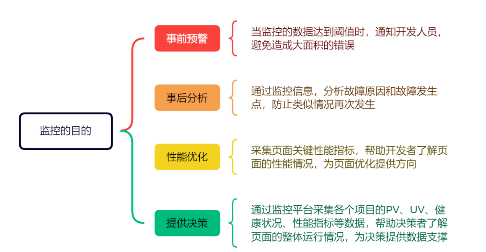
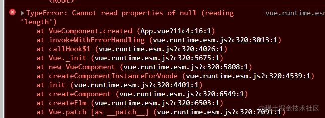
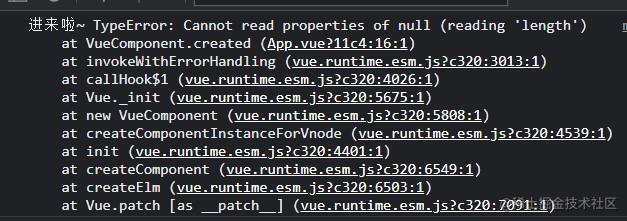
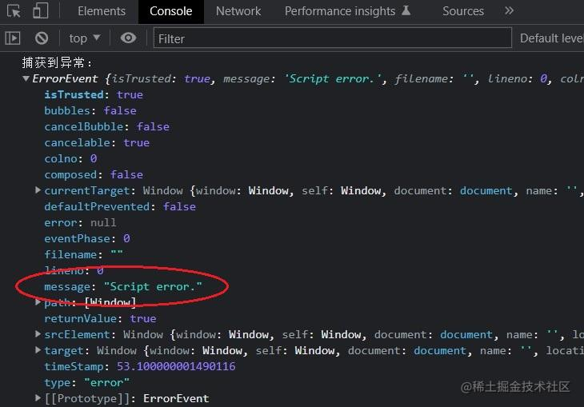
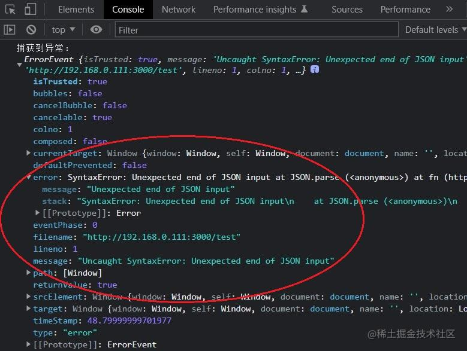
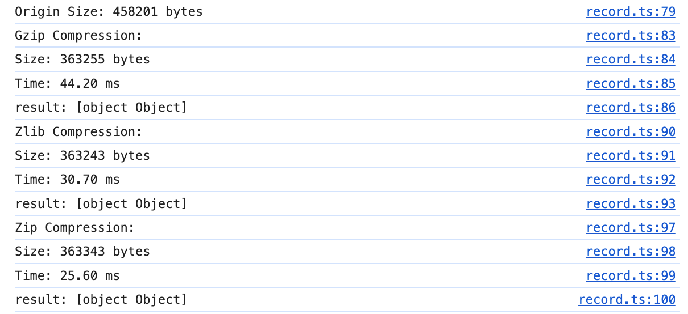

# 前端监控
## 监控的目的
没有监控的系统等于在裸奔，当我们的系统上线后我们完全没办法感知有没有出现错误，系统在各个设备上是不是都好用。
1. 系统崩溃了，或者某个功能不可用了，可是我们毫无察觉？
2. 用户反馈了一个问题，可是无法复现？
3. 发现了脏数据，可是不知道如何产生的？
4. 用户反应系统慢，又不知慢在哪里？
所以监控，是为了了解系统的状态，包括过去、现在，甚至预测未来。通过监控我们可以保证系统的可用性，易用性，同时可以帮助我们进行决策。



## 监控的核心诉求

1. 保证新版本质量，加快敏捷开发/发布
2. 线上异常及时感知
3. 了解用户行为，帮助产品功能分析决策

我们可以进行细分：

1. 保证新版本质量，加快敏捷开发/发布
   - 版本质量如何定义？e.g. 无js运行时错误，无页面明显卡顿，无行为/逻辑问题比如按钮点了没反应...
   - 发布线上后如何第一时间感知新版本的问题？e.g. puppeteer线上巡检

2. 线上异常及时感知
   - 异常如何定义？e.g. cgi 返回错误，cgi超时，静态资源加载失败...
   - 不同的异常区分告警等级？e.g. cgi错误是ERROR，耗时是 WARNING ...

3. 了解用户行为
   - 需要了解什么行为？针对特定需求/功能，比如商品的自动识别使用了多少次，准确度如何..
   - 如何了解？需要埋点按钮A点击次数，回调函数B调用次数，针对不同的调用逻辑分支加上报...
   - 了解了之后能够有什么指导意义？调整表单顺序，隐藏功能...

## 监控系统的流程
1. 监控SDK封装
2. 数据收集和上报
   - 用户基本数据采集： 用户信息 / 设备信息 / 网络信息 ...
   - 错误数据采集：js错误 / 接口错误 / vue框架错误 / react框架错误 / 资源加载错误
   - 性能数据采集：FP / LCP / CLS / long task / Google Performance / CPU / Memory
   - 白屏数据采集：抽样采集 / 骨架屏抽样采集
   - 用户行为数据：按钮点击 / 页面访问 ...
   - ...
3. 监控后台查看数据看板
   - UV,PV指标建设
   - 性能指标建设
4. 监控后台错误还原
   - sourcemap 代码还原
   - rrweb 用户录屏还原
   - 用户操作行为日志还原
   - location / request / session等还原
5. 监控告警
   - 报警规则配置（1min同一错误超过5次...）
   - 报警方式配置（电话 / 邮件 / 信息...）

## 监控SDK封装

## 错误捕获

### try/catch

只能捕获代码常规的运行时错误，语法错误和异步错误不能捕获到

示例：

```js
// 示例1：常规运行时错误，可以捕获 ✅
 try {
   let a = undefined;
   if (a.length) {
     console.log('111');
   }
 } catch (e) {
   console.log('捕获到异常：', e);
}

// 示例2：语法错误，不能捕获 ❌
try {
  const notdefined,
} catch(e) {
  console.log('捕获不到异常：', 'Uncaught SyntaxError');
}

// 示例3：异步错误，不能捕获 ❌
try {
  setTimeout(() => {
    console.log(notdefined);
  }, 0)
} catch(e) {
  console.log('捕获不到异常：', 'Uncaught ReferenceError');
}
```

### window.onerror

window.onerror 可以捕获常规错误、异步错误，但不能捕获资源错误

```js
/**
 * @param { string } message 错误信息
 * @param { string } source 发生错误的脚本URL
 * @param { number } lineno 发生错误的行号
 * @param { number } colno 发生错误的列号
 * @param { object } error Error对象
 */
window.onerror = function (message, source, lineno, colno, error) {
  console.log('捕获到的错误信息是：', message, source, lineno, colno, error);
};
```

示例：

```js
window.onerror = function(message, source, lineno, colno, error) {
  console.log("捕获到的错误信息是：", message, source, lineno, colno, error);
};

// 示例1：常规运行时错误，可以捕获 ✅
console.log(notdefined);

// 示例2：语法错误，不能捕获 ❌
const notdefined;

// 示例3：异步错误，可以捕获 ✅
setTimeout(() => {
  console.log(notdefined);
}, 0);

// 示例4：资源错误，不能捕获 ❌
let script = document.createElement("script");
script.type = "text/javascript";
script.src = "https://www.test.com/index.js";
document.body.appendChild(script);
```

### window.addEventListener

当静态资源加载失败时，会触发 error 事件， 此时 window.onerror 不能捕获到

示例：

```js
<!DOCTYPE html>
<html lang="en">
<head>
  <meta charset="UTF-8">
</head>
<script>
  window.addEventListener('error', (error) => {
    console.log('捕获到异常：', error);
  }, true)
</script>

<!-- 图片、script、css加载错误，都能被捕获 ✅ -->

<script src="https://test.cn/×××.js"></script>
<link href="https://test.cn/×××.css" rel="stylesheet" />

<script>
  // new Image错误，不能捕获 ❌
  // new Image运用的比较少，可以自己单独处理
  new Image().src = 'https://test.cn/×××.png'
</script>
</html>
```

### Promise 错误

Promise 中抛出的错误，无法被 window.onerror、try/catch、 error 事件捕获到，可通过 unhandledrejection 事件来处理

示例：

```js
try {
  new Promise((resolve, reject) => {
    JSON.parse('');
    resolve();
  });
} catch (err) {
  // try/catch 不能捕获Promise中错误 ❌
  console.error('in try catch', err);
}

// error事件 不能捕获Promise中错误 ❌
window.addEventListener(
  'error',
  (error) => {
    console.log('捕获到异常：', error);
  },
  true
);

// window.onerror 不能捕获Promise中错误 ❌
window.onerror = function (message, source, lineno, colno, error) {
  console.log('捕获到异常：', { message, source, lineno, colno, error });
};

// unhandledrejection 可以捕获Promise中的错误 ✅
window.addEventListener('unhandledrejection', function (e) {
  console.log('捕获到异常', e);
  // preventDefault阻止传播，不会在控制台打印
  e.preventDefault();
});
```

### Vue 错误

Vue 项目中，window.onerror 和 error 事件不能捕获到常规的代码错误

异常代码：

```js
export default {
  created() {
    let a = null;
    if (a.length > 1) {
      // ...
    }
  }
};
```

main.js 中添加捕获代码：

```js
window.addEventListener('error', (error) => {
  console.log('error', error);
});
window.onerror = function (msg, url, line, col, error) {
  console.log('onerror', msg, url, line, col, error);
};
```

控制台会报错，但是 window.onerror 和 error 不能捕获到

[](https://camo.githubusercontent.com/5b9b8f3eff3d785cf0046b255fe6ea008b2a07fcd8ab4cb103542fae52261c94/68747470733a2f2f70392d6a75656a696e2e62797465696d672e636f6d2f746f732d636e2d692d6b3375316662706663702f61343636666131613032666234346236623033663437366134626430363662317e74706c762d6b3375316662706663702d77617465726d61726b2e696d6167653f)

vue 通过  `Vue.config.errorHander` 来捕获异常：

```js
Vue.config.errorHandler = (err, vm, info) => {
  console.log('进来啦~', err);
};
```

控制台打印:

[](https://camo.githubusercontent.com/a2036ffc82ed9482c8047832459921cf4a237082d46dba49627c736cfd565385/68747470733a2f2f70362d6a75656a696e2e62797465696d672e636f6d2f746f732d636e2d692d6b3375316662706663702f36306365613762346538346434663639396631313835346665616332333633397e74706c762d6b3375316662706663702d77617465726d61726b2e696d6167653f)

**errorHandler 源码分析**

在`src/core/util`目录下，有一个`error.js`文件

```js
function globalHandleError(err, vm, info) {
  // 获取全局配置，判断是否设置处理函数，默认undefined
  // 配置config.errorHandler方法
  if (config.errorHandler) {
    try {
      // 执行 errorHandler
      return config.errorHandler.call(null, err, vm, info);
    } catch (e) {
      // 如果开发者在errorHandler函数中，手动抛出同样错误信息throw err，判断err信息是否相等，避免log两次
      if (e !== err) {
        logError(e, null, 'config.errorHandler');
      }
    }
  }
  // 没有配置，常规输出
  logError(err, vm, info);
}

function logError(err, vm, info) {
  if (process.env.NODE_ENV !== 'production') {
    warn(`Error in ${info}: "${err.toString()}"`, vm);
  }
  /* istanbul ignore else */
  if ((inBrowser || inWeex) && typeof console !== 'undefined') {
    console.error(err);
  } else {
    throw err;
  }
}
```


通过源码明白了，vue 使用 try/catch 来捕获常规代码的报错，被捕获的错误会通过 console.error 输出而避免应用崩溃

可以在 Vue.config.errorHandler 中将捕获的错误上报

```js
Vue.config.errorHandler = function (err, vm, info) {
  // handleError方法用来处理错误并上报
  handleError(err);
};
```

### React 错误

从 react16 开始，官方提供了 ErrorBoundary 错误边界的功能，被该组件包裹的子组件，render 函数报错时会触发离当前组件最近父组件的 ErrorBoundary

生产环境，一旦被 ErrorBoundary 捕获的错误，也不会触发全局的 window.onerror 和 error 事件

父组件代码：

```react
import React from 'react';
import Child from './Child.js';

// window.onerror 不能捕获render函数的错误 ❌
window.onerror = function (err, msg, c, l) {
  console.log('err', err, msg);
};

// error 不能render函数的错误 ❌
window.addEventListener(
  'error',
  (error) => {
    console.log('捕获到异常：', error);
  },
  true
);

class ErrorBoundary extends React.Component {
  constructor(props) {
    super(props);
    this.state = { hasError: false };
  }

  static getDerivedStateFromError(error) {
    // 更新 state 使下一次渲染能够显示降级后的 UI
    return { hasError: true };
  }
  componentDidCatch(error, errorInfo) {
    // componentDidCatch 可以捕获render函数的错误
    console.log(error, errorInfo);

    // 同样可以将错误日志上报给服务器
    reportError(error, errorInfo);
  }
  render() {
    if (this.state.hasError) {
      // 自定义降级后的 UI 并渲染
      return <h1>Something went wrong.</h1>;
    }
    return this.props.children;
  }
}

function Parent() {
  return (
    <div>
      父组件
      <ErrorBoundary>
        <Child />
      </ErrorBoundary>
    </div>
  );
}

export default Parent;
```


子组件代码：

```react
// 子组件 渲染出错
function Child() {
  let list = {};
  return (
    <div>
      子组件
      {list.map((item, key) => (
        <span key={key}>{item}</span>
      ))}
    </div>
  );
}
export default Child;
```

同 vue 项目的处理类似，react 项目中，可以在 componentDidCatch 中将捕获的错误上报

```js
componentDidCatch(error, errorInfo) {
  // handleError方法用来处理错误并上报
  handleError(err);
}
```

### 跨域问题

如果当前页面中，引入了其他域名的 JS 资源，如果资源出现错误，error 事件只会监测到一个  `script error` 的异常。

示例：

```js
window.addEventListener(
  'error',
  (error) => {
    console.log('捕获到异常：', error);
  },
  true
);

// 当前页面加载其他域的资源，如https://www.test.com/index.js
<script src="https://www.test.com/index.js"></script>;

// 加载的https://www.test.com/index.js的代码
function fn() {
  JSON.parse('');
}
fn();
```

报错信息：

[](https://camo.githubusercontent.com/b4f45c8d5486d3b06d55414e164dacbf218eb4365869b8b2a8fb7ef2e832fccb/68747470733a2f2f70312d6a75656a696e2e62797465696d672e636f6d2f746f732d636e2d692d6b3375316662706663702f30643361363436383264303534313465396534633761313761373838393566347e74706c762d6b3375316662706663702d77617465726d61726b2e696d6167653f)

只能捕获到 `script error` 的原因：

是由于浏览器基于`安全考虑`，故意隐藏了其它域 JS 文件抛出的具体错误信息，这样可以有效避免敏感信息无意中被第三方(不受控制的)脚本捕获到，因此，浏览器只允许同域下的脚本捕获具体的错误信息

解决方法：

前端 script 加 crossorigin，后端配置 Access-Control-Allow-Origin

```html
<script src="https://www.test.com/index.js" crossorigin></script>
```

添加 crossorigin 后可以捕获到完整的报错信息：

[](https://camo.githubusercontent.com/4956238ae58ec378df37ed7a3400488a357029680487a5fa839316fce116aeb9/68747470733a2f2f70312d6a75656a696e2e62797465696d672e636f6d2f746f732d636e2d692d6b3375316662706663702f35663738393938616534383134306265626261653832636536663037333533367e74706c762d6b3375316662706663702d77617465726d61726b2e696d6167653f)

如果不能修改服务端的请求头，可以考虑通过使用 try/catch 绕过，将错误抛出

```html
<!doctype html>
<html>
<body>
  <script src="https://www.test.com/index.js"></script>
  <script>
  window.addEventListener("error", error => {
    console.log("捕获到异常：", error);
  }, true );

  try {
    // 调用https://www.test.com/index.js中定义的fn方法
    fn();
  } catch (e) {
    throw e;
  }
  </script>
</body>
</html>
```

### 接口错误

接口监控的实现原理：针对浏览器内置的 XMLHttpRequest、fetch 对象，利用 AOP 切片编程重写该方法，实现对请求的接口拦截，从而获取接口报错的情况并上报

1）拦截 XMLHttpRequest 请求示例：

```js
function xhrReplace() {
  if (!('XMLHttpRequest' in window)) {
    return;
  }
  const originalXhrProto = XMLHttpRequest.prototype;
  // 重写XMLHttpRequest 原型上的open方法
  replaceAop(originalXhrProto, 'open', (originalOpen) => {
    return function (...args) {
      // 获取请求的信息
      this._xhr = {
        method: typeof args[0] === 'string' ? args[0].toUpperCase() : args[0],
        url: args[1],
        startTime: new Date().getTime(),
        type: 'xhr'
      };
      // 执行原始的open方法
      originalOpen.apply(this, args);
    };
  });
  // 重写XMLHttpRequest 原型上的send方法
  replaceAop(originalXhrProto, 'send', (originalSend) => {
    return function (...args) {
      // 当请求结束时触发，无论请求成功还是失败都会触发
      this.addEventListener('loadend', () => {
        const { responseType, response, status } = this;
        const endTime = new Date().getTime();
        this._xhr.reqData = args[0];
        this._xhr.status = status;
        if (['', 'json', 'text'].indexOf(responseType) !== -1) {
          this._xhr.responseText =
            typeof response === 'object' ? JSON.stringify(response) : response;
        }
        // 获取接口的请求时长
        this._xhr.elapsedTime = endTime - this._xhr.startTime;

        // 上报xhr接口数据
        reportData(this._xhr);
      });
      // 执行原始的send方法
      originalSend.apply(this, args);
    };
  });
}

/**
 * 重写指定的方法
 * @param { object } source 重写的对象
 * @param { string } name 重写的属性
 * @param { function } fn 拦截的函数
 */
function replaceAop(source, name, fn) {
  if (source === undefined) return;
  if (name in source) {
    var original = source[name];
    var wrapped = fn(original);
    if (typeof wrapped === 'function') {
      source[name] = wrapped;
    }
  }
}
```

2）拦截 fetch 请求示例：

```js
function fetchReplace() {
  if (!('fetch' in window)) {
    return;
  }
  // 重写fetch方法
  replaceAop(window, 'fetch', (originalFetch) => {
    return function (url, config) {
      const sTime = new Date().getTime();
      const method = (config && config.method) || 'GET';
      let handlerData = {
        type: 'fetch',
        method,
        reqData: config && config.body,
        url
      };

      return originalFetch.apply(window, [url, config]).then(
        (res) => {
          // res.clone克隆，防止被标记已消费
          const tempRes = res.clone();
          const eTime = new Date().getTime();
          handlerData = {
            ...handlerData,
            elapsedTime: eTime - sTime,
            status: tempRes.status
          };
          tempRes.text().then((data) => {
            handlerData.responseText = data;
            // 上报fetch接口数据
            reportData(handlerData);
          });

          // 返回原始的结果，外部继续使用then接收
          return res;
        },
        (err) => {
          const eTime = new Date().getTime();
          handlerData = {
            ...handlerData,
            elapsedTime: eTime - sTime,
            status: 0
          };
          // 上报fetch接口数据
          reportData(handlerData);
          throw err;
        }
      );
    };
  });
}
```

## sentry运行原理
sentry整体基于发布订阅模式来设计。不同环境有不同的处理方式，但是最后都会调用到`core`目录下的代码。
在我们浏览器的环境下有两个重要的目录
1. `sentry-javascript/packages/core/src/utils-hoist/instrument` 这个文件下就是用来注册handler的。不同的环境都会调用到里面的函数。这里面有两个重要的函数 `maybeInstrument`函数用来监听错误或者修改原生属性，并且在相应后调用`triggerHandlers`触发对应事件的`hanlders`。`addHandler`用来添加对应事件的监听函数
2. `sentry-javascript/packages/browser/src/integrations` 浏览器环境下的`handler`,最后会调用`instrument`目录下的函数进行注册，我们会在这个`handler`调用`captureEvent`进行上报。
我们看下整体初始化流程
### 首先入口是`sentry-javascript/packages/browser/src/sdk.ts(init函数)`
```js
// 初始化
export function init(browserOptions: BrowserOptions = {}): Client | undefined {
  const options = applyDefaultOptions(browserOptions); // 获取配置。非常重要，用来注册handler的

  const clientOptions: BrowserClientOptions = {/** 省略 */};

  const client = initAndBind(BrowserClient, clientOptions); // 初始化操作，在这里面调用integrations的setup注册

  /** 省略 */
}

// 处理options
function applyDefaultOptions(optionsArg: BrowserOptions = {}): BrowserOptions {
  const defaultOptions: BrowserOptions = {
    defaultIntegrations: getDefaultIntegrations(optionsArg), // 这个函数会获取integrations目录下的内容
    /* ... */
  };

  return { ...defaultOptions, ...optionsArg };
}

/** 获取浏览器环境下的默认配置 */
import { breadcrumbsIntegration } from './integrations/breadcrumbs';
import { browserApiErrorsIntegration } from './integrations/browserapierrors';
import { globalHandlersIntegration } from './integrations/globalhandlers';
import { httpContextIntegration } from './integrations/httpcontext';
import { linkedErrorsIntegration } from './integrations/linkederrors';
import { defaultStackParser } from './stack-parsers';
import { makeFetchTransport } from './transports/fetch';

/** Get the default integrations for the browser SDK. */
export function getDefaultIntegrations(_options: Options): Integration[] {
  return [
    inboundFiltersIntegration(),
    functionToStringIntegration(),
    browserApiErrorsIntegration(),
    breadcrumbsIntegration(),
    globalHandlersIntegration(),
    linkedErrorsIntegration(),
    dedupeIntegration(),
    httpContextIntegration(),
  ];
}
```
### `initAndBind`中处理`option`中的`defaultIntegrations`，也就是我们`getDefaultIntegrations`函数获取的内容。
他的调用链路为：`sentry-javascript/packages/core/src/sdk.ts(initAndBind)` -> `client.init( client为传入的BrowserClient，BrowserClient继承BaseClient )` -> `sentry-javascript/packages/core/src/baseclient.ts(init函数)` -> `_setupIntegrations` -> `调用对应Integration的setup函数`

我们以`sentry-javascript/packages/browser/src/integrations/globalhandlers.ts`为例
```js
const _globalHandlersIntegration = ((options: Partial<GlobalHandlersIntegrations> = {}) => {
  const _options = {
    onerror: true,
    onunhandledrejection: true,
    ...options,
  };

  return {
    name: INTEGRATION_NAME,
    setupOnce() {
      Error.stackTraceLimit = 50;
    },
    setup(client) { // 初始化函数
      if (_options.onerror) {
        _installGlobalOnErrorHandler(client);
        globalHandlerLog('onerror');
      }
      if (_options.onunhandledrejection) {
        _installGlobalOnUnhandledRejectionHandler(client); // 注册unhandledrejection事件,函数在下面
        globalHandlerLog('onunhandledrejection');
      }
    },
  };
})

function _installGlobalOnUnhandledRejectionHandler(client: Client): void {
  addGlobalUnhandledRejectionInstrumentationHandler(e => { // 这个函数就是我们传进去的handlers。addGlobalUnhandledRejectionInstrumentationHandler文件路径为 sentry-javascript/packages/core/src/utils-hoist/instrument/globalUnhandledRejection.ts。在instrument目录下
    const { stackParser, attachStacktrace } = getOptions();

    const error = _getUnhandledRejectionError(e as unknown);

    // 事件处理
    const event = isPrimitive(error)
      ? _eventFromRejectionWithPrimitive(error)
      : eventFromUnknownInput(stackParser, error, undefined, attachStacktrace, true);

    event.level = 'error';

    captureEvent(event, { // 这里会触发上报
      originalException: error,
      mechanism: {
        handled: false,
        type: 'onunhandledrejection',
      },
    });
  });
}

/** sentry-javascript/packages/core/src/utils-hoist/instrument/addGlobalUnhandledRejectionInstrumentationHandler  */
export function addGlobalUnhandledRejectionInstrumentationHandler(
  handler: (data: HandlerDataUnhandledRejection) => void,
): void {
  const type = 'unhandledrejection';
  addHandler(type, handler);
  maybeInstrument(type, instrumentUnhandledRejection);
}

/** Add a handler function. */
export function addHandler(type: InstrumentHandlerType, handler: InstrumentHandlerCallback): void {
  handlers[type] = handlers[type] || []; // 添加一个监听函数
  (handlers[type] as InstrumentHandlerCallback[]).push(handler);
}

function instrumentUnhandledRejection(): void {
  _oldOnUnhandledRejectionHandler = GLOBAL_OBJ.onunhandledrejection;

  // 监听原生对象。
  GLOBAL_OBJ.onunhandledrejection = function (e: any): boolean {
    const handlerData: HandlerDataUnhandledRejection = e;
    triggerHandlers('unhandledrejection', handlerData); // 触发unhandledrejection type的handlers。是在我们addHandler添加的

    if (_oldOnUnhandledRejectionHandler && !_oldOnUnhandledRejectionHandler.__SENTRY_LOADER__) {
      // eslint-disable-next-line prefer-rest-params
      return _oldOnUnhandledRejectionHandler.apply(this, arguments);
    }

    return true;
  };

  GLOBAL_OBJ.onunhandledrejection.__SENTRY_INSTRUMENTED__ = true;
}
```


## rrweb打包
1. pack函数使用的是： fflate 包
无依赖：fflate是自包含的，不需要额外加载其他库。
高性能：相比其他JavaScript压缩库，fflate在压缩和解压缩速度上表现更优。
体积小：压缩后的库体积很小，有助于减少项目的总体大小。
跨平台：同时支持浏览器和Node.js环境。
流式处理：支持流式读写，可以处理大文件而不用担心内存溢出问题。
完整支持：实现了Deflate、Zlib和Gzip的压缩与解压缩功能。
使用fflate，你可以很容易地对字符串、ArrayBuffer或TypedArray进行压缩和解压缩操作。例如，以下是一个简单的使用示例：

2. pako fflat等打包对比 （adq用的pako + atob）
`fflate` (short for fast flate) is the **fastest, smallest, and most versatile** pure JavaScript compression and decompression library in existence, handily beating [`pako`](https://npmjs.com/package/pako), [`tiny-inflate`](https://npmjs.com/package/tiny-inflate), and [`UZIP.js`](https://github.com/photopea/UZIP.js) in performance benchmarks while being multiple times more lightweight. Its compression ratios are often better than even the original Zlib C library. It includes support for DEFLATE, GZIP, and Zlib data. Data compressed by `fflate` can be decompressed by other tools, and vice versa.

In addition to the base decompression and compression APIs, `fflate` supports high-speed ZIP file archiving for an extra 3 kB. In fact, the compressor, in synchronous mode, compresses both more quickly and with a higher compression ratio than most compression software (even Info-ZIP, a C program), and in asynchronous mode it can utilize multiple threads to achieve over 3x the performance of virtually any other utility.

|                             | `pako` | `tiny-inflate`         | `UZIP.js`             | `fflate`                       |
|-----------------------------|--------|------------------------|-----------------------|--------------------------------|
| Decompression performance   | 1x     | Up to 40% slower       | **Up to 40% faster**  | **Up to 40% faster**           |
| Compression performance     | 1x     | N/A                    | Up to 25% faster      | **Up to 50% faster**           |
| Base bundle size (minified) | 45.6kB | **3kB (inflate only)** | 14.2kB                | 8kB **(3kB for inflate only)** |
| Decompression support       | ✅     | ✅                      | ✅                    | ✅                             |
| Compression support         | ✅     | ❌                      | ✅                    | ✅                             |
| ZIP support                 | ❌     | ❌                      | ✅                    | ✅                             |
| Streaming support           | ✅     | ❌                      | ❌                    | ✅                             |
| GZIP support                | ✅     | ❌                      | ❌                    | ✅                             |
| Supports files up to 4GB    | ✅     | ❌                      | ❌                    | ✅                             |
| Doesn't hang on error       | ✅     | ❌                      | ❌                    | ✅                             |
| Dictionary support          | ✅     | ❌                      | ❌                    | ✅                             |
| Multi-thread/Asynchronous   | ❌     | ❌                      | ❌                    | ✅                             |
| Streaming ZIP support       | ❌     | ❌                      | ❌                    | ✅                             |
| Uses ES Modules             | ❌     | ❌                      | ❌                    | ✅                             |


不同的压缩算法在设计目标、压缩效率、速度和适用场景等方面存在显著差异。以下是 `gzip`、`zlib` 和 `zip` 三种压缩算法的主要区别和特点：

### 1. Gzip

- **算法**：Gzip 是基于 DEFLATE 算法的压缩工具，主要用于文件压缩。
- **压缩效率**：Gzip 通常提供良好的压缩比，适合文本文件（如 HTML、CSS、JavaScript 等）。
- **速度**：Gzip 的压缩和解压速度相对较快，适合实时应用。
- **用途**：广泛用于 Web 服务器和浏览器之间的内容传输（如 HTTP 压缩），也常用于压缩单个文件。

### 2. Zlib

- **算法**：Zlib 也是基于 DEFLATE 算法，但它是一个库，提供了更低级别的 API，允许开发者在应用程序中实现压缩和解压缩功能。
- **压缩效率**：Zlib 的压缩效率与 Gzip 相似，因为它们使用相同的基础算法。
- **速度**：Zlib 的速度与 Gzip 相似，通常也很快。
- **用途**：Zlib 被广泛用于各种应用程序和协议中，如 PNG 图像格式、HTTP/2 等。

### 3. Zip

- **算法**：Zip 是一种文件格式，支持多种压缩算法（如 DEFLATE、BZIP2 等），但最常用的是 DEFLATE。
- **压缩效率**：Zip 的压缩效率通常与 Gzip 和 Zlib 相似，但由于它可以包含多个文件和目录，因此在某些情况下可能会更大。
- **速度**：Zip 的压缩和解压速度通常也很快，但具体速度取决于所使用的压缩算法。
- **用途**：Zip 文件格式广泛用于文件归档和分发，支持多个文件和目录的压缩。

### 总结比较

- **压缩比**：在压缩比方面，Gzip 和 Zlib 通常表现良好，适合文本数据。Zip 的压缩比可能会因包含多个文件而有所不同。

- **速度**：三者的速度通常都很快，但具体速度可能因实现和数据类型而异。

- 适用场景

  ：

  - **Gzip**：适合 Web 内容传输和单个文件压缩。
  - **Zlib**：适合需要嵌入式压缩的应用程序。
  - **Zip**：适合文件归档和分发，支持多个文件和目录。

### 哪种算法最好？

没有绝对的“最好”算法，选择哪种算法取决于具体的应用场景和需求：

- 如果你需要压缩单个文件并且关注压缩比，Gzip 是一个不错的选择。
- 如果你在开发应用程序并需要嵌入压缩功能，Zlib 是合适的选择。
- 如果你需要压缩多个文件并保持目录结构，Zip 是最合适的选择。

在实际应用中，建议根据数据类型、压缩需求和性能要求进行选择。

### 以下是对比

大概能压缩30-40%

```js
import { strToU8, strFromU8, gzipSync, zlibSync, zipSync } from 'fflate';
const measureCompression = (compressFn: (data: Uint8Array) => Uint8Array, data: string) => {
      const startTime = performance.now();
      const compressedData = compressFn(strToU8(data));
      const endTime = performance.now();
      const compressedSize = compressedData.length;
    
      return {
        compressedSize,
        compressionTime: endTime - startTime,
      };
    };

    console.log(`Origin Size: ${JSON.stringify(events).length} bytes`);
    
    // Measure gzip compression
    const gzipResult = measureCompression(gzipSync, JSON.stringify(events));
    console.log('Gzip Compression:');
    console.log(`Size: ${gzipResult.compressedSize} bytes`);
    console.log(`Time: ${gzipResult.compressionTime.toFixed(2)} ms`);
    console.log(`result: ${gzipResult}`);
    
    // Measure zlib compression
    const zlibResult = measureCompression(zlibSync, JSON.stringify(events));
    console.log('Zlib Compression:');
    console.log(`Size: ${zlibResult.compressedSize} bytes`);
    console.log(`Time: ${zlibResult.compressionTime.toFixed(2)} ms`);
    console.log(`result: ${zlibResult}`);
    
    // Measure zip compression
    const zipResult = measureCompression(data => zipSync({ data }), JSON.stringify(events));
    console.log('Zip Compression:');
    console.log(`Size: ${zipResult.compressedSize} bytes`);
    console.log(`Time: ${zipResult.compressionTime.toFixed(2)} ms`);
    console.log(`result: ${zipResult}`);
```



### 系统优化

1. 抽样录制
2. 数据压缩，录制使用 requestIdleCallback / 微任务
3. 借用vue的catch方式包裹可能有问题的代码
4. 上报使用navigation.sendbeacon 或者fetch keepalive

参考：

1. https://github.com/xy-sea/blog/blob/main/markdown/%E4%BB%8E0%E5%88%B01%E6%90%AD%E5%BB%BA%E5%89%8D%E7%AB%AF%E7%9B%91%E6%8E%A7%E5%B9%B3%E5%8F%B0%EF%BC%8C%E9%9D%A2%E8%AF%95%E5%BF%85%E5%A4%87%E7%9A%84%E4%BA%AE%E7%82%B9%E9%A1%B9%E7%9B%AE.md
2. https://iwiki.woa.com/p/1346539003 参考文档/工具汇总
3. https://iwiki.woa.com/p/4010749643 