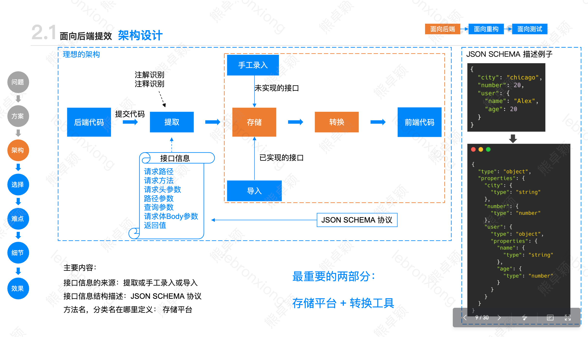
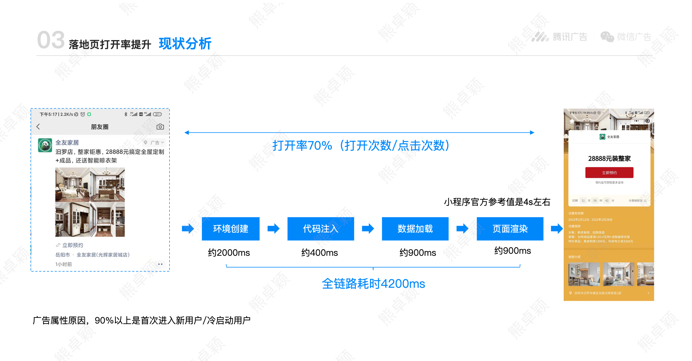
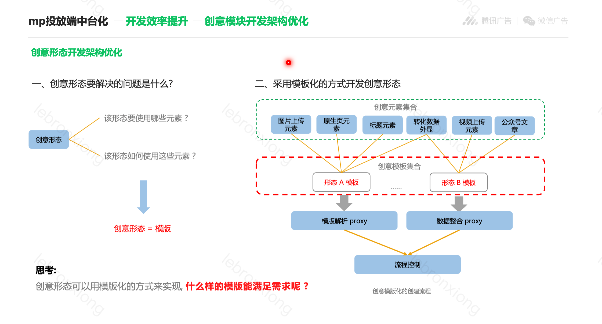
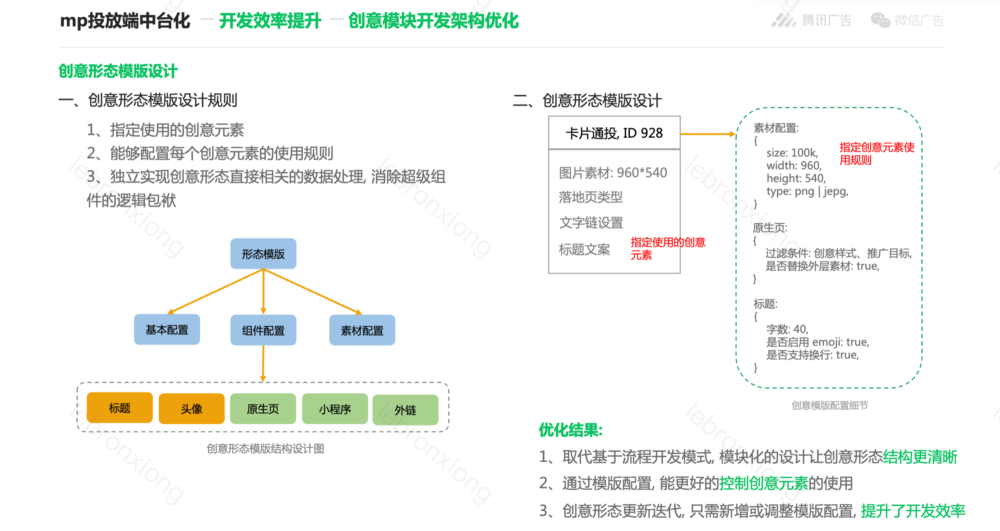
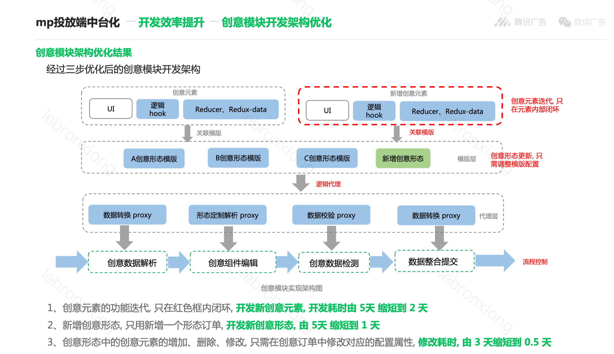

## redux

字段非常多，且字段之间依赖很多，如不用redux需要层层传递或者调用非常多的hooks进行服用。互选这边字段较少，虽然服用了广告的存储结构，但是很多字段都是默认填写，且字段之间的关联较少。表单配置没有这么多。所以互选采用hook的方式进行服用，将整个页面分为三个部分，一个是针对流量主的任务信息，一个是任务的基础信息，一个是组件的配置。将这三个部分聚合为hook进行服用

互选hook转为redux也很简单。将state的更改转换为对redux的更改即可。

## 提效

api沟通提效。可以通过后台直接触发接口更新  pb -> 前端api

## 性能

如何提高性能

## 一些总结

redux和api之间数据不是完全对齐，所以做了一些数据转换的能力，实现apiToRedux 和 reduxToApi

## 架构（数据驱动）

分层架构，数据和UI解耦。UI消费数据。数据也可以分层，数据实体层，业务逻辑层和Controller等。UI也可以分为业务组件和纯展示组件，展示组件完全消费数据，业务组件可以进行请求处理等业务逻辑。

我目前的分析方式首先是理解业务需求，找到业务中的功能点，根据需求将项目划分为多个功能模块，明确每个模块的职责。如果重数据可以采用数据驱动开发，也可以采用UI驱动开发。组件和数据解耦。

没有最合适的架构，也不需要做过度设计，拿到一个需求之后

### 一些原则

#### 1. 组件原则

https://iwiki.woa.com/p/517001938?from=iWiki_search

1）单一职责原则：一个组件原则上只负责一种功能，如果它需要负责更多的功能，则拆分成多个组件。比如定向组件中，进一步拆分为：地域组件、年龄组件、性别组件等
2）组件职能划分：按业务组件和纯ui组件划分，业务组件存放于具体页面的 `components` 目录中，纯ui组件参照 2.3.2 和 2.3.3
3）松耦合：不过多的依赖props，
4）扁平化参数：组件接收的props尽可能偏平化，不传入嵌套的数据
5）`edit` 页面组件存放规则：根据组件所在的业务域放在不同的目录：`campaign`: 计划层级组件，`group`: 广告层级组件，`creative`： 创意层级组件，`common`: 可复用组件（可复用次数2+就需要抽离到这里）

### 创意架构

因为创意是我们项目中变化最多的地方，目前广告支持100种创意形式，每种创意形式都有不同的变现形式。之前都是在组件中通过大量的判断来实现不同的创意形式展示不同的配置。造成逻辑和组件混乱，难以理解，且改动成本很大，创意形式表现不直观。其实创意形式和页面展示是可以解耦的，两者都不需要理解对方的存在。通过引入中间层。中间层负责获取创意配置，根据配置展示不同的UI原子组件。例如外层文案组件，图片组件，视频组件等等。

创意 =》 创意形式 -> 包含不同的创意元素

**存在问题：**

1. 提交的时候redux需要根据不同的创意形式做判断，需要大量的判断逻辑
2. 创意形式不直观，代码中每个创意形式的创意元素散落在各个地方，没办法直观看出某个创意形式有哪些创意元素
3. 组件中存在大量的判断，造成组件不纯，例如不同创意形式的图片规格不同，视频规格不同。对应在组件中就是大量的判断。造成理解困难

之前是视图驱动设计，先写好UI，然后在UI里面写判断逻辑，例如某个形态要不要展示，每个形态不同的配置。容易造成超大组件，组件里面耦合了大量的业务逻辑，非常不利于维护。同时很多地方的逻辑要写很多遍，例如创意数据提交，获取预览数据等等，都需要写大量的判断逻辑，判断哪些需要展示，哪些需要提交。核心是没有解耦，创意形态分散在各个地方。后续我们区分创意形态和创意元素，创意形态做成配置化，包括要提交的数据，展示配置，校验逻辑等等。并且提供相应的工具函数。创意元素负责展示。获取创意形态的配置之后再组合创意元素。

**如何分析**

- **分析业务特点**：
  - 创意核心为创意形态的组织。有多种多样的创意形态。创意形态其实是由多种创意元素组合而成。（之前没有区分这两种，都是耦合在组件中的判断，导致存在非常多的超级大组件）

**处理方式**

整体流程如下（配置化+中间层代理proxy）：中间层负责配置的获取，数据的组合等等。

1. 之前的处理方式是UI驱动，先实现不同组件，再在不同组件中兼容不同的创意形式。本次从数据驱动，用配置的方式组织UI
2. 创意元素和配置解耦，创意元素逻辑单独实现，创意元素的实现粒度为最后接口提交的字段为粒度设计。例如外层图片，文字链，外层标题，广告主头像，落地页跳转等等。

组件[消耗当前配置并展示] ->   中间层(其实就是一个组件) [hook获取当前创意形式配置 ] -> 组件配置

**留一些问题**

1. 配置化考虑不够完善，没有考虑到组件可以自由组合的情况。应该将组件弄成一个map，配置可以自定义顺序进行展示

2. 各个组件与redux数据耦合度高，组件一旦脱离完整redux树，无法正常复用

     初衷：原本的设计在一定程度上解耦了上下级组件的props透传，通过封装hooks给组件使用，但目前看仍不是最佳方案

   - **View（UI组件）层通过依赖注入的方式解决耦合问题**

3. 数据校验逻辑分散，开发心智负担较重。建立字段领域模型，每个字段都是一个领域对象，有数据自处理能力。