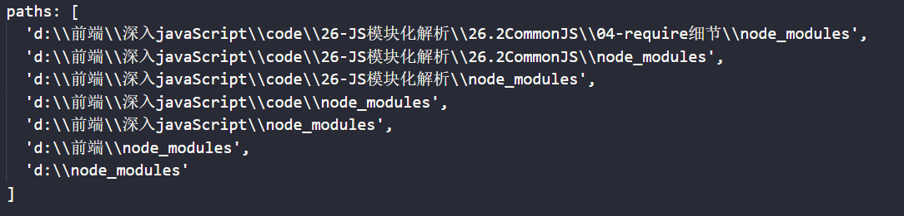
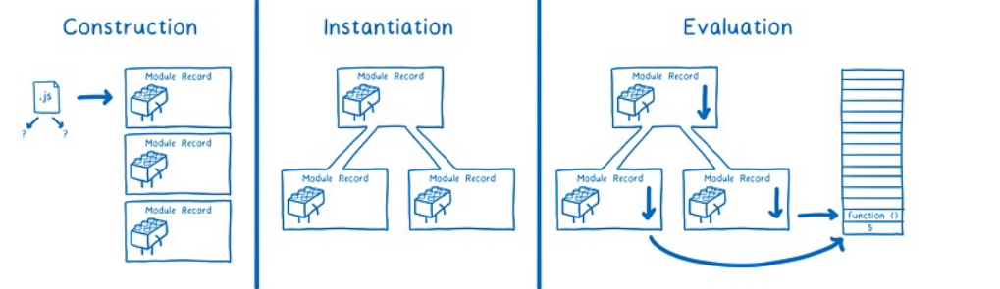
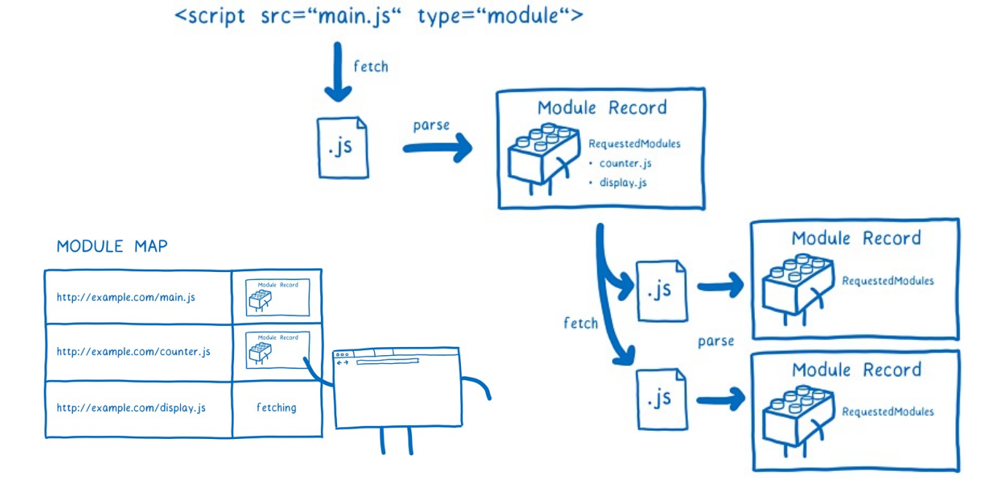
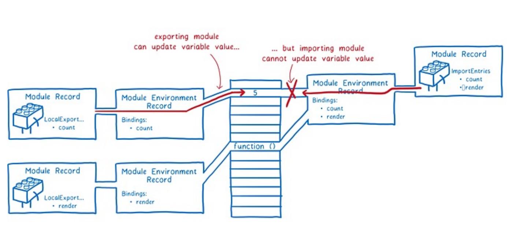

# 模块发展史

在前端开发的历史中，模块化一直是一个核心的问题。随着 JavaScript 应用程序变得越来越复杂，代码的可维护性、复用性和模块化的需求也越来越迫切。

在模块化的演进过程中，最开始是通过`IFFE`来实现模块化，例如我们最熟悉的`jQuery`。后面才涌现了多个模块化标准，例如 `CommonJS`、`AMD` 以及现代的 `ES6 Module`。本篇文章将介绍这些标准的发展历程和各自的特点。

## 一、为什么需要模块化？

在早期`JavaScript`的开发当中，在没有模块化的情况下。写法是这样的：

```js
  <script src="./index.js"></script>

  <script src="./home.js"></script>

  <script src="./user.js"></script>
```

这种写法很容易存在全局污染和依赖管理混乱问题。在多人开发前端应用的情况下问题更加明显。

命名混乱、代码组织性低、可维护性差、可重用性低等问题暴露的更加明显。

例如：

### 1.1 命名冲突

在没有模块化的情况下，所有的函数和变量都定义在全局作用域中。这意味着如果不小心命名冲突，不同部分的代码可能会意外地互相影响，导致难以察觉的 `bug`或不可预见的行为。

```javascript
// 文件 1
function calculateTotal(price, quantity) {
  return price \* quantity;
}
```

```javascript
// 文件 2
function calculateTotal(price, taxRate) {
  return price \* (1 + taxRate);
}
```

如果这两个文件都在全局作用域中定义，且被同一个 HTML 文件引用，那么 `calculateTotal` 函数会产生冲突，调用时可能会得到不正确的结果。

### 1.2 全局污染

在没有模块化的情况下，所有的变量和函数都被添加到全局命名空间中。这可能导致变量名重复、不必要的全局变量增多，从而增加了代码的复杂性和维护难度。

```javascript
// 文件 1
var username = 'Alice';
function greetUser() {
  console.log('Hello, ' + username + '!');
}
```

```javascript
// 文件 2
var username = 'Bob';
function displayUsername() {
  console.log('Current user: ' + username);
}
```

如果这两个文件都在同一个页面中执行，它们共享同一个全局命名空间，可能会造成 `username` 被覆盖，从而导致 `greetUser` 和 `displayUsername` 函数不再使用预期的 `username` 值。

#### 难以管理和维护

没有模块化的代码通常难以分离、重用和测试。整体项目结构可能变得混乱，不同功能之间的依赖关系也不明确，增加了代码的复杂性和理解难度，特别是在大型项目中。

**示例：**

```javascript
// 文件 1
function calculateTotal(price, quantity) {
  return price \* quantity;
}

function formatCurrency(amount) {
  return '$' + amount.toFixed(2);
}
```

```javascript
// 文件 2
function calculateTax(total, taxRate) {
  return total \* taxRate;
}

function formatCurrency(amount) {
  return '¥' + amount.toFixed(2);
}
```

在没有模块化的情况下，两个文件都在全局作用域中定义 `formatCurrency` 函数，如果它们都被加载到同一个页面中，会出现函数覆盖和不一致的行为。

综上，随着前端技术的发展，JavaScript 被用来构建越来越复杂的应用程序。传统的脚本方式逐渐暴露出许多问题：

1. **命名冲突**：不同脚本文件中的变量容易出现命名冲突，导致难以调试。
2. **依赖管理复杂**：需要手动维护脚本之间的依赖关系，这种方式非常脆弱且容易出错。
3. **代码复用性差**：代码没有统一的模块规范，无法实现有效的代码复用。

为了解决这些问题，模块化的概念逐渐被引入到 JavaScript 生态系统中。使用模块化之后有以下好处：

1. 避免命名冲突(减少命名空间污染)
2. 更好的分离, 按需加载
3. 更高复用性
4. 高可维护性

## 二、早期的模块化标准

在 JavaScript 原生支持模块化之前，社区和开发者们提出了多种模块化规范。最具代表性的两种是 `CommonJS` 和 `AMD`。

### 2.1 CommonJS 规范

### 2.1.1 CommonJS 简介

**CommonJS 是 Node.js 采用的模块化规范，主要用于服务端的 JavaScript 环境。**

CommonJS 通过 `require()` 函数同步加载依赖模块，并使用 `module.exports` 导出模块成员。

### 2.1.2 CommonJS 的特性

- **同步加载**：模块在代码运行时同步加载，适用于服务端，但不适用于浏览器环境，因为浏览器环境中同步加载会阻塞渲染进程。
- **缓存机制**：同一个模块在多次加载时会被缓存，除非明确清除缓存。
- **简单易用**：通过 `require` 和 `module.exports` 实现模块的导入和导出，简单直观。

### 2.1.3 CommonJS 的使用示例

```javascript
// math.js
const add = (a, b) => a + b;
const subtract = (a, b) => a - b;

module.exports = {
  add,
  subtract
};

// main.js
const math = require('./math.js');
console.log(math.add(1, 2)); // 输出: 3
console.log(math.subtract(5, 3)); // 输出: 2
```

### 2.1.4 CommonJs 模块查找方式

我们现在已经知道，**require是一个函数**，可以帮助我们引入一个文件（模块）中导出的对象。

那么，require的查找规则是怎么样的呢？

https://nodejs.org/dist/latestv14.x/docs/api/modules.html#modules_all_together

首先我们明白：

- CommonJS中是没有module.exports的概念的； 
- 但是为了实现模块的导出，Node中使用的是Module的类，每一个模块都是Module的一个实例，也就是 module；

这里我总结比较常见的查找规则：导入格式如下：`require(X)`

**情况一：X是一个Node核心模块**

比如path、http—直接返回核心模块，并且停止查找

**情况二：X是以 ./ 或 …/ 或 /（根目录）开头的**

- 第一步：将X当做一个文件在对应的目录下查找； 
  - 1.如果有后缀名，按照后缀名的格式查找对应的文件
  - 2.如果没有后缀名，会按照如下顺序： 
    - 1> 直接查找文件X
    - 2> 查找X.js文件
    - 3> 查找X.json文件
    - 4> 查找X.node文件
- 第二步：没有找到对应的文件，将X作为一个目录 
  - 查找目录下面的index文件 
    - 1> 查找X/index.js文件
    - 2> 查找X/index.json文件
    - 3> 查找X/index.node文件
- 如果没有找到，那么报错：not found

**情况三：直接是一个X（没有路径），并且X不是一个核心模块**



如果上面的路径中都没有找到，那么报错：not found

### 2.1.5 CommonJS 可能出现的问题

尽管 `CommonJS` 在服务端开发中被广泛使用，但在前端环境或大型项目中，它也存在一些潜在的问题和局限性：

-  **同步加载的限制**：`CommonJS `模块是同步加载的，这意味着在模块加载完成之前，代码的执行会被阻塞。在服务端环境中（例如 `Node.js`），这种行为是可行的，因为文件系统读取速度相对较快。然而，在前端浏览器环境中，网络延迟可能导致较长的加载时间，进而阻塞页面渲染并降低用户体验。 
-  **循环依赖问题**：`CommonJS` 规范中，模块被加载时执行（运行时加载），如果两个模块互相引用（循环依赖），这可能会导致未定义的行为或部分代码无法执行。虽然大多数情况下，`Node.js `可以处理这种情况，但会引起意料之外的结果，尤其是当模块依赖链较复杂时。 
-  **缺乏静态分析能力**：由于 `CommonJS `使用动态 `require()` 语句来引入模块，这使得工具很难在编译时进行静态分析。这种动态依赖关系的管理方式，使得打包工具（如 `Webpack、Rollup`）难以进行代码优化（如 Tree Shaking），从而影响性能和代码体积。 
-  **跨平台兼容性**：`CommonJS `规范设计之初是为了满足服务端 JavaScript（Node.js）环境的需求，它不适合直接在浏览器环境中使用。虽然可以通过 Browserify 等工具将 CommonJS 模块转换为浏览器可用的格式，但这增加了开发和构建的复杂性。 

> 尽管 CommonJS 规范在 Node.js 服务端开发中取得了巨大成功，但在前端开发和大型项目中，它也暴露了自身的一些局限性。 现代 JavaScript 开发逐渐转向 ES6 Module 标准，这一标准通过静态分析、异步加载和浏览器原生支持，解决了 CommonJS 规范中的许多问题，为开发者提供了更强大和灵活的模块化支持。 

## 2.2. AMD 规范

### 2.2.1 AMD 简介

**AMD（Asynchronous Module Definition，异步模块定义）是一个在浏览器环境中使用的模块化规范。** 它解决了 CommonJS 在浏览器中同步加载的问题，使用异步加载方式来加载模块。

### 2.2.2 AMD 的特性

- **异步加载**：通过异步方式加载模块，适合在浏览器环境下使用，避免了浏览器渲染的阻塞问题。
- **依赖前置**：在定义模块时需要声明所有的依赖模块，这些模块会在代码运行前加载完成。
- **较复杂的定义方式**：需要使用 `define()` 函数来定义模块，并声明依赖。

### 2.2.3 AMD 的使用示例

```javascript
// math.js
define([], function() {
  const add = (a, b) => a + b;
  const subtract = (a, b) => a - b;
  return {
    add,
    subtract
  };
});

// main.js
require(['./math'], function(math) {
  console.log(math.add(1, 2)); // 输出: 3
  console.log(math.subtract(5, 3)); // 输出: 2
});
```

### 2.2.4 AMD 可能存在的问题

虽然 AMD 规范在解决浏览器环境中模块异步加载方面有显著的优势，但它也存在一些潜在的问题和局限性：

-  **模块定义复杂性增加**：AMD 使用 `define()` 函数来定义模块，并且需要提前声明所有的依赖模块。这种显式声明的方式虽然在一定程度上清晰明了，但在大型项目中会显得繁琐复杂，特别是当依赖关系较多时，代码的可读性和维护性会下降。 
-  **加载速度较慢**：尽管 AMD 通过异步方式加载模块来避免阻塞浏览器渲染进程，但由于模块依赖的前置加载特性，所有依赖模块需要在主模块执行之前全部加载完毕。这在依赖关系复杂或者网络较差的情况下，可能导致模块加载速度变慢，影响页面性能。 
-  **过度依赖回调函数**：AMD 模块化规范依赖于回调函数，这会导致代码结构的嵌套层级增加，出现俗称的“回调地狱”现象，使得代码的调试和维护变得更加困难。 
-  **生态系统和工具支持限制**：相比于 ES6 Module 等更现代的模块化标准，AMD 的生态系统支持较为有限。虽然 RequireJS 等工具对 AMD 提供了良好的支持，但相比于现代工具链（如 Webpack、Rollup 等）对于 ES6 Module 的优化和支持，AMD 的兼容性和性能优化相对较弱。 

>  AMD 规范通过异步加载的方式有效解决了 CommonJS 在浏览器环境下的性能问题，适合用于浏览器端的模块化开发。 然而，其复杂的模块定义方式和对回调的过度依赖，使其在大型项目和现代开发中逐渐失去优势。 随着 ES6 Module 的崛起，开发者们越来越倾向于选择更简单、性能更优的模块化解决方案。 

## 三、现代模块化标准的出现：ES6 Module

### 3.1 ES6 Module 简介

**ES6 Module（ESM）是由 ECMAScript 官方在 ES6（ECMAScript 2015）中引入的模块化规范。它是 JavaScript 语言级别的模块系统，支持静态分析，能够在编译时确定模块的依赖关系。**

相较于 CommonJS 和 AMD，ESM 具有更灵活和更高效的模块管理能力。

### 3.2 ES6 Module 的特性

1.  **静态依赖分析**： ES6 Module 在编译时就可以确定模块的依赖关系，从而实现静态分析和树摇（Tree Shaking）优化。这意味着模块中没有被使用的代码可以在打包阶段被移除，从而减小最终的文件大小。 
2.  **严格模式（Strict Mode）**： ES6 Module 自动采用 JavaScript 严格模式。这意味着模块中不能使用某些不安全的语法（如 `with` 语句），提高了代码的安全性和性能。 
3.  **独立的模块作用域**： 每个模块都有独立的作用域，模块内部的变量、函数不会污染全局作用域，避免了变量命名冲突问题。 
4.  **导入和导出语句（Import 和 Export）**： ES6 Module 使用 `import` 和 `export` 关键字来导入和导出模块成员。导出可以是命名导出（Named Export）或默认导出（Default Export）。 
5.  **异步加载支持**： ES6 Module 可以异步加载模块，避免了阻塞浏览器的渲染进程，从而提升了页面加载性能。 
6.  **浏览器原生支持**： 现代浏览器原生支持 ES6 Module，无需额外的加载器（如 RequireJS）或打包工具（如 Webpack）即可直接使用。 

### 3.3 ES6 Module 的使用方法

ES6 Module 主要通过 `export` 和 `import` 语法来管理模块。

#### 3.3.1 导出模块（Export）

ES6 Module 提供了两种导出方式：**命名导出** 和 **默认导出**。

- **命名导出**（Named Export）：允许导出多个成员，导出时需要使用 `{}` 包裹。

```javascript
// module-a.js
export const data = "moduleA data";

export function methodA() {
  console.log("This is methodA");
}

export class MyClass {
  constructor() {
    console.log("This is MyClass");
  }
}
```

- **默认导出**（Default Export）：每个模块只能有一个默认导出，使用 `export default` 关键字。

```javascript
// module-b.js
export default function () {
  console.log("This is the default exported function");
}
```

#### 3.3.2 导入模块（Import）

- **导入命名导出**：需要使用花括号 `{}` 指定导入的成员。

```javascript
// main.js
import { data, methodA, MyClass } from "./module-a.js";

console.log(data); // 输出：moduleA data
methodA(); // 输出：This is methodA
const instance = new MyClass(); // 输出：This is MyClass
```

- **导入默认导出**：直接指定导入的变量名称。

```javascript
// main.js
import defaultFunction from "./module-b.js";

defaultFunction(); // 输出：This is the default exported function
```

- **同时导入命名导出和默认导出**：

```javascript
// main.js
import defaultFunction, { data, methodA } from "./module-b.js";

defaultFunction();
console.log(data);
methodA();
```

#### 3.3.3 动态导入（Dynamic Import）

ES6 Module 还支持动态导入模块，这种导入方式适用于需要按需加载的场景。动态导入返回一个 Promise 对象。

```javascript
// main.js
import("./module-a.js").then((module) => {
  module.methodA(); // 输出：This is methodA
});
```

### 3.4 ES6 Module 与其他模块规范的比较

ES6 Module 相较于 CommonJS 和 AMD 有显著的优势：

1.  **加载方式**： CommonJS 使用同步加载，这在[服务器](https://cloud.tencent.com.cn/product/cvm/?from_column=20065&from=20065)端是可行的，但在浏览器中会导致阻塞。而 ES6 Module 支持异步加载，不会阻塞浏览器的渲染进程。 
2.  **模块依赖分析**： CommonJS 模块的依赖关系在运行时解析，这可能导致加载时的性能开销。ES6 Module 在编译阶段就能确定依赖关系，优化了加载效率和性能。 
3.  **代码优化**： 由于 ES6 Module 支持静态分析工具，构建工具能够对代码进行更有效的优化（如 Tree Shaking），减少最终产物的大小。 
4.  **兼容性**： ES6 Module 是现代浏览器和 Node.js 官方推荐和支持的模块化标准，未来的兼容性和更新都更有保障。 

### 3.5 ES6 Module 的局限性

虽然 ES6 Module 在现代开发中具有广泛应用，但它也有一些局限性：

1. **浏览器兼容性**：早期版本的浏览器不支持 ES6 Module，不过随着浏览器的更新，这个问题正逐渐消失。
2. **服务端使用限制**：在服务端（如 Node.js）环境中，使用 ES6 Module 可能需要一些配置和额外的工具支持（如 Babel、Webpack）。
3. **性能影响**：在非常大量模块导入的场景下，可能会有性能瓶颈。

### 3.6 ES6 模块查找方式

#### ES Module的解析流程

ES Module是如何被浏览器解析并且让模块之间可以相互引用的呢？

> [ES modules: A cartoon deep-dive](https://cloud.tencent.com.cn/developer/tools/blog-entry?target=https%3A%2F%2Fhacks.mozilla.org%2F2018%2F03%2Fes-modules-a-cartoon-deep-dive%2F&objectId=2163613&objectType=1&isNewArticle=undefined)

ES Module的解析过程可以划分为三个阶段：

- 阶段一：构建（Construction），根据地址查找js文件，并且下载，将其解析成模块记录（Module Record）；
- 阶段二：实例化（Instantiation），对模块记录进行实例化，并且分配内存空间，解析模块的导入和导出语句，把模块指向对应的内存地址。
- 阶段三：运行（Evaluation），运行代码，计算值，并且将值填充到内存地址中



##### 阶段一：构建阶段



##### 阶段二和三：实例化阶段 – 求值阶段



## 四、总结

JavaScript 的模块化演进经历了从无到有、从简单到复杂的过程。随着前端应用的复杂性和需求的增加，模块化的重要性愈发凸显。CommonJS、AMD 和 ES6 Module 各有其应用场景和特点。

- **CommonJS**：适用于 Node.js 服务端开发，使用同步加载机制。
- **AMD**：适用于浏览器环境，使用异步加载机制，解决了前端模块依赖问题。
- **ES6 Module**：现代浏览器和 JavaScript 语言级别的模块化标准，支持静态分析、异步加载和 Tree Shaking，是当前前端开发的主流选择。

未来的 JavaScript 开发中，ES6 Module 将继续发挥重要作用，为开发者提供更强大和灵活的模块化支持。