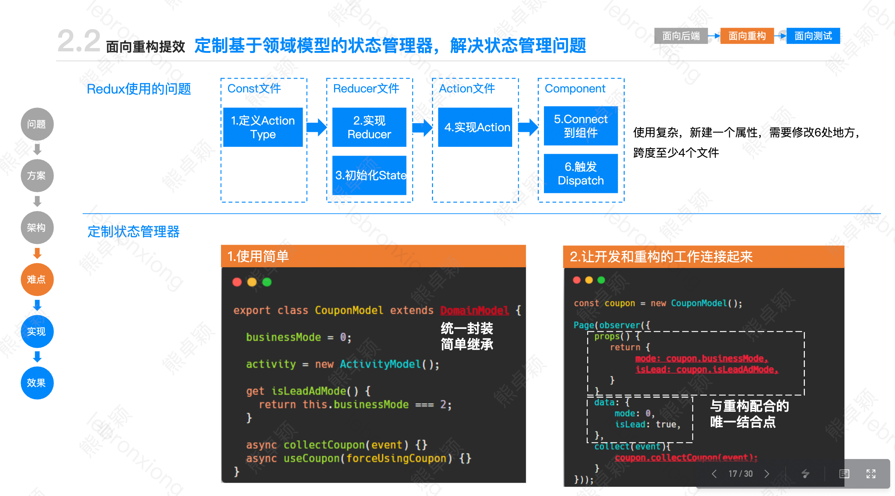

# redux使用优化
## 以往使用存在的问题
在以往类组件中使用`redux`需要编写非常多的模版代码。整个流程非常繁琐，且改动的地方很多。稍不注意就容易漏掉该改的地方。缺点可以总结为以下几部分：
1. 流程非常繁琐，且改动的地方很多
2. 需要编写大量的模版代码
3. 代码逻辑分散在各个地方，例如`action`,`reducer`等等。虽然`redux-toolkit`可以实现整合各个代码，但还是需要编写很多模版代码。

如果要在`redux`中添加一个新的字段，最少需要经过如下几个步骤

1. 定义一个action常量
2. 定义一个action构造函数
3. 在reducer中定义一个初始值
4. 在reducer中定义一个action case
5. 如果要在组件中使用，还要不感知dispatch的存在，就在mapStateProps中重新定义一个函数绑定上dispatch给组件使用，或者使用useDispatch。



```js
// 1. 定义一个action type
const INCREMENT = 'INCREMENT'

// 2. 定义一个action creator
export const increment = (num: number) => ({
  type: INCREMENT,
  payload: num,
})

// 3. 定义一个初始状态
const initState = {
  value: 0,
};

// 4. 定义一个reducer
export const counter = (state = initState, action: Record<string, any>) => {
  switch (action.type) {
    case INCREMENT:
      return {
        ...state,
        value: state.value + action.payload
      }
    default:
      return state
  }
}

// 5. 组件不感知dispatch，所以还需要在mapDispatchToProps中重新定义一次。
const mapDispatchToProps = (dispatch, ownProps) => {
  return {
    increment(budget) {
      dispatch(increment(budget))
    }
  }
};
```

## 优化思路
在开发中，其实我们并不需要关注`action_type`和`reducers`函数，我们可以通过通用模版生成器来将这两部分进行弱化。
1. 根据key可以自动生成`action_type` 和 `reducers`。我们只用定义一个初始对象就行。
`reducers`中的`key`和`action`中的`key`一一对应。通过`getTypePrefix(preFix, key)`来防止`action`名称重复
2. 如今`react`都是编写函数组件，所以在使用`redux`时可以采用`hook`的方式实现，由于`redux`字段的更新和`useState`的使用和类似，所以`hook`的设计可以参考`useState`

最后想要实现的目标如下：
``` js
// 初始化，开发者关注部分
const initState = {
  value: 0,
};

const counterReducer = combineReducer(makeReducers(initState, 'nameSpace')); // 将每一个字段都设计成一个reducer，再组合起来。reducer中的key使用initState中的key

// 使用，开发者关注部分
const [value, setValue] = useCouterState('value'); // 通过包裹成hooks。开发者使用简单。
```
通过以上方式可以将传统`hooks`繁琐流程简化成两步。且符合`hooks`开发的心智模型。后续增加新的字段值需要在`initState`添加一个`key`就行。

## 具体实现
### makeReducer
```ts
type TMakeReducersReturnType<T> = {
  [K in keyof T]: T[K] extends (...args: any) => any ? T[K] : () => T[K];
};
/**
 * @desc 根据对象生成reducer，type命名规则：`${ns.toUpperCase}_SET_${key.toUpperCase()}`
 */
export const makeReducers = <T extends Record<string, any>>(obj: T, ns: string): TMakeReducersReturnType<T> => {
  const reducers = {} as TMakeReducersReturnType<T>;

  for (const [key, val] of Object.entries(obj)) {
    // 如果已经是一个reducer，不进行包装
    reducers[key] = typeof val === 'function' ? val : makeReducer(getTypePrefix(key, ns), val);
  }

  return reducers;
};
```
`makeReducer`通过遍历每一个`key`，将其包裹成单独的`reducer函数`，同时使用`getTypePrefix`同一个`action_key`生成函数来确保全局唯一且规范统一

### makeReducer
```ts
/**
 * @desc 精简模板代码，用来将一个key value转换成reducer
 * @param type
 * @param initState
 * @returns {Function}
 */
export const makeReducer = <T>(type: string, initState: T) => (
  state = initState,
  action: { type: string; payload: any; [propName: string]: any }
): T => {
  const payloadType = Object.prototype.toString.call(action.payload);

  switch (action.type) {
    // 只需要处理当前type的action。兼容一下Object和Array的情况
    case type:
      if (payloadType === '[object Object]') {
        return { ...action.payload };
      }

      if (payloadType === '[object Array]') {
        return [...action.payload] as any;
      }

      return action.payload;
    default:
      return state;
  }
};
```
`makeReducer`针对单独的`key value`来生成一个`reducer`函数，同时通过判断`paload`类型来兼容数据的不同格式（对象 / 数组 / 原始类型）。

通过这一步我们就完成了`counterReducer`的构建。他已经是一个可以在`createStore`中使用的`reducer`了。

### useCouterState
```ts
const useCouterState = 
// 通过unikey读取和更新对应单个广告数据的某个属性值
export function useCouterState<T extends keyof TCounter>(
  key: T
) {
  const dispatch = useDispatch() as IDispatch;

  // 获取数据
  const value = useSelector((state) => state.counter.value)

  // 更新
  const setValue = (value: TCounter[T]) => {
    dispatch(updateCounter({ unikey, [key]: value })); // updateCounter需要关注，里面包含action生成
  }

  return [value, setValue];
}
```
这里将取值和更新逻辑进行封装，开发者只需要向调用`setState`一样使用`redux`。

### updateCounter
```ts
/**
 * @desc 生成更新reducer函数。通过包装一个dispatch函数，同时自动生成action，保证和reducer一直。开发者无需关注
 */
export const makeUpdateFn = <T>(ns: string) => (obj: Partial<T> & { unikey?: string }) => (
  dispatch: IDispatch
): void => {
  for (const [key, val] of Object.entries(obj)) {
    dispatch({
      type: getTypePrefix(key, ns),
      payload: val,
    });
  }
};

const updateCounter = makeUpdateFn('counter')
```

我们通过统一的`makeUpdateFn`函数，来代替以往`action_creator`的部分，这里使用`getTypePrefix`保证和`reducer`中使用的`key`是同一个。同时在上层在封装一个`useCouterState hook`。将取值逻辑和修改逻辑进行封装。

### 优化效果
如果我们要添加一个新变量`new_value`。我们只需要很简单的步骤
```js
// 初始化
const initState = {
  value: 0,
  new_value: 0, // 新添加的值
}

// 使用
const [newValue, setNewValue] = useCouterState('new_value')
```

## 数组的情况
在广告的业务场景下，可能存在多广告的情况。使用上述模型没办法很好的符合我们的情况。所以可以稍微改动一下：
1. 将广告字段定义成一个`array`类型，然后封装一个`makeArrayReducer`的函数。可以实现添加 / 删除 / 修改。
2. 数组中的每一项都通过唯一`key`来区分。在修改的时候找到对应`key`的数据，调用`reducer`生成新的`state`。
3. 使用的时候将组件包裹在`context`组件中，在里层组件使用的时候可以通过`context`拿到这个组件对应的`adGroup`

### reducer定义
```ts
export const adgroupDefault = {
  unikey: (state = createReducerKey('adgroup')) => state, // 生成唯一key
  name: '',
  adgroup_id: 0,
  /** 其他字段 */
}

export const adgroupReducer = combineReducers(makeReducers(adgroupDefault, 'adgroup'));

// 增加makeArrayReducer工具函数
export const adgroupsReducer = makeArrayReducer(adgroupReducer, 'adgroup');
```

### makeArrayReducer
```ts
/**
 * 将一个 reducer 对象 封装成 数组
 * @param reducer 要包装的reducer
 * @param ns 命名空间，会在命名空间前加 ADD_ 和 DEL_ 作为添加或者删除的标识
 */
export function makeArrayReducer<T extends (...args: any) => any>(reducer: T, ns = '') {
  // 这里重新定义类型，避免循环引用的问题
  type ReducerType = ReturnType<T>;

  return (state: ReducerType[] = [], action: IAction): ReducerType[] => {
    const { type, unikey } = action;

    // 新增
    if (type === `ADD_${ns.toUpperCase()}`) {
      return [...state, reducer(action.payload as ReducerType, action)];
    }

    // 删除
    if (unikey && type === `DEL_${ns.toUpperCase()}`) {
      return state.filter((item) => item.unikey !== unikey);
    }

    // 修改
    let newState = state;

    if (state.length) {
      newState = state.map((item) => {
        // 1. 没有传入unikey，说明全部广告都要修改
        // 2. 传入unikey，只改对应的广告
        if (!unikey || item.unikey === unikey) {
          // 这里其实是调用reducer，reducer会返回一个新的对象。我们会传入每个单独的广告。
          // 其实这里就不是redux帮我们调用reducer了，而是我们自己调用reducer。所有第一个参数我们可控
          return reducer(item, action);
        }

        // 传入unikey，并且没有匹配上unikey的广告不需要修改
        return item;
      });
    }

    return newState;
  };
}
```
`makeArrayReducer`会包装一个新的`reducer`函数，除了新增/删除两个自定义的`action`之外，都会走到我们传进来的`reducer`函数逻辑中。通过`reducer`返回一个新`state`存储。


### 组件中使用
```tsx
const context = {
  unikey: '', // 前端生成的唯一key
};

export const AdGroupContext = React.createContext(context);

export function App() {
  const adgroups = useSelector<RootState, any[]>(
    (state) => state.adgroups.map((item) => item),
  );
  return <div>
    {
      adgroups.map(adgroup => {
        return <div key={adgroup.unikey}>
          {/* 使用context传入unikey */}
          <AdGroupContext.Provider value={{
            unikey: adgroup.unikey
          }}>
            <Adgroup adgroup={adgroup} />
          </AdGroupContext.Provider>
        </div>
      })
    }
  </div>
}
```
首先我们需要在组件最外层包裹一个`context`。然后在`Adgroup`组件中我们就可以拿到对应的`unikey`。

### 通过useAdGroupState在Adgroup组件中使用
```ts
// 通过context获取unikey（适用于包含在Adgroup.tsx的内部组件调用），读取和更新对应单个广告数据的某个属性值
// 最后使用方式如下：const [name, setName] = useAdGroupState('name');
export function useAdGroupState<T extends keyof TAdgroup>(key: T) {
  const { unikey } = useContext(AdGroupContext);
  return useAdGroupStateByUnikey(unikey, key);
}

// 通过unikey读取和更新对应单个广告数据的某个属性值
export function useAdGroupStateByUnikey<T extends keyof TAdgroup>(
  unikey: string,
  key: T
) {
  const dispatch = useDispatch() as IDispatch;

  // 通过unikey读取广告数据
  const value = useSelector<RootState>((state) => {
    const adgroup = state.adgroups.find((item) => item.unikey === unikey);
    return adgroup?.[key];
  })

  // 通过unikey更新广告数据。这里只要传入unikey，后面在makeReducer中会自动更新对应的广告数据
  const setValue = (value: TAdgroup[T]) => {
    if (unikey) {
      dispatch(updateAdGroup({ unikey, [key]: value }));
    }
  }


  return [value, setValue] as [TAdgroup[T], typeof setValue];
}
```
需要注意的是，我们updateAdGroup调用的`makeUpdateFn`也需要小改动，需要在`dispatch`的时候带上`unikey`。这样才会走到`makeArrayReducer`生成`reducer`的默认修改逻辑中。
```ts
/**
 * @desc 生成更新reducer函数。通过包装一个dispatch函数，同时自动生成action，保证和reducer一直。开发者无需关注
 */
export const makeUpdateFn = <T>(ns: string) => (obj: Partial<T> & { unikey?: string }) => (
  dispatch: IDispatch
): void => {
  const { unikey } = obj;

  for (const [key, val] of Object.entries(obj)) {
    if (key !== 'unikey') { // unikey不需要dispatch
      dispatch({
        type: getTypePrefix(key, ns),
        unikey, // 这里如果有unikey，就只修改对应的广告。具体逻辑在makeArrayReducer中
        payload: val,
      });
    }
  }
};
```

## 完整例子仓库
https://github.com/xzy0625/redux-optimation