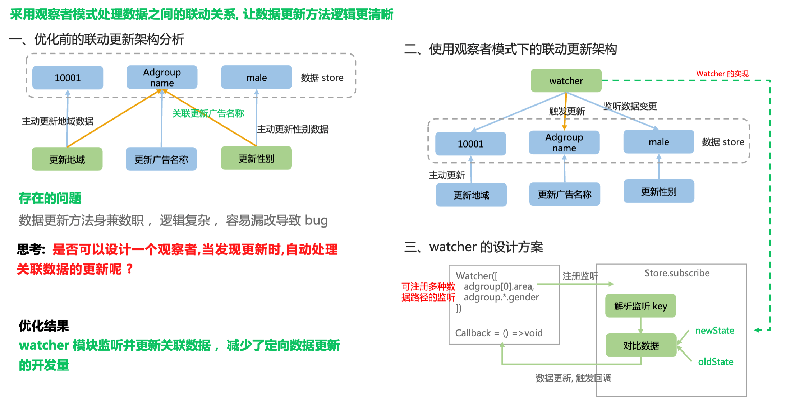

# redux实现watch
在日常使用`redux`中，我们经常存在一个字段变成后需要引起其他字段的变更。我们习惯的写法是按顺序`dispatch`。
```js
// 按顺序dispatch
dispatch({ type: 'before' });
dispatch({ type: 'after' });
```
但是这种方法使得我们的数据更新函数职责混乱，不符合单一职责的原则（比如我的函数就是更新广告计划，但是由于依赖的原因我在函数中需要同步调用更新）。同时数据更新逻辑分布在各个地方，对于后续维护是个灾难。不仅如此，还很容易漏掉需要我们需要更改的数据。

整体架构：



## 具体实现

```typescript
import { logger } from '@/js/rewardquest/helpers/logger';
/* eslint-disable no-prototype-builtins */
import _ from 'lodash';
import objectScan from 'object-scan';
import { RootStateType } from '../reducer';
import { errorActionTypes } from '.';

const subscribers = {};
const watchSubscribers = {};
const keyReg = {};
type IOnChange = (option: {
  newValue: any;
  prevValue: any;
  key: string;
  newState: RootStateType;
  prevState: RootStateType;
  dispatch: IDispatch;
}) => string | { storeKey: string; msg: string } | void;

/**
 * 监听Redux的键的变化
 * @param key 要监听的键
 * @param cb 键变化时，执行的函数
 * @returns 返回验证信息，如果返回 undefined，则忽略
 */
export function validate(key: string | string[], cb: IOnChange) {
  return addSubscriber(subscribers, key, cb);
}
/**
 * 监听Redux的键的变化
 * @param key 要监听的键
 * @param cb 键变化时，执行的函数
 * @returns void
 */
export function watch(key: string | string[], cb: IOnChange) {
  return addSubscriber(watchSubscribers, key, cb);
}

function addSubscriber(subs: IAnyObject, key: string | string[], cb: IOnChange) {
  const keys = _.castArray(key);
  keys.forEach((item) => {
    if (subs.hasOwnProperty(item)) {
      subs[item].push(cb);
    } else {
      subs[item] = [cb];
    }
    if (item.indexOf('*') > -1) {
      keyReg[item] = true;
    } else {
      keyReg[item] = false;
    }
  });

  // return "unsubscribe" function
  return () => {
    keys.forEach((item) => {
      subs[item] = subs[item].filter((s) => s !== cb);
    });
  };
}
function notify(subs, newState, prevState, isReCheck, dispatch) {
  const changeValues = {};

  Object.keys(subs).forEach((key) => {
    const realKeys = keyReg[key] ? objectScan([key], { joined: true })(newState) : [key];
    realKeys.forEach((realKey) => {
      const newValue = _.get(newState, realKey);
      const prevValue = _.get(prevState, realKey);
      if (prevValue !== newValue || isReCheck) {
        subs[key].forEach((cb) => {
          let ret;
          try {
            ret = cb({
              newValue,
              prevValue,
              key: realKey,
              newState,
              prevState,
              dispatch,
            });
          } catch (err) {
            logger.error('notify callback error:', err);
            changeValues[realKey] = `notify '${realKey}' callback error: ${err?.message}`;
          }

          if (_.isString(ret)) {
            changeValues[realKey] = ret;
          } else if (ret?.storeKey) {
            changeValues[ret.storeKey] = ret.msg;
          }
        });
      }
    });
  });
  return changeValues;
}

const LAST_ACTION_TYPE_KEY = 'lastAction.type';

export function errorSubscriber(store) {
  let prevState = store.getState();
  let waiting = false;

  store.subscribe(() => {
    const lastActionType = _.get(store.getState(), LAST_ACTION_TYPE_KEY);

    // MERGE_ERROR是notify后内部收集所有错误信息用，不需要再次触发notify
    if (waiting || lastActionType === errorActionTypes.MERGE_ERROR) {
      return;
    }

    waiting = true;

    // 优化性能：把一个事件循环中的多次dispatch收集到一起再统一校验错误信息
    Promise.resolve().then(() => {
      waiting = false;

      const newState = store.getState();
      // if (_.get(newState, LAST_ACTION_TYPE_KEY) !== 'MERGE_ERROR') {
      const isReCheck = _.get(newState, LAST_ACTION_TYPE_KEY) === errorActionTypes.RECHECK_ERROR;

      try {
        // 普通的watcher
        notify(watchSubscribers, newState, prevState, false, store.dispatch);

        // 上一个action是redux初始化的情况，不触发校验规则
        if (_.get(prevState, LAST_ACTION_TYPE_KEY) !== '@@INIT') {
          // error的wathcer
          const changeValues = notify(subscribers, newState, prevState, isReCheck, store.dispatch);

          if (!_.isEmpty(changeValues)) {
            store.dispatch({
              type: errorActionTypes.MERGE_ERROR,
              payload: changeValues,
            });
          }
        }
      } catch (err) {
        logger.error('subscriber notify error:', err);
      }
      prevState = newState;
    });
  });

  return validate;
}


// 注册监听
store = createStore(
  rootState,
  initialState as RootStateType,
  composeEnhancer(applyMiddleware(...middleware))
);
// 校验处理
errorSubscriber(store);

// 添加监听器
// 普通的字段联动监听
watch(['campaign.promoted_object_type'], ({ newState, dispatch }) => {
  updateBidMode(newState, newState.adgroups?.[0], false, dispatch);
});

// 错误监听
validate('campaign.campaign_name', ({ newValue }) => {
  if (newValue.length === 0) {
    return '计划名称不能为空';
  }
  return '';
});
```

