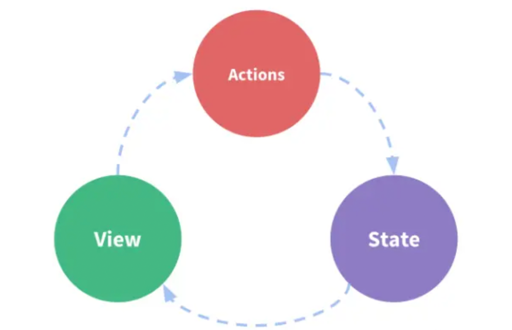
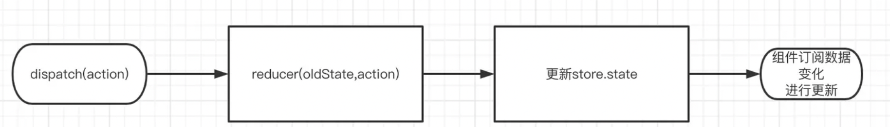

# redux原理解析

> Redux 是 JavaScript 应用的状态容器，提供可预测的状态管理。

## 单向数据流



- 用 `state `来描述应用程序在特定时间点的状况
- 基于 `state `来渲染出` View`
- 当发生某些事情时（例如用户单击按钮），会调用`dispatch`分发`action`更改`state`，生成新的` state`
- 基于新的 `state `重新渲染` View`

## redux三大原则

### 一：[单一数据源](https://cn.redux.js.org/understanding/thinking-in-redux/three-principles#单一数据源)

整个应用的 [全局 state](https://cn.redux.js.org/understanding/thinking-in-redux/glossary#state) 被储存在一棵 object tree 中，并且这个 object tree 只存在于唯一一个 [store](https://cn.redux.js.org/understanding/thinking-in-redux/glossary#store) 中。

### 二：[State 是只读的](https://cn.redux.js.org/understanding/thinking-in-redux/three-principles#state-是只读的)

唯一改变 state 的方法就是触发 [action](https://cn.redux.js.org/understanding/thinking-in-redux/glossary)，action 是一个用于描述已发生事件的普通对象。

### 三：[使用纯函数来执行修改](https://cn.redux.js.org/understanding/thinking-in-redux/three-principles#使用纯函数来执行修改)

为了描述 action 如何改变 state tree，你需要编写纯的 [reducers](https://cn.redux.js.org/understanding/thinking-in-redux/glossary#reducer)。

::: tips

这三大原则可以保证我们的数据更可控，有利于编写维护性更高的代码，不会出现不可预测的程序错误

:::

## 精简实现

我们首先用一个最精简的例子来对`redux`的核心流程有个大概的了解。以下是网上流传的一行代码实现`redux`加入了换行之后的样子。

```js
const createStore = (reducer, state) => ({
    getState: () => state,
    dispatch: (action) => state = reducer(state, action),
})
```

`redux`本质上提供了一个获取` state `的方法`getState`，以及修改` state `的方法，`dispatch`。并在` dispatch `中，调用` reducer `并使用返回值更新` state`。可以说，麻雀虽小，但是确实五脏俱全了。

但是从功能上讲，欠缺了订阅这一必不可少的环节，毕竟要触发` react `或者其他框架更新的话，订阅是必要环节。

不过实现一个订阅也是非常简单的，只是一行代码的话，确实不行，加入了订阅之后的代码如下：

```js
const createStore = (reducer, state) => {
    const listeners = new Set();
    return {
        getState: () => state,
        dispatch: (action) => {
            const preState = state;
            state = reducer(state, action);
            listeners.forEach((listener) => listener(preState, state));
        },
        subscribe: (listener) => {
            listeners.add(listener);
            return () => listeners.delete(listener);
        }
    }
};
```

这里借助了 set 非常轻便的实现了订阅。这时候我们的`dispatch`不够灵活，如果我们要实现打印日志，支持传入函数等要怎么实现呢？最简单的办法重写`store.dispatch`。重写在我们日常开发和框架开发中使用的非常频繁，借助`AOP`的思想，可以很方便的扩展原有函数的功能。例如我们熟悉的`vConsole`就是重写了`window.console`。回到正题，要实现日志打印，我们可以写出如下代码：

```js
const loggerMiddware = (store) => {
    const originDispatch = store.dispatch;
    store.dispatch = (...args) => {
        console.log('before dispatch', store.getState());
        const res = originDispatch(...args);
        console.log('after dispatch', store.getState());
        return res;
    }
}

const store = createStore(() => ({ a: 2 }), { a: 1 });

loggerMiddware(store);

store.dispatch('test');

// 输出如下：
// before dispatch: { a: 1 }
// after dispatch: { a: 2 }

```

这段代码可以在浏览器中运行，不用依赖任何第三方库。通过简单的重写我们就可以实现更丰富的`dispatch`了。`redux`中的原理也是如此，只不过不是这么粗暴。

## 原理

我们的原理基于官方给的一个在线例子进行分析：[示例代码](https://codesandbox.io/p/sandbox/github/reduxjs/redux/tree/master/examples/counter-vanilla?file=%2Findex.html%3A25%2C22)

## createStore

createStore 通过传入三个参数创建当前应用中的唯一 store 实例对象，注意它是全局唯一单例。

后续我们可以通过` createStore `返回的 `dispatch、subscribe、getState `等方法对于` store` 中存放的数据进行增删改查。

```js
export function createStore(
  reducer,
  preloadedState,
  enhancer,
) {
  // enhancer增强
  if (typeof enhancer !== 'undefined') {
    return enhancer(createStore)(
      reducer,
      preloadedState,
    )
  }

  // 传入的reducer
  let currentReducer = reducer
  // store的状态
  let currentState;
  // 监听函数
  let currentListeners = new Map()
  let nextListeners = currentListeners
  let listenerIdCounter = 0
  // 是否正在dispatch
  let isDispatching = false

  
  function getState(): S {
    return currentState as S
  }

  function subscribe(listener: () => void) {}

  function dispatch(action: A) {}

  function replaceReducer(nextReducer: Reducer<S, A>): void {}

  function observable() {}

  // 调用一次init，从而让所有的reducer都返回初始状态
  dispatch({ type: ActionTypes.INIT })

  const store = {
    dispatch,
    subscribe,
    getState,
    replaceReducer,
    [$$observable]: observable
  };
  return store
}
```

精简之后可以看到`createStore`代码非常简单，最后会返回一个大对象。其中`preloadedState`是初始状态，我们一般不会使用。用的是`reducer`里面的初始状态。

> 注意到在`createStore`最后我们会执行`dispatch({ type: ActionTypes.INIT })`，这个`type`会命中我们`Reducer`中的`default`。所以会返回默认值。

另外`enhancer`使用来增强`redux`的，后面讲中间件的时候会提到

#### reducer / action

这里我们提一下`reducer`。`reducer `作为第一个参数，它必须是一个函数。

相信有过 redux 开发经验的同学，对于` reducer `并不陌生。比如一个常见的` reducer `就像下面这个样子：

```js
import { Reducer } from "redux"

const initialState = {
  name: ''
}

const CHANGE_NAME = 'change'
export const changeAction = (payload: string) => ({ type: CHANGE_NAME, payload })

const nameReducer = (state = initialState, action) => {
  switch (action.type) {
    case CHANGE_NAME:
      return { name: action.payload }
    default:
      return state
  }
}

export default name
```

上边的`nameReducer` 函数就是一个`nameReducer` 函数，这个函数接受两个参数分别为

- state 这个参数表示当前 reducer 中旧的状态。
- action 它表示本次处理的动作，它必须拥有 type 属性。在reducer函数执行时会匹配 action.type 执行相关逻辑（当然，在 action 对象中也可以传递一些额外的属性作为本次reducer执行时的参数）。

> 需要额外注意的是，**在 redux 中要求每个 reducer 函数中匹配到对应的 action 时需要返回一个全新的对象（两个对象拥有完全不同的内存空间地址）。**

### dispatch

dispatch 是一个方法，修改 store 中的 state 值的唯一途径就是通过调用 dispatch 方法匹配 dispatch 传入的 type 字段从而执行对应匹配 reducer 函数中的逻辑修改 state 。

```ts
function dispatch(action: A) {
    /** 一些校验逻辑  */

    if (isDispatching) {
      throw new Error('Reducers may not dispatch actions.')
    }

    try {
      isDispatching = true // 当前正在派发中
      currentState = currentReducer(currentState, action) // 调用reducer计算当前的state
    } finally {
      isDispatching = false
    }

    const listeners = (currentListeners = nextListeners)
    listeners.forEach(listener => { // 调用dispatch的时候会触发更新。所以我们如果要更改我们自己的ui的话只需要添加一个监听就好了
      listener()
    })
    return action
  }
```

可以看到`dispatch`实现也很简单，主要包括两部分

1. 调用`reducer`生成最新状态
2. 触发所有的监听函数`listeners`

### subscribe

`subscribe(listener) `方法会接受一个函数作为参数，每当通过 `dispatch` 派发 `Action `修改` store `中的 `state `状态时，`subscribe `方法中传入的 callback 会依次执行。

并且在传入的 `listener callback `中可以通过` store.getState() `获得修改后最新的` state` 。如果我们其他框架要订阅`state`的内容变化就可以传入对应的监听函数，例如最早期的`react-redux`就是这样实现。通过`subscribe（页面更新函数render）`实现状态变化的时候页面能实时更新。

```typescript
function subscribe(listener: () => void) {

    let isSubscribed = true

    const listenerId = listenerIdCounter++
    // 添加监听
    nextListeners.set(listenerId, listener)

  	// 取消监听的函数
    return function unsubscribe() {
      if (!isSubscribed) {
        return
      }

      isSubscribed = false
      nextListeners.delete(listenerId)
      currentListeners = null
    }
  }
```

## bindActionCreators

通常我们在使用 React 的过程中会遇到这么一种情况，父组件中需要将 `action creator `往下传递下到另一个组件上。

但是通常我们并不希望子组件中可以察觉到 Redux 的存在，我们更希望子组件中的逻辑更加纯粹并不需要通过`dispatch`或 Redux store 传给它 。

也许接触 redux 不多的同学，不太清楚什么是 action creator 。没关系，这非常简单。

```js
const ADD = 'ADD'

// 创建一个ActionCreator
const addAction = () => ({ type: ADD })

function reducer(state = { number: 1 }, action) {
  switch (action.type) {
    case ADD:
      return { number: state.number + 1 }
    default:
      return state
  }
}

const store = createStore(reducer)


// 通过actionCreator派发一个action
store.dispatch(addAction())
```

这里的` addAction `函数就被称为 `actionCreator `。**所谓的 actionCreator 本质上就是一个函数，通过调用这个函数返回对应的 action 提供给 dispatch 进行调用。**

可以明显的看到，如果存在父子组件需要互相传递 actionCreator 时，父传递给子 actionCreator 那么子仍需要通过 store.dispatch 进行调用。

这样在子组件中仍然需要关联 Redux 中的 dispatch 方法进行处理，这显然是不太合理的。

Redux 提供了 bindActionCreators API来帮助我们解决这个问题。

```js
bindActionCreators(actionCreators, dispatch)
```

#### 参数

bindActionCreators 接受两个必选参数作为入参：

- `actionCreators` : 一个 [action creator](https://link.juejin.cn?target=https%3A%2F%2Fwww.redux.org.cn%2Fdocs%2FGlossary.html%23action-creator)，或者一个 value 是 action creator 的对象。
- `dispatch` : 一个由 [`Store`](https://link.juejin.cn?target=https%3A%2F%2Fwww.redux.org.cn%2Fdocs%2Fapi%2FStore.html) 实例提供的 [`dispatch`](https://link.juejin.cn?target=https%3A%2F%2Fwww.redux.org.cn%2Fdocs%2Fapi%2FStore.html%23dispatch) 函数。

#### 返回值

它会返回一个与原对象类似的对象，只不过这个对象的 value 都是会直接 dispatch 原 action creator 返回的结果的函数。如果传入一个单独的函数作为 `actionCreators`，那么返回的结果也是一个单独的函数。

#### 用法

它的用法非常简单，结合上边的代码我们来看看如何使用 bindActionCreators:

```js
import { createStore, bindActionCreators } from 'redux'

// ... 上述原本的 DEMO 示例

// 传入的addAction是一个原始的 actionAcreate 函数，同时传入store.dispatch
const action = bindActionCreators(addAction, store.dispatch)

// 调用返回的函数相当于 => store.dispatch(addAction())
action()

// 同时也支持第一个参数传入一个对象
const action = bindActionCreators({
  add: addAction
}, store.dispatch)

// 通过 action.add 调用相当于 => store.dispatch(addAction())
action.add()
```

## 实现

上述我们聊了聊 bindActionCreators 的基础概念和用法，经过了 createStore 的实现后这里我希望同学们可以停下阅读来思考一下换做是你会如何实现 bindActionCreators 。

------

具体的思路图这里我就不进行描绘了，因为这个 API 其实非常简单。

```js
function bindActionCreators(actionCreators, dispatch) {

  // 定义最终返回的对象
  const boundActionCreators = {}

  // 迭代actionCreators对象
  for (const key in actionCreators) {
    const actionCreator = actionCreators[key]
    // 如果value是函数，那么为boundActionCreators[key]赋值
    if (typeof actionCreator === 'function') {
      boundActionCreators[key] = bindActionCreator(actionCreator, dispatch)
    }
  }
}

function bindActionCreator(
  actionCreator,
  dispatch
) {
  return function (this: any, ...args: any[]) {
    return dispatch(actionCreator.apply(this, args))
  }
}

export default bindActionCreators
```

可以看到 bindActionCreators 函数实现的逻辑非常简单。

如果传入的 actionCreator 是一个函数，那么它会返回利用 bindActionCreator 的新函数。新函数内部同样利用闭包调用了 ` dispatch(actionCreator.apply(this, args))` 从而达到 派发 `action(actionCreator(args))` 的效果。

如果传入的是对象，那么将会返回一个对象。对于对象中的 key 对应的每个 value 会利用 bindActionCreator 函数去处理。

## combineReducers

随着前端应用越来越复杂，使用单个 Reducer 的方式管理全局 store 会让整个应用状态树显得非常臃肿且难以阅读。

此时，Redux API 提供了 combineReducers 来为我们解决这个问题。基础使用如下：

```js
import { combineReducers, createStore } from 'redux'

// 子reduer
function counter(state = {age:18 },action) {
    switch (action.type) {
        case 'add':
            return { number: state.number + 1 }
        default:
            return state;
    }
}

// 子reducer
function name(state = { name:'name' },action) {
    switch (action.type) {
        case 'changeName':
            return {name: action.payload}            
        default:
            return state;
    }
}

// 根reducer
const rootReducer = combineReducers({
    counter,
    name
})

// 使用根reducer
const store = createStore(rootReducer)

// { name: { name:'name' }, counter: { age: 18 } }
store.getState()

store.dispatch({type: 'add'})

store.dispatch({type: 'changeName', payload: 'new Name'})

// { name: { name:''new Name' }, counter: { age: 19 } }
store.getState()

```

源码如下：

```js
function combineReducers(reducers) {
  const reducerKeys = Object.keys(reducers)
  // 最后使用的reducer
  const finalReducers: { [key: string]: Reducer<any, any, any> } = {}
  for (let i = 0; i < reducerKeys.length; i++) {
    const key = reducerKeys[i]

    // 遍历将传入的recuder放到finalReducers上
    if (typeof reducers[key] === 'function') {
      finalReducers[key] = reducers[key]
    }
  }

  const finalReducerKeys = Object.keys(finalReducers)


  // 返回新的组合之后的reducer。后续在dispatch中会当作currentReducer使用
  // currentState = currentReducer(currentState, action)
  return function combination(
    state: StateFromReducersMapObject<typeof reducers> = {},
    action: Action
  ) {
    let hasChanged = false
    // 新的状态
    const nextState = {}
    // 遍历上面组合的reducer。对每个reducer都传入action进行计算，得到每个reducer新的值
    for (let i = 0; i < finalReducerKeys.length; i++) {
      const key = finalReducerKeys[i] // 某一个reducer key
      const reducer = finalReducers[key]
      const previousStateForKey = state[key] // 之前的状态
      const nextStateForKey = reducer(previousStateForKey, action) // 某一个reducer 新的状态
      nextState[key] = nextStateForKey
      hasChanged = hasChanged || nextStateForKey !== previousStateForKey
    }
    hasChanged =
      hasChanged || finalReducerKeys.length !== Object.keys(state).length
    return hasChanged ? nextState : state // 返回值
  }
}
```

本质上 `combinReducers `还是通过传入的` reducerObject` 创建了一层嵌套的 object 。

之后在` dispatch `过程中依次去寻找所有的 reducer 进行逻辑调用，最终 getState 返回一个名为 rootState 的顶级对象。

当每次调用 `dispatch(action)` 时，会触发返回的` combination `函数，而` combination `函数由于闭包会拿到记录的 reducers 对象。

所以当` combination `被调用时非常简单，它拥有 store 中传入的整体 state 状态，同时也可以通过闭包拿到对应的 reducers 集合。自然内部只需要遍历` reducers `中每一个 `reducer `并且传入对应的 state 获得它的返回值更新对应 `rootState` 即可。

>需要注意， combineReducers 合并了多个 reducer 后。当我们派发任意一个 action 时，即使当前派发的 action 已经匹配到了对应的 reducer 并且执行完毕后。此时剩余的 reducer 函数并不会终止，剩余 reducer 仍然也会传入本次 action 进行继续匹配。这也就意味着如果不同的 reducer 中存在相同的 action.type 的匹配那么派发 action 时所以匹配到类型的 reducer 都会被计算。

## 中间件

其实上边我们针对于 redux 的完整生命流程基本已经讨论完毕了。不过，在上述的 API 代码中，我们能利用的 reducer 也仅仅只是 redux 的基础功能，简单举个例子。

按照上述的使用过程，当触发某些事件时派发 action 交给 store 之后 store 通过 action 和 旧的 state 触发内部 reducer 最终修改 stroe.state 。组件内部订阅 store.state 的改变，之后在进行 rerender 看上去都是那么一切自然。

可是，假使我们需要在 store 中处理派发一些异步 Action 又该怎么办呢？显然上述的过程完全是一个同步的过程。

上述原生 redux 的整体流程就好像这样：



看上去非常简单的一个过程，显然它是不能满足我们上述提到的需求。

因此**Redux 提供了中间件的机制来帮助我们修改 dispatch 的逻辑，从而满足各种不同的应用场景。**

在上面精简版中我们通过重写`store.dispatch`实现了日志功能， redux 中间件其实本质思想和它是一致的**都是通过闭包访问外部自由变量的形式去包裹原始的 action ，从而返回一个新的 action 。**

我们在项目中一般通过以下方式使用中间件：

```js
const store = createStore(reducer, applyMiddleware([middleware1,middleware2]))
```

当`createStore`的第二个参数为函数的时候，会被重载

```js
export function createStore<
  S,
  A extends Action,
  Ext extends {} = {},
  StateExt extends {} = {}
>(
  reducer: Reducer<S, A>,
  enhancer?: StoreEnhancer<Ext, StateExt>
): Store<S, A, UnknownIfNonSpecific<StateExt>> & Ext
```

这时候第二个参数就是`enhancer`。在上面看到`createStore`源码中有`enhancer`的时候，会调用`enhancer`去创建`store`。

所以我们就来看看`applyMiddleware`。

## applyMiddleware

```js
export default function applyMiddleware(
  ...middlewares: Middleware[]
): StoreEnhancer<any> {
  return createStore => (reducer, preloadedState) => {
    const store = createStore(reducer, preloadedState)
    let dispatch: Dispatch = () => { // 在初始化中间件的时候不能调用dispatch。因为这个时候dispatch还没重写
      throw new Error(
        'Dispatching while constructing your middleware is not allowed. ' +
          'Other middleware would not be applied to this dispatch.'
      )
    }

    const middlewareAPI: MiddlewareAPI = {
      getState: store.getState,
      dispatch: (action, ...args) => dispatch(action, ...args) // 这里最后用的是下面重写后的dispatch
    }
    const chain = middlewares.map(middleware => middleware(middlewareAPI))
    dispatch = compose<typeof dispatch>(...chain)(store.dispatch) // 重写dispatch

    return {
      ...store,
      dispatch
    }
  }
}
```

`applyMiddleware`很少，但是非常经典。首先是用闭包。通过`createStore`可以拿到原始的`store`。然后其他的逻辑就是组装中间件，改写`dispatch`。一个中间件的框架如下：

```js

/**
 * @param param { getState,dispatch } 每个 middleware 接受 Store 的 dispatch 和 getState 函数作为命名参数
 * @returns 返回一个函数
 */
function middleware({ getState, dispatch }) {
  // 返回的 next 参数会在下一个middleware中当中当作dispatch来触发action
  return function (next) {
    // 接受真实传入的action
    return function (action) {
      // do something
    }
  }
}

```

middleware 是一个函数，它接受`store`的`getState`和`dispatch`函数作为命名参数。

并且每个 middleware 会接受一个名为 next 的形参作为参数，它表示下一个 middleware 的 dispatch 方法，并且返回一个接受 Action 的函数。

返回的最后一个函数，这个函数可以直接调用 `next(action)`，我们可以通过调用 `next(action)` 进入下一个中间件的逻辑，注意当已经进入调用链中最后一个 middleware 时，它会接受真实的 store 的 `dispatch`方法作为 `next` 参数，并借此结束调用链。

我们来看一个中间件的每个函数是在什么时候执行的：

1. `function middleware({ getState, dispatch })`。第一个函数在`middlewares.map(middleware => middleware(middlewareAPI))`中执行，并且传入`middlewareAPI`作为参数。注意这时候`dispatch`为一个抛出错误的函数，只有我们的`applyMiddleware`执行完之后`dispatch`才会通过`dispatch = compose`更改为重写后的函数.

2. `function (next)`在`compose(...chain)(store.dispatch)`中被赋值。这个`next`形参其实就是`dispatch`。只不过是其他函数处理过的`dispatch`。

   ```js
   export default function compose(...funcs: Function[]) {
     if (funcs.length === 0) {
       // infer the argument type so it is usable in inference down the line
       return <T>(arg: T) => arg
     }
   
     if (funcs.length === 1) {
       return funcs[0]
     }
   
     return funcs.reduce(
       (a, b) =>
         (...args: any) =>
           a(b(...args))
     )
   }
   ```

   `compose`函数主要是使用`reduce`将入参中的一系列函数:` fn1, fn2, fn3, fn4 `转为 `(...args) => fn1(fn2(fn3(fn4(...args))))`的方式。注意到`compose(...chain)`返回的还是一个函数，只有调用`compose(...chain)(store.dispatch)`才会执行。所以这里的`args`就成了我们传入的`store.dispatch`。也就是说`applyMiddleware`的最后一个函数拿到的就是原始的`store.dispatch`。

3. `function (action)`这个就是最后执行的时候传入参数的。例如在项目中调用`dispatch({ type: 'test' })`。

```js
function middleware1({ getState, dispatch }) {
    // 返回的 next 参数会在下一个middleware中当中当作dispatch来触发action
    return function (next) {
      // 接受真实传入的action
      return function (action) {
        console.log('middleware1 before')
        next(action)
        console.log('middleware1 after')
      }
    }
  }

  function middleware2({ getState, dispatch }) {
    // 返回的 next 参数会在下一个middleware中当中当作dispatch来触发action
    return function (next) {
      // 接受真实传入的action
      return function (action) {
        console.log('middleware2 before');
        next(action)
        console.log('middleware2 after');
      }
    }
  }

  function middleware3({ getState, dispatch }) {
    // 返回的 next 参数会在下一个middleware中当中当作dispatch来触发action
    return function (next) {
      // 接受真实传入的action
      return function (action) {
        console.log('middleware3 before');
        next(action)
        console.log('middleware3 after');
      }
    }
  }

// 输出如下，典型的洋葱模型
middleware1 before
middleware2 before
middleware3 before
middleware3 after
middleware2 after
middleware1 after
```

## 实战

```js
<!doctype html>
<html>
  <head>
    <title>Redux basic example</title>
  </head>
  <body>
    <div>
      <p>
        Clicked: <span id="value">0</span> times
        <button id="increment">+</button>
        <button id="decrement">-</button>
        <button id="incrementIfOdd">Increment if odd</button>
        <button id="incrementAsync">Increment async</button>
      </p>
    </div>
    <script type="module">
      import * as Redux from 'https://unpkg.com/redux@latest/dist/redux.browser.mjs'

      function counter(state, action) {
        if (typeof state === 'undefined') {
          return 0
        }

        switch (action.type) {
          case 'INCREMENT':
            return state + 1
          case 'DECREMENT':
            return state - 1
          default:
            return state
        }
      }

      function middleware1({ getState, dispatch }) {
        // 返回的 next 参数会在下一个middleware中当中当作dispatch来触发action
        return function (next) {
          // 接受真实传入的action
          return function (action) {
            console.log('middleware1 before')
            next(action)
            console.log('middleware1 after')
          }
        }
      }

      function middleware2({ getState, dispatch }) {
        // 返回的 next 参数会在下一个middleware中当中当作dispatch来触发action
        return function (next) {
          // 接受真实传入的action
          return function (action) {
            console.log('middleware2 before');
            next(action)
            console.log('middleware2 after');
          }
        }
      }

      function middleware3({ getState, dispatch }) {
        // 返回的 next 参数会在下一个middleware中当中当作dispatch来触发action
        return function (next) {
          // 接受真实传入的action
          return function (action) {
            // debugger;
            console.log('middleware3 before');
            next(action)
            console.log('middleware3 after');
          }
        }
      }

      function middleware4({ getState, dispatch }) {
        // 返回的 next 参数会在下一个middleware中当中当作dispatch来触发action
        return function (next) {
          // 接受真实传入的action
          return function (action) {
            console.log('进来了好几次');
            if (typeof action === 'function') {
              // 调用函数，将next(单个中间件情况下它完全等同于store.dispatch)传递给action函数作为参数
              // 修改dispatch函数的返回值为传入函数的返回值
              return action({ dispatch, getState })
            }
            // 传入的非函数 返回action
            // 我们之前在createStore中实现过dispatch方法～他会返回传入的action
            return next(action)
          }
        }
      }

      var store = Redux.createStore(counter, Redux.applyMiddleware(middleware1, middleware2, middleware3, middleware4))
      var valueEl = document.getElementById('value')

      function render() {
        valueEl.innerHTML = store.getState().toString()
      }

      store.dispatch(({dispatch }) => { dispatch({ type: 'INCREMENT' }) })

      render()
      store.subscribe(render)

      document
        .getElementById('increment')
        .addEventListener('click', function () {
          store.dispatch({ type: 'INCREMENT' })
        })

      document
        .getElementById('decrement')
        .addEventListener('click', function () {
          store.dispatch({ type: 'DECREMENT' })
        })

      document
        .getElementById('incrementIfOdd')
        .addEventListener('click', function () {
          if (store.getState() % 2 !== 0) {
            store.dispatch({ type: 'INCREMENT' })
          }
        })

      document
        .getElementById('incrementAsync')
        .addEventListener('click', function () {
          setTimeout(function () {
            store.dispatch({ type: 'INCREMENT' })
          }, 1000)
        })
    </script>
  </body>
</html>

```

`middleware4`中执行`action`会再次调用`dispatch`。就会又重新走一次所有中间件。所有每个中间件其实会执行两次。可以复制到本地`debugger`一下。所以如果我们在中间件里面再次`dispatch`是会死循环的。
