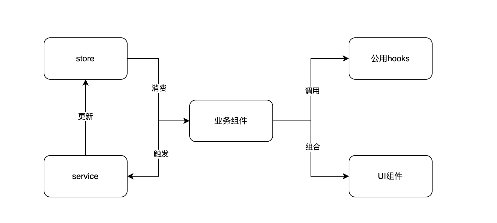

# 创意配置系统设计

## 整个项目的设计

之前的痛点：

1. 没区分逻辑组件和纯UI组件，封装意识不够 / 历史迭代结果。导致很容易出现庞大的组件，逻辑十分混乱
   - 区分UI组件和逻辑组件。UI组件不处理任何业务逻辑，切保证单一职责。
   - 逻辑组件可以有特定的业务逻辑，但是业务逻辑尽可能通过hook封装后使用
2. 数据管理负责，定义一个新数据步骤繁琐
   - 简化数据流程，通过统一的reducer生成函数，同时通过封装同一个hook进行更改。
3. 定向数据和其他配置数据数据频繁操作和更改
   - 增加一个函数，支持数组和对象，返回一个统一的对象。对象上自带相关的数据操作函数。使数据拥有自处理能力。且所有数据都这样使用，规范切方便维护
4. 创意组件配置麻烦。因为业务上有各种各样的创意形式。多图 / 单图 / 视频等。通过将

目前的总体设计：



```bash
service(store更改，一般是一个action函数) -> store(定义数据) 
业务组件(逻辑组件) -> store / service
```


## 创意系统设计

1. 每个创意类型对应一个ID。这个ID对应提交的ID。
2. 每个配置包括组件配置 / 提交创意配置 / 描述 / id枚举等。重点在于组件配置
3. 组件配置里面的每一项可以有 是否需要展示 / 需要提交的key / 错误处理函数 / 配置等等。后面进行统一的收集
   - 错误处理函数：通过传入`creative`字段和广告主基本信息等，具体实现由各个配置实现
4. 最后通过组件配置获取到所有需要提交的数据。然后再统一整理获取的数据，例如要把某些字段整合到一个提交字段中（在`redux`中为了方便，可能会把一个复合字段平铺开来，方便使用。）。这一步可以叫做`reduxToApiState`。