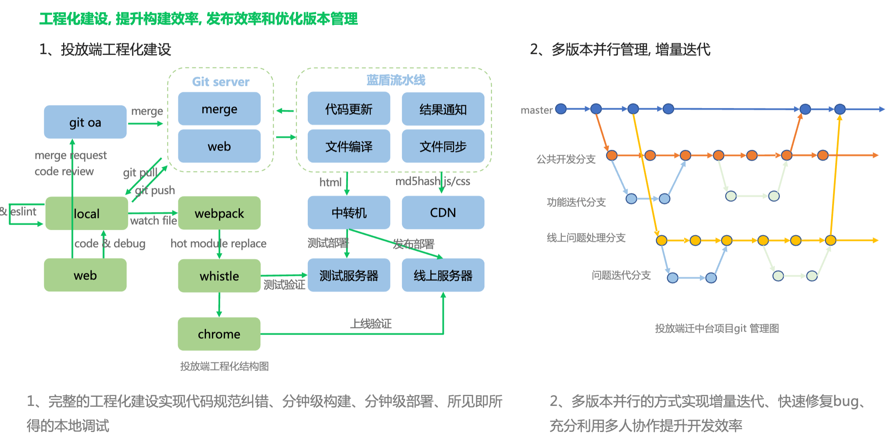

# 前端部署

1. MR合并触发流水线执行。
2. 流水线可以进行相应的任务编排。例如代码构建，打包。
3. 将CSS JS等静态文件上传至CDN
4. 将HTML文件打包成镜像。镜像内使用Nginx镜像静态文件代理。
5. 将镜像推送到服务器并运行镜像。这时候就会启动Nginx成功代理。

### 如何实现不同环境的部署

不同环境使用不同的流水线。也不是同一个镜像仓库。运行的时候通过判断是不是`master`分支或者`git tag`上带上对应的关键字从而判断不同的环境

不同环境的配置，例如CDN，Nginx等等可以放置在不同的目录下面。执行的时候通过路径获取

不同环境可以监听不同的分支或者`gti tag`

### 如何实现版本管理

每次执行构建不同的镜像。发布的时候选择其中一个镜像发布即可。可以执行对应的灰度策略等等。因为打包了多个镜像，所以实现版本的回退之类的会非常方便。