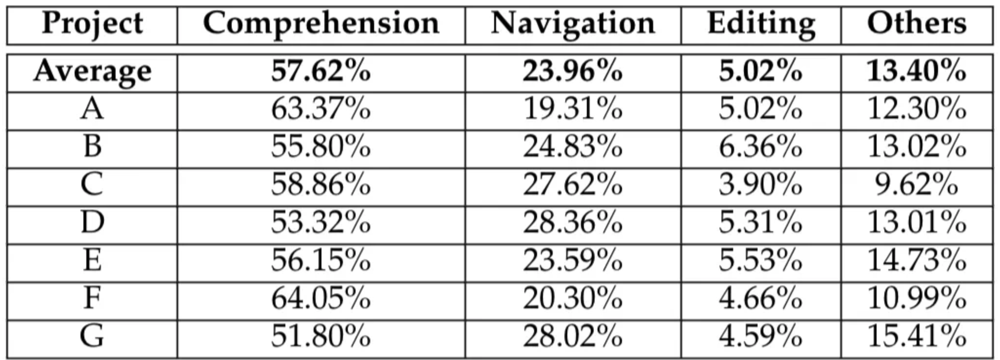
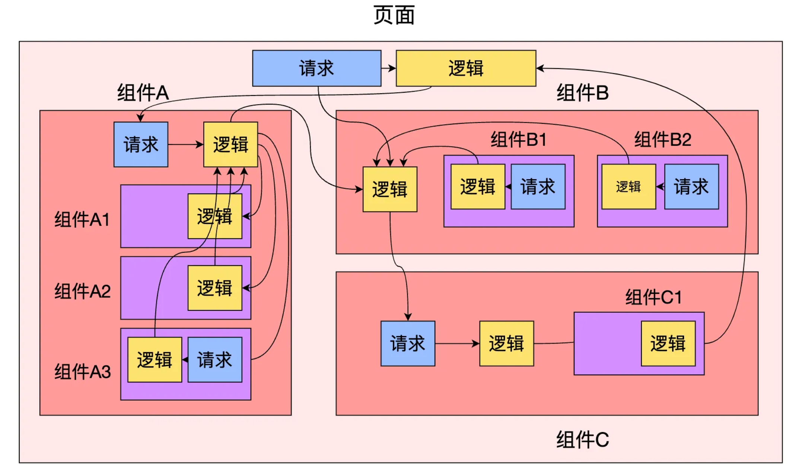
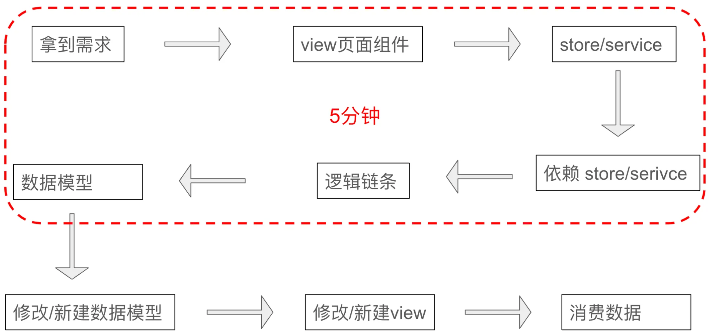
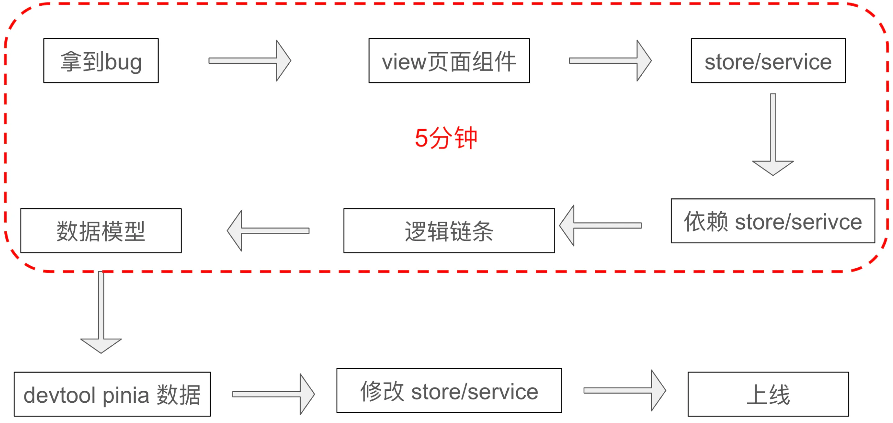

# 如何处理复杂前端业务代码 

本文所指的业务代码，即大家理解的CRUD代码，没有技术难度却是日常写的最多的代码，虽然技术简单但随着业务复杂度不断上升如果没有做好设计和维护，经过多次迭代和人员的更替就会变成团队沉重的负担。本文探讨一种组织前端业务代码的方式，在复杂业务场景下，有效提升代码阅读和维护体验，保持业务开发的轻松流畅的体验。

## 一、 理解coding时间

这篇文章[Measuring Program Comprehension: A Large-Scale Field Study with Professionals](https://ieeexplore.ieee.org/abstract/document/7997917/)调查了程序员写代码过程中时间花费情况。作者通过监测78名开发者在7个真实项目中花费的3148小时的程序理解活动时间来进行统计，并利用数据收集工具和视频录制工具对程序员花费的时间进行严格分类。


作者将程序员写代码时间分了comprehension、navigation、editing、others这四类，并给出了这四类时间在不同样本中的分布：



从结果上来看不同样本之间趋势是一致的，程序员在理解代码以及代码导航之间花去了超过80%的时间，这可能和我们体感不太一致但却是客观事实，项目的代码才是写代码最大的心智负担。简单的业务可能不需要这么长时间但是庞大的项目体量可能让这个时间达到90%以上。

## 二、 视图驱动逻辑

降低占据代码开发80%以上的理解导航时间对于项目维护至关重要，也是性价比最高的事情。那么我们的前端业务代码是如何变得难以理解的呢？

很多开发会将数据的请求、逻辑的处理统一放置在组件中，数据和逻辑链条通过组件数层层传递，功能也是通过组件来进行组织，这样就形成了典型的视图驱动逻辑：



   采取这种方式组织代码，不用怎么思考就可以快速进行功能开发，但是业务一复杂随之而来的就是维护成本飙升：

1. 组件过于臃肿：数据的请求、数据的转换、数据的逻辑处理、全部堆在组件内部
2. 代码阅读困难：业务逻辑散落在各个组件中，需按照组件链条来理解业务
3. 通信复杂：组件层层嵌套，通信非常复杂，也难以理解
4. 定位困难：定位问题需要按照组件链条来排查，成本非常高
5. 无法复用：视图的差异性导致数据处理和业务逻辑无法复用
6. 重复请求：组件内部请求数据导致可以复用的数据难以复用
7. 复杂度高：数据流呈现螺旋网状调用，牵一发而动全身


  总而言之，这种方法不但无法降低阅读导航时间，反而加重了这方面花费的时间，因为数据和逻辑被组件绑架了，无法从更高的维度分别进行抽象。

## 三、 数据驱动视图

如果认为前端状态是一系列数据和逻辑的总和，那么Url变化、DOM元素的操作、定时器、http请求等副作用导致状态在一直动态变化，界面其实是状态某一个时刻的切片。

将状态直接放入界面中其实是本末倒置，将状态从视图层抽离，视图消费状态才符合上述理念。从这个角度来看必然需要有一个单独承载状态的层级。

我们把数据请求放置在 source 层，把逻辑放置到 logic 层，视图拆分成 view 层和 component 层，这样就得到了下面的架构：


这种架构可以理解为数据驱动视图，目前仅仅是把原本包裹在组件中的请求和逻辑抽离出来，这样做可以降低阅读代码的心智负担吗？是的，仅仅是抽离出来并做适当的拆分就可以有效降低阅读代码的时间，但是我们还可以做的更好，我们可以将数据和逻辑抽象成模型。


## 四、 模型驱动视图

模型驱动相比数据驱动，更多的是将业务进行抽象，设计出更好的数据格式降低逻辑在前端页面流转时的阻碍。


通过后端 API 返回的数据可以理解为后端业务模型的返回，但是前端更多的是 for 页面，后端业务模型和前端页面所需要的业务模型必然是不适配的，所以应该将前端数据和逻辑做更适合前端的业务抽象，也就是前端业务模型。

从API获取的数据需要转换成前端业务模型，这个模型和页面是高度适配，数据的流转在前端将非常顺畅并没有太多数据层面的转换，需要发请求时再将前端业务模型的数据转换成API所需要的数据格式。

早期 jQuery 操作 DOM 的时代时代，到响应式 MVVM 框架、再到模型来驱动视图，开发思维将经历变更：事件驱动 -> 数据驱动 -> 模型驱动：

事件驱动：

```
构建页面：设计DOM => 生成DOM => 绑定事件
监听事件：操作UI => 触发事件 => 响应处理 => 更新UI
```

数据驱动：

```
构建页面：设计数据结构 => 事件绑定逻辑 => 生成DOM
监听事件：操作UI => 触发事件 => 响应处理 => 更新数据 => 更新UI
```

模型驱动：

```
构建模型：设计模型的数据和方法
构建页面：绑定模型的方法 => 生成DOM
监听事件：操作UI => 触发事件 => 响应处理 => 调用模型 => 更新UI
```


模型是对数据的更高形式的抽象，可以采用 OOP 的思想来组织模型，也可以采用 DDD 的理念来实现模型，哪怕是技术简单的业务代码，如果采用模型思维也会迫使开发者开发业务代码从体力活动转变脑力活动。

## 五、 落地模型（vue版本）

在做简单业务的时候听到要用模型，会有一种杀鸡用牛刀的感觉，本能上会觉得很麻烦或者会增加工作量，但是随着业务不断迭代复杂，再想进行重构则容易积重难返，还面临高速换轮胎、无法说服上级等窘境。


实际上落地模型既不麻烦也不会增加工总量，但业务的复杂度采用任何办法都不会降低，只能采用模块拆解的方式来隔离，本文不对将业务如何抽象成模型做进一步的探讨，更多的是说明如何拆解模型，如何组织模型。

模型驱动视图只是改变开发思维，降低组织代码、阅读代码、维护代码的成本，下面我们就以 vue 框架为例来说明：


##### 逻辑层

采用vue框架毫无疑问模型需要落地到 pinia store里面，得益于 react hook思想，我们得以采用 composition 的方式来组织 store：

```js
import { defineStore } from 'pinia';

const useAppStore = defineStore('app', () => {
// 1、定义 store 的依赖关系
const projectStore = useProjectStore()

// 2、定义 service 的依赖关系
const aService = useAService(projectStore.xService)
const bService = useBService(aService)
const cService = useCService(bService)

return { aService, bService, cService }
})
```

我们会将业务拆解成多个 store，再将每个 store 拆成多个 service，每个 service 的功能是高内聚的。可以理解 store 是一个壳，内部service 才是负责实现功能内聚的模型，注意在 store 中只能干两件事情：

1、 定义 store 和 store 之间的依赖关系

2、 定义 service 和 service 之间的依赖关系

如果逻辑是一本书，那么store的定义就是目录，具体的业务实现都放在 service，这个很重要！！！，可以有效的降低阅读定位代码的时间。

service 可以采用正常书写 composition 来设计模型即可，模型无非是由一系列数据和修改数据的方法构成，以 aService 为例：

```js
export const useAService (xService) {
  const data1 = ref()

  const data2 = ref()
  const data2Loading = ref(false)
  const data2Error = ref()

  const handleData1 = (arg) {
      data1.value = arg
      fetchData2()
  }
  
  const fetchData2 = async () => {
        data2Loading.value = true
        try{
            data2.value = await fetch(url, {body: JSON.String(data1.value)}) 
            data2Loading = false
        }catch(e){
            data2Error.value = e.message
            data2Loading = false
        }  
 }
 return reactive({data1, data2, data2Loading, data2Error, handleData1, fetchData2 })
```

其中经常会出现数据之间的异步依赖关系，例如 data2 异步依赖于 data1，data1 发生变化需要更新 data2，为此如果采用命令式的方式来写代码会暴露大量细节造成阅读困难，而模型本身并不关心这些细节，并且还会污染到模型其他地方比如：

handleData1 明明是处理 data1 相关的逻辑，就是因为 data2 依赖了 data1 就需要将 fetchData2 也放进来 ，后续还有地方改到 data1 则都需要调用 fetchData2 。

###### 异步数据依赖关系维护

既然采用命令式方式编写异步数据依赖关系，往往会大大降低代码的可读性并且污染模型代码，而且项目已经采用 vue 响应式，不妨将声明式+响应式结合起来：

```js
import { useFetch } from 'fluth-vue'

export const useAService (xService) {
  const data1 = ref()
  const { data: data2, loading: data2Loading, error: data2Error， promise$: fetchData2$ } =  useFetch(url, {refetch: true}).post(data1)
 
  const handleData1 = (arg) {
    data1.value = arg
  }
  return reactive({ data1, data2, data2Loading, data2Error, handleData1, fetchData2$ })
 }
```

采用 [fluth-vue ](https://fluthjs.github.io/fluth-vue/cn/index.html)的usefetch，一行语句就声明了 data2 和 data1的异步关系，极大的降低了代码复杂度和污染，至于出现的fetchData2$ 有何妙用，下面就可以用到。

###### 异步逻辑依赖关系维护

bService 如果依赖 aService 的异步数据 data2，我们经常会采用监听数据的方式来处理这种逻辑，这叫利用数据的响应式来组织逻辑，是一种阅读体验非常差的编码方式：

```js
export const useBService (aService) {
  const data = ref()
  
  watch(aservice.data2), () => {
      data.value = formart(aservice.data2)
  })
}
```


利用数据的响应式来组织逻辑，这会带来两个问题：

1、 丢失语义，监听数据是没有语义的，阅读的逻辑链条在这里断裂

2、 时序控制困难，尤其是当依赖多个数据且这些数据存在时序依赖关系时，那么采用监听方式非常难控制时序

此时采用 [fluth-vue](https://fluthjs.github.io/fluth-vue/cn/index.html) 在 useFetch 中提供的 [promsie$ 流](https://fluthjs.github.io/fluth-doc/cn/guide/base.html#流)：fetchData2$ 

```js
export const useBService (aService) {
  const data = ref()
  
  aService.fetchData2$.then(() => {
      data.value = formart(aservice.data2)
  }) 
}
```

如果通过数据响应式来组织异步逻辑，则逻辑就像一个三维网状结构；通过流来处理异步逻辑就像一条管道，任何一个节点都可以知道上游节点在哪里，什么语义。

这里我们知道 fetchData2$ 之后需要处理 bService 的 data 数据，至于数据是否需要从流中传递过来，这已经不重要了，因为整个 aService 已经注入进来，虽然新的数据也可以从管道获取。

##### 数据层

随着异步数据依赖关系越来越复杂，我们除了自动响应式请求，还有自动 intervel 更新、缓存、条件、重试、防抖、节流等方面的需求，定义在 aService 的 useFetch则会变得越来越庞大：

```js
const { data: data2, loading: data2Loading, error: data2Error， promise$: fetchData2$ } = useFetch(url,   {
     immediate: true,
     condition: computed(() => data1.value.age > 18),
     refetch: true, 
     refresh: 1000 * 60 * 5, 
     retry: ,
     debounce: 1000,
     throttle: 1000,
     cacheSetting: {
        expiration: 1000 * 60 * 60,
        cacheResolve: ({ url, payload }) => url + JSON.stringify(payload.value),
  }
}).post(data1);
```

此时适合封装成到source层：

```js
import { useFetch } from 'fluth-vue'

export const useFetchData2Api = (data1: Ref<{xxx}>) => 
 useFetch(url, {
      immediate: true,
      condition: computed(() => data1.value.age > 18),
      refetch: true, 
      refresh: 1000 * 60 * 5, 
      retry: ,
      debounce: 1000,
      throttle: 1000,
      cacheSetting: {
          expiration: 1000 * 60 * 60,
          cacheResolve: ({ url, payload }) => url + JSON.stringify(payload.value),
      }
}).post(data1);
```

那么在 aService 声明异步数据 data2 和 data1 的关系就非常简单：

```js
const { data: data2, loading: data2Loading, error: data2Error， promise$: fetchData2$ } = useFetchData2Api(data1)
```

service模型层彻底干净清晰，而source层慢慢的就会如下所示：

```
api
├── index.ts
├── useaaaaApi
│   ├── type.ts
│   └── index.ts
├── usebbbApi
│   ├── type.ts
│   └── index.ts
└── useeeeApi
    ├── type.ts
    └── index.ts
```

数据层的 type.ts 定义了从 API 传递过来的数据模型，以及各个异步数据之间的声明式关系（例如：data1 和 data2）。根据业务情况，在数据层中我们还可以做一些统一的处理：


这部分处理可以根据项目实际情况来添加，总而言之，数据层提供了两个重要的基础能力：

1、规范了 API 层的数据 typescript 类型定义

2、声明了异步数据之间的关系是怎么样的

##### 视图层

由于逻辑都在store 和 service 里面，view 原则上不保留业务逻辑的数据，只消费模型数据、调用模型方法、以及视图逻辑数据（比如打开关闭之类的）。这使得整个view层变得非常简洁，无需复杂的 props 数据传递、也没有上蹿下跳的 emit，直接内部通过 store 的 service来获取数据。

在 view 层的任意组件原则上都可以直接从 store 中获取模型数据、调用模型方法。而阅读 View层代码，就可以直接定位页面涉及到的store、service 以及相应的所有模块依赖和逻辑链条。


建议采用 .tsx 的方式来组织 view 的代码，可以带来两个好处：

1、 更加灵活的模板

2、 由于 vue devtool 无法查看组件状态（setup return render()），倒逼开发者使用模型来处理逻辑（vue devtool pinia 可查看状态）


##### 组件层

组件层主要封装的是没有业务属性的组件，不能从也不应该从 store 直接获取数据，只能通过 props 接收 view 传递的数据。

## 六、 是否有效果？

我们可以从一个新维护者的角度来看：

###### 新需求



拿到需求，定位涉及到的页面，定位到涉及到的 store、service，并通过前面介绍的流可以定位整个上下游逻辑链条以及涉及到的数据模型有哪些，所有的时间加起来不会超过5分钟。


###### 解bug



同样按照上面的思路，这个 bug 几乎可以在5分钟内定位整个上下游逻辑链条以及涉及到的数据模型有哪些，通过 vue devtool 可以直接查看 pinia 中模型的数据，几乎不用排查 vue 组件链条


###### 维护成本


业务的复杂度可能会上升，组织代码的复杂度维持不变，5分钟原则依然不变可以有效的降低理解代码、定位代码的时间。采用这种方式，会逼迫开发者不断完善模型、抽象业务，阻止视图层对逻辑的侵入，从而有效降低代码腐化速度。

## 七、 总结

通过模型驱动视图的理念，用 [声明式+响应式](https://fluthjs.github.io/fluth-vue/cn/useFetch/introduce.html) 来组织异步数据依赖，用[ promise 流](https://fluthjs.github.io/fluth-doc/cn/index.html) 流来组织异步逻辑依赖，这种组织代码的形式能够明显的降低开发者在降低阅读代码、定位代码的时间，降低代码腐化速度，在一些轻交互、重逻辑的场景（比如：管理端、sass等）具有良好的效果。最后代码呈现出类似 angular service + vue reactive + react tsx 的组织效果。

最后：

https://fluthjs.github.io/fluth-doc/cn/index.html

https://fluthjs.github.io/fluth-vue/cn/index.html