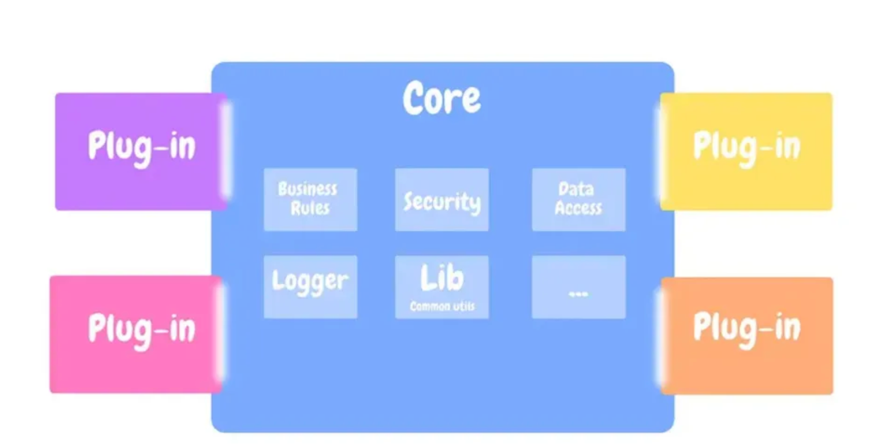
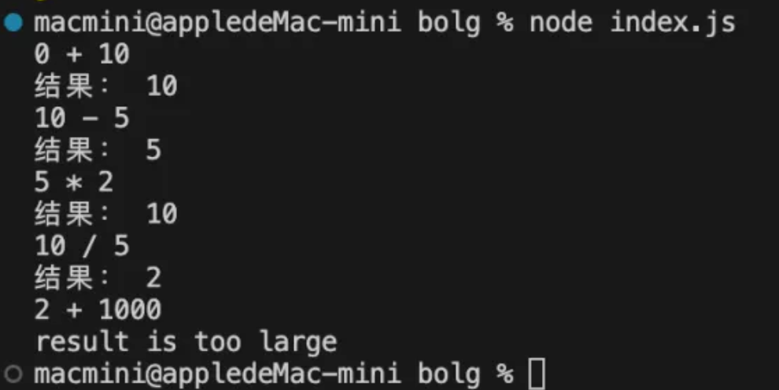

# 插件系统

插件系统是一种软件架构模式，允许开发者通过添加外部模块或组件来扩展和定制软件应用的功能，而无需修改其核心代码。这种方式为软件提供了高度的可扩展性、灵活性和可定制性。

用过构建工具的同学都知道，grunt, webpack, gulp 都支持插件开发。后端框架比如 egg koa 都支持插件机制拓展，前端页面也有许多可拓展性的要求。插件化无处不在，所有的框架都希望自身拥有最强大的可拓展能力，可维护性，而且都选择了插件化的方式达到目标。

## 什么是插件系统

插件系统主要由三个关键部分组成：

1. 核心系统（Host Application）：这是主软件应用，提供了插件可以扩展或修改的基础功能。
2. 插件接口（Plugin Interface）：定义了插件和核心系统之间的交互协议。插件接口规定了插件必须遵循的规则和标准，以便它们能够被核心系统识别和使用。
3. 插件（Plugins）：根据插件接口规范开发的外部模块或组件，用于扩展核心系统的功能。插件可以被添加或移除，而不影响核心系统的运行。



## 插件的执行流程和实现方式

插件的执行流程是指从插件被加载到执行其功能直至卸载的一系列步骤。

1. 设计核心系统：首先，我们需要一个核心系统。这个系统负责维护基础功能，并提供插件可以扩展或修改的接口。
   - 核心系统的生命周期：定义核心系统的关键阶段，例如启动、运行中、关闭等。每个阶段可能会触发特定的事件。
   - 暴露的 API：确定哪些内部功能是可以被插件访问的。这包括数据访问、系统服务调用等接口。
2. 插件的结构设计：插件需要有一个清晰的结构，使其能够容易地集成到核心系统中。一个典型的插件结构可能包含：
   - 初始化代码：插件加载时执行的代码，用于设置插件的运行环境。
   - 处理函数：实现插件功能的核心代码，根据插件的目的可以有多个。
   - 资源清理：插件卸载时需要执行的清理代码，以确保资源被适当释放。
3. 插件的注册和加载：开发者通过配置文件、命令或图形界面在核心系统中注册插件，系统随后根据注册信息安装并加载插件，这个过程涉及读取插件元数据、执行初始化代码，以及将插件绑定到特定的生命周期事件或 API 上。
4. 插件的实现：插件的实现依赖于核心系统提供的生命周期钩子和 API。
   - 利用生命周期钩子：插件可以注册函数来响应核心系统的生命周期事件，例如在系统启动完成后执行初始化操作，或在系统关闭前进行资源清理。
   - 调用暴露的 API：插件通过调用核心系统暴露的 API 来实现其功能。这些 API 可以提供系统信息、修改数据、触发事件等功能。
5. 代码执行流程：插件通过注册自身到核心系统，绑定处理函数至特定事件或 API，以响应系统生命周期变化或 API 调用执行特定任务。在适当时机，如系统关闭或更新时，插件被卸载，其资源得以清理并从系统中移除。

通过这个流程，插件系统提供了一个灵活、可扩展的方式来增强和定制核心系统的功能。插件的开发者可以专注于插件逻辑的实现，而无需修改核心系统的代码。同时，核心系统能够保持稳定性和安全性，因为插件的执行是在明确定义的接口和约束条件下进行的。

## 插件的几种形式

插件的主要形式主要分为以下几种形式：

1. 约定式插件
2. 注入式插件
3. 事件式插件
4. 插槽式插件

### 约定式插件

约定式插件通常在那些采用“约定优于配置”理念的框架或工具中很常见。以 Webpack 为例，它过各种加载器（Loaders）和插件（Plugins）提供强大的扩展性，而这些扩展往往遵循一定的约定，以简化配置的复杂性。

在 Webpack 配置中使用插件时，通常不需要指定插件工作的具体点，只需要将插件加入到配置的 plugins 数组中。Webpack 根据内部的运行机制和生命周期事件，自动调用这些插件，执行相关的任务。

例如，使用 HtmlWebpackPlugin 可以自动生成一个 HTML 文件，并自动将打包后的 JS 文件注入到这个 HTML 文件中。开发者只需要按照约定将 HtmlWebpackPlugin 加入到 plugins 数组中，无需指定具体的注入点或方式，Webpack 就会自动完成这些任务。

```js
const HtmlWebpackPlugin = require("html-webpack-plugin");

module.exports = {
  // 其他配置...
  plugins: [
    new HtmlWebpackPlugin({
      template: "./src/template.html",
    }),
  ],
};
```

通过这种约定式的插件机制，Webpack 极大地简化了开发者的配置工作，同时保持了强大的灵活性和扩展性。用户只需遵循简单的约定，如将插件实例添加到 plugins 数组，Webpack 便能自动完成复杂的集成工作，如资源打包、文件处理等，从而提高了开发效率和项目的可维护性。这正体现了约定式插件的主要优势：通过遵循一套预定义的规则，减少配置的需求，同时提供强大的功能扩展能力。

### 注入式插件

注入式插件通过在应用程序的运行时或编译时将插件的功能注入到应用程序中，从而扩展应用程序的功能。这种方式往往依赖于一种中间件或框架来实现插件的动态加载和执行。一个典型的例子就是 NestJs 世界中广泛使用的依赖注入（DI）功能。

除此之外，尽管 Webpack 更常被人们提及其约定式插件机制，但我们可以从一个角度将 Loaders 视为一种注入式插件，在 Webpack 配置中，Loaders 允许你在模块被添加到依赖图中时，预处理文件。可以看作是在编译过程中“注入”了额外的处理步骤。这些处理步骤可以包括将 TypeScript 转换为 JavaScript、将 SASS 转换为 CSS，或者将图片和字体文件转换为 Webpack 可以处理的格式。

```js
module.exports = {
// ...其他配置
module: {
    rules: [
      {
        test: /\.js$/, // 使用正则表达式匹配文件路径，处理.js文件
        exclude: /node_modules/, // 排除node_modules目录
        use: {
          loader: "babel-loader", // 指定使用babel-loader
          options: {
            presets: ["@babel/preset-env"], // 使用预设配置转换ES6+代码
          },
        },
      },
    ],
  },
// ...其他配置
};
```

通过 loader 的配置，Webpack 实现了一种灵活的“注入式”扩展机制，允许开发者根据需要为构建过程注入各种预处理步骤。

### 事件插件化

事件插件化是一种基于事件驱动编程模式的插件化机制，其中插件通过监听和响应系统中发生的特定事件来工作。这种机制允许插件在不直接修改主程序代码的情况下增加或改变程序的行为。

Node.js 的 EventEmitter 类是实现事件插件化的一个很好的例子。假设我们正在开发一个应用程序，该程序需要在完成某个任务后执行一系列的操作，这些操作由不同的插件来实现。

首先，创建一个基于 EventEmitter 的任务执行器，它在完成任务时会发出一个事件：

```js
const EventEmitter = require("events");

class TaskExecutor extends EventEmitter {
  execute(taskFunc) {
    console.log("Executing task...");
    taskFunc();
    this.emit("taskCompleted", "Task execution finished");
  }
}
```

接着，我们可以开发插件来监听 taskCompleted 事件。每个插件都可以注册自己的监听器来响应事件：

```js
// Plugin A
executor.on("taskCompleted", (message) => {
  console.log(`Plugin A responding to event: ${message}`);
});

// Plugin B
executor.on("taskCompleted", (message) => {
  console.log(`Plugin B responding to event: ${message}`);
});
```

最后，创建 TaskExecutor 的实例，并执行一个任务，看看插件如何响应：

```js
const executor = new TaskExecutor();

// 注册插件
// ...此处省略插件注册代码...

executor.execute(() => {
  console.log("Task is done.");
});
```

运行上述代码时，TaskExecutor 执行一个任务，并在任务完成后发出 taskCompleted 事件。注册监听该事件的所有插件（在这个例子中是插件 A 和插件 B）都会接到通知，并执行相应的响应操作。这种模式使得开发者可以很容易地通过添加更多的事件监听器来扩展应用程序的功能，而无需修改 TaskExecutor 或其他插件的代码，实现了高度的解耦和可扩展性。

### 插槽插件化

在 React 中，插槽插件化的概念可以通过组件的 children 属性或使用特定的插槽来实现。这种模式允许开发者定义一个组件框架，其中一些部分可以通过传入的子组件来填充，从而实现自定义内容的注入。这类似于 Vue 中的插槽（slots）功能，但在 React 中，它通过 props.children 或通过特定的 props 来传递组件来实现。

```jsx
function Card({ children }) {
  return <div className="card">{children}</div>;
}

function App() {
  return (
    <Card>
      <h2>标题</h2>
      <p>这是一段文本</p>
    </Card>
  );
}
```

通过这种方式，React 支持了组件的插槽化，使组件的复用和自定义变得更加容易。这种模式在构建可扩展和可复用的 UI 组件库时尤其有用。

## 代码实现

接下来我们通过插件来实现一个计算器，可以实现加减乘除

### 插件核心实现

```js
class Calculator {
constructor(options = {}) {
    const { initialValue = 0 } = options;
    this.currentValue = initialValue;
  }
  getCurrentValue() {
    returnthis.currentValue;
  }
  setValue(value) {
    this.currentValue = value;
  }
  plus(addend) {
    this.setValue(this.currentValue + addend);
  }
  minus(subtrahend) {
    this.setValue(this.currentValue - subtrahend);
  }
  multiply(multiplicand) {
    this.setValue(this.currentValue * multiplicand);
  }
  division(divisor) {
    if (divisor === 0) {
      console.error("不允许除零。");
      return;
    }
    this.setValue(this.currentValue / divisor);
  }
}

// test
const calculator = new Calculator();
calculator.plus(10);
console.log(calculator.getCurrentValue()); // 10
calculator.minus(5);
console.log(calculator.getCurrentValue()); // 5
calculator.multiply(2);
console.log(calculator.getCurrentValue()); // 10
calculator.division(2);
console.log(calculator.getCurrentValue()); // 5
```

### 实现 hooks

核心系统想要对外提供生命周期钩子，就需要一个事件机制。

```js
class Hooks {
constructor() {
    this.listeners = {};
  }
  on(eventName, handler) {
    let listeners = this.listeners[eventName];
    if (!listeners) {
      this.listeners[eventName] = listeners = [];
    }
    listeners.push(handler);
  }
  off(eventName, handler) {
    const listeners = this.listeners[eventName];
    if (listeners) {
      this.listeners[eventName] = listeners.filter((l) => l !== handler);
    }
  }
  trigger(eventName, ...args) {
    const listeners = this.listeners[eventName];
    const results = [];
    if (listeners) {
      for (const listener of listeners) {
        const result = listener.call(null, ...args);
        results.push(result);
      }
    }
    return results;
  }
  destroy() {
    this.listeners = {};
  }
}
```

这个 Hooks 类是一个事件监听器或事件钩子的简单实现，它允许你在应用程序的不同部分之间传递消息或事件，而不必直接引用那些部分。

### 暴露生命周期（通过 Hooks）

然后将 hooks 运用在核心系统中 -- JavaScript 计算器。

每个钩子对应的事件：

- pressedPlus 做加法操作
- pressedMinus 做减法操作
- pressedMultiply 做乘法操作
- pressedDivision 做乘法操作
- valueWillChanged 即将赋值 currentValue，如果执行此钩子后返回值为 false，则中断赋值。
- valueChanged 已经赋值 currentValue

```js
class Calculator {
constructor(options = {}) {
    this.hooks = new Hooks();
    const { initialValue = 0, plugins = [] } = options;
    this.currentValue = initialValue;
    plugins.forEach((plugin) => plugin.apply(this.hooks));
  }

  getCurrentValue() {
    returnthis.currentValue;
  }

  setValue(value) {
    const result = this.hooks.trigger("valueWillChanged", value);
    if (result.length !== 0 && result.some((_) => !_)) {
    } else {
      this.currentValue = value;
      this.hooks.trigger("valueChanged", this.currentValue);
    }
  }

  plus(addend) {
    this.hooks.trigger("pressedPlus", this.currentValue, addend);
    this.setValue(this.currentValue + addend);
  }

  minus(subtrahend) {
    this.hooks.trigger("pressedMinus", this.currentValue, subtrahend);
    this.setValue(this.currentValue - subtrahend);
  }

  multiply(factor) {
    this.hooks.trigger("pressedMultiply", this.currentValue, factor);
    this.setValue(this.currentValue * factor);
  }

  division(divisor) {
    if (divisor === 0) {
      console.error("Division by zero is not allowed.");
      return;
    }
    this.hooks.trigger("pressedDivision", this.currentValue, divisor);
    this.setValue(this.currentValue / divisor);
  }
}
```

### 插件实现

插件要实现 apply 方法，在 Calculator 的 constructor 调用时，才能确保插件 apply 执行后会绑定（插件内的）处理函数到生命周期。

apply 的入参是 this.hooks，通过 this.hooks 来监听生命周期并添加处理器。

```js
class LogPlugins {
  apply(hooks) {
    hooks.on("pressedPlus", (currentVal, addend) =>
      console.log(`${currentVal} + ${addend}`)
    );
    hooks.on("pressedMinus", (currentVal, subtrahend) =>
      console.log(`${currentVal} - ${subtrahend}`)
    );
    hooks.on("pressedMultiply", (currentVal, factor) =>
      console.log(`${currentVal} * ${factor}`)
    );
    hooks.on("pressedDivision", (currentVal, divisor) =>
      console.log(`${currentVal} / ${divisor}`)
    );
    hooks.on("valueChanged", (currentVal) =>
      console.log(`结果： ${currentVal}`)
    );
  }
}

class LimitPlugins {
  apply(hooks) {
    hooks.on("valueWillChanged", (newVal) => {
      if (100 < newVal) {
        console.log("result is too large");
        returnfalse;
      }
      returntrue;
    });
  }
}
```

LogPlugins 的目的是记录计算器操作的详细日志。通过监听 Calculator 类中定义的事件（如加、减、乘、除操作和值变化时的事件），这个插件在这些操作执行时打印出相应的操作和结果。

LimitPlugins 的目的是在值变更前进行检查，以确保计算器的结果不会超出预设的限制（在这个例子中是 100）。如果预计的新值超出了限制，这个插件会阻止值的更改并打印一条警告消息。

通过这两个插件，Calculator 类获得了额外的功能，而无需直接在其代码中加入日志记录和值限制检查的逻辑。

### 完整代码

最后我们应该贴上全部代码：

```js
class Hooks {
constructor() {
    this.listener = {};
  }

  on(eventName, handler) {
    if (!this.listener[eventName]) {
      this.listener[eventName] = [];
    }
    this.listener[eventName].push(handler);
  }

  trigger(eventName, ...args) {
    const handlers = this.listener[eventName];
    const results = [];
    if (handlers) {
      for (const handler of handlers) {
        const result = handler(...args);
        results.push(result);
      }
    }
    return results;
  }

  off(eventName, handler) {
    const handlers = this.listener[eventName];
    if (handlers) {
      this.listener[eventName] = handlers.filter((cb) => cb !== handler);
    }
  }

  destroy() {
    this.listener = {};
  }
}

class Calculator {
constructor(options = {}) {
    this.hooks = new Hooks();
    const { initialValue = 0, plugins = [] } = options;
    this.currentValue = initialValue;
    plugins.forEach((plugin) => plugin.apply(this.hooks));
  }

  getCurrentValue() {
    returnthis.currentValue;
  }

  setValue(value) {
    const result = this.hooks.trigger("valueWillChanged", value);
    if (result.length !== 0 && result.some((_) => !_)) {
    } else {
      this.currentValue = value;
      this.hooks.trigger("valueChanged", this.currentValue);
    }
  }

  plus(addend) {
    this.hooks.trigger("pressedPlus", this.currentValue, addend);
    this.setValue(this.currentValue + addend);
  }

  minus(subtrahend) {
    this.hooks.trigger("pressedMinus", this.currentValue, subtrahend);
    this.setValue(this.currentValue - subtrahend);
  }

  multiply(factor) {
    this.hooks.trigger("pressedMultiply", this.currentValue, factor);
    this.setValue(this.currentValue * factor);
  }

  division(divisor) {
    if (divisor === 0) {
      console.error("Division by zero is not allowed.");
      return;
    }
    this.hooks.trigger("pressedDivision", this.currentValue, divisor);
    this.setValue(this.currentValue / divisor);
  }
}

class LogPlugins {
  apply(hooks) {
    hooks.on("pressedPlus", (currentVal, addend) =>
      console.log(`${currentVal} + ${addend}`)
    );
    hooks.on("pressedMinus", (currentVal, subtrahend) =>
      console.log(`${currentVal} - ${subtrahend}`)
    );
    hooks.on("pressedMultiply", (currentVal, factor) =>
      console.log(`${currentVal} * ${factor}`)
    );
    hooks.on("pressedDivision", (currentVal, divisor) =>
      console.log(`${currentVal} / ${divisor}`)
    );
    hooks.on("valueChanged", (currentVal) =>
      console.log(`结果： ${currentVal}`)
    );
  }
}

class LimitPlugins {
  apply(hooks) {
    hooks.on("valueWillChanged", (newVal) => {
      if (100 < newVal) {
        console.log("result is too large");
        returnfalse;
      }
      returntrue;
    });
  }
}

// 运行测试
const calculator = new Calculator({
initialValue: 0,
plugins: [new LogPlugins(), new LimitPlugins()],
});
calculator.plus(10);
calculator.minus(5);
calculator.multiply(2);
calculator.division(5);
calculator.plus(1000); // 尝试加到超过限制的值
```

最终输出结果如下图所示：



## 总结

通过这两个插件的例子，我们可以看到插件化设计模式在软件开发中的强大之处。它允许开发者在不修改原有代码基础上扩展功能、增加新的处理逻辑，使得应用更加模块化和易于维护。这种模式特别适用于那些需要高度可扩展性和可定制性的应用程序。