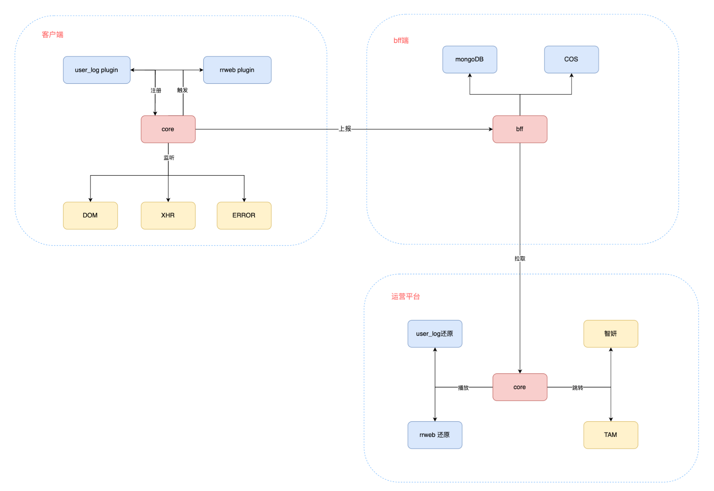

# 插件式实战
## 总体思想
1. 我们的核心是收集数据，所以插件中的核心是收集数据。另外有些自定义的事件，所以插件也可以用来扩展事件核心

## 整体框架

数据收集部分：

## 设计指导思想

1. 插件式设计
2. 观察者模式

## 具体实现
1. core
   - 实现一个EventEmitter，触发事件，插件可以进行监听并处理
   - 支持初始化参数（应用id, uid之类的）
   - 初始化常见错误的上报，并注册相关插件（需保证插件名称唯一）
   - 支持导出相关生命周期，支持在plugins中监听
   - 支持自定义上报，可以被插件中调用
3. plugin API
   - 插件名称：上报时候的key使用插件名称
   - 初始化的时候传入单独的options配置
   - collect：收集数据
   - triggerEvent: string [], 触发数据收集的事件，这些事件core中内置
   - 可以在实例上注册自定义事件，并携带collect数据和插件。【上报时类型默认为CUSTOM_EVENTS】
   - 支持监听生命周期去执行相关事情
4. plugins
   - performance 性能监控
   - record 录制数据
   - user beHaviors 用户行为录制
   - whiteScreen 白屏数据

## 优势
1. 插件式开发
2. 参考sentry的 发布-订阅 模式
3. 参考 vue / react 实现了全局错误捕获并在全局进行捕获
4. 参考 vue 实现了数据访问委托
5. 参考 vue 的插件实现 实现注入全局属性，ts使用模块化的方式

## 一些记录
1. 如何保证上报请求不被取消 https://blog.csdn.net/qq_28565961/article/details/125449937  fetch keep-alive或者Navigator.sendBeacon()
2. 如何节约性能(数据量上 / 事件处理上)
   - 把耗时操作放到requestIdleCallback中处理
   - 事件防抖，数据压缩在webworker，抽样上报
3. 如何保证安全性
   - 用户代码用trycatch进行包裹